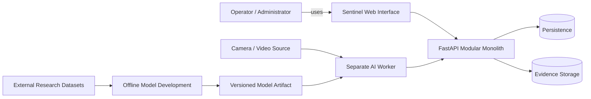

# Sentinel AI — Vision and Scope Specification

> **Document purpose**
>
> This document defines what Sentinel AI is intended to become, why the project exists, who it serves, what is inside and outside the system boundary, what the minimum viable product shall contain, what the project explicitly excludes, which constraints govern the project, and how project success will be judged at a high level.
>
> This document is deliberately more formal than a project proposal and deliberately less detailed than the Software Requirements Specification (SRS).
>
> It shall be used as a scope-control and requirements-input document.
>
> **Do not infer missing technical details from this document.**
>
> Detailed mandatory behavior belongs in `02-srs.md`.  
> Architecture belongs in `04-system-architecture.md` and accepted ADRs.  
> Database schema belongs in `06-database-design.md`.  
> API contracts belong in `07-api-specification.md`.  
> AI implementation belongs in `08-ai-ml-design.md`.

---

# 0. Document Control

## 0.1 Document role

This document answers the following questions:

1. What problem is Sentinel AI intended to address?
2. What type of system is being built?
3. Which users and stakeholders are relevant?
4. What capabilities are required for the MVP?
5. What capabilities are explicitly excluded or deferred?
6. What external systems and actors are outside the project boundary?
7. What project constraints must shape design decisions?
8. What assumptions may temporarily be relied upon?
9. What high-level risks threaten project delivery?
10. What evidence would indicate that the project has succeeded?

This document does **not** define:

- exact endpoint paths;
- database table/column names;
- exact UI component implementation;
- final frontend framework;
- exact AI architecture;
- exact model hyperparameters;
- final camera protocol;
- exact numerical event thresholds;
- exact retention durations;
- exact role permissions;
- exact deployment topology.

Those shall remain unresolved until the corresponding specification or ADR baselines them.

## 0.2 Relationship to root governance

This document is subordinate to:

- `PROJECT_HANDBOOK.md`
- accepted scope decisions made by the project team

If this document conflicts with `PROJECT_HANDBOOK.md`, the conflict shall be resolved explicitly before implementation proceeds.

## 0.3 Status vocabulary

| Status | Meaning | Implementation consequence |
|---|---|---|
| `CONFIRMED` | Accepted project baseline | May be treated as authoritative |
| `PROPOSED` | Candidate decision | Must not be silently treated as final |
| `TBD` | Unresolved | Must not be guessed |
| `DEFERRED` | Valid but postponed | Must not enter MVP implementation |
| `REJECTED` | Explicitly excluded | Must not be implemented |
| `EXPERIMENTAL` | Time-boxed feasibility work | Must remain isolated from production baseline |

## 0.4 Change-control rule

A scope change is considered material if it adds, removes, or significantly redefines:

- an MVP capability;
- a stakeholder;
- a major external dependency;
- the system boundary;
- a safety/privacy assumption;
- a major AI task;
- a project success criterion;
- an explicit non-goal.

Material scope changes require team review and corresponding updates to:

- this document;
- the SRS;
- architecture;
- test plan;
- traceability matrix;
- final report, where applicable.

---

# 1. Executive Vision

## 1.1 Vision statement

**Sentinel AI is intended to be a web-based intelligent CCTV monitoring and event-management platform that augments video surveillance with machine-assisted detection, tracking, configurable rule evaluation, violence/fighting analysis, event evidence, real-time or near-real-time alert delivery, operator acknowledgement, searchable incident/event history, and analytics.**

The system shall be designed so that AI inference is one subsystem within a broader software-engineering architecture rather than the entire project.

## 1.2 One-sentence academic framing

Sentinel AI is an **Advanced Web Technologies project that integrates a FastAPI-based web application, real-time event communication, persistent data, configurable surveillance rules, media evidence workflows, and a separate AI worker performing computer-vision inference.**

## 1.3 Project identity

The system is not merely:

- a CCTV recorder;
- a notebook running an object detector;
- a pre-recorded AI demo;
- a model-training experiment;
- a dashboard displaying hard-coded events.

The intended system is an integrated application where:

```text
video input
    ↓
AI observation
    ↓
tracking/context
    ↓
rule or temporal model evaluation
    ↓
domain event
    ↓
persistence/evidence
    ↓
operator-facing alert
    ↓
acknowledgement/review
    ↓
history/analytics
```

---

# 2. Background and Motivation

## 2.1 Operational background

CCTV installations can produce continuous streams of visual information.

A conventional system may allow:

- live viewing;
- recording;
- playback;
- manual review.

Such systems still require significant human attention to determine whether something important has occurred.

The Sentinel AI project investigates how web technologies and AI-assisted video analysis can be integrated so that selected, explicitly defined events are surfaced to an operator rather than requiring uninterrupted manual observation of every stream.

## 2.2 Project motivation

The project is motivated by the following engineering problem:

> How can a compact web application combine live or recorded surveillance input, computer-vision inference, deterministic event rules, persistent incident data, evidence capture, real-time alerting, and human review in a coherent, testable, academically defensible system?

## 2.3 Why this is an Advanced Web Technologies project

The project must demonstrate meaningful web engineering, including several of the following categories:

- client/server architecture;
- authenticated web application behavior;
- structured APIs;
- real-time communication;
- live or dynamic state updates;
- media presentation;
- server-side validation;
- persistent storage;
- search/filtering;
- analytics visualization;
- asynchronous processing;
- modular backend design;
- secure access to sensitive resources;
- error and connection-state handling.

The AI worker provides data and event signals to the web platform; it does not replace the need for a fully engineered web application.

---

# 3. Problem Statement

## 3.1 Formal problem statement

Continuous CCTV monitoring requires an operator to interpret large volumes of video information.

The system shall investigate a software-assisted approach in which:

1. video is accepted from a supported source;
2. frames or clips are analyzed;
3. people are detected;
4. person tracks are maintained where required;
5. spatial and temporal rules are evaluated;
6. violence/fighting may be evaluated using a temporal AI model;
7. camera availability is monitored;
8. qualifying conditions become system events;
9. event evidence is preserved where configured;
10. operator clients are notified;
11. operators may acknowledge and review events;
12. historical data can be searched and summarized.

## 3.2 Problem boundaries

The problem addressed is:

**machine-assisted event awareness and operator workflow.**

The problem is **not**:

- determining legal guilt;
- determining criminal intent;
- biometric identification;
- replacing security personnel;
- guaranteeing prevention of incidents;
- autonomous emergency dispatch;
- comprehensive physical-security management;
- universal anomaly detection.

## 3.3 Primary engineering challenge

The main project challenge is **integration correctness**, not only model accuracy.

A successful model alone does not constitute Sentinel AI.

The system must demonstrate that:

```text
AI result
→ application interpretation
→ event generation
→ persistence
→ notification
→ operator action
```

works as one controlled software flow.

---

# 4. Project Goals

## 4.1 Goal G-01 — Integrated surveillance workflow

**Status:** `CONFIRMED`

Create a complete demonstrable flow from video input through AI/rule processing to a web-visible event and persistent operator acknowledgement.

## 4.2 Goal G-02 — AI-assisted event extraction

**Status:** `CONFIRMED`

Use AI-assisted detection/tracking and a violence/fighting model where appropriate.

## 4.3 Goal G-03 — Deterministic event rules

**Status:** `CONFIRMED`

Use explicit deterministic logic for rule-derived events such as:

- restricted-area intrusion;
- loitering;
- crowd threshold.

These shall not require separate dedicated neural networks in the MVP unless an accepted design decision later proves otherwise.

## 4.4 Goal G-04 — Web-based operator interaction

**Status:** `CONFIRMED`

Provide an operator-facing web application through which events can be viewed, acknowledged, searched, reviewed, and analyzed.

## 4.5 Goal G-05 — Evidence-linked event records

**Status:** `CONFIRMED`

Associate event records with appropriate evidence artifacts such as snapshots and/or short clips, subject to the final evidence design.

## 4.6 Goal G-06 — Academic traceability

**Status:** `CONFIRMED`

Maintain a clear link between:

```text
project objective
→ requirement
→ design
→ implementation
→ test
→ result
```

## 4.7 Goal G-07 — Reproducible AI work

**Status:** `CONFIRMED`

Document:

- dataset source;
- model source/base weights;
- preprocessing;
- experiment configuration;
- evaluation method;
- measured results;
- limitations.

## 4.8 Goal G-08 — Responsible claims

**Status:** `CONFIRMED`

Ensure that the project documentation distinguishes between:

- designed;
- implemented;
- tested;
- measured;
- demonstrated;
- deferred;
- future work.

---

# 5. Non-Goals

The following are explicit non-goals for the MVP unless reopened through scope control.

## NG-01 — Facial recognition

**Status:** `REJECTED`

The MVP shall not identify people by face.

## NG-02 — Biometric identity database

**Status:** `REJECTED`

The MVP shall not maintain biometric profiles.

## NG-03 — Criminality prediction

**Status:** `REJECTED`

The system shall not infer that a person is a criminal or predict criminal intent.

## NG-04 — General-purpose anomaly understanding

**Status:** `REJECTED_FOR_MVP`

The system is not expected to detect every unusual event.

## NG-05 — Fall detection

**Status:** `DEFERRED`

## NG-06 — Fire/smoke detection

**Status:** `DEFERRED`

## NG-07 — Sound anomaly detection

**Status:** `DEFERRED`

## NG-08 — SMS/email alert integration

**Status:** `DEFERRED`

## NG-09 — Mobile/PWA interface

**Status:** `DEFERRED`

## NG-10 — Multiple-site enterprise monitoring

**Status:** `DEFERRED`

## NG-11 — Autonomous model retraining

**Status:** `REJECTED_FOR_MVP`

Operator feedback shall not automatically trigger online model retraining.

## NG-12 — Full CCTV archival platform

**Status:** `REJECTED_FOR_MVP`

Sentinel AI shall prioritize event evidence rather than indefinite storage of all raw video.

## NG-13 — Commercial production deployment claim

**Status:** `REJECTED`

The academic prototype shall not be described as production-ready unless separate evidence justifies that claim.

---

# 6. MVP Capability Baseline

| Capability | Mechanism | Status |
|---|---|---|
| Person detection | Object detector | `CONFIRMED` |
| Person tracking | Tracking algorithm | `CONFIRMED` |
| Restricted-area intrusion | Detection + zone + rule engine | `CONFIRMED` |
| Loitering | Tracking + duration rule | `CONFIRMED` |
| Crowd threshold | Detection/tracking + count rule | `CONFIRMED` |
| Violence/fighting | Temporal classifier/anomaly model | `CONFIRMED` |
| Camera offline | System health monitoring | `CONFIRMED` |
| Alert generation | Backend event/alert handling | `CONFIRMED` |
| Evidence snapshots/clips | Evidence/media service | `CONFIRMED` |
| Operator acknowledgement | Web application | `CONFIRMED` |
| Incident/event history/search | Web application + persistence | `CONFIRMED` |
| Analytics | Web dashboard | `CONFIRMED` |

---

# 7. Stakeholder Model

## 7.1 Stakeholder STK-01 — Project team

**Type:** Internal  
**Priority:** Critical

The three-person development team owns:

- requirements interpretation;
- design decisions;
- implementation;
- testing;
- documentation;
- dataset/model provenance;
- final demonstration.

### Needs

- clear division of responsibility;
- stable contracts;
- low ambiguity;
- reproducible setup;
- rapid integration;
- explicit scope control.

### Risks

- parallel implementation divergence;
- undocumented decisions;
- interface mismatch;
- AI-generated code drift;
- late integration failure.

---

## 7.2 Stakeholder STK-02 — Faculty/project evaluator

**Type:** Academic external stakeholder  
**Priority:** Critical

The faculty evaluator needs to determine:

- whether the project satisfies academic expectations;
- whether the Advanced Web Technologies contribution is substantial;
- whether the system is genuinely implemented;
- whether AI use is meaningful and honestly documented;
- whether results are measured;
- whether the team understands its design choices.

### Evidence likely relevant

- live system demonstration;
- architecture diagrams;
- requirements;
- working web flows;
- AI evaluation;
- test evidence;
- traceability;
- repository;
- final report.

---

## 7.3 Stakeholder STK-03 — System administrator

**Type:** Intended system user  
**Priority:** High  
**Role status:** `PROPOSED`

Potential responsibilities:

- configure cameras;
- configure zones;
- configure rules;
- manage user access;
- inspect system health.

Exact permissions remain `TBD`.

---

## 7.4 Stakeholder STK-04 — Security operator

**Type:** Intended system user  
**Priority:** High  
**Role status:** `PROPOSED`

Potential responsibilities:

- monitor camera/event status;
- receive alerts;
- inspect evidence;
- acknowledge alerts/events;
- classify false positives;
- review open incidents.

Exact permissions remain `TBD`.

---

## 7.5 Stakeholder STK-05 — Reviewer/supervisor

**Type:** Intended system user  
**Priority:** Medium  
**Role status:** `PROPOSED`

Potential responsibilities:

- review historical events;
- analyze trends;
- review false positives;
- view system/audit history.

Exact permissions remain `TBD`.

---

## 7.6 Stakeholder STK-06 — Individuals appearing in video

**Type:** Data subject / affected stakeholder  
**Priority:** High for privacy considerations

Individuals captured by camera footage may be affected by:

- recording;
- automated analysis;
- event association;
- evidence retention.

The MVP shall avoid facial recognition and biometric identity.

The project shall document:

- source of demonstration footage;
- access controls;
- retention approach;
- use limitations.

---

## 7.7 Stakeholder STK-07 — Dataset authors/providers

**Type:** External source stakeholder

Dataset authors/providers define:

- access method;
- licensing/usage terms;
- original task framing;
- dataset limitations.

The project shall attribute and use datasets according to documented source terms.

---

# 8. User Classes

## 8.1 Administrator

**Status:** `PROPOSED`

Expected characteristics:

- trusted user;
- higher configuration privileges;
- may configure camera and monitoring rules;
- may manage access.

## 8.2 Operator

**Status:** `PROPOSED`

Expected characteristics:

- operational monitoring user;
- responds to events;
- acknowledges/reviews evidence.

## 8.3 Reviewer/Supervisor

**Status:** `PROPOSED`

Expected characteristics:

- primarily read/review-oriented;
- may inspect analytics and history.

## 8.4 Anonymous/public user

**Status:** `REJECTED_AS_PRIMARY_USER`

Sentinel AI is not intended as a public camera portal.

---

# 9. System Boundary

## 9.1 Inside the Sentinel AI boundary

The logical system boundary includes:

- web frontend;
- FastAPI modular monolith;
- AI worker;
- event/rule processing;
- persistence layer;
- evidence metadata;
- evidence storage integration;
- camera/source configuration;
- operator acknowledgement;
- event history/search;
- analytics;
- authentication/authorization if baselined;
- audit behavior if baselined.

## 9.2 Outside the boundary

The following are external to the core system:

- physical CCTV camera hardware;
- network infrastructure;
- external research dataset hosts;
- GPU hardware;
- browser runtime;
- operating system;
- external notification providers, if later introduced;
- identity providers, if later introduced;
- cloud infrastructure, if later introduced.

## 9.3 Context diagram



### Context diagram notes

- exact camera/video protocol: `TBD`;
- database technology: `PROPOSED: PostgreSQL`;
- media storage technology: `TBD`;
- worker/backend transport: `TBD`;
- frontend framework: `TBD`.

---

# 10. Core System Concepts

## 10.1 Video source

A configured source of frames or recorded video.

## 10.2 Detection

A low-level model observation.

## 10.3 Track

A temporal association of detections believed to represent the same observed object over time.

## 10.4 Zone

A configured region in camera-frame coordinates.

## 10.5 Rule

A deterministic condition evaluated using observations/context.

## 10.6 Event

A domain record created when a defined condition is satisfied.

## 10.7 Alert

A user-facing notification associated with a relevant event.

## 10.8 Evidence

Media or metadata retained to support event review.

## 10.9 Incident

A review/management concept associated with one or more events.

Exact event/incident relationship: `TBD`.

## 10.10 Acknowledgement

An operator action indicating that an event/alert has been seen.

---

# 11. High-Level Functional Scope

## 11.1 Camera/source management

Sentinel AI shall support a minimum configured video-source concept.

Final source types remain `TBD`.

The system may eventually support:

- uploaded recordings;
- local files;
- local camera/webcam;
- RTSP/IP streams.

The MVP shall not attempt to support every transport without explicit scope approval.

---

## 11.2 Person detection

The AI worker shall support person detection using a selected detector.

Exact:

- model;
- framework;
- confidence threshold;
- input resolution;
- preprocessing;

remain `TBD`.

---

## 11.3 Person tracking

The AI worker shall maintain track continuity sufficiently to enable time- and region-based rules.

Exact tracker remains `TBD`.

---

## 11.4 Restricted-zone intrusion

The system shall support configured polygonal restricted zones.

Conceptually:

```text
person/track
→ zone relationship
→ rule evaluation
→ intrusion event
```

Exact crossing semantics remain `TBD`.

Questions for the SRS:

- Does any bounding-box overlap count?
- Is the bottom-center point used?
- Must a track persist for a minimum time?
- Does entry only count on a transition from outside to inside?
- What happens if a track starts inside the zone?

---

## 11.5 Loitering

The system shall support loitering as a measurable configured time condition.

Conceptually:

```text
track enters monitored area
→ duration accumulates
→ configured threshold exceeded
→ loitering event
```

Exact threshold: `TBD`.

Exact timer reset semantics: `TBD`.

---

## 11.6 Crowd threshold

The system shall support a configured crowd/count threshold.

Exact counting basis remains `TBD`.

Possible bases include:

- current detections;
- current active tracks;
- detections within zone;
- active tracks within zone.

The SRS shall select exactly one defined behavior for the MVP.

---

## 11.7 Violence/fighting

The system shall include a temporal video-analysis capability for violence/fighting.

The project shall not equate:

- proximity;
- rapid movement;
- multiple people;

with violence without model evidence and documented criteria.

Exact model/dataset: `TBD`.

---

## 11.8 Camera offline

The system shall detect when a configured camera/source becomes unavailable under a defined health rule.

Potential indicators:

- connection loss;
- no frames received;
- repeated decoding error.

Exact offline condition and timeout: `TBD`.

---

## 11.9 Event generation

The backend shall transform qualified observations/health conditions into domain events.

The domain event shall be distinguishable from raw AI output.

---

## 11.10 Alert delivery

Relevant events shall be surfaced to authorized operator clients.

Real-time communication method: `PROPOSED: WebSocket`.

Exact delivery guarantees: `TBD`.

---

## 11.11 Evidence

Events shall support evidence association using:

- snapshot;
- short clip;
- metadata;

subject to final design.

Exact pre-roll/post-roll duration: `TBD`.

---

## 11.12 Acknowledgement

Authorized operators shall be able to acknowledge relevant events/alerts.

Acknowledgement shall be persistent if accepted in the SRS.

---

## 11.13 History/search

The web application shall support historical review of events/incidents.

Search/filter fields remain `TBD`.

---

## 11.14 Analytics

The dashboard shall summarize persisted operational data.

Potential analytics include:

- events by type;
- events over time;
- events by camera;
- acknowledgement status;
- false-positive counts;
- camera availability;
- average response time.

Final chart set remains `TBD`.

---

# 12. Functional Priority Classification

Priority convention:

| Priority | Meaning |
|---|---|
| `MUST` | Required for MVP acceptance |
| `SHOULD` | Important but can be simplified under deadline pressure |
| `COULD` | Optional enhancement |
| `WONT-MVP` | Explicitly excluded from current MVP |

## 12.1 Priority table

| Capability | Priority |
|---|---|
| person detection | `MUST` |
| person tracking | `MUST` |
| restricted-zone intrusion | `MUST` |
| loitering | `MUST` |
| crowd threshold | `MUST` |
| violence/fighting baseline | `MUST` |
| camera-offline event | `MUST` |
| event persistence | `MUST` |
| alert display | `MUST` |
| operator acknowledgement | `MUST` |
| history/search | `MUST` |
| evidence | `MUST` |
| analytics | `SHOULD` but remains in agreed MVP |
| sophisticated analytics | `COULD` |
| fall detection | `WONT-MVP` |
| fire/smoke | `WONT-MVP` |
| sound anomaly | `WONT-MVP` |
| email/SMS | `WONT-MVP` |
| PWA | `WONT-MVP` |
| multi-site | `WONT-MVP` |

---

# 13. High-Level Use Cases

These are use-case seeds only. Detailed flows belong in `03-use-case-specification.md`.

## UC-01 — Authenticate to Sentinel

**Actor:** authorized user  
**Status:** `PROPOSED`

Goal: gain access to the web application.

Authentication approach: `TBD`.

---

## UC-02 — View configured cameras/sources

**Actor:** operator/administrator  
**Status:** `CONFIRMED_CONCEPT`

Goal: inspect available monitoring sources and status.

---

## UC-03 — Define monitoring zone

**Actor:** administrator  
**Status:** `CONFIRMED_CONCEPT`

Goal: create a polygonal region associated with a camera.

---

## UC-04 — Configure intrusion rule

**Actor:** administrator  
**Status:** `CONFIRMED_CONCEPT`

Goal: enable restricted-zone event behavior.

---

## UC-05 — Configure loitering rule

**Actor:** administrator  
**Status:** `CONFIRMED_CONCEPT`

Goal: define a monitored region and time threshold.

---

## UC-06 — Configure crowd threshold

**Actor:** administrator  
**Status:** `CONFIRMED_CONCEPT`

Goal: define a threshold for a monitored region or camera.

---

## UC-07 — Receive event alert

**Actor:** operator  
**Status:** `CONFIRMED_CONCEPT`

Goal: learn that a system event has occurred.

---

## UC-08 — Review event evidence

**Actor:** operator/reviewer  
**Status:** `CONFIRMED_CONCEPT`

Goal: inspect media/context associated with an event.

---

## UC-09 — Acknowledge event

**Actor:** operator  
**Status:** `CONFIRMED_CONCEPT`

Goal: persist that the event has been seen.

---

## UC-10 — Mark false positive

**Actor:** authorized operator/reviewer  
**Status:** `PROPOSED`

Goal: record operator feedback that event classification/rule outcome was not operationally valid.

---

## UC-11 — Search history

**Actor:** operator/reviewer  
**Status:** `CONFIRMED_CONCEPT`

Goal: locate historical events.

---

## UC-12 — View analytics

**Actor:** operator/reviewer  
**Status:** `CONFIRMED_CONCEPT`

Goal: view aggregated event/camera information.

---

## UC-13 — Detect camera offline

**Actor:** system  
**Status:** `CONFIRMED_CONCEPT`

Goal: identify source health failure.

---

# 14. Operational Scenarios

## 14.1 Scenario S-01 — Restricted-area intrusion

### Preconditions

- video source configured;
- restricted zone exists;
- relevant rule enabled;
- worker operational.

### Conceptual flow

```text
1. Frame arrives.
2. Person is detected.
3. Track is established or updated.
4. Position is evaluated against zone.
5. Rule condition becomes true.
6. Backend creates event.
7. Evidence is associated.
8. Event is persisted.
9. Operator client is notified.
10. Operator opens event.
11. Operator acknowledges.
12. Acknowledgement is persisted.
```

### Success evidence

- event record;
- event timestamp;
- camera/source reference;
- rule reference;
- evidence;
- operator acknowledgement record.

---

## 14.2 Scenario S-02 — Loitering

### Conceptual flow

```text
1. Track enters monitored area.
2. System tracks duration.
3. Duration exceeds configured threshold.
4. One loitering event is generated according to duplicate policy.
5. Operator receives alert.
```

### Required future clarification

- threshold;
- pause behavior;
- exit/reset;
- retrigger;
- track loss tolerance.

---

## 14.3 Scenario S-03 — Crowd threshold

### Conceptual flow

```text
1. Persons are detected/tracked.
2. Count is calculated according to configured semantics.
3. Count crosses threshold.
4. Crowd event is generated.
5. Event is displayed.
```

---

## 14.4 Scenario S-04 — Violence/fighting

### Conceptual flow

```text
1. Video sequence is available.
2. Violence model processes temporal information.
3. Model produces output.
4. Event criterion is evaluated.
5. Qualified result becomes violence/fighting event.
6. Evidence and model metadata are associated.
7. Operator reviews.
```

---

## 14.5 Scenario S-05 — Camera offline

### Conceptual flow

```text
1. Source is active.
2. Source stops satisfying health criteria.
3. Offline condition is reached.
4. Camera state changes.
5. Offline event is generated.
6. Operator is informed.
```

---

# 15. High-Level Data Scope

## 15.1 Application data

Potential application data includes:

- user account metadata;
- role/permission metadata;
- camera/source configuration;
- zone geometry;
- rule configuration;
- event records;
- event status;
- acknowledgements;
- evidence metadata;
- audit entries;
- analytics aggregates;
- model/version references.

Exact schema remains `TBD`.

## 15.2 Video data

Potential video categories:

- live frames;
- short-lived processing buffers;
- event snapshots;
- event clips;
- development sample videos;
- research dataset videos.

The system shall not assume unlimited retention.

## 15.3 AI metadata

Potential metadata:

- model ID;
- model version;
- inference result;
- score/confidence;
- class;
- bounding box;
- track ID;
- processing timestamp;
- source timestamp;
- experiment ID.

Exact storage requirements remain `TBD`.

---

# 16. AI/ML Scope Boundary

## 16.1 AI is used for

- person detection;
- tracking support;
- violence/fighting temporal inference.

## 16.2 AI is not required for

- restricted-area geometry;
- loitering duration calculation;
- crowd threshold comparison;
- camera-offline health;
- alert acknowledgement;
- history/search;
- analytics aggregation.

## 16.3 Model development policy

The project may use:

- pretrained models;
- fine-tuned models;
- transfer learning;
- pre-extracted features;

provided usage is documented accurately.

The project shall not imply that all models were trained from random initialization.

## 16.4 Dataset policy

AI datasets shall have documented:

- source;
- authorship;
- acquisition path;
- licensing/usage terms;
- version;
- preprocessing;
- split;
- limitations.

Detailed rules belong in dataset documentation.

---

# 17. Architecture Constraints

## 17.1 Backend

**FastAPI**

Status: `CONFIRMED`.

## 17.2 Application architecture

**Modular monolith**

Status: `CONFIRMED`.

## 17.3 AI execution

**Separate AI worker**

Status: `CONFIRMED`.

## 17.4 Frontend framework

`TBD`.

## 17.5 Database

`PROPOSED: PostgreSQL`.

## 17.6 Real-time transport

`PROPOSED: WebSocket`.

## 17.7 Worker transport

`TBD`.

## 17.8 Deployment

`TBD`.

---

# 18. Quality Attributes

Detailed measurable requirements belong in the SRS.

This section identifies the quality dimensions that matter.

## 18.1 Correctness

The system should produce behavior consistent with documented rules/contracts.

## 18.2 Reliability

Component failures should be observable and should not silently masquerade as successful processing.

## 18.3 Performance

The system should be fast enough to support meaningful demonstration and operator interaction.

Numerical targets: `TBD`.

## 18.4 Security

The system should protect:

- credentials;
- event data;
- evidence;
- restricted operations.

## 18.5 Privacy

The system should minimize unnecessary handling and exposure of video/personal data.

## 18.6 Maintainability

The codebase should remain understandable to all three team members during the short build window.

## 18.7 Testability

Domain logic should be testable without requiring every test to run a live camera and model.

## 18.8 Reproducibility

AI experiments and environment setup should be reproducible from documented configuration.

## 18.9 Usability

Operators should be able to understand:

- what event occurred;
- where;
- when;
- evidence;
- current state;
- available action.

## 18.10 Observability

The team should be able to diagnose:

- source failure;
- worker failure;
- event-generation failure;
- notification failure;
- persistence failure.

---

# 19. Security Vision

## 19.1 Security objective

Prevent unauthorized access or modification of surveillance configuration, events, evidence, and user actions.

## 19.2 Security design expectations

The SRS/security specification should address:

- authentication;
- authorization;
- session/token handling;
- protected media access;
- input validation;
- file handling;
- error exposure;
- secrets;
- auditability;
- dependency security.

## 19.3 Security standard influence

OWASP ASVS may be used as a structured source for web-application security verification requirements.

This project does not claim formal ASVS certification.

---

# 20. Privacy and Responsible-AI Vision

## 20.1 Privacy baseline

Video may include identifiable people even without facial recognition.

Therefore Sentinel AI shall:

- avoid unnecessary identity inference;
- restrict evidence access;
- document demo footage provenance;
- document dataset provenance;
- avoid public exposure of footage by default;
- define evidence retention before final deployment.

## 20.2 Human oversight

Sentinel AI is intended to support a human operator.

An event generated by the system is not equivalent to a final human judgement.

## 20.3 AI risk-management influence

The project may use NIST AI RMF concepts as an organizing influence for:

- risk identification;
- measurement;
- documentation;
- model limitations;
- human oversight.

The project does not claim formal NIST AI RMF compliance.

---

# 21. Major Assumptions

Assumptions are temporary planning statements, not immutable facts.

## ASM-01 — Development hardware is sufficient for baseline inference

**Status:** `ASSUMPTION`

The team expects access to hardware capable of running at least a feasible person detector/tracker and violence baseline.

If false:

- reduce model complexity;
- reduce input resolution/FPS;
- use pre-extracted features;
- simplify temporal model.

---

## ASM-02 — A legitimate violence/fighting dataset can be obtained

**Status:** `ASSUMPTION`

Dataset acquisition must be verified early.

If false:

- evaluate alternative official datasets;
- adjust violence approach;
- preserve honest limitation.

---

## ASM-03 — A reproducible video source can be used for testing

**Status:** `ASSUMPTION`

Recorded videos should be available even if live streaming is also demonstrated.

---

## ASM-04 — Three team members contribute in parallel

**Status:** `ASSUMPTION`

The project plan depends on parallel frontend, backend/integration, and AI/data work.

---

## ASM-05 — Final demonstration can run locally

**Status:** `ASSUMPTION`

Cloud deployment is not required to prove the system unless faculty requirements later specify it.

---

# 22. Constraints

## CON-01 — Delivery time

Maximum available build window is approximately 2–3 weeks.

**Impact:** high.

The project shall prefer integration over speculative breadth.

---

## CON-02 — Team size

Three contributors.

**Impact:** high.

Each major subsystem needs clear primary ownership and secondary review.

---

## CON-03 — Academic course alignment

The system must demonstrate substantial Advanced Web Technologies content.

**Impact:** high.

AI shall not dominate the project to the point that web architecture becomes trivial.

---

## CON-04 — Dataset legality/provenance

Datasets must have verifiable provenance and acceptable usage conditions.

**Impact:** high.

Random third-party mirrors shall not be silently used.

---

## CON-05 — Compute

Training/inference resources may be limited.

**Impact:** medium/high.

Prefer pretrained/fine-tuned approaches and time-boxed experiments.

---

## CON-06 — Surveillance-data sensitivity

Video may contain identifiable people.

**Impact:** high.

Use controlled demo footage and restricted evidence access.

---

## CON-07 — Licensing

Model/framework licenses may impose obligations.

**Impact:** medium/high.

Dependency selection requires license review.

---

# 23. Dependencies

## 23.1 Required conceptual dependencies

Sentinel AI depends on:

- Python runtime;
- FastAPI;
- selected database;
- selected frontend environment;
- computer-vision/model runtime;
- video decoding/processing library;
- selected AI models;
- local/storage filesystem or media store;
- web browser.

Exact packages remain design decisions.

## 23.2 External data dependencies

The violence/fighting subsystem depends on accessible training/evaluation data.

## 23.3 External model dependency

Person detection may depend on pretrained weights.

Provenance/license shall be recorded.

---

# 24. Scope-Critical Open Questions

## OQ-01 — What is the primary MVP camera/video input?

Options may include:

- uploaded video;
- file;
- local webcam;
- RTSP stream.

Status: `TBD`.

## OQ-02 — What database will be used?

Current proposal:

**PostgreSQL**

Status: `PROPOSED`.

## OQ-03 — What frontend framework will be used?

Status: `TBD`.

## OQ-04 — What authentication method will be used?

Status: `TBD`.

## OQ-05 — What detector will be used?

Status: `TBD`.

## OQ-06 — What tracker will be used?

Status: `TBD`.

## OQ-07 — Which violence dataset will be used?

Status: `TBD`.

## OQ-08 — What violence model architecture will be used?

Status: `TBD`.

## OQ-09 — How does worker communicate with backend?

Status: `TBD`.

## OQ-10 — How are evidence clips buffered/stored?

Status: `TBD`.

## OQ-11 — What is the event/incident relationship?

Status: `TBD`.

## OQ-12 — What are the exact event state transitions?

Status: `TBD`.

## OQ-13 — What are role permissions?

Status: `TBD`.

---

# 25. Project Success Criteria

Success criteria are intentionally separated into system, AI, web, and academic categories.

## 25.1 SC-SYS-01 — End-to-end integration

**Required**

A demonstrable scenario shall show:

```text
video input
→ AI observation
→ rule/model condition
→ event
→ persistence
→ operator-facing notification
→ acknowledgement
→ persistent acknowledgement state
```

This is the highest-level success criterion.

---

## 25.2 SC-SYS-02 — MVP event categories

**Required**

The final project shall demonstrate or credibly validate:

- restricted-area intrusion;
- loitering;
- crowd threshold;
- violence/fighting;
- camera offline.

Where a capability cannot be fully integrated because of a verified technical constraint, that limitation must be documented and must not be represented as completed.

---

## 25.3 SC-WEB-01 — Meaningful web application

**Required**

The application shall provide more than static AI output.

At minimum it should support:

- dynamic event display;
- operator action;
- persistence;
- history;
- configurable surveillance behavior;
- analytics at a meaningful baseline.

---

## 25.4 SC-AI-01 — Reproducible AI baseline

**Required**

For each final AI model, the team shall know:

- model identity;
- source;
- dataset;
- configuration;
- evaluation method;
- actual measured result.

---

## 25.5 SC-AI-02 — No fabricated metrics

**Required**

All reported metrics shall come from actual evaluation.

---

## 25.6 SC-DATA-01 — Dataset provenance

**Required**

Datasets used in the final system shall have documented acquisition/provenance.

---

## 25.7 SC-TEST-01 — Requirements-linked testing

**Required**

Key requirements shall have linked test evidence.

---

## 25.8 SC-DOC-01 — Repository explains the system

**Required**

A reviewer should be able to understand the project from repository documentation without relying on undocumented chat history.

---

## 25.9 SC-SEC-01 — Basic secure access

**Required if authentication is baselined**

Sensitive operations and evidence shall not be intentionally public.

---

# 26. Success Metrics to Be Baselined Later

These categories must be measured, but target values remain `TBD`.

## 26.1 Model metrics

Potential:

- precision;
- recall;
- F1-score;
- confusion matrix;
- mAP for object detector where relevant.

## 26.2 Operational metrics

Potential:

- processing FPS;
- inference latency;
- event creation latency;
- notification latency;
- false events per test duration;
- missed events in controlled scenarios.

## 26.3 Web metrics

Potential:

- API latency;
- error rate in test scenario;
- UI notification delay;
- acknowledgement persistence correctness.

No target value shall be invented before baseline measurements.

---

# 27. Acceptance Boundary

The project should be considered **functionally acceptable as an MVP** when:

1. required MVP scope is implemented at an agreed baseline;
2. first vertical slice works reliably;
3. event types are demonstrated with controlled scenarios;
4. operator workflow is functional;
5. data persists correctly;
6. evidence handling functions at a documented baseline;
7. AI outputs are traceable to model/version;
8. dataset/model provenance is documented;
9. critical failures are handled visibly;
10. documentation matches implementation;
11. measured claims have test evidence;
12. setup can be reproduced.

The project should **not** be considered acceptable merely because:

- the frontend looks polished;
- a YOLO bounding box appears;
- a notebook produces a classification;
- screenshots of mock alerts exist;
- model accuracy is shown without integration.

---

# 28. First Vertical-Slice Acceptance

## 28.1 Target scenario

Restricted-area intrusion.

## 28.2 Minimum end-to-end flow

```text
configured video source
↓
AI worker receives/processes video
↓
person detected
↓
track established if required
↓
zone relation evaluated
↓
restricted-zone rule satisfied
↓
backend event created
↓
event stored
↓
event appears in web UI
↓
operator acknowledges
↓
acknowledgement persists
```

## 28.3 Why intrusion is first

It exercises:

- video ingestion;
- AI;
- tracking;
- geometry;
- backend domain logic;
- persistence;
- API/real-time communication;
- frontend;
- operator workflow.

It does not depend on successful violence-model training.

---

# 29. Scope-Cut Strategy

If time becomes insufficient, preserve these in order:

1. integrated backend + worker;
2. person detection;
3. tracking;
4. restricted-zone intrusion;
5. loitering;
6. crowd threshold;
7. event persistence;
8. web alerting;
9. acknowledgement;
10. history;
11. evidence;
12. camera-offline;
13. violence baseline;
14. minimum analytics;
15. documentation/testing.

Reduce first:

- visual polish;
- extra analytics;
- advanced filtering;
- optional animations;
- complex model-management UI;
- sophisticated deployment.

Do not cut:

- truthfulness of project claims;
- dataset provenance;
- testing evidence;
- basic security;
- architectural consistency.

---

# 30. Risk Register

| Risk ID | Risk | Likelihood | Impact | Primary mitigation |
|---|---|---:|---:|---|
| R-001 | Scope creep | High | High | Frozen MVP + deferred list |
| R-002 | Late integration | High | High | First vertical slice by early phase |
| R-003 | Contract divergence | High | High | API/schema docs + review |
| R-004 | Violence dataset inaccessible | Medium–High | High | Verify in first days |
| R-005 | Model training too slow | Medium | High | pretrained/baseline approach |
| R-006 | Tracker unstable | Medium | High | test representative clips early |
| R-007 | False alerts excessive | Medium | High | threshold/rule calibration |
| R-008 | Worker crash affects app | Medium | High | process separation + failure handling |
| R-009 | Video source unreliable | Medium | High | deterministic recorded-video path |
| R-010 | Evidence storage grows rapidly | Medium | Medium | short evidence + retention design |
| R-011 | Web real-time channel unstable | Medium | Medium–High | reconnect/duplicate handling |
| R-012 | AI assistant invents interfaces | High | High | `AGENTS.md` |
| R-013 | License conflict | Medium | High | early license verification |
| R-014 | Secret leakage | Medium | High | repo hygiene + review |
| R-015 | Privacy exposure | Medium | High | controlled footage/access |
| R-016 | Documentation/code divergence | Medium | High | docs-as-code PR checklist |
| R-017 | Analytics become fake/demo-only | Medium | Medium | derive from persisted records |
| R-018 | Final demo depends on network dataset/service | Medium | High | local reproducible artifacts |

---

# 31. Failure Philosophy

Sentinel AI shall favor explicit failure over silent false success.

Examples:

## 31.1 Camera failure

Incorrect:

```text
camera failed → continue showing "live"
```

Preferred:

```text
camera failed → health state changes → operator informed
```

## 31.2 Model failure

Incorrect:

```text
inference error → assume no violence
```

Preferred:

```text
inference error → record/emit processing failure according to design
```

## 31.3 Evidence failure

Incorrect:

```text
clip write failed → event claims evidence exists
```

Preferred:

```text
event persists with explicit evidence failure state
```

Exact failure states remain SRS/design decisions.

---

# 32. Event Semantics Principles

## 32.1 Events are domain assertions

An event should state:

> a configured condition was satisfied.

It should not state:

> a person is guilty.

## 32.2 Duplicate suppression

One frame must not automatically equal one event.

The SRS must define:

- opening;
- persistence;
- cooldown;
- retrigger;
- closure.

## 32.3 Event confidence

Confidence semantics must be model-specific.

Do not aggregate unrelated model scores into a fake universal percentage.

---

# 33. Evidence Principles

## 33.1 Purpose

Evidence exists to support operator review.

## 33.2 Minimum useful evidence

Potential:

- timestamp;
- source/camera;
- event type;
- snapshot;
- short clip;
- model/rule metadata.

## 33.3 Retention

Retention period: `TBD`.

## 33.4 Access

Evidence should be restricted to authorized users.

Exact access policy: `TBD`.

---

# 34. Search and Analytics Scope

## 34.1 History/search

The MVP shall support reviewing historical event data.

Potential filters:

- event type;
- date/time;
- camera;
- status;
- acknowledgement;
- false-positive state.

Final filters: `TBD`.

## 34.2 Analytics

Analytics shall use actual persisted data.

No production view shall display fabricated counters.

Potential analytics:

- events by type;
- events by day/hour;
- events by camera;
- unresolved/acknowledged;
- false-positive rate;
- camera health.

---

# 35. User Experience Vision

The UI should allow an operator to answer quickly:

1. What happened?
2. Where?
3. When?
4. How severe/relevant is it?
5. What evidence exists?
6. Has someone acknowledged it?
7. What action can I take?

The UI should distinguish:

- loading;
- connected;
- disconnected;
- no events;
- error;
- stale data;
- unauthorized state.

Exact visual style remains `TBD`.

---

# 36. Traceability Seeds

The following objective-to-capability relationships shall be preserved.

| Goal | Primary capability |
|---|---|
| G-01 Integrated surveillance workflow | end-to-end vertical slice |
| G-02 AI-assisted event extraction | detection/tracking/violence |
| G-03 Deterministic event rules | intrusion/loitering/crowd |
| G-04 Web-based operator interaction | alert/ack/history/analytics |
| G-05 Evidence-linked records | snapshot/clip association |
| G-06 Academic traceability | SRS + tests + RTM |
| G-07 Reproducible AI | dataset/model documentation |
| G-08 Responsible claims | report/test evidence |

The SRS shall derive formal requirement IDs from these goals.

---

# 37. Requirements Derivation Rules

When drafting `02-srs.md`, requirements should be derived from this document.

Example:

Vision statement:

> Operators need to acknowledge events.

Derived requirement:

```text
FR-ALT-XXX
The system shall allow an authorized operator to acknowledge
an eligible event.
```

Then define:

- preconditions;
- authorization;
- persistence;
- idempotency;
- timestamp;
- state transition;
- failure behavior.

Do not leave the SRS at vision-level wording.

---

# 38. Design Decisions That Must Not Leak Into Requirements Prematurely

Avoid writing a requirement such as:

> The system shall use PostgreSQL table `events`.

That is design, not user-visible functional behavior, unless the academic task explicitly requires a technology.

Instead:

> The system shall persist event records.

Then the architecture/database specification decides PostgreSQL.

FastAPI is an explicit project architecture baseline and may be referenced where architectural constraints are appropriate.

---

# 39. Validation Strategy

## 39.1 Stakeholder validation

The team should review:

- goals;
- scope;
- non-goals;
- user roles;
- scenarios;
- acceptance criteria.

## 39.2 Prototype validation

The first vertical slice validates that architecture assumptions are feasible.

## 39.3 Model validation

Model behavior shall be evaluated using documented datasets/splits.

## 39.4 System validation

Controlled demo scenarios validate operational workflows.

---

# 40. Verification Strategy

Verification checks whether implementation conforms to specified requirements.

Planned methods:

- unit tests;
- API tests;
- integration tests;
- AI worker tests;
- contract tests;
- manual system tests;
- performance measurements;
- model evaluation;
- security checks.

---

# 41. Documentation Standards Reference

This project uses ISO/IEC/IEEE 29148:2018 as a requirements-engineering reference framework.

Official reference:

https://www.iso.org/standard/72089.html

The project does not claim formal certification.

---

# 42. AI Risk Reference

NIST AI Risk Management Framework resources may be used as a voluntary reference for thinking about AI risks, trustworthiness, measurement, and governance.

Official reference:

https://www.nist.gov/itl/ai-risk-management-framework

The project does not claim formal compliance.

---

# 43. Web Security Reference

OWASP Application Security Verification Standard may be used to structure web security verification thinking.

Official reference:

https://owasp.org/www-project-application-security-verification-standard/

The project does not claim formal ASVS certification.

---

# 44. Project Schedule Alignment

## Phase A — Definition

- handbook;
- agent rules;
- vision/scope;
- SRS;
- high-risk feasibility.

## Phase B — Architecture

- ADRs;
- worker contract;
- DB;
- API;
- UI flow.

## Phase C — Vertical slice

- video;
- detection;
- tracking;
- intrusion;
- persistence;
- alert;
- acknowledgement.

## Phase D — MVP expansion

- loitering;
- crowd;
- offline;
- evidence;
- history.

## Phase E — Violence

- dataset;
- model;
- evaluation;
- integration.

## Phase F — Hardening

- analytics;
- security;
- performance;
- tests;
- documentation.

---

# 45. Team Ownership Matrix Template

Actual assignments remain `TBD`.

| Area | Primary owner | Reviewer |
|---|---|---|
| backend architecture | `TBD` | `TBD` |
| API | `TBD` | `TBD` |
| database | `TBD` | `TBD` |
| frontend | `TBD` | `TBD` |
| UI/UX | `TBD` | `TBD` |
| AI worker | `TBD` | `TBD` |
| datasets | `TBD` | `TBD` |
| violence model | `TBD` | `TBD` |
| integration | `TBD` | `TBD` |
| testing | shared | shared |
| documentation | shared | shared |

---

# 46. Decision Log Seeds

The following decisions should receive ADRs when accepted.

| ADR | Decision |
|---|---|
| ADR-001 | modular monolith |
| ADR-002 | FastAPI backend |
| ADR-003 | separate AI worker |
| ADR-004 | database selection |
| ADR-005 | no facial recognition |
| ADR-006 | detector selection |
| ADR-007 | tracker selection |
| ADR-008 | violence model selection |
| ADR-009 | worker communication |
| ADR-010 | evidence storage |
| ADR-011 | frontend framework |
| ADR-012 | authentication strategy |

---

# 47. Demonstration Integrity

The final demonstration must distinguish:

- live inference;
- replayed recorded video;
- mock data;
- fixture data;
- manually injected test events.

A controlled prerecorded video is acceptable as a reproducible test source.

It must not be misrepresented as a live camera if it is not live.

---

# 48. Model Claim Rules

## 48.1 Person detection claim

Allowed if true:

> Sentinel AI integrates a pretrained/fine-tuned person detector.

Not allowed without evidence:

> Sentinel AI developed a novel object detector.

## 48.2 Violence claim

Allowed if true:

> Sentinel AI integrates and evaluates a temporal violence/fighting classifier.

Not allowed without evidence:

> Sentinel AI understands dangerous human behavior.

## 48.3 System claim

Preferred:

> Sentinel AI detects configured surveillance events and presents them for operator review.

Avoid:

> Sentinel AI autonomously prevents crime.

---

# 49. Dataset Claim Rules

Every dataset claim should identify:

- original dataset;
- authors;
- original paper/project;
- official source;
- how Sentinel used it.

If a mirror is used, the mirror is not the academic origin.

---

# 50. Definition of Project Completion

The project is considered complete only when three categories are satisfied.

## 50.1 Product

- integrated MVP works;
- major event flows operate;
- UI/operator workflow works;
- evidence/history/analytics work at documented baseline.

## 50.2 Engineering

- setup reproducible;
- tests executed;
- errors handled;
- contracts documented;
- no critical unresolved integration issue.

## 50.3 Academic

- requirements documented;
- architecture documented;
- datasets cited;
- models evaluated;
- claims measured;
- limitations stated;
- final report consistent with repository.

---

# 51. Known Limitations Expected Even in Successful MVP

A successful Sentinel MVP may still have limitations such as:

- limited camera-source support;
- performance constrained by hardware;
- false positives;
- false negatives;
- track loss;
- sensitivity to camera angle;
- limited violence dataset generalization;
- small-scale deployment;
- local-only storage;
- simplified user roles;
- limited analytics.

These should be disclosed rather than hidden.

---

# 52. Future Work

Potential future directions, not MVP commitments:

- fall detection;
- fire/smoke detection;
- multimodal audio;
- notification adapters;
- mobile/PWA;
- multi-site support;
- scalable distributed workers;
- advanced model registry;
- human-reviewed active-learning pipeline;
- deployment orchestration;
- multi-camera re-identification, subject to privacy review;
- richer anomaly detection.

Future-work items shall not appear in MVP screenshots/documentation as if implemented.

---

# 53. Pre-SRS Review Checklist

Before drafting/baselining the SRS, verify:

- [ ] project problem statement accepted;
- [ ] MVP capability table accepted;
- [ ] non-goals accepted;
- [ ] facial recognition exclusion accepted;
- [ ] team agrees AI is subsystem, not entire project;
- [ ] stakeholder list is adequate;
- [ ] user-role concept is adequate;
- [ ] system boundary accepted;
- [ ] first vertical slice accepted;
- [ ] success criteria accepted;
- [ ] open questions recorded;
- [ ] no numerical threshold has been invented;
- [ ] no unresolved technology is incorrectly marked `CONFIRMED`;
- [ ] dataset/model claims remain uncommitted until verified;
- [ ] Advanced Web Technologies contribution is explicit.

---

# 54. Baseline Approval Record

When approved by the team, replace `TBD` values only with actual decisions.

| Approval item | Contributor | Date | Status |
|---|---|---|---|
| scope accepted | `TBD` | `TBD` | Pending |
| MVP accepted | `TBD` | `TBD` | Pending |
| non-goals accepted | `TBD` | `TBD` | Pending |
| architecture boundary accepted | `TBD` | `TBD` | Pending |
| success criteria accepted | `TBD` | `TBD` | Pending |

After explicit team acceptance:

```yaml
status: "BASELINED"
version: "1.0.0"
```

may be assigned.

---

# 55. Source Notes

The following authoritative external sources were checked for this document.

## 55.1 Requirements engineering

**ISO/IEC/IEEE 29148:2018 — Systems and software engineering — Life cycle processes — Requirements engineering**

Official source:

https://www.iso.org/standard/72089.html

Use in Sentinel:

- requirements-engineering reference framework;
- traceability/verifiability discipline;
- not a certification claim.

Accessed:

**2026-08-19**

---

## 55.2 AI risk management

**NIST AI Risk Management Framework**

Official source:

https://www.nist.gov/itl/ai-risk-management-framework

Use in Sentinel:

- voluntary conceptual reference for AI risk/governance;
- not a formal compliance claim.

Accessed:

**2026-08-19**

---

## 55.3 Web application security

**OWASP Application Security Verification Standard**

Official source:

https://owasp.org/www-project-application-security-verification-standard/

Use in Sentinel:

- source of structured security-verification guidance;
- not a formal certification claim.

Accessed:

**2026-08-19**

---

# 56. Final Scope Statement

> Sentinel AI v1 is a constrained, academically focused, web-based intelligent surveillance prototype.
>
> It combines a FastAPI modular monolith, a separate AI worker, person detection and tracking, deterministic spatial/temporal rule evaluation, violence/fighting analysis, camera-health monitoring, event/evidence persistence, operator-facing alerts, acknowledgement, history/search, and analytics.
>
> It does not attempt facial recognition, universal anomaly detection, autonomous criminality judgement, or large-scale enterprise deployment.
>
> The project's primary success condition is not that an AI model produces a prediction in isolation. The primary success condition is that a documented, testable, reproducible end-to-end software workflow turns legitimate video observations into traceable operator-facing events and preserves the human review lifecycle accurately.
