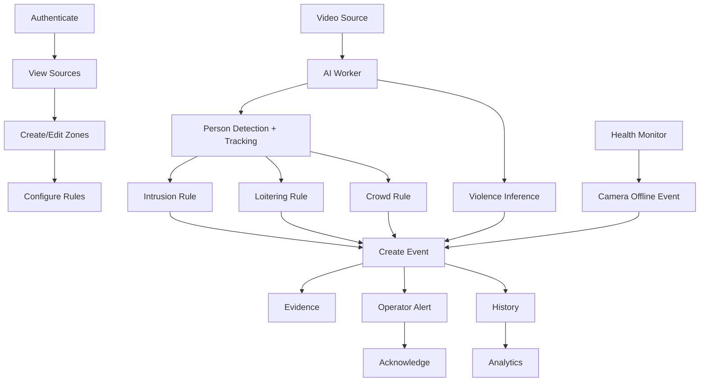
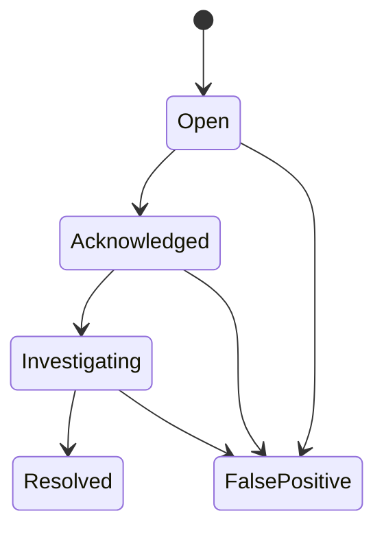

# Sentinel AI — Use Case Specification

> **Document purpose**
>
> This document defines the principal actor interactions and system behavioral scenarios for Sentinel AI.
>
> It sits between the Software Requirements Specification and the implementation/design documents:
>
> ```text
> Vision & Scope
>       ↓
> SRS
>       ↓
> Use Case Specification
>       ↓
> Architecture / API / Database / UI Design
>       ↓
> Implementation
>       ↓
> Tests
> ```
>
> The use cases in this document are intended to eliminate ambiguity about **how users and internal system actors interact with Sentinel AI**.
>
> This document does **not** authorize implementation of unresolved design choices. Any behavior marked `TBD`, `PROPOSED`, or `ASSUMPTION REQUIRING APPROVAL` shall remain unresolved until explicitly baselined.

---

# 0. Document Control

## 0.1 Authority

This document is authoritative for detailed use-case behavior after baseline approval.

It is subordinate to:

- `PROJECT_HANDBOOK.md`
- `01-vision-and-scope.md`
- `02-srs.md`

If this document conflicts with the SRS, the SRS takes precedence until the inconsistency is explicitly resolved.

## 0.2 Status vocabulary

| Status | Meaning |
|---|---|
| `DRAFT` | Not yet approved |
| `BASELINED` | Accepted for implementation |
| `MODIFIED` | Changed after baseline |
| `RETIRED` | No longer applicable |

## 0.3 Scope vocabulary

| Scope status | Meaning |
|---|---|
| `CONFIRMED_SCOPE` | Capability is part of MVP |
| `PROPOSED_SCOPE` | Behavior still requires team acceptance |
| `TBD_SCOPE` | Required behavior is unresolved |
| `DEFERRED_SCOPE` | Future feature, not MVP |
| `REJECTED_SCOPE` | Explicitly excluded |

## 0.4 Actor terminology

This document uses the following conceptual actors:

- **Administrator**
- **Operator**
- **Reviewer/Supervisor**
- **AI Worker**
- **Camera/Video Source**
- **System Scheduler/Health Monitor**
- **Unauthenticated User**
- **Authenticated User**

Exact role permissions remain partly `TBD` until the authorization model is baselined.

## 0.5 Use-case identifier scheme

```text
UC-AUTH-###
UC-CAM-###
UC-ZONE-###
UC-RULE-###
UC-MON-###
UC-EVT-###
UC-EVD-###
UC-HIST-###
UC-ANL-###
UC-AI-###
UC-ADM-###
UC-SYS-###
```

---

# 1. Use Case Template

Every major use case follows this structure:

```text
Use Case ID
Title
Status
Primary actor
Supporting actors
Goal
Trigger
Preconditions
Postconditions
Related requirements
Business/data objects touched
Main success flow
Alternate flows
Exception flows
Security/privacy notes
Acceptance evidence
Open decisions
```

---

# 2. Actor Catalogue

## 2.1 ACT-01 — Administrator

**Status:** `PROPOSED_SCOPE`

### Intent

Configure Sentinel resources and system behavior.

### Candidate responsibilities

- register cameras/video sources;
- edit source configuration;
- create zones;
- configure rules;
- enable/disable sources;
- potentially manage users/roles.

### Explicit limitation

Exact permissions remain `TBD`.

Do not assume that every administrator can perform every system operation until the authorization matrix is finalized.

---

## 2.2 ACT-02 — Operator

**Status:** `PROPOSED_SCOPE`

### Intent

Monitor operational events and respond to alerts.

### Candidate responsibilities

- view live/active sources;
- receive alerts;
- inspect event details;
- review evidence;
- acknowledge events;
- inspect history;
- optionally record false-positive feedback.

---

## 2.3 ACT-03 — Reviewer/Supervisor

**Status:** `PROPOSED_SCOPE`

### Intent

Review historical events, analytics, and system outcomes.

Potential access:

- event history;
- evidence;
- analytics;
- false-positive review;
- audit data.

Exact authorization remains `TBD`.

---

## 2.4 ACT-04 — AI Worker

**Status:** `CONFIRMED_SCOPE`

### Intent

Process supported video/frame input and return structured AI observations/results to the backend.

Responsibilities include:

- person detection;
- tracking;
- violence/fighting inference;
- model loading;
- preprocessing;
- inference-result generation.

The AI worker shall not own user authorization or product-level event lifecycle policy.

---

## 2.5 ACT-05 — Camera / Video Source

**Status:** `CONFIRMED_SCOPE`

### Intent

Provide visual input to the processing pipeline.

Exact transport type remains `TBD`.

Potential source forms include:

- recorded video;
- local file;
- local webcam;
- RTSP/IP source.

---

## 2.6 ACT-06 — Health Monitoring Process

**Status:** `CONFIRMED_SCOPE`

### Intent

Evaluate whether an enabled source remains healthy according to the final offline criteria.

---

## 2.7 ACT-07 — Unauthenticated User

**Status:** `PROPOSED_SCOPE`

### Intent

Attempt to reach the application before authentication.

Expected behavior:

- protected data is not exposed;
- authentication flow is presented where implemented.

---

# 3. Use Case Overview Matrix

| Use Case | Name | Primary Actor | MVP |
|---|---|---|---:|
| UC-AUTH-001 | Authenticate to Sentinel | User | Yes if auth baselined |
| UC-AUTH-002 | End authenticated session | User | Yes if auth baselined |
| UC-CAM-001 | Register camera/video source | Administrator | Yes |
| UC-CAM-002 | View source list and health | Operator/Admin | Yes |
| UC-CAM-003 | Edit source configuration | Administrator | Yes |
| UC-CAM-004 | Disable/re-enable source | Administrator | Yes |
| UC-ZONE-001 | Create monitoring zone | Administrator | Yes |
| UC-ZONE-002 | Edit monitoring zone | Administrator | Yes |
| UC-RULE-001 | Configure intrusion rule | Administrator | Yes |
| UC-RULE-002 | Configure loitering rule | Administrator | Yes |
| UC-RULE-003 | Configure crowd rule | Administrator | Yes |
| UC-RULE-004 | Enable/disable rule | Administrator | Yes |
| UC-MON-001 | Monitor active event feed | Operator | Yes |
| UC-EVT-001 | Generate restricted-area intrusion event | System | Yes |
| UC-EVT-002 | Generate loitering event | System | Yes |
| UC-EVT-003 | Generate crowd-threshold event | System | Yes |
| UC-EVT-004 | Generate violence/fighting event | System | Yes |
| UC-EVT-005 | Generate camera-offline event | System | Yes |
| UC-EVT-006 | Acknowledge event | Operator | Yes |
| UC-EVT-007 | Record false-positive feedback | Operator/Reviewer | Proposed |
| UC-EVD-001 | Review event evidence | Operator/Reviewer | Yes |
| UC-HIST-001 | Search/filter event history | Operator/Reviewer | Yes |
| UC-HIST-002 | Open historical event | Operator/Reviewer | Yes |
| UC-ANL-001 | View analytics dashboard | Operator/Reviewer | Yes |
| UC-AI-001 | Run person detection/tracking pipeline | AI Worker | Yes |
| UC-AI-002 | Run violence/fighting inference | AI Worker | Yes |
| UC-SYS-001 | Handle AI worker failure | System | Yes |
| UC-SYS-002 | Handle malformed AI result | System | Yes |
| UC-SYS-003 | Handle evidence-write failure | System | Yes |
| UC-SYS-004 | Recover from client real-time disconnect | Web Client/System | Proposed |
| UC-SYS-005 | Replay deterministic test video | Developer/Test Actor | Yes |
| UC-ADM-001 | Review audit-sensitive action | Admin/Reviewer | Proposed |

---

# 4. Authentication Use Cases

## UC-AUTH-001 — Authenticate to Sentinel

**Status:** `TBD_SCOPE`  
**Primary actor:** Unauthenticated User  
**Supporting actor:** Authentication subsystem  
**Goal:** Obtain authorized access to Sentinel functions.  
**Trigger:** User attempts to access the application or submits authentication credentials.  
**Related requirements:** `FR-AUTH-001`, `FR-AUTH-002`, `FR-AUTH-003`  
**Priority:** `MUST` if authentication is baselined.

### Preconditions

1. Authentication is enabled in the selected system design.
2. A valid account or external identity exists.
3. The application backend is available.
4. The user is not currently in a valid authenticated session.

### Postconditions — success

1. The user has a valid authenticated application context.
2. The system can identify the authenticated user.
3. Authorization checks can be performed against that identity.
4. No password or secret is exposed to the client beyond the normal authentication protocol.

### Postconditions — failure

1. No authenticated session is established.
2. Protected resources remain inaccessible.
3. The failure does not expose sensitive authentication internals.

### Main success flow

1. The user opens Sentinel.
2. Sentinel determines that no valid authenticated session exists.
3. Sentinel presents the configured authentication interface.
4. The user supplies the required authentication information.
5. The client submits the authentication request securely to the backend or selected identity mechanism.
6. The authentication subsystem validates the input.
7. The backend establishes the selected authenticated session/token state.
8. Sentinel loads only the functions and data permitted to the authenticated user.
9. The user arrives at the authorized application entry page.

### Alternate flow A1 — already authenticated

1. User opens Sentinel.
2. Existing session/token is validated.
3. Authentication screen is skipped.
4. User proceeds to authorized application content.

### Exception flow E1 — invalid credentials

1. User submits invalid credentials.
2. Authentication fails.
3. No session is created.
4. User receives a safe error.
5. Protected application data is not returned.

### Exception flow E2 — disabled/unauthorized account

1. Identity is syntactically valid.
2. Account is not permitted to access Sentinel.
3. Authentication/authorization is denied.
4. Application content is not exposed.

### Security/privacy notes

- Exact authentication mechanism remains `TBD`.
- Password storage requirements apply only if local password authentication is selected.
- Server-side authorization remains mandatory regardless of frontend visibility.

### Acceptance evidence

- successful authentication test;
- invalid-credential test;
- unauthorized-resource test;
- session/token verification;
- no sensitive error leakage.

### Open decisions

- RD-003 authentication mechanism;
- RD-004 roles and permissions.

---

## UC-AUTH-002 — End Authenticated Session

**Status:** `TBD_SCOPE`  
**Primary actor:** Authenticated User  
**Goal:** End the current authenticated session.  
**Related requirements:** `FR-AUTH-004`

### Preconditions

- authentication mechanism supports an interactive session/token lifecycle;
- user is authenticated.

### Main success flow

1. User selects the logout/session termination action.
2. Client sends the required termination request or clears state according to the approved design.
3. Server invalidates or ends the authenticated context where required.
4. Client discards local authentication state.
5. User is returned to an unauthenticated state.
6. A subsequent protected request requires authentication again.

### Exception flow E1 — backend unavailable

1. User requests logout.
2. Backend cannot be reached.
3. Client shall not falsely claim server-side invalidation if it cannot verify it.
4. Client clears local state only according to the selected safe logout design.
5. User is informed of the condition if necessary.

### Acceptance evidence

- logout behavior test;
- protected request after logout is denied.

---

# 5. Camera / Video Source Use Cases

## UC-CAM-001 — Register Camera or Video Source

**Status:** `CONFIRMED_SCOPE`  
**Primary actor:** Administrator  
**Goal:** Create a system-known video source that Sentinel may monitor.  
**Related requirements:** `FR-CAM-001`, `NFR-SEC-005`  
**Data touched:** camera/source configuration.

### Preconditions

1. Administrator is authenticated and authorized.
2. Selected source type is supported by the current MVP.
3. Required configuration fields are known.

### Main success flow

1. Administrator opens source-management interface.
2. Administrator selects add/register source.
3. Sentinel presents source configuration fields.
4. Administrator supplies required metadata.
5. Client submits the configuration.
6. Backend validates:
   - source type;
   - required fields;
   - identifier constraints;
   - syntax/format.
7. Backend persists the source.
8. Sentinel assigns a stable source identifier.
9. Source appears in the source list.
10. Health state begins according to the selected source lifecycle.

### Alternate flow A1 — source registered but not started

If the design separates configuration from activation:

1. Source is saved.
2. Source remains disabled/inactive.
3. Administrator may explicitly enable it later.

### Exception flow E1 — unsupported source type

1. Administrator supplies unsupported source transport/type.
2. Backend rejects configuration.
3. No partial source is created.

### Exception flow E2 — invalid credentials embedded in source configuration

1. Source configuration is syntactically invalid.
2. Backend rejects it.
3. Secrets are not echoed back in logs/error responses.

### Acceptance evidence

- valid source creation;
- invalid source rejection;
- persistent retrieval;
- authorization test.

### Open decisions

- RD-005 primary MVP input type;
- source credential handling;
- exact health lifecycle.

---

## UC-CAM-002 — View Source List and Health

**Status:** `CONFIRMED_SCOPE`  
**Primary actor:** Operator or Administrator  
**Goal:** Understand which sources exist and their current system-visible health state.  
**Related requirements:** `FR-CAM-002`, `FR-CAM-006`, `NFR-REL-001`

### Preconditions

- user is authorized;
- one or more sources may exist.

### Main success flow

1. User opens source/monitoring view.
2. Client requests visible sources.
3. Backend returns only authorized sources.
4. UI displays each source with:
   - source identifier/name;
   - enabled/disabled state;
   - health state according to final design.
5. User may select a source for more details.

### Alternate flow A1 — no sources configured

1. Backend returns valid empty collection.
2. UI displays an empty state.
3. UI does not display an error.

### Exception flow E1 — backend error

1. Source request fails.
2. UI displays error state.
3. UI does not display stale health as current without indicating staleness.

### Acceptance evidence

- populated state;
- empty state;
- error state;
- source authorization filtering.

---

## UC-CAM-003 — Edit Source Configuration

**Status:** `CONFIRMED_SCOPE`  
**Primary actor:** Administrator  
**Goal:** Change supported mutable source properties.  
**Related requirements:** `FR-CAM-004`

### Preconditions

- source exists;
- actor is authorized.

### Main success flow

1. Administrator opens source details.
2. Sentinel retrieves current configuration.
3. Administrator edits mutable fields.
4. Backend validates update.
5. Valid changes persist.
6. Updated source state is returned.
7. Processing behavior reflects the new configuration according to lifecycle rules.

### Exception flow E1 — immutable field modification

1. Client attempts to alter an immutable identifier.
2. Backend rejects the change.

### Exception flow E2 — invalid source config

1. Submitted configuration is invalid.
2. Backend rejects the entire invalid update.
3. Existing valid configuration remains intact.

### Acceptance evidence

- update persists;
- invalid update does not partially corrupt source.

---

## UC-CAM-004 — Disable or Re-enable Source

**Status:** `PROPOSED_SCOPE`  
**Primary actor:** Administrator  
**Goal:** Intentionally stop or resume processing without deleting source history.  
**Related requirements:** `FR-CAM-005`, `FR-CAM-008`

### Preconditions

- source exists.

### Main success flow — disable

1. Administrator selects disable.
2. Backend verifies authorization.
3. Source enters disabled state.
4. Normal inference/event processing is stopped for that source.
5. Historical events remain available.
6. UI distinguishes disabled from offline.

### Main success flow — re-enable

1. Administrator selects enable.
2. Backend updates source.
3. Health checks/processing resume.
4. Current source health becomes observable.

### Acceptance evidence

- disabled source generates no new normal surveillance events;
- history remains intact;
- re-enable restores processing eligibility.

---

# 6. Zone Use Cases

## UC-ZONE-001 — Create Monitoring Zone

**Status:** `CONFIRMED_SCOPE`  
**Primary actor:** Administrator  
**Goal:** Define a polygonal region for rule evaluation.  
**Related requirements:** `FR-ZONE-001`, `FR-ZONE-004`, `FR-ZONE-005`

### Preconditions

1. Source exists.
2. Actor can configure that source.
3. A current frame/image view is available or the UI provides an equivalent coordinate reference.

### Main success flow

1. Administrator opens zone configuration for a source.
2. Sentinel displays source image/video area.
3. Administrator begins zone creation.
4. Administrator selects polygon vertices.
5. Client displays polygon preview.
6. Administrator provides required zone metadata.
7. Client submits normalized zone coordinates according to the approved coordinate convention.
8. Backend validates:
   - source association;
   - minimum geometry requirements;
   - coordinate range;
   - polygon validity.
9. Backend persists zone.
10. UI reloads/returns the persisted zone.
11. Polygon appears aligned with source view.

### Alternate flow A1 — user cancels before save

1. Unsaved geometry is discarded.
2. No persistent zone is created.

### Exception flow E1 — invalid polygon

Examples:

- too few vertices;
- coordinates outside allowed range;
- self-intersection if prohibited;
- malformed geometry.

Backend rejects the zone.

### Exception flow E2 — source changed or removed

If the source no longer exists or is inaccessible:

1. Save is rejected.
2. User is informed.
3. No orphan zone is created.

### Acceptance evidence

- create zone;
- retrieve zone;
- render consistently;
- invalid geometry rejection.

### Open decisions

- normalized coordinates vs pixel coordinates;
- exact geometry point used for person-zone evaluation.

---

## UC-ZONE-002 — Edit Monitoring Zone

**Status:** `CONFIRMED_SCOPE`  
**Primary actor:** Administrator  
**Related requirements:** `FR-ZONE-002`, `FR-ZONE-003`

### Main success flow

1. Administrator opens existing zone.
2. Existing polygon is rendered.
3. Administrator changes geometry or supported metadata.
4. Backend validates.
5. New configuration persists.
6. New future rule evaluations use updated zone.

### Historical-data constraint

Changing a zone shall not make historical event interpretation impossible.

Exact strategy may be:

- versioned zone;
- configuration snapshot;
- event-level copied geometry metadata.

This remains a database-design decision.

### Alternate flow A1 — disable instead of edit

Administrator disables zone.

New zone-based events stop while historical events remain available.

---

# 7. Rule Configuration Use Cases

## UC-RULE-001 — Configure Restricted-Area Intrusion Rule

**Status:** `CONFIRMED_SCOPE`  
**Primary actor:** Administrator  
**Related requirements:** `FR-RULE-001`, `FR-RULE-003`, `FR-INT-001`

### Goal

Configure Sentinel to create an intrusion event when a person satisfies the restricted-zone entry condition.

### Preconditions

- source exists;
- restricted zone exists;
- actor is authorized.

### Main success flow

1. Administrator selects source/zone.
2. Administrator creates a restricted-area rule.
3. Sentinel displays applicable configuration.
4. Administrator provides required settings.
5. Backend validates source-zone compatibility.
6. Backend persists rule.
7. Rule is enabled or remains disabled according to selected lifecycle.
8. Future matching track observations become eligible for evaluation.

### Open decisions

- entry-point geometry;
- crossing semantics;
- starting-inside behavior;
- cooldown/retrigger;
- optional schedule/time-window.

No value shall be guessed before baseline.

---

## UC-RULE-002 — Configure Loitering Rule

**Status:** `CONFIRMED_SCOPE`  
**Primary actor:** Administrator  
**Related requirements:** `FR-RULE-001`, `FR-LOIT-001`, `FR-LOIT-002`, `FR-LOIT-003`

### Goal

Define measurable dwell-time behavior for a zone.

### Preconditions

- source/zone exists.

### Main success flow

1. Administrator selects loitering rule.
2. Administrator selects monitored zone.
3. Administrator provides configured duration threshold.
4. Additional required timer/reset parameters are supplied if the final rule requires them.
5. Backend validates values.
6. Rule persists.
7. Rule becomes eligible for evaluation when enabled.

### Exception flow E1 — missing threshold

Backend rejects rule if threshold is mandatory.

### Open decisions

- exact threshold;
- track-loss grace;
- pause/reset behavior;
- event retrigger policy.

---

## UC-RULE-003 — Configure Crowd Threshold Rule

**Status:** `CONFIRMED_SCOPE`  
**Primary actor:** Administrator  
**Related requirements:** `FR-CROWD-001`, `FR-CROWD-002`

### Main success flow

1. Administrator selects a source or zone.
2. Administrator selects crowd-threshold rule.
3. Administrator supplies threshold.
4. Backend validates threshold.
5. Backend saves rule.
6. System evaluates count using the single baselined counting method.

### Open decisions

- active tracks vs detections;
- zone-specific vs whole-frame;
- threshold crossing semantics;
- cooldown/retrigger.

---

## UC-RULE-004 — Enable or Disable Rule

**Status:** `CONFIRMED_SCOPE`  
**Primary actor:** Administrator  
**Related requirements:** `FR-RULE-002`

### Main flow — disable

1. Administrator chooses rule.
2. Selects disable.
3. Backend changes state.
4. Rule stops generating new events.
5. Historical events remain.

### Main flow — enable

1. Administrator chooses disabled rule.
2. Selects enable.
3. Backend validates dependencies still exist.
4. Rule becomes active.

---

# 8. Monitoring Use Case

## UC-MON-001 — Monitor Active Event Feed

**Status:** `CONFIRMED_SCOPE`  
**Primary actor:** Operator  
**Supporting actors:** Backend, real-time transport  
**Related requirements:** `FR-ALT-001`, `FR-ALT-002`, `FR-ALT-003`, `FR-UI-005`

### Goal

Allow an operator to become aware of newly created events without manually refreshing the application.

### Preconditions

1. Operator is authenticated/authorized if auth is enabled.
2. Monitoring UI is open.
3. Backend is available.
4. Real-time mechanism is connected if that mechanism is used.

### Main success flow

1. Operator opens monitoring dashboard.
2. Client retrieves current relevant event state.
3. Client establishes the selected update mechanism.
4. Backend creates a new alert-worthy event.
5. Backend communicates the new event/alert to the client.
6. Client validates/accepts the event payload.
7. UI adds or updates the alert.
8. Operator can open the event.

### Alternate flow A1 — page opened after event already occurred

1. Client retrieves current persisted events.
2. Existing unacknowledged/relevant events are shown.

### Exception flow E1 — real-time disconnect

1. Client detects connection loss.
2. UI shows disconnected/reconnecting state.
3. Client follows baselined reconnect logic.
4. After reconnect, client reconciles missed events according to API design.

### Exception flow E2 — duplicate message

1. Client receives duplicate event notification.
2. UI does not create misleading duplicate event cards if event identifier is already known.
3. State is reconciled against persisted event identity.

### Acceptance evidence

- new event appears without full-page manual reload;
- disconnect state;
- reconnect behavior;
- duplicate handling.

---

# 9. System Event Generation Use Cases

## UC-EVT-001 — Generate Restricted-Area Intrusion Event

**Status:** `CONFIRMED_SCOPE`  
**Primary actor:** System  
**Supporting actors:** AI Worker, Camera/Video Source  
**Related requirements:** `FR-DET-001`, `FR-TRK-001`, `FR-INT-001`, `FR-INT-002`, `FR-INT-003`, `FR-EVT-001`, `FR-EVT-007`

### Goal

Create one traceable intrusion event when a tracked person satisfies the configured restricted-area condition.

### Preconditions

1. Source enabled and healthy enough for processing.
2. Restricted zone exists and is enabled.
3. Intrusion rule exists and is enabled.
4. AI worker can produce person detection/tracking results.
5. Rule geometry semantics are baselined.

### Main success flow

1. Video frame/sequence reaches AI worker.
2. Person is detected.
3. Detection becomes associated with a temporary track.
4. Worker/backend receives spatial track data.
5. Rule engine evaluates track position against restricted polygon.
6. Previous rule state is checked where transition semantics require it.
7. Rule condition becomes event-triggering true.
8. Duplicate/retrigger policy is evaluated.
9. Backend creates intrusion event.
10. Event is persisted.
11. Event references source and rule/zone context.
12. Evidence workflow is initiated if required.
13. Alert becomes available to operators.

### Alternate flow A1 — person remains outside zone

No event is created.

### Alternate flow A2 — person remains inside after initial event

System applies duplicate-suppression policy.

No unbounded frame-by-frame events are created.

### Alternate flow A3 — person exits and re-enters

Behavior follows baselined retrigger semantics.

### Exception flow E1 — invalid track geometry

Result is rejected/quarantined.

No intrusion event is created from invalid geometry.

### Exception flow E2 — zone disabled during processing

Rule evaluation shall follow the authoritative rule-state timing policy.

This behavior is `TBD` and must be defined in architecture/SRS baseline.

### Acceptance evidence

- synthetic coordinate tests;
- recorded-video integration test;
- duplicate suppression test;
- source/zone linkage verification.

---

## UC-EVT-002 — Generate Loitering Event

**Status:** `CONFIRMED_SCOPE`  
**Primary actor:** System  
**Supporting actor:** AI Worker  
**Related requirements:** `FR-LOIT-001`, `FR-LOIT-002`, `FR-LOIT-003`, `FR-LOIT-004`

### Preconditions

- source, zone, rule enabled;
- track is available;
- threshold and timer semantics are baselined.

### Main success flow

1. Person track satisfies in-zone condition.
2. System records or derives dwell start time.
3. Subsequent track observations continue satisfying in-zone condition.
4. Dwell duration is updated.
5. Duration reaches configured threshold.
6. Duplicate/retrigger policy is checked.
7. Loitering event is created.
8. Event persists.
9. Alert/evidence workflow proceeds.

### Alternate flow A1 — person exits before threshold

Timer behaves according to reset semantics.

No loitering event is created for that episode.

### Alternate flow A2 — temporary track loss

System follows baselined track-loss grace/reset behavior.

### Alternate flow A3 — person remains long after event

System does not create an event per frame.

### Acceptance evidence

- below-threshold test;
- threshold-crossing test;
- exit-reset test;
- track-loss test;
- sustained-condition duplicate test.

---

## UC-EVT-003 — Generate Crowd-Threshold Event

**Status:** `CONFIRMED_SCOPE`  
**Primary actor:** System  
**Related requirements:** `FR-CROWD-001`, `FR-CROWD-002`, `FR-CROWD-003`

### Preconditions

- crowd rule enabled;
- counting semantics baselined.

### Main success flow

1. AI output provides qualifying person observations.
2. System computes count using baselined method.
3. Count is compared to configured threshold.
4. Event condition becomes true.
5. Duplicate/retrigger policy is checked.
6. Crowd-threshold event is created.
7. Observed count/threshold context is preserved according to data design.
8. Alert is surfaced.

### Alternate flow A1 — count below threshold

No event.

### Alternate flow A2 — threshold remains exceeded

No frame-by-frame event stream.

### Alternate flow A3 — count drops then rises

Behavior follows retrigger policy.

### Acceptance evidence

- count below threshold;
- exact threshold condition;
- sustained exceedance;
- retrigger scenario.

---

## UC-EVT-004 — Generate Violence/Fighting Event

**Status:** `CONFIRMED_SCOPE`  
**Primary actor:** System  
**Supporting actor:** AI Worker  
**Related requirements:** `FR-VIO-001`, `FR-VIO-002`, `FR-VIO-003`, `FR-VIO-004`, `MLR-VIO-*`

### Preconditions

1. Violence model selected and loadable.
2. Input temporal window is valid.
3. Model/event threshold criterion is baselined.
4. Model version is registered.

### Main success flow

1. AI worker receives temporal video input.
2. Worker applies documented preprocessing.
3. Violence/fighting model runs.
4. Model produces class/score result.
5. Result includes model/version provenance.
6. Backend receives structured result.
7. Backend validates contract.
8. Event criterion is evaluated.
9. Qualifying result creates violence/fighting event.
10. Event stores model provenance.
11. Evidence is associated.
12. Alert is surfaced to operator.

### Alternate flow A1 — score below event criterion

No violence event is created.

The model result may or may not be persisted according to AI/data design.

### Exception flow E1 — inference failure

1. Model throws error or cannot process input.
2. Worker reports explicit failure.
3. Backend does not treat failure as `non-violence`.
4. Failure is logged/observable.

### Exception flow E2 — missing model metadata

1. Result fails mandatory contract validation.
2. Result is rejected/quarantined.
3. No unsupported event is created.

### Acceptance evidence

- formal held-out evaluation;
- positive integrated clip;
- negative integrated clip;
- inference failure test;
- model provenance verification.

---

## UC-EVT-005 — Generate Camera-Offline Event

**Status:** `CONFIRMED_SCOPE`  
**Primary actor:** Health Monitoring Process  
**Supporting actor:** Camera/Video Source  
**Related requirements:** `FR-CAM-006`, `FR-CAM-007`, `FR-CAM-008`

### Preconditions

- source is configured;
- source is enabled;
- offline criteria are baselined.

### Main success flow

1. Source is considered healthy.
2. Health monitoring evaluates source.
3. Source stops satisfying healthy criteria.
4. Offline condition persists until the defined threshold/condition is met.
5. System transitions source health to offline.
6. Camera-offline event is created.
7. Event persists.
8. Operator alert becomes visible.

### Alternate flow A1 — transient interruption below offline threshold

No offline event is created if criteria are not yet satisfied.

### Alternate flow A2 — source intentionally disabled

Disabled source is not treated as accidental offline unless design explicitly states otherwise.

### Alternate flow A3 — source recovers

Health state returns to healthy/available.

A dedicated recovery event is `TBD`.

### Acceptance evidence

- forced source outage;
- transient failure test;
- disabled-vs-offline distinction.

---

## UC-EVT-006 — Acknowledge Event

**Status:** `CONFIRMED_SCOPE`  
**Primary actor:** Operator  
**Related requirements:** `FR-ALT-004`, `FR-ALT-005`, `NFR-REL-004`

### Goal

Persist that an authorized operator has seen an eligible event.

### Preconditions

1. Event exists.
2. Event is eligible for acknowledgement.
3. Operator is authorized.

### Main success flow

1. Operator opens event or alert.
2. Operator selects acknowledge.
3. Client sends acknowledgement request.
4. Backend validates user and event.
5. Backend applies acknowledgement transition.
6. Acknowledgement persists.
7. Response returns updated state.
8. UI shows acknowledged state.
9. State remains after refresh/reconnect.

### Alternate flow A1 — acknowledgement repeated

1. Same logical acknowledgement is requested again.
2. Backend applies deterministic idempotent behavior.
3. State remains valid.

### Exception flow E1 — unauthorized actor

Request is denied.

No acknowledgement state changes.

### Exception flow E2 — event no longer eligible

Backend rejects transition according to lifecycle rules.

### Acceptance evidence

- successful acknowledgement;
- persistence after refresh;
- unauthorized test;
- repeated acknowledgement test.

---

## UC-EVT-007 — Record False-Positive Feedback

**Status:** `PROPOSED_SCOPE`  
**Primary actor:** Operator or Reviewer  
**Related requirements:** `FR-ALT-006`

### Goal

Record that a generated event was judged operationally false-positive without deleting the original evidence.

### Preconditions

- event exists;
- actor authorized;
- false-positive feedback feature baselined.

### Main success flow

1. User opens event.
2. User selects false-positive action.
3. User may select/provide reason if configured.
4. Backend validates transition/feedback.
5. Feedback persists.
6. Original event remains.
7. UI reflects feedback state.
8. Model retraining is **not** triggered automatically.

### Acceptance evidence

- original event preserved;
- feedback persisted;
- no automatic model mutation.

---

# 10. Evidence Use Cases

## UC-EVD-001 — Review Event Evidence

**Status:** `CONFIRMED_SCOPE`  
**Primary actor:** Operator or Reviewer  
**Related requirements:** `FR-EVD-001`, `FR-EVD-002`, `FR-EVD-003`, `FR-EVD-004`, `FR-EVD-005`

### Preconditions

- event exists;
- evidence metadata exists or evidence state indicates unavailable;
- actor is authorized.

### Main success flow

1. User opens event details.
2. Client requests event metadata.
3. Backend verifies access.
4. Evidence metadata is returned.
5. User selects snapshot or clip.
6. Backend/storage layer authorizes media access.
7. Media is rendered or downloaded/streamed according to the final UI design.
8. User can inspect context associated with the event.

### Alternate flow A1 — snapshot only

Event has snapshot but no clip.

UI displays snapshot and does not falsely indicate clip availability.

### Alternate flow A2 — evidence generation failed

Event remains visible.

UI displays explicit evidence-unavailable/failed state.

### Exception flow E1 — unauthorized direct media access

Access is denied even if media identifier/path is guessed.

### Exception flow E2 — missing artifact

Metadata exists but storage artifact is missing.

System reports missing/deleted evidence state.

### Privacy notes

- media is protected;
- demo footage provenance must be documented;
- evidence retention remains `TBD`.

### Acceptance evidence

- authorized snapshot/clip access;
- unauthorized test;
- missing artifact test.

---

# 11. History Use Cases

## UC-HIST-001 — Search and Filter Event History

**Status:** `CONFIRMED_SCOPE`  
**Primary actor:** Operator or Reviewer  
**Related requirements:** `FR-HIST-001` through `FR-HIST-006`

### Goal

Locate historical events using supported filters.

### Preconditions

- actor is authorized;
- events may exist.

### Main success flow

1. User opens history page.
2. Client requests initial bounded event list.
3. Backend returns authorized results.
4. User selects one or more filters:
   - time range;
   - event type;
   - source;
   - acknowledgement/status if baselined.
5. Client submits filter query.
6. Backend validates filters.
7. Backend returns matching bounded results.
8. UI displays results in deterministic order.
9. User may navigate pages/cursor/limits according to API design.
10. User may open a specific event.

### Alternate flow A1 — no matching events

UI displays valid empty state.

### Exception flow E1 — invalid date range

Backend rejects request.

UI displays validation feedback.

### Exception flow E2 — inaccessible source filter

Backend denies or returns authorized-safe behavior without leaking inaccessible source details.

### Acceptance evidence

- each required filter;
- combined filters;
- empty result;
- pagination/bounded retrieval.

---

## UC-HIST-002 — Open Historical Event

**Status:** `CONFIRMED_SCOPE`  
**Primary actor:** Operator or Reviewer  
**Related requirements:** `FR-EVT-004`, `FR-HIST-001`, `FR-EVD-001`

### Main success flow

1. User selects event from history.
2. Client requests event.
3. Backend authorizes access.
4. Event details load.
5. Current status/ack state is displayed.
6. Evidence availability is shown.
7. Model/rule context is shown where specified.
8. User may review evidence.

### Exception flow E1 — event removed/unavailable

Defined not-found state.

### Exception flow E2 — user lacks access

Access denied without protected-data leakage.

---

# 12. Analytics Use Case

## UC-ANL-001 — View Analytics Dashboard

**Status:** `CONFIRMED_SCOPE`  
**Primary actor:** Operator or Reviewer  
**Related requirements:** `FR-ANL-001` through `FR-ANL-005`

### Goal

View aggregated operational data derived from persisted Sentinel records.

### Preconditions

- user authorized;
- analytics endpoint/data layer available.

### Main success flow

1. User opens analytics.
2. Client requests metrics for default/selected time range.
3. Backend computes or retrieves aggregates from persisted data.
4. Backend returns metrics.
5. UI renders:
   - event counts by type;
   - one time-series metric;
   - event counts by source;
   - acknowledgement metric if baselined.
6. Time range/metric definition is visible or otherwise clearly defined.

### Alternate flow A1 — no events

Analytics displays valid zero/empty state.

### Exception flow E1 — backend failure

UI displays error.

It must not display stale/demo metrics as current live metrics without labeling.

### Data-integrity rule

No hard-coded fake production metrics.

### Acceptance evidence

- aggregate query validated against underlying event data;
- empty-data state;
- error state.

---

# 13. AI Worker Use Cases

## UC-AI-001 — Run Person Detection and Tracking Pipeline

**Status:** `CONFIRMED_SCOPE`  
**Primary actor:** AI Worker  
**Supporting actor:** Camera/Video Source  
**Related requirements:** `MLR-DET-001`, `MLR-DET-002`, `MLR-TRK-001`, `FR-DET-001`, `FR-TRK-001`

### Goal

Transform supported frames/video into structured person detections and temporary track context.

### Preconditions

1. Detector is installed/configured.
2. Tracker is installed/configured.
3. Required model artifacts are available.
4. Input source is supported.
5. Worker is healthy.

### Main success flow

1. Worker receives frame/sequence.
2. Worker timestamps/correlates input according to contract.
3. Preprocessing is applied.
4. Detector executes.
5. Person detections are extracted.
6. Tracker receives relevant detections.
7. Tracker updates active tracks.
8. Worker constructs structured result.
9. Result includes:
   - source identity;
   - timestamp;
   - model identity/version;
   - person geometry;
   - confidence/score;
   - track ID where available.
10. Result is delivered to backend.
11. Backend validates contract.

### Alternate flow A1 — no person detected

Worker returns a valid no-person/empty-detection result according to contract.

This is distinct from inference failure.

### Exception flow E1 — detector model missing

Worker reports failure.

### Exception flow E2 — tracker error

Worker reports tracking failure or degraded result according to contract.

It does not fabricate stable track IDs.

### Exception flow E3 — malformed frame

Input is rejected with explicit failure.

### Acceptance evidence

- positive person clip;
- no-person clip;
- malformed input;
- model missing;
- track continuity test.

---

## UC-AI-002 — Run Violence/Fighting Inference

**Status:** `CONFIRMED_SCOPE`  
**Primary actor:** AI Worker  
**Related requirements:** `MLR-VIO-001` through `MLR-VIO-006`, `FR-VIO-001`, `FR-VIO-002`

### Main success flow

1. Worker obtains the model-required temporal input.
2. Input is sampled/preprocessed.
3. Selected violence model executes.
4. Output score/class is produced.
5. Worker attaches model/version provenance.
6. Structured result is returned.
7. Backend validates.
8. Backend applies event criterion separately.

### Alternate flow A1 — non-violence result

Valid result is returned.

No event unless criterion says otherwise.

### Exception flow E1 — insufficient temporal input

Worker returns explicit failure or insufficient-input result according to AI contract.

### Exception flow E2 — model inference failure

Worker reports failure.

No successful negative classification is fabricated.

---

# 14. System Failure Use Cases

## UC-SYS-001 — Handle AI Worker Failure

**Status:** `CONFIRMED_SCOPE`  
**Primary actor:** System  
**Related requirements:** `FR-INTG-004`, `MLR-INF-001`, `NFR-REL-001`, `NFR-REL-002`

### Trigger

AI worker becomes unreachable or unable to perform inference.

### Main failure-handling flow

1. Backend/monitor detects worker failure.
2. System records/logs failure context.
3. Worker-dependent processing is marked degraded/failed.
4. Backend remains available for unrelated operations where possible.
5. No successful AI result is fabricated.
6. User/system health state reflects degradation if health UI is implemented.
7. Recovery is attempted according to deployment design.

### Acceptance evidence

- stop worker during integration test;
- backend remains responsive;
- failure is observable;
- no false-negative AI result is generated.

---

## UC-SYS-002 — Handle Malformed AI Result

**Status:** `CONFIRMED_SCOPE`  
**Primary actor:** Backend  
**Related requirements:** `FR-INTG-003`, `NFR-SEC-005`

### Trigger

Backend receives AI payload that violates contract.

### Main flow

1. Backend validates schema.
2. Validation fails.
3. Backend rejects/quarantines payload.
4. Error is logged with safe context.
5. No event is created from invalid mandatory data.
6. Worker/client receives appropriate failure signal where applicable.

### Acceptance evidence

- missing source;
- invalid coordinates;
- unknown mandatory result type;
- malformed model metadata.

---

## UC-SYS-003 — Handle Evidence Write Failure

**Status:** `CONFIRMED_SCOPE`  
**Primary actor:** Backend/Evidence subsystem  
**Related requirements:** `FR-EVD-001`, `FR-EVD-003`

### Trigger

Event exists, but snapshot/clip cannot be stored.

### Main flow

1. Event creation succeeds or is in progress.
2. Evidence write fails.
3. System records evidence failure state.
4. Event remains retrievable if event persistence succeeded.
5. UI does not claim evidence exists.
6. Failure is logged.
7. Retry behavior, if any, follows design.

### Acceptance evidence

- simulated storage permission/disk failure;
- event remains valid;
- evidence state not falsely successful.

---

## UC-SYS-004 — Recover from Real-Time Client Disconnect

**Status:** `TBD_SCOPE`  
**Primary actor:** Web Client  
**Related requirements:** `FR-UI-005`, `NFR-REL-005`

### Preconditions

- persistent real-time channel selected.

### Main flow

1. Client connection drops.
2. Client marks connection state unavailable.
3. Client attempts reconnect according to policy.
4. Connection restores.
5. Client reconciles events created while disconnected.
6. Duplicate messages do not create duplicate event identities.

### Open decisions

- WebSocket vs alternative;
- reconnect interval/backoff;
- last-event cursor/checkpoint;
- heartbeat.

---

## UC-SYS-005 — Replay Deterministic Test Video

**Status:** `CONFIRMED_SCOPE`  
**Primary actor:** Developer/Test Actor  
**Related requirements:** `FR-DEMO-001`, `NFR-TEST-003`

### Goal

Reproduce at least one complete Sentinel event flow using known input.

### Main success flow

1. Tester selects approved sample video.
2. Source is configured in test mode.
3. AI worker processes video.
4. Expected detection/rule condition occurs.
5. Event is generated.
6. Event appears in UI.
7. Tester acknowledges event.
8. State persists.
9. Test result is recorded.

### Acceptance evidence

- documented fixture path/source;
- expected event;
- observed event;
- acknowledgement;
- test result.

---

# 15. Administrative / Audit Use Cases

## UC-ADM-001 — Review Audit-Sensitive Action

**Status:** `PROPOSED_SCOPE`  
**Primary actor:** Administrator or Reviewer  
**Related requirements:** `FR-AUD-001`, `FR-AUD-002`

### Goal

Determine who performed an audited action and when.

### Main success flow

1. Authorized reviewer opens audit view or event audit section.
2. Backend retrieves allowed audit records.
3. Reviewer sees:
   - actor;
   - action;
   - target;
   - time;
   - outcome where defined.
4. Reviewer may filter or inspect event acknowledgement audit.

### Security note

Audit data itself is sensitive and must not be publicly exposed.

---

# 16. Use Case Relationship Diagram



---

# 17. Detailed Event-State Considerations

The exact event state model is not yet baselined.

A candidate model is:



**Status:** `PROPOSED`

Before implementation, define:

1. whether `OPEN` exists;
2. whether acknowledgement is a status or separate record;
3. whether `INVESTIGATING` is needed;
4. whether false-positive is terminal;
5. whether resolved events can reopen;
6. whether lifecycle history is immutable.

---

# 18. Authorization Matrix — Draft

The following is **not baselined**.

| Capability | Administrator | Operator | Reviewer |
|---|---:|---:|---:|
| View sources | Proposed Yes | Proposed Yes | Proposed Yes |
| Add/edit sources | Proposed Yes | Proposed No | Proposed No |
| Create/edit zones | Proposed Yes | Proposed No | Proposed No |
| Configure rules | Proposed Yes | Proposed No | Proposed No |
| View alerts | Proposed Yes | Proposed Yes | Proposed Yes |
| Acknowledge alerts | Proposed Yes | Proposed Yes | Proposed TBD |
| Mark false positive | Proposed Yes | Proposed Yes | Proposed Yes |
| View history | Proposed Yes | Proposed Yes | Proposed Yes |
| View evidence | Proposed Yes | Proposed Yes | Proposed Yes |
| View analytics | Proposed Yes | Proposed Yes | Proposed Yes |
| Manage users | Proposed Yes | Proposed No | Proposed No |
| View audit logs | Proposed Yes | Proposed No | Proposed Yes |

The final matrix must be approved before authorization tests are baselined.

---

# 19. Use-Case Data Ownership

| Data object | Created by | Updated by | Consumed by |
|---|---|---|---|
| User | Admin/auth system | Admin/auth system | Backend/UI |
| Camera/source | Administrator | Administrator/system health | Worker/backend/UI |
| Zone | Administrator | Administrator | Rule engine/UI |
| Rule | Administrator | Administrator | Rule engine |
| Detection | AI Worker | AI Worker | Tracking/rules |
| Track | AI Worker | AI Worker | Rules |
| Event | Backend/system | Backend lifecycle | UI/history/analytics |
| Alert | Backend | Backend/operator workflow | UI |
| Evidence | Evidence subsystem | Evidence subsystem | UI/reviewer |
| Acknowledgement | Operator/backend | Backend | UI/history/audit |
| Model record | AI/data workflow | AI/data workflow | Worker/event provenance |
| Audit entry | Backend/system | Append-only conceptually | Reviewer/admin |

Exact persistence choices belong in database design.

---

# 20. Use-Case Failure Matrix

| Failure | Primary impacted use cases | Expected high-level behavior |
|---|---|---|
| Camera unavailable | UC-EVT-005, UC-MON-001 | health/offline event |
| AI worker down | UC-AI-001, UC-AI-002 | explicit degraded state |
| Detector model missing | UC-AI-001 | inference failure |
| Violence model missing | UC-AI-002 | inference failure |
| Invalid worker payload | UC-SYS-002 | reject/quarantine |
| DB unavailable | most persistent flows | no false success |
| Evidence storage failure | UC-EVD-001 | event survives with evidence failure state |
| Real-time channel down | UC-MON-001 | disconnected/reconnect behavior |
| Invalid zone | UC-ZONE-001 | reject |
| Unauthorized request | all protected user cases | deny |
| Track lost | UC-EVT-002 | follow baselined timer semantics |
| Duplicate worker result | event flows | duplicate policy/correlation |
| Stale UI | monitoring/history | reconcile from persisted backend state |

---

# 21. Use-Case Acceptance Evidence Standard

For each baselined use case, the project shall eventually provide one or more of:

- automated test;
- integration test;
- screenshot;
- screen recording;
- console/log evidence;
- database record;
- model evaluation output;
- API trace;
- reproducible test fixture.

A screenshot alone is insufficient evidence for behavior that depends on:

- persistence;
- authorization;
- AI inference;
- duplicate suppression;
- real-time delivery.

---

# 22. Use-Case-to-SRS Traceability Matrix

| Use Case | Principal Requirement IDs |
|---|---|
| UC-AUTH-001 | FR-AUTH-001, FR-AUTH-002, FR-AUTH-003 |
| UC-AUTH-002 | FR-AUTH-004 |
| UC-CAM-001 | FR-CAM-001 |
| UC-CAM-002 | FR-CAM-002, FR-CAM-006 |
| UC-CAM-003 | FR-CAM-004 |
| UC-CAM-004 | FR-CAM-005, FR-CAM-008 |
| UC-ZONE-001 | FR-ZONE-001, FR-ZONE-004, FR-ZONE-005 |
| UC-ZONE-002 | FR-ZONE-002, FR-ZONE-003 |
| UC-RULE-001 | FR-RULE-001, FR-RULE-003, FR-INT-001 |
| UC-RULE-002 | FR-LOIT-001, FR-LOIT-002, FR-LOIT-003 |
| UC-RULE-003 | FR-CROWD-001, FR-CROWD-002 |
| UC-RULE-004 | FR-RULE-002 |
| UC-MON-001 | FR-ALT-001, FR-ALT-002, FR-ALT-003 |
| UC-EVT-001 | FR-INT-001, FR-INT-002, FR-INT-003 |
| UC-EVT-002 | FR-LOIT-001, FR-LOIT-002, FR-LOIT-004 |
| UC-EVT-003 | FR-CROWD-001, FR-CROWD-002, FR-CROWD-003 |
| UC-EVT-004 | FR-VIO-001, FR-VIO-002, FR-VIO-003, FR-VIO-004 |
| UC-EVT-005 | FR-CAM-006, FR-CAM-007, FR-CAM-008 |
| UC-EVT-006 | FR-ALT-004, FR-ALT-005 |
| UC-EVT-007 | FR-ALT-006 |
| UC-EVD-001 | FR-EVD-001, FR-EVD-002, FR-EVD-003, FR-EVD-004 |
| UC-HIST-001 | FR-HIST-001 through FR-HIST-006 |
| UC-HIST-002 | FR-EVT-004, FR-EVD-001 |
| UC-ANL-001 | FR-ANL-001 through FR-ANL-005 |
| UC-AI-001 | MLR-DET-001, MLR-TRK-001, FR-DET-001, FR-TRK-001 |
| UC-AI-002 | MLR-VIO-001 through MLR-VIO-006 |
| UC-SYS-001 | FR-INTG-004, MLR-INF-001 |
| UC-SYS-002 | FR-INTG-003 |
| UC-SYS-003 | FR-EVD-001, FR-EVD-003 |
| UC-SYS-004 | FR-UI-005, NFR-REL-005 |
| UC-SYS-005 | FR-DEMO-001, NFR-TEST-003 |
| UC-ADM-001 | FR-AUD-001, FR-AUD-002 |

---

# 23. Use-Case-to-Test Seed Matrix

| Use Case | Suggested Test ID Seed |
|---|---|
| UC-AUTH-001 | TC-AUTH-001 |
| UC-CAM-001 | TC-CAM-001 |
| UC-ZONE-001 | TC-ZONE-001 |
| UC-EVT-001 | TC-INT-001 |
| UC-EVT-002 | TC-LOIT-001 |
| UC-EVT-003 | TC-CROWD-001 |
| UC-EVT-004 | TC-VIO-001 |
| UC-EVT-005 | TC-OFFLINE-001 |
| UC-EVT-006 | TC-ACK-001 |
| UC-EVD-001 | TC-EVD-001 |
| UC-HIST-001 | TC-HIST-001 |
| UC-ANL-001 | TC-ANL-001 |
| UC-AI-001 | TC-AI-DET-001 |
| UC-AI-002 | TC-AI-VIO-001 |
| UC-SYS-001 | TC-FAIL-WORKER-001 |
| UC-SYS-002 | TC-FAIL-CONTRACT-001 |
| UC-SYS-003 | TC-FAIL-EVIDENCE-001 |
| UC-SYS-005 | TC-E2E-001 |

Final test IDs belong in `14-test-plan.md`.

---

# 24. Open Use-Case Decisions

These decisions must be resolved before affected use cases become baselined.

| ID | Decision | Affected use cases |
|---|---|---|
| UCD-001 | Authentication mechanism | UC-AUTH-* |
| UCD-002 | Role/permission matrix | all user use cases |
| UCD-003 | Source input type | UC-CAM-001, UC-AI-* |
| UCD-004 | Zone coordinate representation | UC-ZONE-* |
| UCD-005 | Intrusion geometry point | UC-EVT-001 |
| UCD-006 | Starting-inside-zone behavior | UC-EVT-001 |
| UCD-007 | Intrusion cooldown/retrigger | UC-EVT-001 |
| UCD-008 | Loitering threshold | UC-RULE-002, UC-EVT-002 |
| UCD-009 | Loitering track-loss behavior | UC-EVT-002 |
| UCD-010 | Crowd counting method | UC-RULE-003, UC-EVT-003 |
| UCD-011 | Crowd retrigger semantics | UC-EVT-003 |
| UCD-012 | Violence model threshold/event criterion | UC-EVT-004 |
| UCD-013 | Camera-offline timeout/criteria | UC-EVT-005 |
| UCD-014 | Evidence storage and media access method | UC-EVD-001 |
| UCD-015 | Evidence pre/post-roll | UC-EVD-001 |
| UCD-016 | Event lifecycle | UC-EVT-006, UC-EVT-007 |
| UCD-017 | Event vs incident relationship | history/review use cases |
| UCD-018 | Real-time transport | UC-MON-001, UC-SYS-004 |
| UCD-019 | Reconnect/reconciliation strategy | UC-SYS-004 |
| UCD-020 | Audit feature inclusion | UC-ADM-001 |

---

# 25. Use-Case Review Checklist

Before this document becomes `BASELINED`:

- [ ] All three team members agree on the actor list.
- [ ] Role permissions are resolved or explicitly deferred.
- [ ] Authentication use cases match the chosen auth mechanism.
- [ ] Camera input mode is selected.
- [ ] Zone coordinate representation is selected.
- [ ] Intrusion semantics are unambiguous.
- [ ] Loitering semantics are unambiguous.
- [ ] Crowd semantics are unambiguous.
- [ ] Violence event threshold semantics are defined.
- [ ] Camera-offline semantics are defined.
- [ ] Evidence failure behavior is agreed.
- [ ] Event lifecycle is defined.
- [ ] Real-time connection behavior is defined.
- [ ] Each `MUST` SRS behavior is represented by at least one use case or clearly identified as non-use-case behavior.
- [ ] No use case invents a database field or API endpoint.
- [ ] No use case claims an unmeasured metric.
- [ ] Deferred features are absent from normal MVP flows.

---

# 26. Baseline Approval Record

| Review item | Contributor | Date | Status |
|---|---|---|---|
| Actor model | `TBD` | `TBD` | Pending |
| Camera workflows | `TBD` | `TBD` | Pending |
| Zone/rule workflows | `TBD` | `TBD` | Pending |
| Event-generation flows | `TBD` | `TBD` | Pending |
| Operator workflows | `TBD` | `TBD` | Pending |
| Failure flows | `TBD` | `TBD` | Pending |
| Traceability | `TBD` | `TBD` | Pending |

---

# 27. Final Use-Case Rule

> A Sentinel AI use case is not considered sufficiently specified if a developer or AI assistant still has to invent:
>
> - who is allowed to perform the action;
> - what triggers the action;
> - what success means;
> - what failure means;
> - what persistent state changes;
> - what happens when the same action occurs twice;
> - how the action relates to the formal SRS.
>
> Any such unresolved behavior shall remain explicitly marked `TBD` or `PROPOSED` until the team makes a decision.
