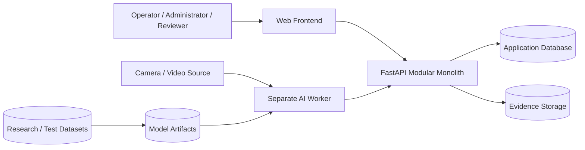
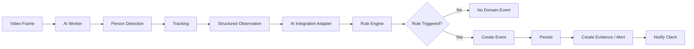
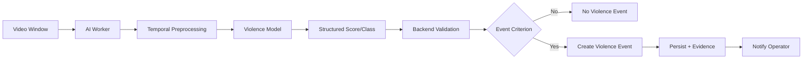
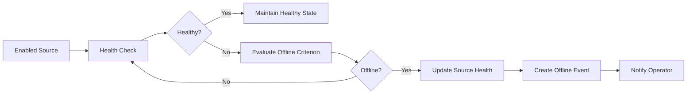
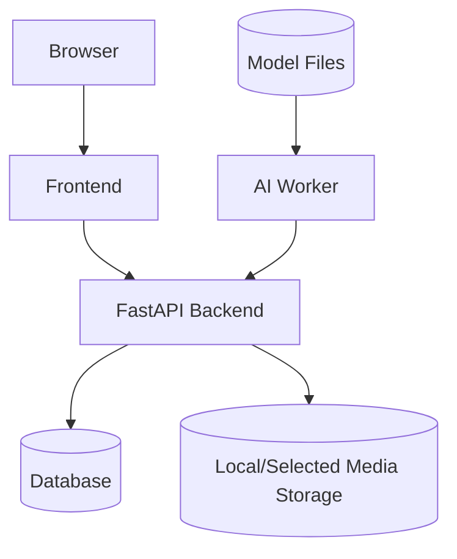

# Sentinel AI — System Architecture Specification

> **Document purpose**
>
> This document defines the software architecture of Sentinel AI at system, process, module, and integration-boundary level.
>
> It translates the project vision, SRS, and use cases into a technical structure that can be implemented by three developers within a short 2–3 week delivery window.
>
> It is intentionally explicit about:
>
> - what belongs inside the FastAPI modular monolith;
> - what belongs inside the separate AI worker;
> - which responsibilities must remain separated;
> - how data is expected to move through the system;
> - where failures must be contained;
> - which architecture decisions are already confirmed;
> - which technology choices remain unresolved.
>
> This document does **not** define exact REST paths, database table names, WebSocket message names, model architectures, or UI component names. Those belong in their respective detailed specifications.

---

# 0. Document Control

## 0.1 Authority

This document is authoritative for system architecture after baseline approval.

It is subordinate to:

- `PROJECT_HANDBOOK.md`
- `01-vision-and-scope.md`
- `02-srs.md`
- `03-use-case-specification.md`
- accepted ADRs in `docs/adr/`

If an accepted ADR conflicts with this document, the ADR shall be treated as the more specific decision and this document shall be updated.

## 0.2 Architecture status vocabulary

| Status | Meaning |
|---|---|
| `CONFIRMED` | Accepted architecture decision |
| `PROPOSED` | Candidate design awaiting acceptance |
| `TBD` | Unresolved |
| `DEFERRED` | Future architecture enhancement |
| `REJECTED` | Explicitly excluded |

## 0.3 Confirmed architecture baseline

The following architecture choices are already accepted:

1. **FastAPI backend** — `CONFIRMED`
2. **Modular monolith application architecture** — `CONFIRMED`
3. **Separate AI worker process/service** — `CONFIRMED`
4. **AI inference must not execute as the primary long-running operation inside ordinary interactive API request handlers** — `CONFIRMED`
5. **Detections/tracks are not equivalent to domain events** — `CONFIRMED`
6. **Facial recognition is excluded from MVP** — `CONFIRMED`
7. **Rule-driven event logic belongs in the application domain, not inside the frontend** — `CONFIRMED`

## 0.4 Unresolved architecture choices

| Decision | Status |
|---|---|
| Frontend framework | `TBD` |
| Database engine | `PROPOSED: PostgreSQL` |
| Web real-time transport | `PROPOSED: WebSocket` |
| Backend ↔ AI worker transport | `TBD` |
| Evidence-media storage mechanism | `TBD` |
| Primary camera/video input transport | `TBD` |
| Authentication mechanism | `TBD` |
| Deployment target | `TBD` |
| Queue/broker use | `TBD` |
| Redis use | `TBD` |
| Container orchestration | `REJECTED_FOR_MVP` unless later required |

---

# 1. Architectural Drivers

Architecture is governed by the following project constraints and quality goals.

## 1.1 Driver AD-01 — Short delivery window

**Constraint:** Maximum 2–3 weeks.

### Architectural consequence

Prefer:

- one application backend;
- explicit internal modules;
- one separate AI worker;
- one primary database;
- minimal infrastructure;
- simple deployment.

Avoid:

- unnecessary microservices;
- distributed transaction complexity;
- service mesh;
- orchestration-heavy deployment;
- premature horizontal scaling.

---

## 1.2 Driver AD-02 — Three-person team

### Architectural consequence

Subsystem ownership must map cleanly to three primary responsibility areas:

```text
Frontend / AWT
Backend / Integration
AI / Data
```

Architecture must minimize hidden coupling between these areas.

---

## 1.3 Driver AD-03 — AI workload characteristics

AI/video inference differs from normal HTTP application work.

It may be:

- CPU/GPU intensive;
- long-running;
- bursty;
- failure-prone due to model/media issues;
- dependent on model artifacts;
- sensitive to video resolution/frame rate.

### Architectural consequence

AI inference shall run in a separate worker process/service.

---

## 1.4 Driver AD-04 — Advanced Web Technologies relevance

The architecture must support substantial web-system behavior:

- API interaction;
- authenticated access;
- persistent application state;
- dynamic event updates;
- live monitoring state;
- media review;
- configuration UIs;
- analytics.

---

## 1.5 Driver AD-05 — Traceability

Events must be traceable to:

- source;
- relevant rule;
- model/version when AI contributes;
- time;
- evidence;
- acknowledgement.

### Architectural consequence

Domain entities and interfaces must preserve provenance.

---

## 1.6 Driver AD-06 — Failure transparency

The project explicitly rejects silent false-success behavior.

### Architectural consequence

Component failures must be distinguishable from valid negative AI results.

---

# 2. Architectural Style

## 2.1 Application architecture

Sentinel AI shall use a **modular monolith**.

The FastAPI backend runs as one logical application process/deployment unit, but internal responsibilities are divided into explicit modules.

Conceptually:

```text
FastAPI Application
│
├── Core / Shared Infrastructure
├── Authentication / Authorization
├── User Management
├── Camera Management
├── Zone Management
├── Rule Management
├── Event Management
├── Alert / Acknowledgement
├── Evidence
├── History / Search
├── Analytics
├── Audit
└── AI Integration Adapter
```

Not every module must be implemented as a separate Python package on Day 1, but logical separation must remain visible.

## 2.2 Why modular monolith

A modular monolith is selected because it provides:

- low operational overhead;
- one deployment unit;
- simple local setup;
- simpler transaction boundaries;
- easier debugging;
- easier integration for three developers;
- sufficient modularity for academic design quality.

## 2.3 Why not microservices

Microservices were intentionally not selected for MVP because they would introduce:

- service-to-service authentication;
- distributed logging;
- network retry semantics;
- schema drift;
- service discovery;
- more deployment complexity;
- more integration failure modes.

These concerns do not materially improve the course-project objective.

---

# 3. Top-Level System Context



## 3.1 Context interpretation

### Web frontend

Responsible for:

- user interaction;
- configuration views;
- monitoring;
- alerts;
- event review;
- evidence presentation;
- analytics.

### FastAPI backend

Responsible for:

- product/domain behavior;
- authorization;
- persistence;
- rule evaluation;
- event lifecycle;
- evidence metadata;
- integration with AI worker;
- API contracts;
- real-time client updates.

### AI worker

Responsible for:

- video preprocessing;
- person detection;
- tracking;
- violence/fighting inference;
- model loading;
- AI result production.

### Database

Responsible for structured application persistence.

Technology remains `PROPOSED: PostgreSQL`.

### Evidence storage

Responsible for snapshots/clips.

Technology remains `TBD`.

---

# 4. Process Boundaries

Sentinel AI shall have at least two distinct runtime process boundaries.

## 4.1 Process P-01 — Web/Application Backend

**Technology:** FastAPI  
**Status:** `CONFIRMED`

Responsibilities:

- HTTP/API handling;
- authentication/authorization;
- camera/source configuration;
- zones;
- rules;
- event creation;
- alert state;
- acknowledgement;
- history/search;
- analytics;
- audit;
- AI-worker result consumption;
- real-time client update emission.

Must not own:

- long-running model inference;
- training;
- direct dataset processing pipelines.

---

## 4.2 Process P-02 — AI Worker

**Status:** `CONFIRMED`

Responsibilities:

- video/frame intake;
- preprocessing;
- object/person detection;
- tracking;
- violence/fighting inference;
- model health;
- AI result serialization.

Must not own:

- user accounts;
- authorization policy;
- final event lifecycle;
- frontend notification policy;
- incident status;
- application analytics.

---

## 4.3 Optional process P-03 — Frontend development/runtime server

If a frontend framework uses a separate development or production runtime, that process exists operationally but is not a domain-service boundary.

Frontend technology remains `TBD`.

---

## 4.4 Optional process P-04 — Database server

If PostgreSQL or equivalent is selected, database runs as a separate infrastructure process.

---

## 4.5 Optional process P-05 — Media server/storage service

May be:

- local filesystem;
- static protected backend route;
- object storage;
- external media service.

Status: `TBD`.

---

# 5. Backend Modular Monolith Structure

The following module model is the recommended architecture baseline.

```text
backend/
└── app/
    ├── main.py
    ├── core/
    ├── auth/
    ├── users/
    ├── cameras/
    ├── zones/
    ├── rules/
    ├── events/
    ├── alerts/
    ├── evidence/
    ├── analytics/
    ├── audit/
    ├── ai_integration/
    └── shared/
```

Exact file names remain implementation details.

---

# 6. Backend Module Responsibilities

## 6.1 Core module

### Responsibilities

- application startup/shutdown;
- configuration;
- dependency wiring;
- database session setup;
- logging configuration;
- error mapping;
- shared security utilities;
- health checks.

### Must not contain

- intrusion logic;
- loitering logic;
- detector logic;
- UI-specific state.

---

## 6.2 Authentication/Authorization module

**Status:** `PROPOSED`, because exact auth mechanism is `TBD`.

### Responsibilities

- authentication;
- current-user resolution;
- authorization checks;
- session/token validation;
- password verification if local credentials are used.

### Constraints

Authorization must remain server-side.

---

## 6.3 User module

**Status:** `PROPOSED`

Responsibilities:

- application user data;
- roles/permissions if baselined;
- account state.

Not responsible for:

- tracking detected persons.

A tracked person must never be represented using the user/account entity.

---

## 6.4 Camera module

Responsibilities:

- camera/source registration;
- source configuration;
- enable/disable;
- health state;
- source metadata.

Must not:

- implement model inference;
- own zone geometry.

---

## 6.5 Zone module

Responsibilities:

- monitoring-zone geometry;
- source-zone association;
- zone enable/disable;
- geometry validation.

Potential geometry forms:

- normalized coordinates;
- source-pixel coordinates.

Exact representation: `TBD`.

---

## 6.6 Rules module

Responsibilities:

- intrusion rule configuration;
- loitering rule configuration;
- crowd rule configuration;
- deterministic rule evaluation;
- duplicate/cooldown state as required.

This is a key domain module.

### Important separation

```text
AI result
    ↓
Rule module
    ↓
Event decision
```

The AI worker should not directly create application-domain intrusion/loitering/crowd records in persistence.

---

## 6.7 Events module

Responsibilities:

- domain event creation;
- event validation;
- event type taxonomy;
- event occurrence metadata;
- event retrieval;
- lifecycle where baselined.

This module is the principal boundary between:

```text
observation
```

and:

```text
operational domain event
```

---

## 6.8 Alerts module

Responsibilities:

- operator-facing alert representation;
- acknowledgement;
- status synchronization;
- real-time event publication to clients.

Exact relationship between event and alert: `TBD`.

---

## 6.9 Evidence module

Responsibilities:

- snapshot/clip metadata;
- evidence creation coordination;
- protected media access;
- missing/deleted/failed evidence state.

The application database should normally store metadata/reference rather than large video binaries.

---

## 6.10 Analytics module

Responsibilities:

- aggregated event counts;
- time-series metrics;
- camera/source metrics;
- acknowledgement metrics where baselined.

Analytics must derive from persistent data.

---

## 6.11 Audit module

**Status:** `PROPOSED`

Responsibilities:

- security/workflow-sensitive action records;
- acknowledgement audit;
- configuration-change audit where defined.

---

## 6.12 AI Integration module

Responsibilities:

- worker/backend contract validation;
- AI result normalization;
- correlation IDs;
- model provenance mapping;
- dispatch to appropriate rule/event logic;
- worker health integration.

Must not:

- perform model training;
- hide malformed results;
- silently repair missing mandatory fields.

---

# 7. Internal Backend Layering

Recommended dependency direction:

```text
API / Controller
      ↓
Application Service
      ↓
Domain Logic
      ↓
Repository / Persistence Port
      ↓
Database Adapter
```

## 7.1 Controller layer

Responsibilities:

- HTTP input;
- schema validation;
- authorization call;
- response mapping.

Should not contain:

- complex event logic;
- large SQL statements;
- AI inference.

---

## 7.2 Application service layer

Coordinates use cases.

Example:

```text
acknowledge_event()
```

may:

1. load event;
2. check lifecycle;
3. create acknowledgement;
4. update event state;
5. record audit;
6. commit transaction;
7. emit real-time update.

---

## 7.3 Domain layer

Contains deterministic product rules such as:

- intrusion transition;
- loitering timer;
- crowd threshold;
- event duplicate suppression.

---

## 7.4 Repository/persistence layer

Provides persistence abstraction.

The project does not need a complex repository framework if simple service-oriented SQLAlchemy access remains clear and testable.

---

# 8. AI Worker Architecture

Recommended conceptual structure:

```text
AI Worker
│
├── Input Adapter
├── Frame Decoder / Sampler
├── Preprocessing
├── Person Detector
├── Tracker
├── Violence Model
├── Result Builder
├── Model Registry Loader
├── Health / Diagnostics
└── Output Adapter
```

## 8.1 Input adapter

Accepts video/frame input according to selected source architecture.

Status: `TBD`.

---

## 8.2 Frame decoder/sampler

Responsibilities:

- decode frame;
- select frames;
- preserve timestamps;
- optionally create temporal windows.

---

## 8.3 Detector

Responsibilities:

- person detection;
- bounding geometry;
- detector score.

Exact model: `TBD`.

---

## 8.4 Tracker

Responsibilities:

- associate detections over time;
- assign temporary track IDs.

Exact tracker: `TBD`.

---

## 8.5 Violence model

Responsibilities:

- temporal violence/fighting classification.

Exact architecture/data representation: `TBD`.

---

## 8.6 Result builder

Creates structured worker result.

Example conceptual structure:

```yaml
message_type: "observation"
correlation_id: "..."
source_id: "..."
source_timestamp: "..."
processing_timestamp: "..."
model:
  id: "..."
  version: "..."
detections:
  - class: "person"
    confidence: 0.0
    bbox: []
    track_id: "..."
violence:
  score: 0.0
  class: "..."
status: "success"
```

This is **illustrative only**.

The final schema belongs in `07-api-specification.md`.

---

# 9. Backend ↔ AI Worker Communication

## 9.1 Status

Transport: `TBD`.

Candidate approaches:

1. HTTP request/response
2. internal job queue
3. Redis-backed queue
4. message broker
5. local process IPC

## 9.2 Selection criteria

The chosen mechanism shall be evaluated against:

- 2–3 week implementation window;
- reliability;
- debugging simplicity;
- ability to run locally;
- long-running inference;
- concurrency;
- retry behavior;
- correlation;
- error handling.

## 9.3 Architectural preference

For MVP, prefer the **simplest transport that preserves the separate-worker boundary and supports asynchronous/long-running processing cleanly**.

Do not introduce a broker solely because it appears more enterprise-like.

## 9.4 Contract requirements

Regardless of transport:

- structured schema;
- source identity;
- correlation identity;
- timestamp semantics;
- model provenance;
- explicit success/failure state;
- versioning strategy;
- validation.

---

# 10. Frontend ↔ Backend Communication

## 10.1 Request/response

**Proposed:** REST-style HTTP APIs.

Used for:

- auth;
- source configuration;
- zones;
- rules;
- event retrieval;
- acknowledgement;
- history;
- analytics.

## 10.2 Real-time updates

**Proposed:** WebSocket.

Used for:

- new alerts;
- event-state changes;
- source-health changes.

## 10.3 Important reliability rule

The persistent real-time channel must not be treated as the only source of truth.

The database/backend remains authoritative.

On reconnect:

```text
client
→ fetch/reconcile persisted state
→ continue live updates
```

This prevents lost messages from permanently hiding events.

---

# 11. Event Processing Pipeline

## 11.1 Person/rule pipeline



---

## 11.2 Violence pipeline



---

## 11.3 Camera-offline pipeline



---

# 12. Rule Engine Architecture

The rule engine shall remain deterministic.

## 12.1 Intrusion rule

Input:

- source;
- track;
- spatial geometry;
- zone;
- previous rule state.

Output:

```text
trigger / no trigger
```

---

## 12.2 Loitering rule

Input:

- track;
- zone membership;
- timestamps;
- configured threshold;
- previous timer state.

Output:

```text
trigger / continue / reset
```

---

## 12.3 Crowd rule

Input:

- qualifying person count;
- threshold;
- previous threshold state.

Output:

```text
trigger / no trigger
```

---

## 12.4 Rule state storage

Exact storage is `TBD`.

Possible options:

- in-memory per worker/backend;
- database;
- short-lived cache.

Selection must account for:

- restart behavior;
- duplicate suppression;
- multiple backend workers;
- testability.

For a single-instance academic deployment, a simpler strategy may be acceptable if limitations are documented.

---

# 13. Duplicate Event Suppression Architecture

Video processing may generate many equivalent observations.

The architecture shall separate:

```text
observation frequency
```

from:

```text
event frequency
```

## 13.1 Required state concepts

Depending on rule:

- current track inside/outside;
- current loitering episode;
- crowd threshold currently exceeded/not exceeded;
- violence alert cooldown;
- camera already offline.

## 13.2 Duplicate suppression location

Duplicate suppression belongs in:

- rule/event domain logic.

It shall not rely only on frontend deduplication.

---

# 14. Persistence Architecture

## 14.1 Proposed database

**PostgreSQL** — `PROPOSED`.

Rationale:

- relational data fits users/cameras/zones/rules/events;
- transactional behavior;
- indexing;
- mature Python support.

Final confirmation belongs in ADR-004.

## 14.2 Structured persistence responsibilities

Database should persist, where baselined:

- users;
- roles;
- sources;
- zones;
- rules;
- events;
- acknowledgements;
- evidence metadata;
- audit records;
- model metadata references.

## 14.3 Raw detections

Do **not** assume every frame-level detection should be stored.

Potential strategies:

1. transient only;
2. store only detections that contribute to event;
3. sampled detection history.

Decision: `TBD`.

## 14.4 Transaction boundaries

Use transactions for operations where partial persistence would create invalid state.

Example acknowledgement:

```text
event state change
+
acknowledgement row
+
audit entry
```

should be treated consistently.

---

# 15. Evidence Storage Architecture

## 15.1 Principle

Evidence media and structured metadata are different concerns.

Preferred conceptual model:

```text
Database
    ↓
media reference / metadata

Evidence Storage
    ↓
snapshot / clip
```

## 15.2 Candidate storage approaches

### Option A — Local filesystem

Advantages:

- simplest;
- fast to implement;
- good for local demo.

Disadvantages:

- single-machine;
- path/permission management;
- harder multi-instance scaling.

### Option B — Object storage

Advantages:

- clean media abstraction;
- scalable;
- signed URL options.

Disadvantages:

- extra infrastructure;
- credentials;
- unnecessary complexity for local MVP.

### Current status

`TBD`.

For a local academic demonstration, local filesystem is likely the simplest candidate but is not yet confirmed.

---

# 16. Evidence Buffering

To create pre-event clips, the system may require a rolling in-memory/video buffer.

Status: `PROPOSED`.

Conceptually:

```text
incoming frames
    ↓
rolling buffer
    ↓
event trigger
    ↓
retain pre-event frames
    +
capture post-event frames
    ↓
write clip
```

## 16.1 Open decisions

- buffer duration;
- frame rate;
- storage in memory vs temp files;
- per-camera buffer;
- maximum memory use;
- cleanup.

No numeric value is baselined.

---

# 17. Authentication and Authorization Architecture

Exact authentication mechanism: `TBD`.

Candidate approaches:

- local username/password with token/session;
- JWT-style bearer token;
- server session cookie.

## 17.1 Architecture requirements

Regardless of mechanism:

- backend resolves authenticated user;
- backend enforces authorization;
- frontend does not act as security boundary;
- protected media follows authorization.

## 17.2 Role model

Candidate roles:

```text
Administrator
Operator
Reviewer/Supervisor
```

Status: `PROPOSED`.

Exact permission matrix remains in SRS/use-case baseline.

---

# 18. Real-Time Update Architecture

## 18.1 Proposed model

```text
Backend
  ↓
WebSocket
  ↓
Connected authorized client
```

## 18.2 Message categories

Potential:

- event_created;
- event_updated;
- acknowledgement_created;
- camera_health_changed.

These are **conceptual**, not approved message names.

## 18.3 Reconciliation

On connection/reconnection:

1. client authenticates;
2. client obtains current persisted state;
3. client subscribes/connects;
4. client processes incremental updates;
5. duplicate event IDs are reconciled.

---

# 19. Analytics Architecture

Analytics should query persisted event data.

## 19.1 Recommended MVP approach

Do not create a separate analytics service.

Use:

- application database queries;
- aggregation service;
- API response;
- frontend charts.

## 19.2 Candidate aggregates

- events by type;
- events over time;
- events by source;
- acknowledgement counts;
- false positives;
- camera health.

## 19.3 Optimization

Materialized views/data warehouse are unnecessary for MVP unless actual data volume proves need.

---

# 20. Audit Architecture

Audit is `PROPOSED`.

## 20.1 Candidate audited actions

- login success/failure;
- source creation/update;
- zone change;
- rule change;
- acknowledgement;
- false-positive feedback;
- user/role change.

## 20.2 Integrity expectation

User should not directly submit arbitrary actor identity.

Backend should derive actor identity from authenticated context.

---

# 21. Configuration Architecture

Runtime configuration shall be externalized.

Candidate configuration areas:

```text
DATABASE_URL
APPLICATION_SECRET
MEDIA_ROOT
MODEL_ROOT
LOG_LEVEL
ALLOWED_ORIGINS
WORKER_URL / QUEUE
```

These are examples only.

Final keys belong in deployment guide.

## 21.1 Secret separation

Real secrets:

- never committed;
- not stored in Markdown;
- not logged.

---

# 22. Error Architecture

Errors should be handled at the boundary where they are understood.

## 22.1 AI error

Origin:

- worker.

Mapped to:

- explicit processing failure.

## 22.2 Domain rule error

Origin:

- invalid configuration/state.

Mapped to:

- validation/domain error.

## 22.3 Persistence error

Origin:

- database/media.

Mapped to:

- operation failure;
- no false success.

## 22.4 Client error

Frontend should distinguish:

- validation error;
- unauthorized;
- not found;
- server error;
- disconnected state.

---

# 23. Logging and Observability Architecture

## 23.1 Backend log fields

Recommended:

```text
timestamp
level
component
request_id
user_id where appropriate
source_id
event_id
correlation_id
message
```

## 23.2 Worker log fields

Recommended:

```text
timestamp
level
model_id
model_version
source_id
correlation_id
frame/window context
processing duration
error
```

## 23.3 Do not log

- passwords;
- access tokens;
- secret keys;
- raw camera credentials;
- raw frames by default.

---

# 24. Correlation and Traceability

A correlation ID is strongly recommended.

Status: `PROPOSED`.

Example path:

```text
video job
    ↓ correlation_id
AI worker
    ↓ correlation_id
backend result
    ↓ correlation_id
event
    ↓ event_id
alert/evidence
```

This helps debug:

- delayed worker result;
- duplicate result;
- wrong source;
- missing event.

---

# 25. Timestamp Architecture

Exact timestamp strategy: `TBD`.

The architecture must distinguish:

- source/frame timestamp;
- worker processing timestamp;
- backend receive timestamp;
- event occurrence timestamp;
- persistence timestamp;
- acknowledgement timestamp.

A single `timestamp` field for every concept is insufficient.

Recommended policy:

- store authoritative server timestamps in UTC;
- preserve source timestamp separately where relevant;
- convert for display in client.

This is `PROPOSED`, pending data-design decision.

---

# 26. Security Boundaries

## 26.1 Trust boundary TB-01 — Browser ↔ Backend

Browser input is untrusted.

Validate:

- body;
- IDs;
- geometry;
- filters;
- credentials;
- file metadata.

---

## 26.2 Trust boundary TB-02 — AI Worker ↔ Backend

Worker payloads must also be validated.

Do not trust a worker message solely because it is internal.

---

## 26.3 Trust boundary TB-03 — Backend ↔ Media Storage

Media path/reference must be validated.

Avoid user-controlled arbitrary paths.

---

## 26.4 Trust boundary TB-04 — External Video Source ↔ Worker

Video input may be malformed or unavailable.

Decoder errors must not crash the entire application.

---

# 27. Security Architecture Principles

1. server-side authorization;
2. least privilege;
3. secrets externalized;
4. evidence protected;
5. safe file handling;
6. validated worker contract;
7. dependency pinning;
8. no debug internals in final deployment.

---

# 28. Privacy Architecture Principles

1. no facial recognition;
2. no biometric identity database;
3. no sensitive-attribute inference;
4. controlled evidence access;
5. documented dataset/video provenance;
6. minimized storage of unnecessary raw footage.

---

# 29. Deployment Architecture — Local Academic MVP

Recommended minimal deployment topology:



## 29.1 Local-machine deployment

Potentially all processes may run on one development machine.

This does not violate the logical process separation.

---

# 30. Containerization

Status: `PROPOSED`.

Docker may be useful for:

- backend;
- database;
- frontend;
- AI worker.

However, GPU support can complicate worker containerization.

## 30.1 MVP rule

Containerization must not become a blocker.

A documented non-container local setup is acceptable if reproducible.

---

# 31. Horizontal Scaling

Not an MVP goal.

## 31.1 Backend

Potential future scaling:

- multiple FastAPI instances;
- shared DB;
- shared real-time coordination.

## 31.2 AI worker

Potential future scaling:

- multiple workers;
- per-camera assignment;
- queue.

## 31.3 Why deferred

Scaling introduces:

- distributed rule state;
- distributed WebSocket fanout;
- job routing;
- duplicate processing.

These are outside current project needs.

---

# 32. Performance Architecture

The architecture should permit measurement of:

```text
frame acquisition
+
preprocessing
+
detector inference
+
tracking
+
rule evaluation
+
event persistence
+
client notification
```

## 32.1 Critical performance isolation

A slow model must not block unrelated API operations.

This is one primary reason for the worker boundary.

---

# 33. Reliability Architecture

## 33.1 Worker failure isolation

Worker crash:

```text
should degrade AI processing
```

but should not:

```text
crash the FastAPI process
```

## 33.2 Database failure

Backend should report persistence failure.

## 33.3 Media failure

Event may survive while evidence creation fails explicitly.

## 33.4 Real-time failure

Persisted data remains authoritative.

---

# 34. Testability Architecture

Architecture shall support testing without requiring full hardware.

## 34.1 Rule tests

Use:

- synthetic tracks;
- synthetic coordinates;
- controlled timestamps.

## 34.2 Worker tests

Use:

- deterministic video files;
- known model artifact/configuration.

## 34.3 Backend tests

Use:

- API client;
- test database;
- mocked/fixture worker messages where appropriate.

## 34.4 End-to-end test

Use one deterministic video fixture to exercise:

```text
worker
→ rule
→ event
→ persistence
→ frontend
→ acknowledgement
```

---

# 35. Development Ownership Mapping

Recommended ownership:

## Role A — Backend / Integration Lead

Primary:

- FastAPI;
- modules;
- database;
- worker integration;
- events;
- rules;
- WebSocket/API.

## Role B — Frontend / AWT Lead

Primary:

- monitoring UI;
- zones;
- alerts;
- history;
- analytics.

## Role C — AI / Data Lead

Primary:

- worker;
- detector;
- tracker;
- violence model;
- datasets;
- model evaluation.

Each major PR should have one reviewer from an adjacent responsibility.

---

# 36. Architecture Decision Records

Recommended ADRs:

```text
ADR-001-modular-monolith.md
ADR-002-fastapi-backend.md
ADR-003-separate-ai-worker.md
ADR-004-database-selection.md
ADR-005-no-facial-recognition.md
ADR-006-detector-selection.md
ADR-007-tracker-selection.md
ADR-008-violence-model-selection.md
ADR-009-worker-communication.md
ADR-010-evidence-storage.md
ADR-011-frontend-framework.md
ADR-012-authentication-strategy.md
ADR-013-realtime-transport.md
```

---

# 37. Architecture Decision Matrix

| Decision | Candidate | Current status |
|---|---|---|
| Backend | FastAPI | `CONFIRMED` |
| Application style | Modular monolith | `CONFIRMED` |
| AI execution | Separate worker | `CONFIRMED` |
| Database | PostgreSQL | `PROPOSED` |
| Real-time | WebSocket | `PROPOSED` |
| Frontend | TBD | `TBD` |
| Worker communication | TBD | `TBD` |
| Media storage | TBD | `TBD` |
| Auth | TBD | `TBD` |
| Detector | TBD | `TBD` |
| Tracker | TBD | `TBD` |
| Violence model | TBD | `TBD` |

---

# 38. Architecture Constraints for AI Assistants

An AI assistant must not:

1. move intrusion/loitering/crowd logic into frontend-only code;
2. embed full AI inference in FastAPI route handlers;
3. allow AI worker to directly own authorization;
4. introduce a microservice per module;
5. add Redis/Kafka/RabbitMQ without accepted decision;
6. add facial recognition;
7. store arbitrary raw video in DB by default;
8. invent WebSocket message names;
9. invent database schema fields;
10. invent model thresholds;
11. treat AI failure as negative result;
12. bypass the event domain layer.

---

# 39. Architecture Anti-Patterns

## 39.1 God route

Bad:

```python
@app.post("/process")
def process():
    # decode video
    # run YOLO
    # track
    # check zone
    # save DB
    # generate clip
    # send notification
```

Reason:

- impossible to test cleanly;
- tightly coupled;
- violates worker boundary.

---

## 39.2 Frontend-only alert state

Bad:

```text
browser sees detection
→ browser decides intrusion
→ browser displays alert
```

Reason:

- no persistence;
- no server authority;
- insecure;
- not auditable.

---

## 39.3 AI-worker direct DB mutation for everything

Bad:

```text
AI worker
→ directly inserts intrusion event into DB
```

Reason:

- bypasses domain rules;
- duplicates business logic;
- couples AI to schema.

Preferred:

```text
AI worker
→ structured observation
→ backend event domain
→ database
```

---

## 39.4 One generic confidence field

Bad:

```text
event.ai_confidence
```

used interchangeably for:

- detector;
- tracker;
- violence model.

Reason:

- different semantics.

---

# 40. Architectural Quality Attribute Scenarios

## 40.1 QA-01 — Worker failure

**Stimulus:** AI worker crashes.  
**Expected:** backend still serves non-AI API operations; worker-dependent status becomes degraded.

---

## 40.2 QA-02 — Repeated detection

**Stimulus:** same person remains inside restricted area across many frames.  
**Expected:** one event episode according to duplicate policy, not one event per frame.

---

## 40.3 QA-03 — Client disconnect

**Stimulus:** WebSocket disconnects.  
**Expected:** UI indicates disconnect and reconciles state after reconnect.

---

## 40.4 QA-04 — Evidence write failure

**Stimulus:** clip cannot be saved.  
**Expected:** event remains valid with explicit evidence failure.

---

## 40.5 QA-05 — Unauthorized media request

**Stimulus:** user requests event clip without permission.  
**Expected:** media not returned.

---

# 41. Architecture Evolution Path

If Sentinel were extended later:

```text
MVP
FastAPI monolith + one AI worker
        ↓
multiple workers
        ↓
queue
        ↓
distributed rule state
        ↓
multi-site
        ↓
service decomposition if justified
```

The MVP architecture deliberately leaves this possible without requiring it now.

---

# 42. Repository Structure Recommendation

```text
sentinel-ai/
├── PROJECT_HANDBOOK.md
├── AGENTS.md
├── docs/
│   ├── 01-vision-and-scope.md
│   ├── 02-srs.md
│   ├── 03-use-case-specification.md
│   ├── 04-system-architecture.md
│   └── adr/
│
├── backend/
│   ├── app/
│   │   ├── core/
│   │   ├── auth/
│   │   ├── cameras/
│   │   ├── zones/
│   │   ├── rules/
│   │   ├── events/
│   │   ├── alerts/
│   │   ├── evidence/
│   │   ├── analytics/
│   │   ├── audit/
│   │   └── ai_integration/
│   └── tests/
│
├── ai_worker/
│   ├── src/
│   ├── models/
│   └── tests/
│
├── frontend/
│   ├── src/
│   └── tests/
│
├── data/
├── models/
├── scripts/
└── infra/
```

This is recommended, not mandatory file-for-file.

---

# 43. API Boundary Principles

Before frontend/backend parallel implementation:

1. define contract;
2. document contract;
3. generate/mock against same contract where helpful;
4. version significant changes;
5. update consumers together.

---

# 44. Database Boundary Principles

Database access should remain behind backend modules.

Frontend and AI worker should not directly query the application database.

This preserves:

- authorization;
- domain consistency;
- migration control.

---

# 45. Model Boundary Principles

The AI worker should expose model results, not model implementation details.

Backend should not need to know:

- PyTorch layer names;
- checkpoint internals;
- training script structure.

Backend needs:

- model ID;
- model version;
- output contract;
- failure state.

---

# 46. Media Boundary Principles

Frontend should not receive arbitrary filesystem paths.

Use:

- evidence ID;
- protected endpoint;
- signed URL;
- other controlled reference.

Exact mechanism: `TBD`.

---

# 47. Architecture Review Questions

Before baseline, the team must answer:

1. Is PostgreSQL confirmed?
2. What frontend framework is selected?
3. What is primary video input mode?
4. How does backend submit work to AI worker?
5. Does worker push result or backend poll?
6. Is a queue necessary?
7. Where is evidence stored?
8. Is WebSocket confirmed?
9. What auth mechanism is used?
10. Where does transient rule state live?
11. How are correlation IDs generated?
12. What is timestamp policy?
13. How is pre-event video buffered?
14. Does one worker handle one or multiple sources?
15. How is worker health determined?

---

# 48. Architecture Baseline Checklist

Before changing status to `BASELINED`:

- [ ] FastAPI confirmed.
- [ ] Modular monolith confirmed.
- [ ] Separate AI worker confirmed.
- [ ] Database selected.
- [ ] Frontend selected.
- [ ] AI worker transport selected.
- [ ] Real-time transport selected.
- [ ] Video input selected.
- [ ] Evidence storage selected.
- [ ] Authentication strategy selected.
- [ ] Internal module boundaries accepted.
- [ ] Rule engine ownership accepted.
- [ ] Event creation ownership accepted.
- [ ] Worker failure isolation accepted.
- [ ] Timestamp strategy documented.
- [ ] Correlation strategy documented.
- [ ] No unresolved design is accidentally marked confirmed.
- [ ] Repository structure is agreed.
- [ ] First vertical slice maps cleanly to architecture.

---

# 49. Architecture Traceability to SRS

| Architecture element | Principal requirements |
|---|---|
| FastAPI backend | NFR-MAINT-001, NFR-PERF-003 |
| AI worker | FR-INTG-001, FR-INTG-004, MLR-INF-* |
| Camera module | FR-CAM-* |
| Zone module | FR-ZONE-* |
| Rules module | FR-RULE-*, FR-INT-*, FR-LOIT-*, FR-CROWD-* |
| Events module | FR-EVT-* |
| Alerts module | FR-ALT-* |
| Evidence module | FR-EVD-* |
| Analytics module | FR-ANL-* |
| AI integration | FR-DET-*, FR-TRK-*, FR-VIO-*, FR-INTG-* |
| Auth module | FR-AUTH-*, NFR-SEC-* |
| Persistence | NFR-REL-003, NFR-DATA-* |
| Real-time channel | FR-ALT-002, NFR-REL-005 |
| Logging/correlation | NFR-OBS-* |

---

# 50. Final Architecture Rule

> **Sentinel AI shall remain architecturally simple enough to finish, but structured enough that each responsibility has a clear owner and a clear boundary.**
>
> The project should not become more distributed, more abstract, or more infrastructure-heavy merely because an AI assistant or framework makes that architecture appear sophisticated.
>
> The architecture is successful if:
>
> - the three developers can work in parallel;
> - AI failures do not collapse the web application;
> - event logic remains deterministic and testable;
> - interfaces are explicit;
> - data provenance remains traceable;
> - the full vertical slice can be demonstrated reproducibly;
> - unresolved decisions remain visibly unresolved rather than silently guessed.
