# Sentinel AI — UML and System Models

> **Document purpose**
>
> This document consolidates the formal behavioral and structural models for Sentinel AI.
>
> The diagrams are designed to be:
>
> - readable in Obsidian;
> - version-controllable in Git;
> - understandable by human reviewers;
> - useful to coding assistants;
> - traceable to the SRS and architecture.
>
> Mermaid syntax is used where practical because it is text-based and portable.
>
> **Important:** These diagrams do not override the SRS or architecture specification. Where a diagram shows a `PROPOSED` or `TBD` behavior, implementation must wait for the corresponding decision to be baselined.

---

# 0. Document Control

## 0.1 Authority hierarchy

This document is subordinate to:

1. `PROJECT_HANDBOOK.md`
2. `01-vision-and-scope.md`
3. `02-srs.md`
4. `03-use-case-specification.md`
5. `04-system-architecture.md`
6. accepted ADRs

If a diagram conflicts with a baselined requirement, the requirement takes precedence and this document shall be corrected.

## 0.2 Diagram status vocabulary

| Status | Meaning |
|---|---|
| `CONFIRMED` | Model reflects accepted architecture/behavior |
| `PROPOSED` | Model contains candidate behavior awaiting acceptance |
| `TBD` | Material behavior is unresolved |
| `DEFERRED` | Future-state diagram |
| `ILLUSTRATIVE` | Explanatory model, not implementation contract |

## 0.3 Modeling conventions

### Actors

Human actors are represented as labeled external nodes.

### Components

Major runtime components are represented separately from internal modules.

### Domain events

Event creation is modeled only after rule/model qualification.

### AI outputs

AI outputs are shown as observations/results, not automatically as events.

### Persistence

Database/storage interactions are shown where persistence materially affects behavior.

---

# 1. System Context Model

**Status:** `CONFIRMED_WITH_TBD_TECHNOLOGIES`

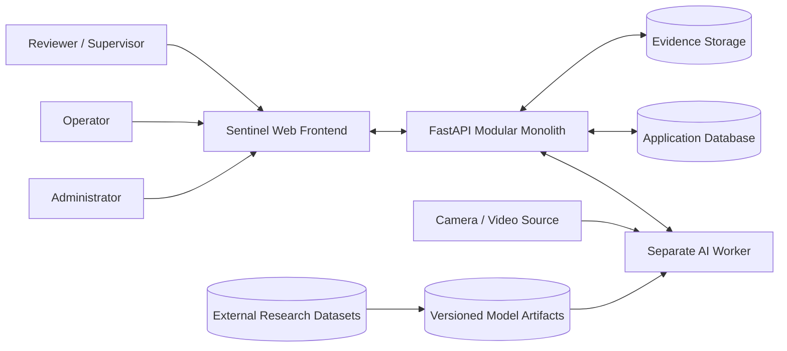

## 1.1 Interpretation

The system boundary includes:

- frontend;
- FastAPI backend;
- AI worker;
- application persistence;
- evidence integration.

External actors/systems include:

- human users;
- video source;
- research datasets;
- development model artifacts.

---

# 2. Actor / Use-Case Overview

**Status:** `PROPOSED_ROLE_PERMISSIONS`

```mermaid
flowchart TB
    ADMIN[Administrator]
    OP[Operator]
    REV[Reviewer / Supervisor]
    AIW[AI Worker]
    HEALTH[Health Monitor]

    UC1([Register / Configure Source])
    UC2([Create Monitoring Zone])
    UC3([Configure Rules])
    UC4([Monitor Events])
    UC5([Acknowledge Event])
    UC6([Review Evidence])
    UC7([Search History])
    UC8([View Analytics])
    UC9([Process Person Detection / Tracking])
    UC10([Run Violence Inference])
    UC11([Generate Offline Event])

    ADMIN --> UC1
    ADMIN --> UC2
    ADMIN --> UC3
    ADMIN --> UC4
    ADMIN --> UC6
    ADMIN --> UC7
    ADMIN --> UC8

    OP --> UC4
    OP --> UC5
    OP --> UC6
    OP --> UC7
    OP --> UC8

    REV --> UC6
    REV --> UC7
    REV --> UC8

    AIW --> UC9
    AIW --> UC10
    HEALTH --> UC11
```

## 2.1 Modeling note

This is an actor-capability overview, not a finalized RBAC matrix.

Exact role permissions remain `TBD`.

---

# 3. System Container Model

**Status:** `CONFIRMED_WITH_PROPOSED_TRANSPORTS`

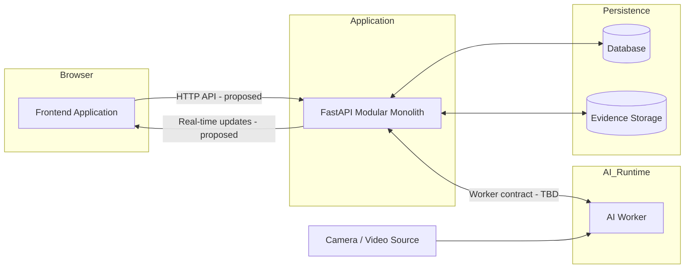

---

# 4. Backend Component Model

**Status:** `PROPOSED_INTERNAL_MODULE_LAYOUT`

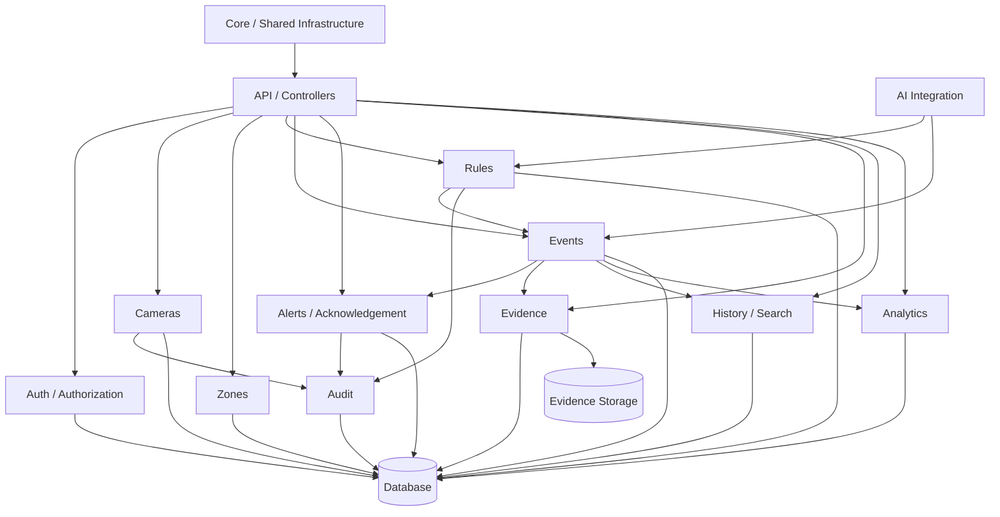

---

# 5. AI Worker Component Model

**Status:** `CONFIRMED_STRUCTURE / TBD_IMPLEMENTATIONS`

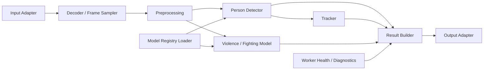

---

# 6. Deployment Model — Local Academic MVP

**Status:** `PROPOSED_DEPLOYMENT`

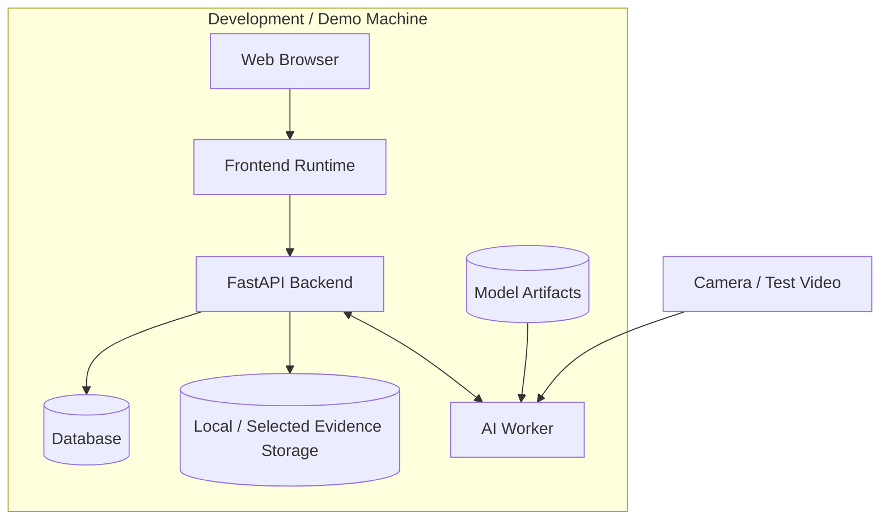

## 6.1 Interpretation

All logical components may run on one physical machine during the academic demonstration.

Logical process separation remains valid even when physical deployment is co-located.

---

# 7. Deployment Model — Optional Containerized Form

**Status:** `PROPOSED`

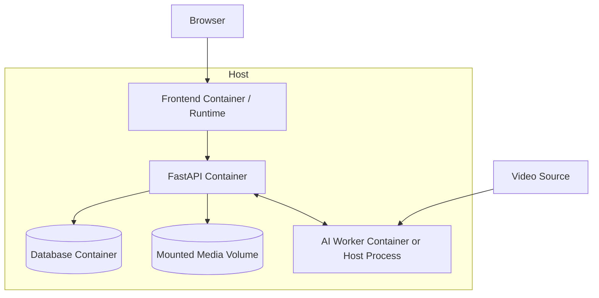

## 7.1 Constraint

Containerization shall not become a blocker for the MVP.

---

# 8. Core Domain Relationship Model

**Status:** `CONCEPTUAL / DATABASE_SCHEMA_NOT_FINAL`

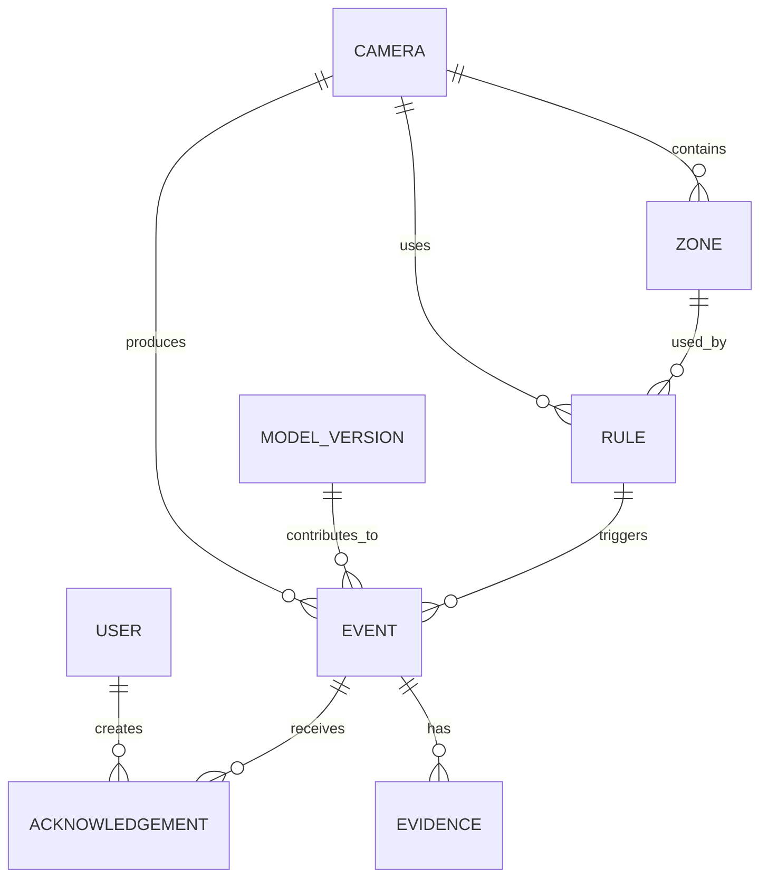

## 8.1 Important limitation

This diagram represents conceptual relationships only.

It is **not** permission to create these exact table names or cardinalities before `06-database-design.md` is baselined.

---

# 9. Detection-to-Event Activity Model

**Status:** `CONFIRMED`

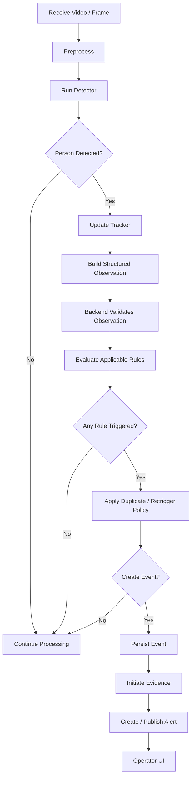

---

# 10. Restricted-Area Intrusion Activity Diagram

**Status:** `CONFIRMED_WITH_TBD_GEOMETRY_SEMANTICS`

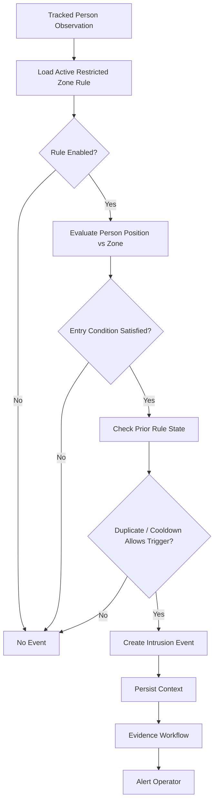

---

# 11. Loitering Activity Diagram

**Status:** `CONFIRMED_WITH_TBD_TIMER_SEMANTICS`

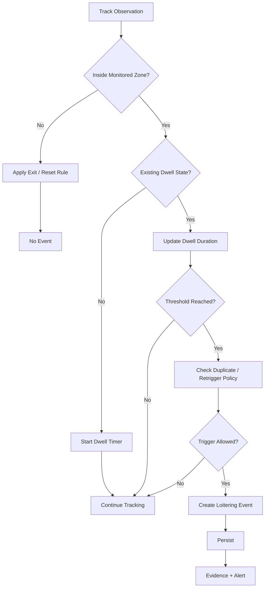

---

# 12. Crowd Threshold Activity Diagram

**Status:** `CONFIRMED_WITH_TBD_COUNTING_METHOD`

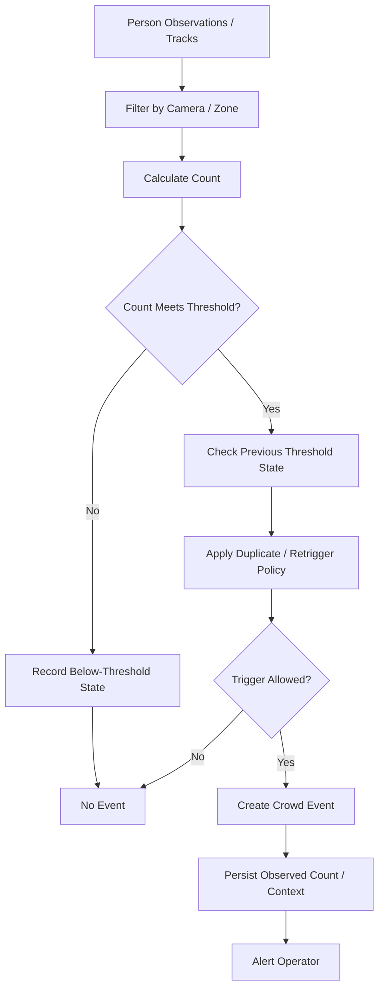

---

# 13. Violence/Fighting Activity Diagram

**Status:** `CONFIRMED_WITH_TBD_MODEL_AND_THRESHOLD`

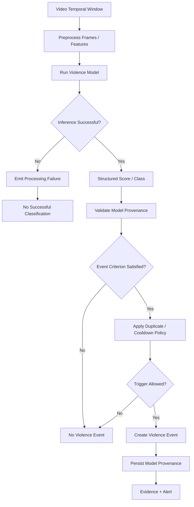

---

# 14. Camera Offline Activity Diagram

**Status:** `CONFIRMED_WITH_TBD_HEALTH_THRESHOLD`

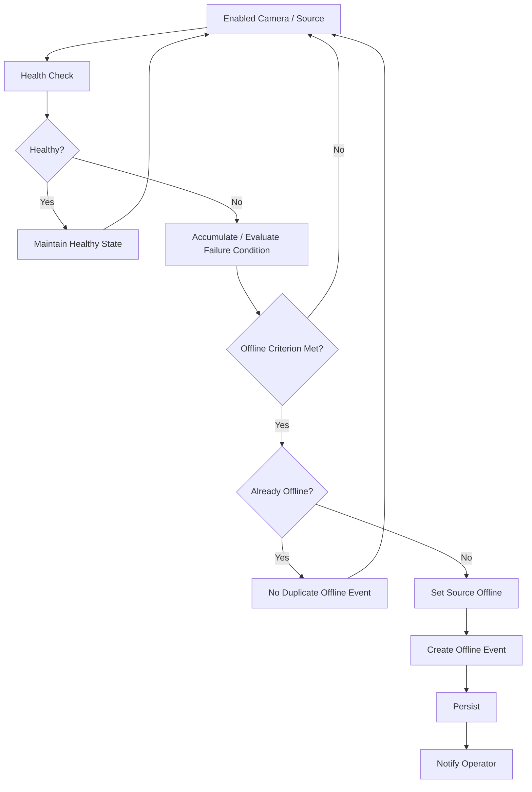

---

# 15. Sequence Diagram — Restricted-Area Intrusion

**Status:** `CONFIRMED`

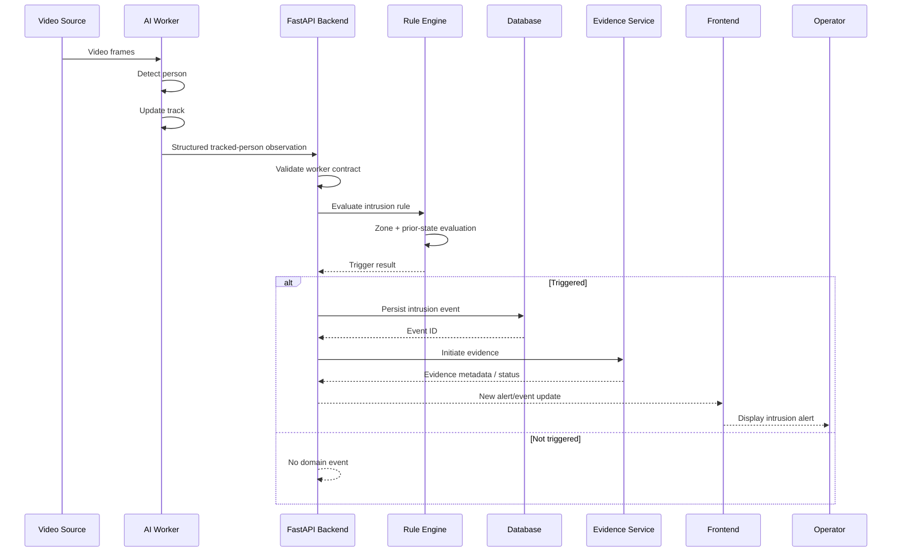

---

# 16. Sequence Diagram — Loitering

**Status:** `CONFIRMED_WITH_TBD_TIMER_RESET`

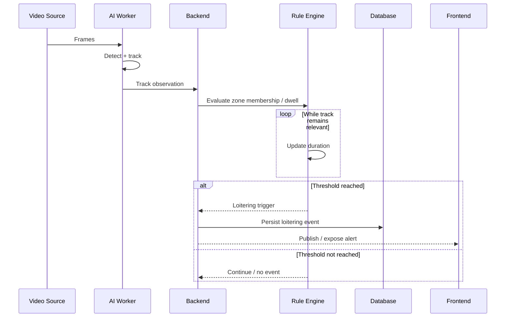

---

# 17. Sequence Diagram — Crowd Threshold

**Status:** `CONFIRMED_WITH_TBD_COUNT_METHOD`

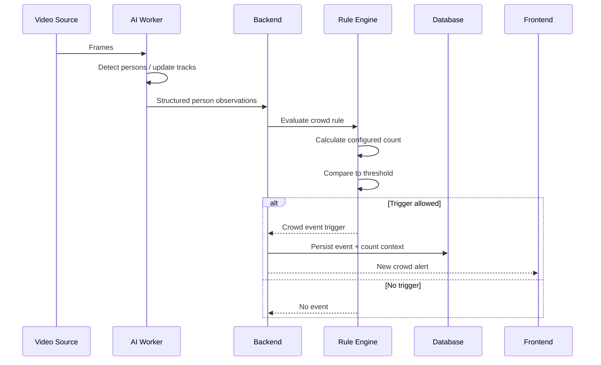

---

# 18. Sequence Diagram — Violence/Fighting

**Status:** `CONFIRMED_WITH_TBD_MODEL`

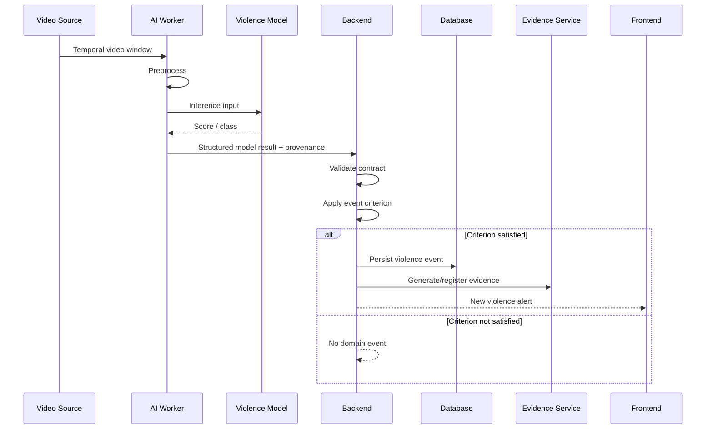

---

# 19. Sequence Diagram — Camera Offline

**Status:** `CONFIRMED_WITH_TBD_HEALTH_RULE`

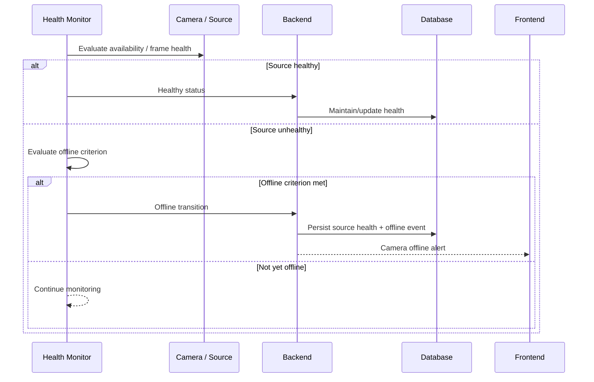

---

# 20. Sequence Diagram — Operator Acknowledgement

**Status:** `CONFIRMED`

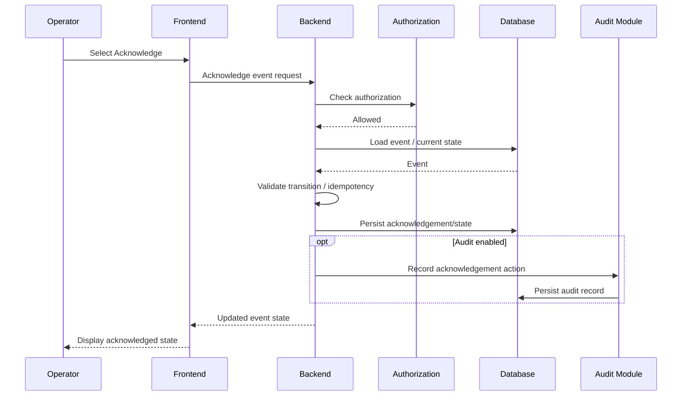

---

# 21. Sequence Diagram — Unauthorized Acknowledgement

**Status:** `CONFIRMED_SECURITY_BEHAVIOR`

```mermaid
sequenceDiagram
    participant U as Unauthorized User
    participant F as Frontend / Client
    participant B as Backend
    participant A as Authorization
    participant D as Database

    U->>F: Attempt acknowledgement
    F->>B: Acknowledge request
    B->>A: Check authorization
    A-->>B: Denied
    B-->>F: Safe forbidden/denied response
    B--xD: No state change
```

---

# 22. Sequence Diagram — Evidence Creation

**Status:** `PROPOSED_STORAGE_DETAILS`

```mermaid
sequenceDiagram
    participant B as Backend
    participant BUF as Rolling / Event Buffer
    participant E as Evidence Service
    participant M as Media Storage
    participant D as Database

    B->>E: Event created; request evidence
    E->>BUF: Request relevant pre/post frames
    BUF-->>E: Frame/video segment
    E->>E: Encode snapshot / clip
    E->>M: Write media artifact

    alt Write succeeds
        M-->>E: Artifact reference
        E->>D: Persist evidence metadata
    else Write fails
        M-->>E: Failure
        E->>D: Persist evidence failure state
    end
```

---

# 23. Sequence Diagram — Review Evidence

**Status:** `CONFIRMED_WITH_TBD_MEDIA_ACCESS_MECHANISM`

```mermaid
sequenceDiagram
    participant O as Operator
    participant F as Frontend
    participant B as Backend
    participant A as Authorization
    participant D as Database
    participant M as Media Storage

    O->>F: Open event evidence
    F->>B: Request evidence
    B->>A: Authorize event/media access
    A-->>B: Allowed
    B->>D: Load evidence metadata
    D-->>B: Evidence reference
    B->>M: Resolve protected media
    M-->>B: Media / authorized access reference
    B-->>F: Evidence response
    F-->>O: Render snapshot / clip
```

---

# 24. Sequence Diagram — AI Worker Failure

**Status:** `CONFIRMED`

```mermaid
sequenceDiagram
    participant B as Backend
    participant W as AI Worker
    participant F as Frontend
    participant L as Logging / Health

    B->>W: Processing request / health check
    W--xB: Worker unavailable / failure
    B->>L: Record degraded state / failure context
    B-->>F: Worker-dependent status degraded
    Note over B,F: Backend should remain available for unrelated functions
```

---

# 25. Sequence Diagram — Malformed Worker Result

**Status:** `CONFIRMED`

```mermaid
sequenceDiagram
    participant W as AI Worker
    participant B as Backend
    participant V as Contract Validator
    participant L as Logging
    participant D as Database

    W->>B: Malformed / incomplete result
    B->>V: Validate schema
    V-->>B: Invalid
    B->>L: Record safe diagnostic context
    B--xD: Do not create domain event
    B-->>W: Failure response / reject according to transport
```

---

# 26. Sequence Diagram — Client Real-Time Reconnect

**Status:** `PROPOSED`

```mermaid
sequenceDiagram
    participant F as Frontend
    participant B as Backend
    participant D as Database

    F--xB: Real-time connection lost
    F->>F: Mark disconnected
    F->>B: Attempt reconnect

    alt Reconnect succeeds
        B-->>F: Connection restored
        F->>B: Request current/recent persisted state
        B->>D: Query events since checkpoint / current filter
        D-->>B: Persisted event state
        B-->>F: Reconciliation result
        F->>F: Merge by stable event ID
    else Reconnect fails
        F->>F: Remain disconnected / retry per policy
    end
```

---

# 27. Event Lifecycle State Machine

**Status:** `PROPOSED`

```mermaid
stateDiagram-v2
    [*] --> Open

    Open --> Acknowledged: operator acknowledges
    Acknowledged --> Investigating: investigation begins
    Investigating --> Resolved: event resolved

    Open --> FalsePositive: classified false positive
    Acknowledged --> FalsePositive: classified false positive
    Investigating --> FalsePositive: classified false positive

    Resolved --> [*]
    FalsePositive --> [*]
```

## 27.1 Open questions

- Is acknowledgement a state or a separate record?
- Is `Investigating` necessary?
- Can `Resolved` reopen?
- Is `FalsePositive` terminal?
- Are state transitions audited?

No code shall adopt these exact enum values until baselined.

---

# 28. Camera / Source State Machine

**Status:** `PROPOSED`

```mermaid
stateDiagram-v2
    [*] --> Disabled

    Disabled --> EnabledUnknown: administrator enables
    EnabledUnknown --> Healthy: health succeeds
    EnabledUnknown --> Offline: offline criterion met

    Healthy --> Degraded: transient/partial failure
    Degraded --> Healthy: recovery
    Degraded --> Offline: offline criterion met

    Offline --> Healthy: recovery
    Healthy --> Disabled: administrator disables
    Degraded --> Disabled: administrator disables
    Offline --> Disabled: administrator disables
```

## 28.1 Note

Exact state names are illustrative.

At minimum the final model must distinguish:

- intentionally disabled;
- enabled and healthy;
- enabled but offline/unavailable.

---

# 29. Rule State Model — Intrusion

**Status:** `ILLUSTRATIVE`

```mermaid
stateDiagram-v2
    [*] --> Outside
    Outside --> InsideEligible: tracked person enters zone
    InsideEligible --> InsideAlerted: event created
    InsideAlerted --> Outside: tracked person exits

    InsideAlerted --> InsideAlerted: continued presence / no duplicate
```

Exact initial-inside and cooldown behavior remains `TBD`.

---

# 30. Rule State Model — Loitering

**Status:** `ILLUSTRATIVE`

```mermaid
stateDiagram-v2
    [*] --> Outside
    Outside --> Dwelling: enters zone
    Dwelling --> Outside: exits before threshold
    Dwelling --> Loitering: duration reaches threshold
    Loitering --> Loitering: remains / duplicate suppression
    Loitering --> Outside: exits / reset
```

Track-loss handling remains `TBD`.

---

# 31. Rule State Model — Crowd

**Status:** `ILLUSTRATIVE`

```mermaid
stateDiagram-v2
    [*] --> BelowThreshold
    BelowThreshold --> AboveThreshold: threshold crossed
    AboveThreshold --> Alerted: event created
    Alerted --> Alerted: sustained exceedance
    Alerted --> BelowThreshold: count drops below threshold
```

---

# 32. Activity Diagram — Source Configuration

**Status:** `CONFIRMED_BEHAVIOR / TBD_SOURCE_FIELDS`

```mermaid
flowchart TD
    A[Administrator Opens Source Management] --> B[Select Add Source]
    B --> C[Enter Source Configuration]
    C --> D[Submit]
    D --> E[Backend Validates]

    E --> F{Valid?}
    F -- No --> G[Return Validation Error]
    F -- Yes --> H[Persist Source]
    H --> I[Assign Stable ID]
    I --> J[Begin Health / Processing Lifecycle]
```

---

# 33. Activity Diagram — Zone Configuration

**Status:** `CONFIRMED`

```mermaid
flowchart TD
    A[Open Camera View] --> B[Select Create Zone]
    B --> C[Draw Polygon]
    C --> D[Preview Geometry]
    D --> E[Submit Zone]
    E --> F[Backend Validates Geometry]

    F --> G{Valid?}
    G -- No --> H[Return Validation Error]
    G -- Yes --> I[Persist Zone]
    I --> J[Render Saved Zone]
```

---

# 34. Activity Diagram — Acknowledgement

**Status:** `CONFIRMED`

```mermaid
flowchart TD
    A[Operator Opens Event] --> B[Select Acknowledge]
    B --> C[Backend Authenticates / Authorizes]
    C --> D{Allowed?}

    D -- No --> E[Deny]
    D -- Yes --> F[Load Event]
    F --> G[Validate Current State]
    G --> H{Transition Valid?}

    H -- No --> I[Return State Error]
    H -- Yes --> J[Persist Acknowledgement]
    J --> K[Optional Audit]
    K --> L[Return Updated State]
```

---

# 35. Activity Diagram — Search History

**Status:** `CONFIRMED`

```mermaid
flowchart TD
    A[Open History] --> B[Load Bounded Default Results]
    B --> C[User Sets Filters]
    C --> D[Submit Query]
    D --> E[Backend Validates Filters]

    E --> F{Valid?}
    F -- No --> G[Validation Error]
    F -- Yes --> H[Query Authorized Events]
    H --> I{Any Results?}

    I -- No --> J[Display Empty State]
    I -- Yes --> K[Display Results]
    K --> L[User Opens Event]
```

---

# 36. Activity Diagram — Analytics

**Status:** `CONFIRMED`

```mermaid
flowchart TD
    A[Open Analytics] --> B[Select / Use Default Time Range]
    B --> C[Request Aggregates]
    C --> D[Backend Queries Persisted Events]
    D --> E[Compute Aggregates]
    E --> F[Return Metrics]
    F --> G[Render Charts / KPIs]

    D --> H{Query Failed?}
    H -- Yes --> I[Display Error State]
```

---

# 37. Class / Domain Model — Conceptual

**Status:** `ILLUSTRATIVE_NOT_SCHEMA`

```mermaid
classDiagram
    class Camera {
        +id
        +name
        +enabled
        +health_state
    }

    class Zone {
        +id
        +camera_id
        +geometry
        +enabled
    }

    class Rule {
        +id
        +type
        +enabled
        +configuration
    }

    class Event {
        +id
        +type
        +occurrence_time
        +source_id
        +status
    }

    class Evidence {
        +id
        +event_id
        +media_type
        +storage_reference
        +state
    }

    class Acknowledgement {
        +id
        +event_id
        +user_id
        +timestamp
    }

    class ModelVersion {
        +id
        +version
        +task
    }

    Camera "1" --> "*" Zone
    Camera "1" --> "*" Rule
    Camera "1" --> "*" Event
    Zone "1" --> "*" Rule
    Rule "1" --> "*" Event
    Event "1" --> "*" Evidence
    Event "1" --> "*" Acknowledgement
    ModelVersion "1" --> "*" Event
```

## 37.1 Important constraint

Fields shown here are conceptual placeholders only.

The database document must define actual schema.

---

# 38. Data Flow Model — Person Detection Path

**Status:** `CONFIRMED`

```mermaid
flowchart LR
    VID[Video Source]
    FRAME[Frames]
    DET[Detector]
    TRACK[Tracker]
    OBS[Structured Observation]
    VALID[Backend Validator]
    RULE[Rule Engine]
    EVT[Event Service]
    DB[(Database)]

    VID --> FRAME
    FRAME --> DET
    DET --> TRACK
    TRACK --> OBS
    OBS --> VALID
    VALID --> RULE
    RULE --> EVT
    EVT --> DB
```

---

# 39. Data Flow Model — Violence Path

**Status:** `CONFIRMED`

```mermaid
flowchart LR
    VID[Video Window]
    PRE[Temporal Preprocessing]
    MODEL[Violence Model]
    RESULT[Structured Result]
    VALID[Backend Validator]
    CRIT[Event Criterion]
    EVT[Event]
    DB[(Database)]

    VID --> PRE
    PRE --> MODEL
    MODEL --> RESULT
    RESULT --> VALID
    VALID --> CRIT
    CRIT --> EVT
    EVT --> DB
```

---

# 40. Data Flow Model — Operator Event Review

**Status:** `CONFIRMED`

```mermaid
flowchart LR
    DB[(Event Database)]
    API[Backend API]
    UI[Frontend]
    OP[Operator]
    MEDIA[(Evidence Storage)]

    DB --> API
    API --> UI
    UI --> OP

    OP --> UI
    UI --> API
    API --> MEDIA
    MEDIA --> API
    API --> UI
```

---

# 41. Trust Boundary Model

**Status:** `CONFIRMED`

```mermaid
flowchart LR
    subgraph Untrusted_Client
        BROWSER[Browser]
    end

    subgraph Trusted_Application
        API[FastAPI Backend]
    end

    subgraph Internal_Compute
        AI[AI Worker]
    end

    subgraph Persistence
        DB[(Database)]
        MEDIA[(Media Storage)]
    end

    EXT[External Video Source]

    BROWSER -->|Validate input/auth| API
    AI -->|Validate worker payload| API
    EXT -->|Decode/validate media| AI
    API --> DB
    API -->|Validate storage references| MEDIA
```

---

# 42. Fault Propagation Model

**Status:** `CONFIRMED`

```mermaid
flowchart TD
    WFAIL[AI Worker Failure] --> AI_DEG[AI Processing Degraded]
    AI_DEG --> APP_OK[Backend Remains Available]

    DBFAIL[Database Failure] --> WRITE_FAIL[Persistence Fails]
    WRITE_FAIL --> NO_SUCCESS[No False Success Response]

    MEDIAFAIL[Evidence Storage Failure] --> EVD_FAIL[Evidence Marked Failed]
    EVD_FAIL --> EVENT_OK[Event May Remain Valid]

    WSFAIL[Real-Time Channel Failure] --> CLIENT_DISC[Client Shows Disconnected]
    CLIENT_DISC --> RECON[Reconcile from Persisted State]
```

---

# 43. First Vertical Slice Model

**Status:** `CONFIRMED_PRIORITY`

```mermaid
sequenceDiagram
    participant V as Recorded Video / Camera
    participant W as AI Worker
    participant B as Backend
    participant R as Rule Engine
    participant D as Database
    participant F as Frontend
    participant O as Operator

    V->>W: Video input
    W->>W: Detect + track person
    W->>B: Structured track observation
    B->>R: Evaluate restricted zone
    R-->>B: Trigger
    B->>D: Persist intrusion event
    B-->>F: New event update
    F-->>O: Display alert
    O->>F: Acknowledge
    F->>B: Acknowledge request
    B->>D: Persist acknowledgement
    B-->>F: Updated state
```

---

# 44. Future Expansion Model

**Status:** `DEFERRED`

```mermaid
flowchart TB
    CORE[Sentinel Core]
    VISION[Vision Models]
    RULES[Rule Engine]
    NOTIFY[Notification Adapters]
    MULTI[Multi-Site Management]

    CORE --> VISION
    CORE --> RULES
    CORE --> NOTIFY
    CORE --> MULTI

    VISION --> FALL[Fall Detection]
    VISION --> FIRE[Fire / Smoke]
    VISION --> AUDIO[Audio Anomaly]
    NOTIFY --> EMAIL[Email]
    NOTIFY --> SMS[SMS]
```

None of these expansion branches are MVP commitments.

---

# 45. Model-to-Requirement Traceability

| Diagram / Model | Primary Requirement Families |
|---|---|
| System Context | all major SRS sections |
| Backend Components | FR-CAM, FR-ZONE, FR-RULE, FR-EVT, FR-ALT, FR-EVD, FR-ANL |
| AI Worker Components | MLR-DET, MLR-TRK, MLR-VIO, MLR-INF |
| Intrusion Activity | FR-INT-* |
| Loitering Activity | FR-LOIT-* |
| Crowd Activity | FR-CROWD-* |
| Violence Activity | FR-VIO-*, MLR-VIO-* |
| Camera Offline | FR-CAM-006/007/008 |
| Acknowledgement Sequence | FR-ALT-004/005 |
| Evidence Sequence | FR-EVD-* |
| Worker Failure | FR-INTG-004, NFR-REL-* |
| Trust Boundary | NFR-SEC-* |
| Vertical Slice | NFR-TEST-003 |

---

# 46. Model-to-Use-Case Traceability

| Model | Related Use Cases |
|---|---|
| Intrusion Sequence | UC-EVT-001 |
| Loitering Sequence | UC-EVT-002 |
| Crowd Sequence | UC-EVT-003 |
| Violence Sequence | UC-EVT-004 |
| Camera Offline Sequence | UC-EVT-005 |
| Acknowledgement Sequence | UC-EVT-006 |
| Evidence Review | UC-EVD-001 |
| History Activity | UC-HIST-001 |
| Analytics Activity | UC-ANL-001 |
| Worker Failure | UC-SYS-001 |
| Malformed Worker Result | UC-SYS-002 |
| Evidence Failure | UC-SYS-003 |
| Client Reconnect | UC-SYS-004 |
| Vertical Slice | UC-SYS-005 |

---

# 47. Modeling Decisions Still Open

| ID | Open modeling decision | Affected models |
|---|---|---|
| MD-001 | Frontend framework/runtime | deployment |
| MD-002 | DB technology | deployment/data models |
| MD-003 | Worker transport | container/sequence models |
| MD-004 | Real-time transport | monitoring/reconnect |
| MD-005 | Source input protocol | AI worker/context |
| MD-006 | Zone coordinate system | zone/intrusion |
| MD-007 | Person point used for polygon test | intrusion |
| MD-008 | Loitering track-loss semantics | loitering state |
| MD-009 | Crowd counting method | crowd models |
| MD-010 | Violence threshold | violence |
| MD-011 | Camera offline criterion | offline state |
| MD-012 | Evidence buffer duration | evidence |
| MD-013 | Media storage | evidence/deployment |
| MD-014 | Event lifecycle | event state machine |
| MD-015 | Event/incident relationship | domain model |
| MD-016 | Role matrix | actor/use-case model |

---

# 48. Diagram Review Checklist

Before this document is baselined:

- [ ] System context matches architecture.
- [ ] Backend modules match accepted module boundaries.
- [ ] AI worker responsibilities are isolated correctly.
- [ ] Rule engine is shown in backend domain, not frontend.
- [ ] Detections are separated from events.
- [ ] Each MVP event has a sequence or activity diagram.
- [ ] Camera offline flow is explicit.
- [ ] Acknowledgement persistence is explicit.
- [ ] Evidence failure is explicit.
- [ ] Worker failure does not imply backend failure.
- [ ] Real-time reconnect model is marked proposed until transport is accepted.
- [ ] Event state model remains proposed until lifecycle is accepted.
- [ ] Domain/class diagram is not misused as final DB schema.
- [ ] Deferred features are isolated in future-work model.
- [ ] Mermaid renders in Obsidian/GitHub-compatible viewer.
- [ ] No diagram invents exact API route names.
- [ ] No diagram invents exact DB table/column contracts.

---

# 49. Suggested Academic Use of These Models

For a project review or technical report, the most important diagrams are:

1. System Context Diagram
2. Component Diagram
3. Deployment Diagram
4. Restricted-Area Intrusion Sequence Diagram
5. Violence/Fighting Sequence Diagram
6. Event Lifecycle State Diagram
7. First Vertical Slice Diagram

The full file should remain in the repository, while the report/presentation may select only the diagrams that best communicate the architecture.

---

# 50. Final Modeling Rule

> A diagram is useful only if it reduces ambiguity.
>
> Sentinel AI models shall therefore:
>
> - show real component boundaries;
> - distinguish AI observations from domain events;
> - distinguish operator actions from automated processing;
> - show persistence where it matters;
> - show failure paths where they materially change behavior;
> - avoid pretending unresolved technologies are already selected;
> - remain synchronized with the SRS and architecture.
>
> If an implementation decision changes the meaning of a diagram, update the diagram in the same change set.
