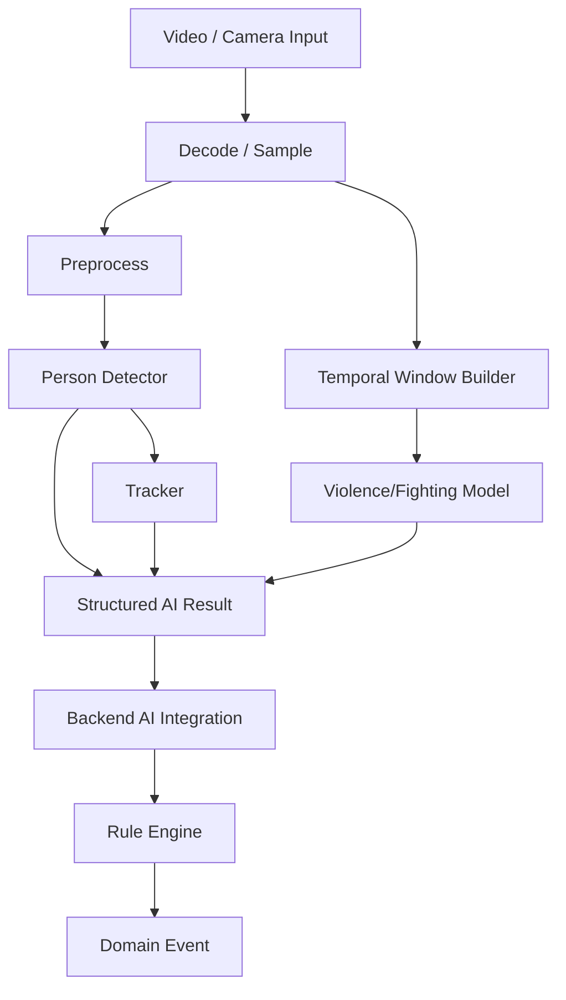

# Sentinel AI — AI/ML Design Specification

> **Document purpose**
>
> This document defines how artificial intelligence and machine learning are used inside Sentinel AI.
>
> It is deliberately written as an engineering specification rather than a generic description of "using AI for CCTV."
>
> It defines:
>
> - which problems are solved by learned models;
> - which problems are solved by deterministic rules;
> - what the AI worker is responsible for;
> - how detector/tracker/violence components are selected;
> - how datasets are evaluated and acquired;
> - how experiments are reproduced;
> - how models are evaluated;
> - how model outputs are converted into system inputs;
> - how inference failures are represented;
> - which claims are academically permissible.
>
> **Important**
>
> Sentinel AI does **not** use one giant model to decide every surveillance event.
>
> The approved conceptual decomposition is:
>
> ```text
> person detection
>       ↓
> person tracking
>       ↓
> spatial / temporal context
>       ↓
> deterministic rules
>       ↓
> intrusion / loitering / crowd events
>
> temporal video model
>       ↓
> violence/fighting score or class
>       ↓
> backend event criterion
>       ↓
> violence/fighting event
> ```
>
> This separation is fundamental to the project architecture.

---

# 0. Document Control

## 0.1 Authority

After baseline approval, this document becomes authoritative for AI/ML design.

It is subordinate to:

1. `PROJECT_HANDBOOK.md`
2. `01-vision-and-scope.md`
3. `02-srs.md`
4. `03-use-case-specification.md`
5. `04-system-architecture.md`
6. `07-api-specification.md`
7. accepted ADRs

Dataset source-of-truth documents are:

- `09-dataset-acquisition.md`
- `10-dataset-registry.md`

Measured results belong in:

- `11-model-card-and-evaluation.md`

## 0.2 Status vocabulary

| Status | Meaning |
|---|---|
| `CONFIRMED` | Accepted design |
| `PROPOSED` | Candidate awaiting acceptance |
| `TBD` | Unresolved |
| `EXPERIMENTAL` | Time-boxed feasibility experiment |
| `DEFERRED` | Future enhancement |
| `REJECTED` | Intentionally excluded |

## 0.3 Current confirmed AI scope

| Capability | Method category | Status |
|---|---|---|
| Person detection | Pretrained object detector | `CONFIRMED` |
| Person tracking | Multi-object tracker | `CONFIRMED` |
| Restricted-area intrusion | Detector + tracker + polygon rule | `CONFIRMED` |
| Loitering | Tracker + dwell-time rule | `CONFIRMED` |
| Crowd threshold | Person observations + counting rule | `CONFIRMED` |
| Violence/fighting | Temporal video model | `CONFIRMED` |
| Camera offline | System health logic | `CONFIRMED_NON_ML` |
| Facial recognition | Biometric model | `REJECTED` |

---

# 1. AI Design Philosophy

## 1.1 Use ML only where ML is justified

The project shall not train a neural network for a deterministic problem simply to make the project appear more "AI-driven."

Examples:

### Restricted-area intrusion

Correct:

```text
person detector
→ track
→ geometry
→ polygon entry rule
```

Not recommended:

```text
train a separate "intrusion neural network"
```

### Loitering

Correct:

```text
track
→ zone membership
→ elapsed dwell time
→ threshold
```

### Crowd threshold

Correct:

```text
person observations
→ count
→ configured threshold
```

### Camera offline

Correct:

```text
stream/frame health
→ timeout/failure state
```

No ML required.

## 1.2 Learned-model responsibilities

Learned models should primarily solve:

1. visual person detection;
2. temporal violence/fighting recognition.

Tracking may use a classical/probabilistic multi-object tracking algorithm coupled with detector output rather than an independently trained Sentinel-specific neural model.

---

# 2. AI Worker Boundary

The separate AI worker is `CONFIRMED`.

## 2.1 AI worker owns

- video/frame decoding as required;
- frame sampling;
- preprocessing;
- person detection;
- multi-object tracking;
- violence/fighting inference;
- model loading;
- model health;
- model metadata;
- structured inference result generation;
- inference diagnostics.

## 2.2 AI worker does not own

- user authentication;
- role authorization;
- event acknowledgement;
- event history;
- final incident lifecycle;
- database business rules;
- frontend alerts;
- rule configuration;
- legal/security judgement.

## 2.3 Output principle

The worker produces:

```text
observations / model results
```

The backend produces:

```text
domain events
```

except where the architecture explicitly delegates a narrowly defined event criterion.

---

# 3. End-to-End AI Pipeline



---

# 4. AI Task Decomposition

## 4.1 Task T-AI-01 — Person Detection

Input:

```text
video frame
```

Output:

```text
zero or more person detections
```

Each detection minimally requires:

- class;
- bounding box;
- model score;
- model version;
- frame/source context.

## 4.2 Task T-AI-02 — Person Tracking

Input:

```text
sequence of person detections
```

Output:

```text
temporary track IDs across frames
```

A track ID is not identity.

## 4.3 Task T-AI-03 — Violence/Fighting Recognition

Input:

```text
temporal video sequence or temporal features
```

Output:

```text
model class / score
```

The backend separately applies the event criterion.

---

# 5. Person Detector Requirements

The detector must satisfy:

- `MLR-DET-001`
- `MLR-DET-002`
- `MLR-DET-003`

## 5.1 Functional output

For every detected person:

```text
class = person
confidence/score
bounding box
frame/source timestamp
model version
```

## 5.2 Detector output coordinate convention

Proposed normalized bounding boxes:

```text
x_min
y_min
x_max
y_max
```

with:

```text
0 <= x_min < x_max <= 1
0 <= y_min < y_max <= 1
```

Status: `PROPOSED`.

## 5.3 Person class only

The MVP backend need not consume every object class detected by the base detector.

If a generic detector produces:

```text
person
car
chair
dog
...
```

the worker may filter outputs to:

```text
person
```

for Sentinel person-based rules.

---

# 6. Detector Strategy

## 6.1 Primary project strategy

Do **not** train the person detector from random initialization.

Preferred:

```text
pretrained detector
→ Sentinel-relevant evaluation
→ optional fine-tuning only if baseline is inadequate
```

## 6.2 Why

The project has only 2–3 weeks.

Training a general object detector from scratch would consume:

- dataset preparation time;
- annotation time;
- GPU time;
- evaluation time;

without materially improving the academic web-system contribution.

---

# 7. Detector Candidate Evaluation Matrix

Exact detector: `TBD`.

Candidates should be scored against:

| Criterion | Importance |
|---|---:|
| Person detection quality | Critical |
| Real-time/near-real-time inference feasibility | Critical |
| License compatibility | Critical |
| Ease of integration | High |
| Pretrained person capability | High |
| CPU/GPU availability | High |
| Tracker compatibility | High |
| Reproducibility | High |
| Model artifact size | Medium |
| Fine-tuning support | Medium |

---

# 8. Detector Candidate Family A — Ultralytics YOLO

**Status:** `CANDIDATE / LICENSE REVIEW REQUIRED`

Current official Ultralytics documentation, checked 2026-08-20, shows current model/tracking examples using YOLO26 and supports custom/fine-tuned models.

Current official tracking documentation supports multiple built-in trackers including:

- BoT-SORT;
- ByteTrack;
- OC-SORT;
- Deep OC-SORT;
- FastTracker;
- TrackTrack.

## 8.1 Advantages

- convenient Python API;
- fast object detection;
- integrated tracker workflow;
- straightforward pretrained inference;
- mature tutorials;
- easy demo integration.

## 8.2 Important licensing constraint

Current Ultralytics official licensing states that their YOLO software/models are offered under:

- AGPL-3.0 for open-source use;
- commercial licensing for proprietary/closed deployments.

For a university project, adoption can be appropriate only after the team confirms that the repository/distribution approach is compatible with the applicable license terms.

**Do not select Ultralytics solely because implementation is convenient.**

## 8.3 Required ADR if selected

`ADR-006-detector-selection.md`

must record:

- exact model family;
- exact weights;
- license;
- reason selected;
- alternatives;
- performance baseline.

---

# 9. Detector Candidate Family B — Torchvision Detectors

**Status:** `CANDIDATE`

Current official Torchvision documentation provides pretrained object detection architectures including:

- Faster R-CNN;
- FCOS;
- RetinaNet;
- SSD;
- SSDLite.

Official pretrained weights include person among COCO categories.

## 9.1 Advantages

- direct PyTorch ecosystem;
- transparent model interface;
- multiple architecture choices;
- can avoid coupling detector selection to one vendor-specific integrated tracking stack.

## 9.2 Disadvantages

- some models may be slower than lightweight YOLO variants;
- tracking integration must be implemented separately;
- greater manual glue code.

## 9.3 Candidate lightweight baseline

A mobile/lightweight detector may be investigated if available hardware is constrained.

No specific model is confirmed in this document.

---

# 10. Detector Feasibility Spike

Before selecting detector:

## Experiment DET-SPIKE-001

Test at least two viable detector configurations on the actual development machine.

Record:

```text
experiment_id
model
weights source
license
runtime
device
input resolution
test videos
average / median inference latency
approximate processing FPS
person misses
obvious false positives
memory issues
integration effort
```

## Decision

Choose the simplest detector that:

- detects people sufficiently for the rule pipeline;
- runs acceptably on available hardware;
- has acceptable licensing;
- integrates reproducibly.

Do not select only from published benchmark numbers.

---

# 11. Detector Threshold

Detection threshold is `TBD`.

It shall not be copied blindly from a library example.

## 11.1 Selection method

1. choose representative Sentinel clips;
2. run detector over several threshold values;
3. inspect:
   - false positives;
   - missed persons;
   - tracker stability;
4. select a practical threshold;
5. record rationale;
6. freeze value in model configuration/model card.

## 11.2 Important interaction

A detector threshold affects:

```text
tracking
→ intrusion
→ loitering
→ crowd count
```

Therefore detector threshold is a **system behavior parameter**, not merely a visual setting.

---

# 12. Detector Fine-Tuning Policy

Fine-tuning is optional.

## 12.1 Trigger for fine-tuning

Fine-tune only if baseline evaluation demonstrates meaningful failure caused by surveillance-domain mismatch.

Examples:

- high-angle people consistently missed;
- low-light CCTV people missed;
- small distant people insufficiently detected.

## 12.2 Do not fine-tune merely for novelty

If pretrained model already works adequately for the project demo, use it honestly.

Academic wording:

> The system integrates a pretrained person detector evaluated on Sentinel-relevant footage.

Not:

> The team developed a new person detector.

---

# 13. Tracking Requirements

Tracking supports:

- intrusion transition state;
- loitering duration;
- crowd counting where active tracks are used.

## 13.1 Track output

A track record in memory should conceptually contain:

```text
track_id
current_bbox
last_seen_timestamp
track_state
confidence context
```

Additional state may be required by rule engine.

## 13.2 Track scope

Track ID scope must be defined.

Recommended:

```text
unique within camera + tracker runtime/session
```

Status: `PROPOSED`.

It need not be globally unique forever.

---

# 14. Tracker Candidate Selection

Exact tracker: `TBD`.

## 14.1 Candidate starting points

For stationary CCTV:

- ByteTrack-style association is an attractive simple baseline;
- BoT-SORT may provide stronger association if camera movement/occlusion or appearance cues matter.

Current Ultralytics documentation describes ByteTrack as a fast/simple baseline and BoT-SORT as adding camera-motion compensation and optional ReID.

## 14.2 Privacy rule

Optional tracker ReID embeddings used only for short-term within-stream association must never be described as facial recognition or real-world identity.

However, if any appearance embedding creates persistent cross-camera identity capability, that would materially change privacy scope and requires explicit review.

---

# 15. Tracker Feasibility Evaluation

## Experiment TRK-SPIKE-001

Use representative clips containing:

- one person;
- two crossing people;
- temporary occlusion;
- person entering/leaving zone;
- crowd scene if available.

Measure or record:

- track continuity;
- ID switches;
- track loss;
- false tracks;
- time to initialize track;
- approximate overhead;
- behavior after occlusion.

## 15.1 Formal benchmark

MOT17 may be used for optional tracker benchmarking.

The official MOTChallenge MOT17 dataset provides pedestrian tracking sequences and benchmark metrics such as:

- MOTA;
- IDF1;
- HOTA;
- ID switches.

For this short project, MOT17 is **optional evaluation data**, not required tracker training data.

---

# 16. Tracker Metrics

Potential metrics:

- IDF1;
- HOTA;
- MOTA;
- ID switches;
- mostly tracked;
- mostly lost.

For Sentinel-specific validation, also record operational metrics:

```text
zone-crossing track continuity
loitering timer continuity
track-loss frequency
```

These may be more directly useful than a benchmark leaderboard score.

---

# 17. Rule Input Representation

The backend rule engine requires normalized track observations.

Proposed logical structure:

```yaml
camera_id: ...
source_timestamp: ...
track_id: ...
bbox:
  x_min: ...
  y_min: ...
  x_max: ...
  y_max: ...
```

The rule engine then derives a representative person point.

---

# 18. Intrusion Position Method

Exact position method: `TBD`.

Candidate methods:

## Option A — Bounding-box center

```text
x = (x_min + x_max) / 2
y = (y_min + y_max) / 2
```

Advantage:

- simple.

Disadvantage:

- center may not correspond to floor position.

## Option B — Bottom-center / foot point

```text
x = (x_min + x_max) / 2
y = y_max
```

Advantage:

- often better approximation of where a standing person contacts ground plane.

## Recommended candidate

For fixed CCTV and floor-area polygons:

```text
bottom-center
```

is `PROPOSED`.

It must be tested on actual camera geometry before baseline.

---

# 19. Polygon Membership

Given point:

```text
p = (x, y)
```

and polygon:

```text
Z
```

the rule evaluates:

```text
inside = point_in_polygon(p, Z)
```

Implementation may use:

- ray casting;
- winding number;
- trusted geometry library.

Do not reimplement geometry poorly if a small reliable dependency already exists and its license is acceptable.

---

# 20. Intrusion State

Minimum conceptual state per:

```text
camera
rule
track
```

may include:

```text
previous_inside
current_inside
last_event_at
```

Event transition:

```text
previous_inside = false
current_inside = true
→ candidate entry event
```

Exact starting-inside behavior remains `TBD`.

---

# 21. Loitering State

Conceptual state per:

```text
camera
rule
track
```

may include:

```text
entered_at
last_seen_at
event_emitted
```

Duration:

```text
dwell_ms = current_time - entered_at
```

Event condition:

```text
dwell_ms >= configured_threshold
```

Exact:

- grace;
- reset;
- retrigger;

remain `TBD`.

---

# 22. Crowd Counting

Counting method: `TBD`.

Candidate:

```text
number of active qualifying tracks whose representative point lies in zone
```

This is `PROPOSED` because active tracks generally reduce frame-to-frame duplicate count noise compared with raw detections.

## 22.1 Counting invariant

One active track should contribute:

```text
0 or 1
```

person to one rule's current count.

---

# 23. Camera Offline Is Non-ML

Camera offline detection shall not consume AI resources.

Potential observations:

- no frames;
- decode failure;
- connection failure.

Backend/worker health subsystem evaluates configured time criterion.

---

# 24. Violence/Fighting Capability

Violence/fighting is the only confirmed MVP event requiring a dedicated temporal behavior model.

## 24.1 Why temporal

A single frame often cannot distinguish:

- fighting;
- hugging;
- sports;
- normal proximity.

The model should use:

- multiple frames;
- temporal features;
- motion;

rather than a single image heuristic.

---

# 25. Violence Task Definition

Final task formulation: `FROZEN`.

Frozen formulation:

```text
binary temporal classification:
Fighting
vs
Normal
```

The strict experimental dataset mapping uses only XD-Violence `Fighting` and
`Normal` samples. Broader anomaly/violence categories are not silently treated
as equivalent to Fighting.

Potential alternative:

```text
weakly supervised anomaly scoring over long videos
```

For the 2–3 week schedule, a simple binary or segment-level output is easier to integrate.

However, dataset annotation type may constrain the approach.

---

# 26. Violence Dataset Selection Criteria

Every candidate dataset shall be scored against:

| Criterion | Importance |
|---|---:|
| Official acquisition available | Critical |
| Academic provenance clear | Critical |
| Usage terms acceptable | Critical |
| Contains fighting/violence relevant to CCTV | Critical |
| Annotation format usable | High |
| Surveillance realism | High |
| Training time feasible | High |
| Dataset size manageable | High |
| Positive/negative balance | High |
| Test split usable | High |
| Model/code references available | Medium |
| Multimodal audio | Low for MVP unless used |

---

# 27. Candidate Dataset — XD-Violence

**Status:** `PRIMARY_FEASIBILITY_CANDIDATE`

Official project:

https://roc-ng.github.io/XD-Violence/

Verified 2026-08-20.

The official project describes:

- 217 hours;
- 4,754 untrimmed videos;
- audio signals;
- weak labels;
- multiple violent categories.

Shown categories include:

- Abuse;
- Car Accident;
- Explosion;
- Fighting;
- Riot;
- Shooting;
- Normal Activities.

The official page currently exposes test data/annotations and multiple training-download options, including OneDrive/AliyunDrive links, as well as pre-extracted I3D visual features and VGGish audio features.

## 27.1 Strengths

- large;
- multi-scene;
- surveillance-oriented;
- fighting included;
- official feature downloads can reduce compute burden.

## 27.2 Challenges

- long untrimmed videos;
- weak supervision;
- broad violence/anomaly framing;
- large download/storage requirement;
- may be heavier than needed for a 2–3 week student project.

## 27.3 Feasibility strategy

Before downloading the entire raw dataset, investigate:

1. test annotations;
2. official pre-extracted visual features;
3. whether fighting-specific subset can be defined legitimately;
4. whether baseline method can run using available features.

---

# 28. Candidate Dataset — UCF-Crime

**Status:** `SECONDARY_CANDIDATE`

Official project:

https://www.crcv.ucf.edu/research/real-world-anomaly-detection-in-surveillance-videos/

The official project describes long untrimmed surveillance videos across 13 real-world anomaly classes, including:

- Abuse;
- Arrest;
- Arson;
- Assault;
- Road Accident;
- Burglary;
- Explosion;
- Fighting;
- Robbery;
- Shooting;
- Stealing;
- Shoplifting;
- Vandalism.

## 28.1 Strengths

- surveillance setting;
- academically established;
- contains Fighting;
- useful for anomaly context.

## 28.2 Challenges

- broader anomaly task than Sentinel's violence/fighting objective;
- long untrimmed videos;
- not a simple balanced binary fight dataset;
- may require additional preprocessing/label interpretation.

## 28.3 Recommended use

Potential:

- secondary evaluation;
- additional fighting samples;
- anomaly-model comparison.

Not automatically primary training dataset.

---

# 29. Candidate Dataset — RWF-2000

**Status:** `REJECTED_FOR_CURRENT_PLAN_UNLESS_OFFICIAL_ACCESS_OBTAINED`

Official repository:

https://github.com/mchengny/RWF2000-Video-Database-for-Violence-Detection

Verified 2026-08-20.

The official repository describes:

- 2,000 video clips;
- violent/non-violent behavior;
- surveillance scenarios.

However, its current official repository states that the video files are **not currently available on the website due to privacy issues**.

## 29.1 Project policy

Do not base the 2–3 week project plan on RWF-2000 unless official access is obtained quickly.

Do not silently use a random mirror.

If a mirror is later considered:

- document original authors;
- document original official source;
- document mirror;
- review terms;
- record checksums;
- disclose provenance.

---

# 30. Candidate Tracking Dataset — MOT17

**Status:** `OPTIONAL_EVALUATION_ONLY`

Official:

https://motchallenge.net/data/MOT17/

MOT17 provides pedestrian multi-object tracking sequences.

Official benchmark currently reports metrics including:

- MOTA;
- IDF1;
- HOTA;
- ID switches.

Sentinel does not need to train a tracker on MOT17 for MVP.

---

# 31. Person Detector Dataset Policy

A generic pretrained person detector may already be trained on a large object detection dataset such as COCO.

The project shall record:

- pretrained weights;
- original training dataset if documented;
- model source;
- license.

Do not claim Sentinel trained that detector.

---

# 32. Dataset Feasibility Spike

Before model implementation is frozen, conduct:

## `EXP-DATA-VIO-001`

For XD-Violence:

- confirm links work;
- inspect annotation format;
- download smallest useful subset/features first;
- estimate storage;
- estimate training/evaluation time;
- identify fight/non-fight mapping.

## `EXP-DATA-VIO-002`

For UCF-Crime:

- confirm access;
- inspect Fighting examples/annotations;
- estimate preprocessing effort.

## Decision rule

Choose the dataset that best balances:

```text
task fit
+ access
+ academic defensibility
+ compute feasibility
+ integration time
```

not simply the largest dataset.

---

# 33. Violence Architecture Design Space

The architecture decision is now `FROZEN` for the selected deployment model.

## 33.0 Selected architecture — `EXP-VIO-TEMPORAL-001`

```text
input reference feature array: (T, 5, 2048)
→ mean across 5 spatial crops
→ (T, 2048)
→ deterministic uniform resampling to 64 steps
→ Linear(2048 → 256)
→ LayerNorm(256)
→ GELU
→ Dropout(0.25)
→ one-layer bidirectional GRU
   input size 256
   hidden size 128 per direction
→ learned temporal attention over 256-D BiGRU output
→ LayerNorm(256)
→ Dropout(0.25)
→ Linear(256 → 1)
→ sigmoid fighting score
```

Frozen parameter count: **822,530**.

Checkpoint:

```text
sentinel_temporal/artifacts/best_model.pt
SHA256 = 1fa01d1be82ab3c63d33b4d5f1d5ef4ab2a176d1d2842afc842955ff72896772
```

The original feature-based Logistic Regression experiment remains a useful
reference baseline, but the BiGRU + temporal-attention model is the frozen live
violence model.

The following subsections record the earlier design space for historical
context.

## 33.1 Feature-based temporal classifier

Pipeline:

```text
pretrained visual feature extractor
→ sequence features
→ temporal pooling / classifier
```

Advantages:

- lower compute;
- faster experiments;
- feasible with pre-extracted features.

Strong candidate if XD-Violence features are used.

## 33.2 3D CNN / video backbone

Pipeline:

```text
video frames
→ 3D CNN
→ temporal feature
→ classifier
```

Advantages:

- direct temporal modeling.

Disadvantages:

- heavier GPU cost;
- longer training.

## 33.3 CNN + recurrent/temporal layer

```text
frame features
→ LSTM/GRU/temporal model
→ classifier
```

Potentially manageable but still requires careful temporal sampling.

## 33.4 Video Transformer

Powerful but may be unnecessarily expensive for MVP.

Status: `LOW_PRIORITY_CANDIDATE`.

---

# 34. Violence Model Selection Rule

Prefer the **lowest-complexity architecture that can be reproduced, evaluated, and integrated correctly**.

A smaller baseline with:

- real evaluation;
- clear provenance;
- low latency;

is academically stronger than a large model that:

- cannot be reproduced;
- cannot run during demo;
- has copied benchmark metrics.

---

# 35. Pretrained Weights Policy

If pretrained weights are used:

record:

```text
source
version
license
original task
download URL
checksum if practical
```

Use wording:

> Fine-tuned from pretrained weights.

or:

> Integrated using pretrained weights without fine-tuning.

Do not use:

> trained from scratch

unless random initialization and full training actually occurred.

---

# 36. Violence Data Preparation

Exact process depends on dataset.

Potential steps:

```text
download
→ verify provenance
→ extract metadata
→ define split
→ decode/sample
→ temporal segmentation
→ feature extraction or frame transforms
→ training loader
```

Every transformation must be documented.

---

# 37. Temporal Windowing

The selected live policy is frozen.

## 37.1 Exact feature step

The qualified raw-video feature extractor emits one I3D feature step for each
sequential **64-source-frame sampling block** using:

```text
clip_len      = 32 sampled frames
sampling_rate = 2
5 spatial crops
RGB I3D ResNet-50 non-local backbone
feature dim   = 2048
```

One worker model observation uses:

```text
W1 = one exact I3D feature step
stride = one feature step
```

The temporal model internally resamples that one `(1, 2048)` crop-averaged
feature step to 64 positions, exactly matching its frozen training
preprocessing. For W1 this repeats the single input step across the model
sequence dimension; this behavior was explicitly validated before policy
selection.

Wall-clock seconds per feature step depend on the source frame rate and must
not be hard-coded globally. At 24 FPS, a nominal 64-source-frame block spans
approximately 2.67 seconds.

## 37.2 Worker versus backend temporal context

The worker emits one fighting score per W1 observation.

The backend maintains the last five scores and applies the frozen `3-of-5`
criterion. This keeps model inference separate from application-domain event
state.

---

# 38. Training/Validation/Test Split

Formal evaluation requires separation.

## 38.1 If official split exists

Prefer the official split unless there is a strong reason not to.

## 38.2 If custom split is created

Record:

```text
seed
split percentages
video IDs
grouping rule
```

## 38.3 Leakage rule

Segments from the same source video should not be split across train and test if doing so would create highly correlated leakage.

---

# 39. Preprocessing

Must document applicable steps:

- resize;
- crop;
- normalization;
- frame sampling;
- color format;
- augmentation;
- audio handling if used;
- feature extraction.

Training preprocessing and inference preprocessing shall be compatible.

---

# 40. Data Augmentation

Augmentation is `TBD`.

Potential video-safe augmentations:

- horizontal flip where semantically acceptable;
- crop;
- brightness/contrast;
- minor spatial transforms.

Avoid augmentations that:

- destroy action semantics;
- introduce unrealistic motion;
- leak validation/test transformations into training assumptions.

Every augmentation must be recorded in experiment configuration.

---

# 41. Class Balance

Before training, compute:

```text
number of positive videos/windows
number of negative videos/windows
duration distribution
```

If imbalanced, consider:

- weighted loss;
- balanced sampling;
- threshold tuning.

Do not claim "balanced dataset" without measuring.

---

# 42. Training Baseline

First violence experiment should be deliberately simple.

## `EXP-VIO-BASE-001`

Record:

```text
dataset version
split
feature representation
model architecture
pretrained source
loss
optimizer
learning rate
batch size
epochs
seed
hardware
training duration
validation metric
test metric
```

The first goal is a reproducible baseline, not maximum accuracy.

---

# 43. Hyperparameter Tuning Policy

Do not perform unlimited manual tuning on the test set.

Use:

```text
train
→ validation
→ choose hyperparameters / threshold
→ final test
```

If test results are inspected repeatedly during development, disclose that the set no longer functions as a pristine final holdout.

---

# 44. Experiment Identifier Convention

Recommended:

```text
EXP-DET-YYYYMMDD-###
EXP-TRK-YYYYMMDD-###
EXP-VIO-YYYYMMDD-###
```

Example:

```text
EXP-VIO-20260820-001
```

---

# 45. Experiment Record Schema

Each meaningful experiment shall record:

```yaml
experiment_id: ...
date: ...
purpose: ...
git_commit: ...
dataset_id: ...
dataset_split: ...
model_id: ...
base_weights: ...
preprocessing: ...
augmentation: ...
seed: ...
hyperparameters: ...
hardware: ...
software_versions: ...
metrics: ...
artifact_path: ...
notes: ...
```

Missing values shall be:

```text
TBD
```

not guessed.

---

# 46. Training Reproducibility

Record:

- Python version;
- PyTorch version;
- CUDA version if applicable;
- GPU model;
- dependency lock;
- random seed;
- code commit;
- dataset manifest.

## 46.1 Determinism caveat

GPU operations may remain nondeterministic even with seeds.

Do not promise bit-identical results unless verified.

---

# 47. Model Artifact Organization

Recommended:

```text
models/
├── README.md
├── detector/
│   └── registry/
└── violence/
    └── registry/
```

Large binary weights should generally be ignored from Git.

Registry metadata is committed.

---

# 48. Model Artifact Naming

Recommended:

```text
<model-name>__<version>__<task>.<ext>
```

Example:

```text
violence_baseline__v1__violence_fighting.pt
```

Avoid:

```text
best.pt
best_final.pt
best_final2.pt
```

as the only provenance.

---

# 49. Model Checksum

Recommended:

```text
SHA-256
```

for final artifacts.

This provides an integrity link between:

```text
model registry
event provenance
actual file
```

---

# 50. Model Registry Requirements

Each deployed model version records:

- model family;
- task;
- artifact;
- checksum;
- source;
- license;
- training/fine-tuning status;
- dataset ID;
- code commit;
- metrics;
- deployment status.

---

# 51. Model Lifecycle

Proposed states:

```text
experimental
candidate
approved
retired
```

Status: `PROPOSED`.

Only:

```text
approved
```

model versions should be used for final recorded demo unless experiment mode is explicitly disclosed.

---

# 52. Detector Evaluation Metrics

If formal labeled object-detection evaluation is performed:

- precision;
- recall;
- mAP@0.5;
- mAP@0.5:0.95.

If no custom labeled evaluation set is available, record at least a systematic operational evaluation on selected Sentinel clips and do not fabricate mAP.

---

# 53. Tracking Evaluation Metrics

Potential formal:

- HOTA;
- IDF1;
- MOTA;
- ID switches.

Sentinel operational:

- track survives zone entry;
- track survives dwell interval;
- count stability;
- track-loss frequency.

---

# 54. Violence Classification Metrics

Required where binary/multiclass formulation supports them:

```text
precision
recall
F1-score
confusion matrix
```

Potential:

```text
ROC-AUC
PR-AUC
```

depending on class balance/task.

---

# 55. Confusion Matrix Definitions

For binary violence:

| | Predicted Violence | Predicted Non-Violence |
|---|---:|---:|
| Actual Violence | TP | FN |
| Actual Non-Violence | FP | TN |

## Precision

```text
Precision = TP / (TP + FP)
```

## Recall

```text
Recall = TP / (TP + FN)
```

## F1

```text
F1 = 2 × Precision × Recall / (Precision + Recall)
```

---

# 56. Operational AI Metrics

The final system should also measure:

- detector inference latency;
- violence inference latency;
- end-to-end processing latency;
- approximate FPS;
- false events per controlled test period;
- missed events in scripted scenarios.

These are distinct from model classification accuracy.

---

# 57. False Alert Analysis

A system false alert may arise from:

```text
detector false positive
tracker error
zone geometry error
rule threshold
violence classifier false positive
duplicate-suppression bug
```

Therefore every false alert shall not automatically be labeled:

```text
model failure
```

Root cause should be categorized where possible.

---

# 58. Model Threshold Selection

Threshold selection must use validation/controlled calibration data.

## 58.1 Detector threshold

Balances:

- missed persons;
- false detections;
- tracker quality.

## 58.2 Violence threshold

Balances:

- false violence alerts;
- missed violence.

## 58.3 Important

Published threshold from another project is not automatically valid.

---

# 59. Violence Event Criterion

Status: `FROZEN_MODEL_POLICY`.

The selected criterion is:

```text
positive_window = fighting_score >= 0.906

candidate_violence_condition =
    at least 3 positive_window values
    among the most recent 5 ordered windows
```

Selection was performed on validation data only.

The threshold and N-of-M policy were frozen before the one-time official TEST
evaluation.

`candidate_violence_condition` is not the same thing as persistent event
creation. Duplicate suppression, cooldown, retrigger, evidence, and incident
lifecycle remain backend/domain concerns.

---

# 60. Temporal Smoothing Options

## Option A — Single-window threshold

Simplest.

Risk:

- unstable alerts.

## Option B — N-of-M windows

Example concept:

```text
at least N of last M windows qualify
```

Approved live policy: `N = 3`, `M = 5`.

## Option C — Moving-average score

Potentially stable but introduces latency.

## Selection rule

Use the simplest approach that reduces obvious flicker without unnecessary complexity.

---

# 61. Violence Duplicate Suppression

Violence model may output high scores over multiple overlapping windows.

The backend shall not create one event per window indefinitely.

Possible state:

```text
violence_episode_active
last_event_at
```

Exact cooldown/retrigger semantics remain `TBD`.

---

# 62. Inference Execution Mode

AI worker should load models once per process where practical.

Preferred:

```text
worker startup
→ load approved models
→ warm up if necessary
→ process many frames/jobs
```

Avoid:

```text
load model
→ infer one frame
→ unload
```

per frame.

---

# 63. Model Warm-Up

Warm-up may be used before timing inference.

If performance is reported:

- state whether warm-up was performed;
- exclude model load time only if the metric is explicitly "steady-state inference latency";
- separately report startup if relevant.

---

# 64. Device Selection

Potential:

```text
CUDA GPU
Apple/other accelerator
CPU
```

Actual final device must be recorded.

The model should fail explicitly if a requested unsupported device cannot be initialized.

---

# 65. Precision Mode

Potential:

```text
FP32
FP16
mixed precision
```

Status: `TBD`.

Do not report a benchmark using one precision mode while deploying another without disclosure.

---

# 66. Frame Sampling

Running the detector on every original camera frame may be unnecessary.

Sampling rate: `TBD`.

Factors:

- source FPS;
- detector speed;
- tracking stability;
- event latency.

Record actual processed FPS separately from source FPS.

---

# 67. Source FPS vs Processing FPS

Example conceptual distinction:

```text
source FPS = 30
processed detector FPS = 10
display FPS = 30 or other
```

Do not call the system "30 FPS inference" merely because the source video is 30 FPS.

---

# 68. Backpressure

If input arrives faster than AI processing:

possible strategies:

- drop stale frames;
- sample latest frame;
- queue bounded work;
- reduce FPS.

Unbounded frame queue is discouraged because it causes:

```text
growing latency
```

and stale alerts.

Exact backpressure policy: `TBD`.

---

# 69. Preferred Real-Time Processing Principle

For monitoring:

```text
freshness > processing every frame
```

A bounded/latest-frame strategy may be preferable to processing a long backlog.

Status: `PROPOSED`.

---

# 70. Worker Failure Semantics

A worker result must distinguish:

```text
success with zero detections
```

from:

```text
failed inference
```

## Valid negative

```json
{
  "status": "success",
  "detections": []
}
```

## Failure

```json
{
  "status": "failed",
  "error": {
    "code": "INFERENCE_FAILED"
  }
}
```

---

# 71. AI Error Taxonomy

Proposed:

```text
MODEL_LOAD_FAILED
MODEL_ARTIFACT_MISSING
VIDEO_DECODE_FAILED
UNSUPPORTED_INPUT
PREPROCESSING_FAILED
INFERENCE_FAILED
TRACKING_FAILED
INSUFFICIENT_TEMPORAL_INPUT
OUT_OF_MEMORY
INVALID_MODEL_OUTPUT
INTERNAL_WORKER_ERROR
```

Final codes align with `07-api-specification.md`.

---

# 72. Out-of-Memory Handling

If GPU/CPU memory is insufficient:

1. worker reports explicit failure;
2. log safe diagnostics;
3. do not crash backend;
4. optional recovery may:
   - reduce batch;
   - restart worker;
   - fall back to CPU only if explicitly configured.

Do not silently change device/performance mode and then compare metrics as if unchanged.

---

# 73. Invalid Model Output

Backend/worker integration validates:

- expected dimensions;
- class labels;
- score type;
- coordinates;
- model version.

Malformed output shall not create an event.

---

# 74. Model Version in Every Relevant Result

For every model-derived result:

```text
model_version_id
```

shall be available.

This is mandatory for violence events and recommended for detector-derived event provenance.

---

# 75. AI Result Contract

Refer to `07-api-specification.md`.

Logical person result includes:

```text
schema_version
job_id
correlation_id
camera_id
source_timestamp
processing_timestamp
status
model provenance
detections
track IDs
```

Violence result includes:

```text
temporal window
model provenance
label
score
score semantics
```

---

# 76. Backend AI Integration Validation

Backend shall reject:

- missing camera ID;
- malformed bbox;
- unknown schema version;
- missing model provenance where required;
- invalid score representation;
- timestamps that violate mandatory schema;
- unsupported task result.

---

# 77. AI Security

The AI subsystem shall not:

- execute arbitrary uploaded scripts;
- load models from unrestricted user paths;
- interpolate user strings into shell commands;
- expose secret model/storage paths to frontend;
- trust unvalidated filenames.

---

# 78. Video Input Security

If uploaded videos are supported:

validate:

- size;
- extension/MIME;
- decode capability;
- storage path.

A valid media extension does not prove the file is safe/decodable.

---

# 79. Privacy

AI design intentionally excludes:

- face recognition;
- named-person identification;
- biometric templates;
- demographic classification;
- sensitive-attribute inference.

Track labels such as:

```text
Person Track #27
```

are permitted as temporary operational identifiers.

---

# 80. Appearance ReID Boundary

If tracker uses appearance embeddings internally:

- do not persist them by default;
- do not use them for named identity;
- do not perform cross-camera identity linkage without explicit scope/privacy review.

---

# 81. Dataset Storage Structure

Recommended:

```text
data/
├── README.md
├── raw/
├── interim/
├── processed/
├── manifests/
└── samples/
```

## `.gitignore`

Recommended:

```text
data/raw/**
data/interim/**
data/processed/**
models/**/*.pt
models/**/*.pth
models/**/*.onnx
*.mp4
*.avi
*.mkv
```

Tiny redistribution-safe sample media may be explicitly excepted.

---

# 82. Dataset Manifest

Every selected dataset should have a machine-readable or Markdown manifest containing:

```text
dataset_id
name
version
official_source
retrieved_at
files
checksums
split
license/terms
preprocessing
```

---

# 83. Dataset Registry vs Acquisition

`09-dataset-acquisition.md` answers:

> Where and how can the source data legally/reproducibly be obtained?

`10-dataset-registry.md` answers:

> Exactly which dataset/version/files/splits did Sentinel actually use?

Do not merge these concepts.

---

# 84. Mirror Policy

If official data is inaccessible:

1. do not silently use a mirror;
2. verify original dataset identity;
3. record mirror URL/provider;
4. compare filenames/metadata;
5. checksum if possible;
6. document uncertainty;
7. cite original authors/project academically.

---

# 85. Dataset License Gate

Before training:

```text
source verified
→ terms reviewed
→ access recorded
→ dataset registered
→ training allowed
```

If terms are unclear:

```text
STATUS = TBD
```

not:

```text
probably okay
```

---

# 86. Dataset Bias / Domain Shift

Potential differences:

- public CCTV vs staged scenes;
- indoor vs outdoor;
- high vs low angle;
- daylight vs night;
- compressed vs clear video;
- cultural/contextual behaviors;
- crowd density.

Model card must discuss domain shift.

---

# 87. Violence Label Ambiguity

A clip labeled "violence" may include:

- fighting;
- assault;
- riot;
- explosion;
- shooting.

Sentinel's advertised capability is:

```text
violence/fighting
```

The team must document whether the selected model actually learns:

```text
general violence
```

or:

```text
fighting specifically
```

Do not use "fight detection" if training labels are only generic anomalies unless evaluation supports that interpretation.

---

# 88. Model Evaluation Split Integrity

Formal reported metrics must specify:

```text
dataset
split
number of samples
class distribution
metric implementation
threshold
```

A percentage without those fields is not academically sufficient.

---

# 89. Per-Event System Evaluation

Separate from model metrics, test controlled scenarios.

## Intrusion

- expected entry;
- person remains outside;
- person remains inside;
- exit + re-entry.

## Loitering

- below threshold;
- threshold reached;
- exit before threshold;
- track interruption.

## Crowd

- below;
- exactly threshold;
- above;
- sustained condition.

## Violence

- positive clips;
- negative clips;
- ambiguous clips.

---

# 90. Detector Error Propagation

Example:

```text
person missed
→ no track
→ no intrusion event
```

This is an AI-originated system false negative.

Example:

```text
false person detection
→ track inside zone
→ false intrusion event
```

This is detector-originated false positive.

Root-cause analysis should distinguish these.

---

# 91. Tracker Error Propagation

Example:

```text
track ID switches
→ dwell timer resets
→ missed loitering event
```

or:

```text
two people merged
→ wrong crowd count
```

Tracking quality is therefore directly tied to rule quality.

---

# 92. Rule Error Propagation

Example:

```text
poorly drawn zone
→ legitimate person appears inside
→ event
```

The model may be correct; configuration caused the false alert.

---

# 93. Violence Error Propagation

Example:

```text
rough sports movement
→ high violence score
→ false violence alert
```

This is classification/domain-shift failure.

---

# 94. Human Feedback

If operator marks:

```text
false_positive
```

store it as:

```text
operator feedback
```

not automatically:

```text
training ground truth
```

A later curated retraining dataset may review these events manually.

---

# 95. No Online Learning

The MVP shall not automatically:

```text
operator feedback
→ modify model weights
```

Online self-learning is rejected for MVP.

---

# 96. Evaluation Report Structure

For each model:

1. model identity;
2. source;
3. license;
4. task;
5. dataset;
6. split;
7. preprocessing;
8. threshold;
9. metrics;
10. hardware;
11. latency;
12. confusion/failure examples;
13. limitations.

---

# 97. Detector Model Card Seed

Record:

```text
Model ID:
Version:
Architecture:
Source:
Weights:
License:
Training dataset:
Fine-tuned by team?:
Sentinel evaluation set:
Detection threshold:
Input size:
Device:
Precision:
Recall:
mAP:
Latency:
FPS:
Limitations:
```

---

# 98. Tracker Card Seed

Record:

```text
Tracker:
Implementation:
Source:
License:
Detector dependency:
Key configuration:
Evaluation clips:
ID switches:
Track loss:
Latency overhead:
Known failures:
```

---

# 99. Violence Model Card Seed

Record:

```text
Model ID:
Version:
Architecture:
Pretrained source:
Dataset:
Split:
Task definition:
Input window:
Sampling:
Preprocessing:
Threshold:
Precision:
Recall:
F1:
ROC/PR AUC if used:
Confusion matrix:
Inference latency:
Hardware:
Known false positives:
Known false negatives:
Limitations:
```

---

# 100. Performance Measurement Method

For each inference component:

## Cold start

```text
process start
→ model loaded and ready
```

## Steady-state inference

```text
preprocessed input ready
→ model output ready
```

## AI pipeline latency

```text
frame/window accepted
→ structured worker result ready
```

## End-to-end event latency

```text
relevant source observation
→ event visible to operator
```

Do not mix these measurements.

---

# 101. Hardware Record

Every performance result should record:

```text
CPU
GPU
GPU memory
RAM
OS
Python
PyTorch
CUDA
input resolution
model
precision
```

---

# 102. Benchmark Repeat Count

Do not report one timing as definitive.

Prefer:

- warm-up;
- multiple repetitions;
- median;
- optionally p95.

Exact sample count remains project test-design decision.

---

# 103. Model Selection Scorecard

Recommended final comparison:

| Criterion | Candidate A | Candidate B |
|---|---:|---:|
| License fit | | |
| Person/violence quality | | |
| Inference latency | | |
| Memory | | |
| Ease of integration | | |
| Reproducibility | | |
| Dataset fit | | |
| Tracker compatibility | | |
| Project schedule risk | | |

Do not choose by a single metric.

---

# 104. Proposed Detector Decision Process

```text
official candidate verification
→ license review
→ install
→ representative inference
→ tracker integration
→ latency measurement
→ failure review
→ ADR
```

---

# 105. Proposed Violence Decision Process

```text
dataset feasibility
→ baseline feature/model experiment
→ validation metrics
→ integration feasibility
→ inference latency
→ error review
→ ADR
```

---

# 106. AI Development Schedule

## Days 1–2

- dataset access spike;
- detector candidates;
- tracker candidates;
- model licensing review.

## Days 3–5

- detector/tracker worker baseline;
- worker contract;
- recorded-video pipeline.

## Days 6–8

- integrate rule observations;
- evaluate track continuity;
- begin violence baseline.

## Days 9–11

- violence experiment;
- integrate violence result;
- threshold calibration.

## Days 12–14

- model evaluation;
- performance measurements;
- failure analysis;
- model card.

## Buffer

- optimize only after integration works.

---

# 107. AI Definition of Ready

An AI feature is ready for implementation when:

- task defined;
- dataset/source identified where needed;
- model candidate identified;
- license reviewed;
- input/output contract defined;
- evaluation method defined.

---

# 108. AI Definition of Done

A model/inference feature is done only when:

- artifact is identified;
- model loads reproducibly;
- input preprocessing is documented;
- output schema is validated;
- model/version provenance exists;
- evaluation is performed;
- latency is measured;
- failures are explicit;
- integration test passes;
- limitations are documented.

---

# 109. AI Testing Layers

## Unit

- preprocessing;
- bbox normalization;
- temporal sampling.

## Model

- known input → output format;
- metric evaluation.

## Worker

- input job → structured result.

## Contract

- worker output → backend validation.

## Integration

- video → event rule/model.

## System

- event visible/acknowledgeable.

---

# 110. Deterministic AI Test Fixtures

Keep small fixtures for:

- one person entering zone;
- one person loitering;
- two/multiple people crowd count;
- no-person video;
- violence positive;
- violence negative;
- invalid/corrupted video.

Only redistribute clips whose usage permits repository inclusion.

---

# 111. Golden Vertical-Slice Fixture

The highest-priority deterministic AI fixture should demonstrate:

```text
person appears
→ detector
→ tracker
→ person enters restricted zone
→ backend rule
→ event
→ alert
→ acknowledgement
```

This fixture is independent of the violence model and protects integration progress.

---

# 112. Model Failure Fixtures

Test:

- model file absent;
- corrupted model;
- unsupported device;
- invalid frame;
- video decoder failure;
- insufficient temporal window;
- worker killed.

Backend shall not display successful negative inference.

---

# 113. Model Performance Optimization Order

Only optimize after correctness.

Order:

1. measure;
2. identify bottleneck;
3. reduce frame rate if acceptable;
4. reduce resolution if acceptable;
5. choose lighter model;
6. hardware acceleration;
7. precision optimization;
8. architectural optimization.

Do not start with advanced optimization.

---

# 114. Export / Inference Runtime

Potential future:

- ONNX;
- TensorRT;
- TorchScript;
- other runtime.

Status: `DEFERRED_UNLESS_NEEDED`.

For 2–3 weeks, native framework inference is preferred unless latency makes export necessary.

---

# 115. No Premature Quantization

INT8/quantization is `DEFERRED` unless hardware constraints demand it.

If used, evaluate accuracy after quantization.

---

# 116. AI Observability

Worker logs should include:

```text
correlation_id
camera_id
model_version
processing stage
latency
error code
```

Do not log:

- full frames;
- raw private video;
- credentials;
- model secrets.

---

# 117. Model Health

Worker health should distinguish:

```text
process alive
```

from:

```text
required model loaded
```

Potential health states:

```text
starting
ready
degraded
failed
```

Names remain `PROPOSED`.

---

# 118. Model Loading Failure

If a configured approved model cannot load:

```text
worker ready = false / degraded
```

depending on whether other tasks remain available.

Do not allow health to report `ready` while required model is missing.

---

# 119. Multi-Model Worker

One AI worker process may host:

- detector;
- tracker;
- violence model.

This is acceptable for MVP.

Separate worker per model is not required.

---

# 120. Worker Concurrency

Exact concurrency: `TBD`.

Potential:

- one camera sequential;
- one processing loop per source;
- limited worker tasks.

Do not add heavy concurrency before baseline performance is understood.

---

# 121. GPU Concurrency

Multiple models sharing one GPU can cause:

- memory pressure;
- latency spikes.

Measure actual combined behavior.

Do not sum independent benchmark FPS and assume combined performance.

---

# 122. Violence Audio

XD-Violence includes audio signals.

Sentinel MVP does **not** require audio anomaly analysis.

Potential options:

1. ignore audio and use visual features;
2. use audio only if the selected baseline already supports multimodal inference.

Status: `TBD`.

Adding standalone sound anomaly detection remains out of scope.

---

# 123. Feature Precomputation

If dataset supplies official pre-extracted features:

using them is academically acceptable if clearly documented.

Report:

> The experiment uses the dataset authors' pre-extracted I3D visual features.

Do not claim the team trained the feature extractor.

---

# 124. Transfer Learning

Transfer learning is encouraged where appropriate.

Current official Ultralytics documentation describes fine-tuning from pretrained weights as distinct from random-initialization training, with lower data/training requirements.

General project rule:

```text
use pretrained representations
→ fine-tune only where task/domain requires
```

---

# 125. Licensing Gate for Detector Libraries

Before committing a detector library:

1. read official license;
2. record project release implications;
3. verify model-weight terms;
4. verify repository licensing compatibility;
5. record in ADR/model registry.

This is especially important for current Ultralytics licensing.

---

# 126. Licensing Gate for Dataset

Before storing dataset:

1. inspect official page;
2. inspect terms/license;
3. note redistribution limits;
4. add to `.gitignore`;
5. store acquisition instructions.

---

# 127. Academic Citation Rules

Final report citations should distinguish:

- model paper;
- software implementation;
- dataset paper;
- dataset official project page.

A GitHub repository is not a substitute for the original academic paper when a paper exists.

---

# 128. Prohibited Academic Claims

Do not write:

> Sentinel AI predicts crime.

Do not write:

> Sentinel AI identifies dangerous people.

Do not write:

> The team trained YOLO from scratch.

unless true.

Do not write:

> 98% accurate.

without:

- task;
- dataset;
- metric;
- test split.

---

# 129. Preferred Academic Claims

Acceptable if verified:

> Sentinel AI integrates a pretrained person detector with multi-object tracking to support deterministic spatial and temporal surveillance rules.

Acceptable if verified:

> A temporal violence/fighting classifier was evaluated on the documented held-out dataset split and integrated into the AI worker.

Acceptable:

> Operator review remains part of the incident-management workflow because model and rule outputs can produce false positives and false negatives.

---

# 130. Ethical Boundary

The AI subsystem is decision-support.

It shall not autonomously:

- accuse;
- punish;
- dispatch law enforcement;
- infer intent;
- identify individuals biometrically.

---

# 131. Dataset / Model Risk Register

| Risk | Impact | Mitigation |
|---|---:|---|
| Violence dataset inaccessible | High | feasibility spike first |
| Dataset too large | High | features/subset where legitimate |
| GPU unavailable | High | lightweight/precomputed approach |
| Detector license incompatible | High | alternative detector |
| Tracker instability | High | evaluate early |
| Violence false positives | High | threshold + human review |
| Domain shift | High | local evaluation + limitations |
| Training overrun | High | simple baseline |
| Test leakage | High | split discipline |
| Model artifact lost | High | registry + checksum |
| Worker OOM | High | bounded configuration |
| Model/API contract drift | High | schema tests |

---

# 132. Decision Register

| ID | Decision | Status |
|---|---|---|
| AI-OD-001 | Person detector | `TBD` |
| AI-OD-002 | Detector weights/version | `TBD` |
| AI-OD-003 | Detector threshold | `TBD` |
| AI-OD-004 | Detector input resolution | `TBD` |
| AI-OD-005 | Tracker | `TBD` |
| AI-OD-006 | Tracker config | `TBD` |
| AI-OD-007 | Track ID scope | `PROPOSED` |
| AI-OD-008 | Intrusion representative point | `PROPOSED: bottom-center` |
| AI-OD-009 | Video processed FPS | `TBD` |
| AI-OD-010 | Backpressure strategy | `TBD` |
| AI-OD-011 | Violence dataset | `RESOLVED: DATA-XD-I3D-FEATURES-V1 + strict Fighting/Normal derived split` |
| AI-OD-012 | Violence task formulation | `RESOLVED: binary Fighting vs Normal` |
| AI-OD-013 | Violence model | `RESOLVED: EXP-VIO-TEMPORAL-001 / BiGRU + temporal attention` |
| AI-OD-014 | Temporal window | `RESOLVED: W1 exact I3D feature step, stride 1` |
| AI-OD-015 | Violence threshold | `RESOLVED: 0.906` |
| AI-OD-016 | Violence temporal smoothing | `RESOLVED: 3-of-5` |
| AI-OD-017 | Audio usage | `RESOLVED_FOR_MVP: not used` |
| AI-OD-018 | Model runtime/device | `RESOLVED_FOR_QUALIFIED_PATH: CUDA; isolated exact-I3D extractor + main temporal-model environment` |
| AI-OD-019 | Model artifact format | `RESOLVED: PyTorch checkpoint best_model.pt` |
| AI-OD-020 | Ultralytics adoption/license | `TBD` |

---

# 133. Baseline Checklist

Before changing this document to `BASELINED`:

- [ ] Person detector selected.
- [ ] Detector license reviewed.
- [ ] Detector weights documented.
- [ ] Detector input resolution selected.
- [ ] Detector threshold calibrated.
- [ ] Tracker selected.
- [ ] Tracker configuration documented.
- [ ] Tracker tested on zone/loitering clips.
- [ ] Intrusion representative point selected.
- [ ] Crowd counting method selected.
- [ ] Worker frame rate/backpressure selected.
- [ ] Violence dataset access verified.
- [ ] Violence dataset terms recorded.
- [ ] Violence task formulation defined.
- [ ] Violence model baseline reproduced.
- [ ] Train/validation/test split documented.
- [ ] Violence threshold defined.
- [ ] Model versions registered.
- [ ] Model artifact locations documented.
- [ ] Worker result schemas align with API spec.
- [ ] Inference failure semantics tested.
- [ ] Hardware/runtime recorded.
- [ ] Performance measured.
- [ ] Academic claims reflect actual implementation.

---

# 134. SRS Traceability

| AI design area | Requirements |
|---|---|
| model identity | MLR-MOD-001/002 |
| dataset provenance | MLR-DATA-001/002/005 |
| split integrity | MLR-DATA-003/004 |
| detector | MLR-DET-001/002/003 |
| tracker | MLR-TRK-001/002 |
| violence | MLR-VIO-001 through 006 |
| inference | MLR-INF-001 through 004 |
| experiment reproducibility | MLR-EXP-001/002 |
| licensing | MLR-LIC-001 |
| worker integration | FR-DET-*, FR-TRK-*, FR-VIO-*, FR-INTG-* |
| privacy | NFR-PRIV-* |
| performance | NFR-PERF-* |
| reliability | NFR-REL-* |

---

# 135. Use-Case Traceability

| AI capability | Use Cases |
|---|---|
| detector/tracker | UC-AI-001 |
| violence inference | UC-AI-002 |
| intrusion | UC-EVT-001 |
| loitering | UC-EVT-002 |
| crowd | UC-EVT-003 |
| violence event | UC-EVT-004 |
| worker failure | UC-SYS-001 |
| malformed result | UC-SYS-002 |
| deterministic replay | UC-SYS-005 |

---

# 136. Current Official Source Notes

The following sources were checked on **2026-08-20**.

## 136.1 Ultralytics tracking documentation

Official:

https://docs.ultralytics.com/modes/track

Observed:

- current examples use YOLO26;
- built-in trackers include BoT-SORT, ByteTrack, OC-SORT, Deep OC-SORT, FastTracker, and TrackTrack;
- BoT-SORT is documented as the default tracker in the current page.

Use in Sentinel:

- candidate detector/tracker technology only;
- not yet selected.

## 136.2 Ultralytics fine-tuning documentation

Official:

https://docs.ultralytics.com/guides/finetuning-guide

Observed:

- current documentation distinguishes pretrained fine-tuning from random-initialization training;
- pretrained fine-tuning is described as requiring less data and converging faster.

## 136.3 Ultralytics licensing

Official:

https://www.ultralytics.com/license

Observed:

- AGPL-3.0 open-source option;
- separate commercial licensing options;
- current official page explicitly discusses academic/university coursework under open-source use.

This is not legal advice. The team must review actual applicable terms before adoption.

## 136.4 Torchvision models

Official:

https://docs.pytorch.org/vision/stable/

and object-detection model documentation:

https://docs.pytorch.org/vision/main/models.html

Current documentation exposes pretrained object-detection model families and person-capable COCO weights.

## 136.5 XD-Violence

Official:

https://roc-ng.github.io/XD-Violence/

Observed:

- 217 total hours;
- 4,754 untrimmed videos;
- weak labels;
- audio;
- official download links for training/test data and pre-extracted visual/audio features.

## 136.6 UCF-Crime

Official:

https://www.crcv.ucf.edu/research/real-world-anomaly-detection-in-surveillance-videos/

Observed:

- surveillance anomaly dataset;
- 13 anomaly categories;
- Fighting is one category.

## 136.7 RWF-2000

Official:

https://github.com/mchengny/RWF2000-Video-Database-for-Violence-Detection

Observed:

- 2,000 violent/non-violent clips described;
- current repository states video files are not available on the site due to privacy issues.

Therefore Sentinel shall not depend on this dataset unless legitimate official access is resolved.

## 136.8 MOT17

Official:

https://motchallenge.net/data/MOT17/

Use:

- optional pedestrian-tracking evaluation benchmark;
- not required for tracker training in MVP.

---

# 137. Immediate AI Work Order

Once this document is reviewed, the AI/Data contributor should perform work in this order:

```text
1. verify dataset access
2. compare detector candidates
3. compare tracker candidates
4. run recorded-video detector/tracker baseline
5. freeze AI worker result schema
6. integrate restricted-zone vertical slice
7. build violence baseline
8. evaluate violence model
9. integrate violence result
10. measure latency
11. complete model card
```

Do not begin with full violence-model training before the detector/tracker vertical slice is integrated.

---

# 138. Final AI/ML Rule

> **Sentinel AI shall use AI where perception is genuinely required and deterministic software where deterministic logic is sufficient.**
>
> The academic quality of the project depends less on claiming a sophisticated model and more on demonstrating that:
>
> - model provenance is known;
> - data provenance is known;
> - evaluation is real;
> - errors are understood;
> - inference failures are explicit;
> - model outputs integrate correctly with the web system;
> - operator decisions are not falsely represented as AI certainty;
> - every reported metric is reproducible.
>
> If a model cannot be reproduced, evaluated, licensed appropriately, and integrated within the available project time, it is not a good Sentinel AI model choice regardless of benchmark popularity.


---

# 75. Implemented Violence Model and Runtime Status — 2026-09-12

## 75.1 Dataset and frozen splits

Derived strict Fighting-vs-Normal feature split:

```text
TRAIN: 1938 = 1636 Normal + 302 Fighting
VAL:    485 =  410 Normal +  75 Fighting
TEST:   407 =  300 Normal + 107 Fighting
```

Official TEST was not used for threshold/window selection.

## 75.2 Frozen temporal model

```text
experiment_id = EXP-VIO-TEMPORAL-001
model         = MODEL-VIO-BIGRU-ATTN-XD-V1
checkpoint    = sentinel_temporal/artifacts/best_model.pt
parameters    = 822,530
best epoch    = 3
```

Whole-video held-out TEST:

```text
TN = 296
FP =   4
FN =  18
TP =  89

accuracy     = 0.9459459459
precision    = 0.9569892473
recall       = 0.8317757009
specificity  = 0.9866666667
F1           = 0.8900000000
ROC-AUC      = 0.9815576324
PR-AUC       = 0.944877884
```

## 75.3 Frozen live policy

```text
window    = W1
stride    = 1 feature step
threshold = 0.906
smoothing = 3-of-5
```

One-time official TEST:

```text
TN = 285
FP =  15
FN =  21
TP =  86

accuracy                  = 0.911548
balanced accuracy         = 0.876869
precision                 = 0.851485
positive-video coverage   = 0.803738
specificity               = 0.950000
F1                        = 0.826923
Normal-video false-event  = 0.050000
```

Because XD-Violence labels here are video-level weak labels, positive-video
coverage must not be described as precise temporal localization recall.

## 75.4 Exact raw-video extractor

Final compatible feature extractor:

```text
MMAction2 I3D ResNet-50 non-local
i3d_imagenet-pretrained-r50-nl-dot-product_8xb8-32x2x1-100e_kinetics400-rgb
```

Qualified preprocessing:

```text
Decord decode
32 sampled frames
sampling rate 2
resize 256
5-crop 224
float [0,1]
ImageNet normalization
CTHW
AdaptiveAvgPool3d → 2048-D feature
```

Raw-video feature reproduction reached approximately:

```text
Normal fixture:
cosine  = 0.999999961
MAE     = 4.96e-05

Fighting fixture:
cosine  = 0.999999910
MAE     = 6.85e-05
```

Final raw-video temporal-policy parity matched:

- per-window threshold flags;
- 3-of-5 qualification flags;
- final Normal/Fighting event condition.

See `19-violence-model-and-runtime-qualification.md` for complete experiment
lineage and evidence.
