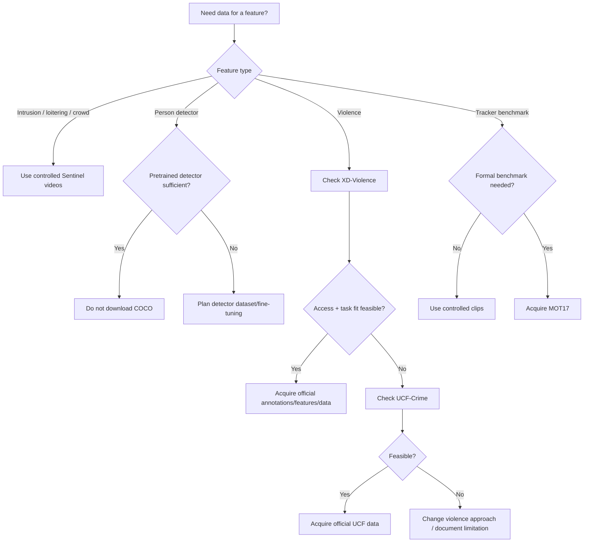

# Sentinel AI — Dataset Acquisition and Provenance Guide

> **Document purpose**
>
> This document defines **where Sentinel AI data may come from, how it must be acquired, how acquisition must be recorded, and what the project team must not do when official data is unavailable**.
>
> It is intentionally practical.
>
> A teammate should be able to follow this document and answer:
>
> - Which datasets are actually candidates?
> - Which dataset should I try first?
> - Which official website should I use?
> - Which files should I download?
> - Which files should I avoid downloading?
> - How should I store them locally?
> - How do I prove where the files came from?
> - How do I calculate checksums?
> - What if the official link fails?
> - Can I use a Kaggle/Drive/random mirror?
> - What belongs in Git?
>
> **This document does not mean every dataset listed here will be used.**
>
> Actual use is recorded separately in:
>
> `10-dataset-registry.md`
>
> The acquisition guide answers:
>
> > "How may this dataset be obtained?"
>
> The registry answers:
>
> > "What exactly did Sentinel AI actually use?"

---

# 0. Document Control

## 0.1 Authority

This document is authoritative for dataset acquisition after baseline approval.

It is subordinate to:

1. `PROJECT_HANDBOOK.md`
2. `02-srs.md`
3. `08-ai-ml-design.md`
4. accepted ADRs

Actual dataset usage and split details belong in:

- `10-dataset-registry.md`

Measured model results belong in:

- `11-model-card-and-evaluation.md`

## 0.2 Dataset status vocabulary

| Status | Meaning |
|---|---|
| `PRIMARY_CANDIDATE` | Investigate first |
| `SECONDARY_CANDIDATE` | Investigate if primary is insufficient |
| `OPTIONAL_EVALUATION` | Useful for evaluation but not required |
| `PRETRAINED_SOURCE_ONLY` | Relevant because external weights were trained on it |
| `REJECTED_FOR_CURRENT_PLAN` | Do not depend on it for current schedule |
| `TBD` | Access/terms/task fit unresolved |
| `ACQUIRED` | Team has successfully obtained and verified data |
| `REGISTERED` | Exact acquired files are recorded in dataset registry |

---

# 1. Acquisition Priority for Sentinel AI

## 1.1 Recommended order

The team should investigate data in this order:

```text
1. Sentinel deterministic local/test videos
2. XD-Violence feasibility
3. UCF-Crime feasibility if needed
4. MOT17 only if formal tracker evaluation is useful
5. COCO only if person-detector fine-tuning becomes justified
6. RWF-2000 only if official access is legitimately obtained
```

## 1.2 Why this order matters

The MVP does not need a large custom dataset for:

- intrusion;
- loitering;
- crowd threshold;
- camera offline.

Those capabilities depend primarily on:

- pretrained person detection;
- tracking;
- deterministic rules;
- controlled test video.

The main dataset-dependent feature is:

```text
violence / fighting
```

Therefore the team should not download tens of gigabytes of unrelated image data before validating the end-to-end web system.

---

# 2. Candidate Dataset Decision Summary

| Dataset | Sentinel purpose | Current decision |
|---|---|---|
| Team-controlled Sentinel test videos | deterministic integration tests | `PRIMARY / REQUIRED` |
| XD-Violence | violence/fighting model feasibility | `PRIMARY_CANDIDATE` |
| UCF-Crime | secondary violence/anomaly source | `SECONDARY_CANDIDATE` |
| MOT17 | tracker benchmarking | `OPTIONAL_EVALUATION` |
| COCO 2017 | detector provenance/fine-tuning only | `PRETRAINED_SOURCE_ONLY` unless justified |
| RWF-2000 | violence classification | `REJECTED_FOR_CURRENT_PLAN` unless official access obtained |

---

# 3. Non-Negotiable Acquisition Rules

## 3.1 Official source first

Always begin with:

```text
original dataset project page
original authors' repository
official institutional host
official benchmark host
```

## 3.2 Mirror is not original source

A mirror may help with download availability.

It shall never replace:

- original authorship;
- original academic citation;
- original dataset name;
- original usage terms.

## 3.3 No silent mirror use

If a mirror is used, record:

```text
original_source
mirror_source
mirror_provider
retrieved_at
file names
file sizes
checksums
reason official route could not be used
```

## 3.4 No dataset in Git

Do not commit full datasets.

## 3.5 No assumed license

If a dataset page does not clearly state a license:

```text
license_status: TBD
```

Do not write:

```text
free for academic use
```

unless the source actually says so.

## 3.6 No fabricated checksum

A checksum must be calculated from the actual downloaded file.

Never copy a random checksum from a forum unless using it only as an independently verified expected value.

---

# 4. Required Local Directory Structure

Recommended:

```text
sentinel-ai/
├── data/
│   ├── README.md
│   ├── raw/
│   │   ├── sentinel_demo/
│   │   ├── xd_violence/
│   │   ├── ucf_crime/
│   │   ├── mot17/
│   │   └── coco/
│   ├── interim/
│   ├── processed/
│   ├── manifests/
│   └── samples/
│
└── models/
```

## 4.1 Meaning

### `data/raw/`

Original downloaded/acquired data.

Do not manually modify in place.

### `data/interim/`

Temporary transformed files.

Examples:

- extracted frames;
- temporary features;
- converted annotations.

### `data/processed/`

Final training/evaluation-ready data produced by project scripts.

### `data/manifests/`

Small metadata files that **should be committed**.

### `data/samples/`

Small redistribution-safe test assets only.

---

# 5. Recommended `.gitignore`

```gitignore
# Raw and processed datasets
data/raw/**
data/interim/**
data/processed/**

# Large video/media
*.mp4
*.avi
*.mkv
*.mov
*.webm

# Dataset archives
*.zip
*.tar
*.tar.gz
*.tgz
*.7z
*.rar

# Large ML arrays/features
*.npy
*.npz
*.h5
*.hdf5

# Model binaries
*.pt
*.pth
*.onnx
*.ckpt
*.weights

# Allow metadata/manifests
!data/manifests/**
!data/README.md

# Explicit small safe samples can be unignored individually
# !data/samples/example_safe_clip.mp4
```

A sample video should only be unignored after confirming redistribution is permitted.

---

# 6. Dataset Acquisition Record

For every acquisition attempt, create:

```text
data/manifests/acquisition_<dataset-id>.yaml
```

Recommended schema:

```yaml
dataset_id: "DATA-XD-VIOLENCE-001"
name: "XD-Violence"
status: "ACQUIRED"
original_project_url: "https://..."
download_url_used: "https://..."
download_provider: "Official OneDrive link from project page"
retrieved_at: "2026-08-20T..."
retrieved_by: "TBD"
license_or_terms_status: "TBD"
archive_files:
  - name: "..."
    size_bytes: 0
    sha256: "..."
notes: ""
```

---

# 7. Acquisition Evidence

Keep evidence of acquisition without committing the dataset itself.

Useful evidence:

- acquisition manifest;
- checksum file;
- downloaded filename list;
- dataset README;
- screenshot of official page if academically useful;
- retrieval date;
- official URLs.

Do not put passwords, temporary access tokens, or personal cloud links into committed manifests.

---

# 8. Checksum Standard

Recommended:

```text
SHA-256
```

## 8.1 Linux

```bash
sha256sum filename.zip
```

For multiple archives:

```bash
sha256sum *.zip > SHA256SUMS.txt
```

## 8.2 macOS

```bash
shasum -a 256 filename.zip
```

## 8.3 Windows PowerShell

```powershell
Get-FileHash .\filename.zip -Algorithm SHA256
```

Multiple files:

```powershell
Get-ChildItem *.zip | Get-FileHash -Algorithm SHA256
```

## 8.4 Python

```python
from pathlib import Path
import hashlib

def sha256_file(path: str, chunk_size: int = 1024 * 1024) -> str:
    digest = hashlib.sha256()

    with Path(path).open("rb") as f:
        while chunk := f.read(chunk_size):
            digest.update(chunk)

    return digest.hexdigest()

print(sha256_file("dataset.zip"))
```

---

# 9. Archive Integrity Check

A checksum proves file identity, not necessarily archive readability.

After download:

## ZIP

```bash
unzip -t archive.zip
```

## 7-Zip

```bash
7z t archive.zip
```

Windows GUI:

```text
7-Zip → Test archive
```

Do not begin long preprocessing before verifying that the archive is readable.

---

# 10. Storage-Space Procedure

Before downloading:

1. check free disk space;
2. estimate:
   - archive;
   - extracted data;
   - processed data;
   - features;
   - model artifacts;
3. preserve extra working space.

Linux:

```bash
df -h
```

PowerShell:

```powershell
Get-PSDrive -PSProvider FileSystem
```

Do not fill the system drive with a large research dataset during the project.

---

# 11. Controlled Sentinel Test Videos

**Status:** `REQUIRED`

This is not an external academic dataset.

It is the project's controlled integration-test media.

## 11.1 Purpose

Use for:

- intrusion;
- loitering;
- crowd threshold;
- camera-health simulation where relevant;
- end-to-end deterministic replay.

## 11.2 Preferred sources

1. self-recorded staged footage with informed participants;
2. redistribution-safe public sample media;
3. synthetic/animated clips if suitable for deterministic testing.

## 11.3 Avoid

- private college CCTV footage without permission;
- secretly recorded people;
- random social-media clips with unclear reuse rights;
- real security incidents copied from unknown sources.

## 11.4 Required metadata

For each test video:

```yaml
video_id: "SENT-DEMO-001"
purpose: "restricted_area_intrusion"
source: "team-recorded"
permission_basis: "participants consented to course-project recording"
redistribution_allowed: "TBD/yes/no"
recorded_at: "..."
duration_seconds: "..."
resolution: "..."
fps: "..."
sha256: "..."
expected_behavior:
  - "person enters restricted polygon once"
```

---

# 12. Golden Integration Video

Create one particularly controlled video for the first vertical slice.

## 12.1 Required behavior

Video should contain:

```text
person starts outside zone
→ walks into zone
→ remains visible
```

Avoid:

- heavy occlusion;
- multiple unnecessary people;
- camera movement;
- extreme darkness.

The goal is to test integration, not challenge the detector initially.

## 12.2 Later robustness clips

After the vertical slice works, add:

- crossing people;
- partial occlusion;
- small person;
- low light;
- multiple people;
- track loss.

---

# 13. XD-Violence

**Dataset ID candidate:** `DATA-XD-VIOLENCE-V1`  
**Status:** `PRIMARY_CANDIDATE`

## 13.1 Official project page

```text
https://roc-ng.github.io/XD-Violence/
```

Verified on:

```text
2026-08-20
```

## 13.2 Academic source

Project:

**Not only Look, but also Listen: Learning Multimodal Violence Detection under Weak Supervision**

Authors include:

- Peng Wu
- Jing Liu
- Yujia Shi
- Yujia Sun
- Fangtao Shao
- Zhaoyang Wu
- Zhiwei Yang

Venue:

```text
ECCV 2020
```

## 13.3 Officially described scale

The official project page states:

```text
217 hours
4,754 untrimmed videos
audio signals
weak labels
```

## 13.4 Categories shown by official project

Violent categories displayed include:

```text
Abuse
Car Accident
Explosion
Fighting
Riot
Shooting
```

plus:

```text
Normal Activities
```

The project page also describes multi-label violent videos.

---

# 14. XD-Violence Official Download Structure

On the official project page, the current `Download` section exposes:

## V1.0 Videos

### Baidu Netdisk

- training videos link is shown as disabled;
- test videos remain listed;
- test annotations;
- README.

### AliyunDrive

- training videos.

### OneDrive

Training videos split into multiple ranges:

```text
0001–1004
1005–2004
2005–2804
2805–3319
3320–3954
```

Also:

```text
Test Videos
Test Annotations
```

## V1.0 Features

The official page exposes:

```text
audio features — VGGish
visual features — I3D RGB & Flow
```

through OneDrive/Baidu links.

---

# 15. XD-Violence Acquisition Strategy

Do **not** immediately download every raw video.

Use a staged approach.

## Stage 1 — Documentation only

Open:

```text
https://roc-ng.github.io/XD-Violence/
```

Record:

- page retrieval date;
- dataset description;
- active download providers;
- test annotation link;
- README link.

## Stage 2 — Test annotation acquisition

Acquire:

```text
Test Annotations
README
```

first.

Goal:

- understand format;
- inspect label structure;
- determine whether Sentinel can isolate/evaluate violence/fighting in a defensible way.

## Stage 3 — Feature feasibility

Before raw videos, consider official:

```text
I3D RGB & Flow visual features
```

This may allow a lightweight temporal baseline without expensive feature extraction.

## Stage 4 — Smallest useful video subset

Only after task mapping is understood, acquire enough videos to:

- inspect examples;
- validate labels;
- run integration.

## Stage 5 — Full training data

Download full training videos only if the chosen model actually requires raw video.

---

# 16. XD-Violence Manual Acquisition Procedure

Because the official video links are hosted through external file providers and may use dynamic share URLs, the project should use the links **from the official project page** rather than hard-coding an unofficial mirror.

Procedure:

1. Open:

```text
https://roc-ng.github.io/XD-Violence/
```

2. Scroll to:

```text
Download
```

3. Under:

```text
V1.0 Videos
```

select the official currently active provider.

4. For feasibility, obtain first:

```text
Test Annotations
README
```

5. Record the provider shown on the official page.

6. Download the required archive/file.

7. Do **not** rename the original archive before recording its original filename.

8. Record:
   - file name;
   - byte size;
   - retrieval date;
   - share/provider;
   - SHA-256.

9. Store under:

```text
data/raw/xd_violence/
```

10. Update:

```text
data/manifests/acquisition_xd_violence.yaml
```

---

# 17. XD-Violence Feature-First Option

If compute/storage is limited, prefer evaluating the official pre-extracted visual features before processing all raw video.

Official project page currently lists:

```text
V1.0 Features
→ visual features (I3D RGB&Flow)
```

## 17.1 Academic wording if used

Correct:

> Sentinel's baseline violence experiment uses the XD-Violence authors' pre-extracted I3D visual features.

Incorrect:

> Sentinel extracted all I3D features itself.

unless the team actually did.

---

# 18. XD-Violence Audio Decision

The dataset includes audio and official VGGish audio features.

Sentinel MVP does not require standalone audio anomaly detection.

Therefore:

```text
audio usage: TBD
```

If the selected baseline is visual-only:

- do not download audio features unnecessarily.

If a multimodal violence baseline is chosen:

- document that audio is used only as part of the violence model;
- this does not expand MVP into general sound anomaly detection.

---

# 19. XD-Violence Terms / License Handling

The official project page provides the dataset and academic citation, but the team shall independently record any explicit terms included with the downloaded README/files.

Do not infer a broad redistribution license merely because downloads are public.

Until terms are inspected locally:

```text
license_or_terms_status: TBD
```

Do not commit XD-Violence videos to the repository.

---

# 20. XD-Violence Acquisition Manifest Example

```yaml
dataset_id: "DATA-XD-VIOLENCE-V1"
name: "XD-Violence"
status: "ACQUIRED_PARTIAL"
official_project_url: "https://roc-ng.github.io/XD-Violence/"
provider_used: "Official OneDrive link exposed by project page"
retrieved_at: "TBD"
retrieved_by: "TBD"
files:
  - original_name: "TBD"
    purpose: "test annotations"
    size_bytes: "TBD"
    sha256: "TBD"
terms_status: "TBD_AFTER_READING_INCLUDED_README"
notes:
  - "Acquired as feasibility step; not yet locked as training dataset."
```

---

# 21. UCF-Crime

**Dataset ID candidate:** `DATA-UCF-CRIME`  
**Status:** `SECONDARY_CANDIDATE`

## 21.1 Official project page

Current official project:

```text
https://www.crcv.ucf.edu/research/real-world-anomaly-detection-in-surveillance-videos/
```

Legacy official project route may also appear as:

```text
https://www.crcv.ucf.edu/projects/real-world/
```

## 21.2 Officially described scale

The UCF project page states:

```text
128 hours
1,900 long untrimmed surveillance videos
13 realistic anomaly categories
```

---

# 22. UCF-Crime Categories

Official project categories include:

```text
Abuse
Arrest
Arson
Assault
Road Accident
Burglary
Explosion
Fighting
Robbery
Shooting
Stealing
Shoplifting
Vandalism
```

plus normal activity videos.

The official page describes Fighting as videos where two or more people attack one another.

---

# 23. UCF-Crime Official Direct Dataset URL

The current official UCF project page exposes:

```text
https://www.crcv.ucf.edu/data1/chenchen/UCF_Crimes.zip
```

It also exposes an official-page-linked Dropbox alternative for downloading the data in parts:

```text
https://www.dropbox.com/sh/75v5ehq4cdg5g5g/AABvnJSwZI7zXb8_myBA0CLHa?dl=0
```

## 23.1 Preferred order

1. UCF institutional direct link.
2. Dropbox link explicitly published by UCF project page.
3. No unrelated mirror unless separately documented.

---

# 24. UCF-Crime Download — Linux/macOS

Before running, confirm enough free disk.

Using curl:

```bash
mkdir -p data/raw/ucf_crime
cd data/raw/ucf_crime

curl -L \
  --fail \
  --continue-at - \
  --output UCF_Crimes.zip \
  "https://www.crcv.ucf.edu/data1/chenchen/UCF_Crimes.zip"
```

Using wget:

```bash
wget -c \
  "https://www.crcv.ucf.edu/data1/chenchen/UCF_Crimes.zip" \
  -O UCF_Crimes.zip
```

If the institutional host is unstable, use the alternate link from the official project page.

---

# 25. UCF-Crime Download — Windows PowerShell

PowerShell's built-in web request can be used, but for large resumable downloads, current Windows `curl.exe` is often more convenient.

```powershell
New-Item -ItemType Directory -Force `
  -Path ".\data\raw\ucf_crime" | Out-Null

Set-Location ".\data\raw\ucf_crime"

curl.exe -L `
  --fail `
  --continue-at - `
  --output "UCF_Crimes.zip" `
  "https://www.crcv.ucf.edu/data1/chenchen/UCF_Crimes.zip"
```

Do not repeatedly restart a very large download from zero if the server supports resume.

---

# 26. UCF-Crime Archive Verification

After download:

PowerShell:

```powershell
Get-FileHash .\UCF_Crimes.zip -Algorithm SHA256
```

Linux:

```bash
sha256sum UCF_Crimes.zip
```

Archive test:

```bash
unzip -t UCF_Crimes.zip
```

Then record the calculated checksum.

---

# 27. UCF-Crime Folder Structure

The official project documentation states that `UCF_Crimes` contains:

```text
Anomaly_Detection_splits/
Action_Recognition_splits/
Videos/
```

The official page states:

- anomaly-detection train/test partition files are provided;
- action-recognition splits contain four partitions;
- the video folder contains category subfolders.

## 27.1 Important current note

A current UCF researcher dataset index warns that the ZIP has a corrupted `Anomaly_Train.txt` and that the project page provides the corrected file.

Therefore:

**Do not assume the split file inside the archive is authoritative without comparing it with the current official project-page correction.**

Record which split file is actually used.

---

# 28. UCF-Crime Sentinel Strategy

Do not automatically train on all anomaly classes.

Possible Sentinel use:

```text
Fighting
+
Normal
```

or a broader:

```text
violence-like classes
+
normal
```

only after task definition is formally selected.

## 28.1 Required decision

Before preprocessing:

```text
What exactly is the positive class?
```

Potential interpretations:

- Fighting only;
- Fighting + Assault;
- broad violent anomalies;
- general anomaly.

The final report wording must match the chosen labels.

---

# 29. UCF-Crime Acquisition Manifest Example

```yaml
dataset_id: "DATA-UCF-CRIME"
name: "UCF-Crime"
status: "ACQUIRED"
official_project_url: "https://www.crcv.ucf.edu/research/real-world-anomaly-detection-in-surveillance-videos/"
download_url_used: "https://www.crcv.ucf.edu/data1/chenchen/UCF_Crimes.zip"
retrieved_at: "TBD"
archive:
  name: "UCF_Crimes.zip"
  size_bytes: "TBD"
  sha256: "TBD"
split_note:
  anomaly_train_file_source: "TBD — verify official corrected version"
terms_status: "TBD"
```

---

# 30. RWF-2000

**Dataset ID candidate:** `DATA-RWF-2000`  
**Status:** `REJECTED_FOR_CURRENT_PLAN`

## 30.1 Official repository

```text
https://github.com/mchengny/RWF2000-Video-Database-for-Violence-Detection
```

## 30.2 Official description

The current official repository describes:

```text
2,000 video clips
violent / non-violent
surveillance scenarios
```

and states the clips were created from surveillance videos.

## 30.3 Current access blocker

The official repository currently states:

> Due to privacy requirements, video files are not currently available on the website.

The current issue tracker also shows multiple recent academic access requests.

Therefore:

```text
Sentinel shall not depend on RWF-2000 for the current 2–3 week schedule.
```

---

# 31. RWF-2000 Usage Restrictions Noted by Official Repository

The official repository states restrictions including:

- no modification/redistribution without SMIIP Lab approval;
- no commercial use without approval;
- privacy/mental-health usage restrictions;
- citation requirement for publications.

The exact current repository text should be reviewed before any eventual use.

---

# 32. RWF-2000 Mirror Policy

Do **not** search Kaggle or random Drive links and silently use them.

If official access later remains unavailable and the team proposes a mirror:

1. obtain team approval;
2. record the original official repository;
3. record the mirror;
4. compare structure;
5. record checksum;
6. inspect original terms;
7. state clearly in the final data registry that acquisition was through a mirror;
8. do not redistribute.

Given the short schedule, the default decision remains:

```text
do not use
```

---

# 33. MOT17

**Dataset ID candidate:** `DATA-MOT17`  
**Status:** `OPTIONAL_EVALUATION`

## 33.1 Official benchmark page

```text
https://motchallenge.net/data/MOT17/
```

Verified through current MOTChallenge search results on 2026-08-20.

## 33.2 Official purpose

Pedestrian multi-object tracking benchmark.

## 33.3 Current official page data

The current official page reports:

```text
Get all data: approximately 5.5 GB
Get files (no img) only: approximately 9.7 MB
```

MOT17 uses MOT16 sequences with improved ground truth and three provided detection sets.

---

# 34. MOT17 Sentinel Purpose

MOT17 is **not required** to train Sentinel's tracker.

Use it only if the team wants:

- formal tracker benchmark;
- ID-switch measurement;
- IDF1/HOTA/MOTA evaluation.

For a short project, operational clips may provide enough evidence.

---

# 35. MOT17 Acquisition Procedure

Because MOTChallenge may generate or change download links, use the official page.

1. Open:

```text
https://motchallenge.net/data/MOT17/
```

2. Find:

```text
Download
```

3. Choose:

```text
Get all data
```

only if full image sequences are required.

4. If only annotations/metadata are needed, consider:

```text
Get files (no img) only
```

5. Save into:

```text
data/raw/mot17/
```

6. Record exact downloaded URL in the acquisition manifest.

7. Calculate SHA-256.

8. Test archive.

---

# 36. MOT17 Official Evaluation Kit

Current official MOTChallenge evaluation uses TrackEval.

Official TrackEval repository:

```text
https://github.com/JonathonLuiten/TrackEval
```

Use benchmark documentation rather than a random third-party evaluator if formal MOT metrics are reported.

---

# 37. MOT17 Metrics

Potential metrics:

```text
HOTA
MOTA
IDF1
ID switches
```

Do not report benchmark metrics unless the tracker was actually evaluated using the correct format/tool.

---

# 38. COCO 2017

**Dataset ID candidate:** `DATA-COCO-2017`  
**Status:** `PRETRAINED_SOURCE_ONLY` unless detector fine-tuning is justified.

## 38.1 Official project

```text
https://cocodataset.org/
```

## 38.2 Why COCO matters to Sentinel

Many general pretrained object detectors include a:

```text
person
```

class learned using COCO.

That does **not** mean Sentinel must download or train on COCO.

## 38.3 Default decision

If pretrained detector works:

```text
DO NOT DOWNLOAD FULL COCO
```

Record COCO as part of pretrained model provenance.

---

# 39. COCO Direct Object-Store Files

Common official COCO object-store URLs used by the ecosystem include:

```text
http://images.cocodataset.org/zips/train2017.zip
http://images.cocodataset.org/zips/val2017.zip
http://images.cocodataset.org/annotations/annotations_trainval2017.zip
```

The official COCO site remains the authoritative project source:

```text
https://cocodataset.org/
```

## 39.1 Approximate scale

Common current documentation reports:

- train2017: ~118K images;
- val2017: ~5K images.

Full image archives are large.

Do not acquire unless there is a concrete experimental need.

---

# 40. COCO Fine-Tuning Trigger

Download COCO only if one of the following is true:

1. team intentionally reproduces detector evaluation;
2. detector fine-tuning requires COCO-formatted data;
3. a custom person subset experiment is explicitly planned.

Do not use COCO merely because a tutorial begins by downloading it.

---

# 41. COCO Acquisition — If Required

Linux:

```bash
mkdir -p data/raw/coco
cd data/raw/coco

wget -c http://images.cocodataset.org/zips/train2017.zip
wget -c http://images.cocodataset.org/zips/val2017.zip
wget -c http://images.cocodataset.org/annotations/annotations_trainval2017.zip
```

PowerShell:

```powershell
curl.exe -L --continue-at - `
  -O "http://images.cocodataset.org/zips/train2017.zip"

curl.exe -L --continue-at - `
  -O "http://images.cocodataset.org/zips/val2017.zip"

curl.exe -L --continue-at - `
  -O "http://images.cocodataset.org/annotations/annotations_trainval2017.zip"
```

Then checksum every archive.

---

# 42. COCO Person-Only Processing

If Sentinel needs only people, do not copy all categories into a custom dataset blindly.

Use original annotations to create a **derived person-only manifest/annotation set**.

Derived data must record:

```text
parent_dataset = COCO 2017
selection_rule = category person
script_commit = ...
```

Keep original raw archive immutable.

---

# 43. External Pretrained Detector Weights

Model weights are not datasets, but acquisition must follow similar provenance discipline.

For each weight file:

```yaml
model_name: "..."
model_version: "..."
official_source: "..."
retrieved_at: "..."
file_name: "..."
sha256: "..."
license: "..."
pretrained_dataset: "..."
```

Do not download weights from random model-hosting accounts when the original framework/research project provides them.

---

# 44. Dataset Acquisition Decision Tree



---

# 45. No-Acquisition Rule for Unnecessary Data

Before any large download, write one sentence:

```text
This dataset is needed because __________________________.
```

If the team cannot fill that blank precisely, do not download yet.

---

# 46. Dataset Selection Evidence

Before locking the violence dataset, produce a short comparison:

| Criterion | XD-Violence | UCF-Crime |
|---|---|---|
| Official access | | |
| Fighting class relevance | | |
| Weak/strong labels | | |
| Raw video size feasibility | | |
| Feature availability | | |
| Training effort | | |
| Evaluation clarity | | |
| Terms clarity | | |
| Integration fit | | |

Fill with actual observed facts after acquisition inspection.

---

# 47. Archive Naming Rule

Keep original downloaded filename.

Optional local copy:

```text
<dataset-id>__<original-name>
```

But manifest must preserve original name.

Do not rename:

```text
download.zip
```

to:

```text
final_dataset.zip
```

without recording provenance.

---

# 48. Extraction Rule

Extract into dataset-specific folder.

Example:

```text
data/raw/ucf_crime/archive/UCF_Crimes.zip
data/raw/ucf_crime/extracted/UCF_Crimes/
```

This preserves the exact downloaded archive for verification.

---

# 49. Raw Data Immutability

Treat:

```text
data/raw/
```

as read-only after acquisition.

All transformations go into:

```text
data/interim/
data/processed/
```

This enables reproducibility.

---

# 50. Preprocessing Script Requirement

Do not manually edit thousands of dataset files.

Write scripts for:

- label conversion;
- frame sampling;
- subset selection;
- feature extraction;
- split creation.

Commit scripts.

Record Git commit in dataset registry.

---

# 51. Derived Dataset Manifest

For a processed subset:

```yaml
derived_dataset_id: "DATA-XD-FIGHTING-SUBSET-V1"
parent_dataset_id: "DATA-XD-VIOLENCE-V1"
created_at: "..."
script: "scripts/data/build_xd_fighting_subset.py"
git_commit: "..."
selection_rule: "..."
input_manifest_sha256: "..."
output_counts:
  positive: "..."
  negative: "..."
```

No number should be filled before script execution.

---

# 52. Split Files Must Be Versioned

Commit small split manifests:

```text
data/manifests/splits/violence_train.txt
data/manifests/splits/violence_val.txt
data/manifests/splits/violence_test.txt
```

This makes experiments reproducible without storing the source videos in Git.

---

# 53. Split Leakage Guard

For video datasets:

Do not place clips/windows from the same original source video across:

```text
train
and
test
```

when that creates near-duplicate leakage.

Group by original video identity.

---

# 54. Dataset Statistics Script

After acquisition, compute rather than guess:

```text
file count
total duration
class count
resolution distribution
FPS distribution
corrupted files
```

Store output under:

```text
data/manifests/statistics/
```

---

# 55. Video Validation Script

A preprocessing utility should attempt to decode every selected file and record:

```text
path
decode_success
duration
fps
width
height
frame_count
error
```

Do not discover corrupt clips halfway through training.

---

# 56. Suggested FFprobe Validation

If FFmpeg is installed:

```bash
ffprobe \
  -v error \
  -show_entries format=duration \
  -of default=noprint_wrappers=1:nokey=1 \
  video.mp4
```

For stream metadata:

```bash
ffprobe -v error -show_streams video.mp4
```

Use only if FFmpeg is actually installed and documented.

---

# 57. Dataset Corruption Handling

If a file cannot decode:

1. do not silently delete it;
2. record it in validation output;
3. determine whether official re-download fixes it;
4. exclude only through a documented rule;
5. update final sample counts.

---

# 58. Download Resume

For large official archives, use resume-capable tools when possible.

`curl`:

```bash
curl -L --continue-at - --output file.zip URL
```

`wget`:

```bash
wget -c URL
```

Do not assume resume works on every cloud-share provider.

---

# 59. Cloud Share Links

OneDrive/Baidu/Aliyun/Dropbox links may:

- redirect;
- require cookies;
- expire;
- change share tokens.

Therefore manifests should record:

```text
official project page
provider used
retrieval date
```

not only a long temporary URL.

---

# 60. Browser Download Evidence

If browser download is required:

record:

1. official page URL;
2. button/link label;
3. provider;
4. downloaded filename;
5. checksum.

That is sufficient provenance even if the final redirected URL is temporary.

---

# 61. Credentials / Access Tokens

Never commit:

- dataset portal password;
- OneDrive cookie;
- Google Drive access token;
- personal email token.

If registration is required, document:

```text
registration required: yes
```

without sharing credentials.

---

# 62. Terms Screenshot / Copy Policy

Do not copy an entire legal terms page into the repository.

Instead record:

```text
terms URL
retrieval date
short summary
team interpretation status
```

If terms are ambiguous:

```text
TBD
```

---

# 63. Dataset Citation Record

Every accepted dataset should store citation metadata.

Example:

```yaml
citation:
  title: "..."
  authors:
    - "..."
  venue: "..."
  year: 2020
  doi: "..."
  official_project_url: "..."
```

The final report should cite the original research publication.

---

# 64. Dataset README

Create:

```text
data/README.md
```

It should explain:

- data not committed;
- how to acquire;
- expected directory names;
- which datasets are currently active;
- links to this guide.

It shall not contain private download credentials.

---

# 65. Team Synchronization

One teammate should not say:

> I downloaded the dataset, it is on my laptop.

without adding acquisition metadata.

Minimum shareable record:

```text
dataset ID
source
file list
checksums
split manifests
preprocessing commands
```

---

# 66. Sharing Dataset Between Team Members

If terms permit internal academic sharing, use a team-approved private transfer mechanism.

Do not place large datasets in:

- public GitHub;
- public Drive folder;
- public file host;

unless redistribution is clearly permitted.

Every teammate should preserve the same manifest/checksum.

---

# 67. Dataset Path Configuration

Code must not hard-code personal paths such as:

```text
C:\Users\Kasinath\Downloads\dataset
```

Use configuration:

```text
SENTINEL_DATA_ROOT
```

or equivalent.

Exact environment variable name remains deployment-design dependent.

---

# 68. Expected Path Manifest

Example:

```yaml
datasets:
  xd_violence:
    root: "data/raw/xd_violence"
  ucf_crime:
    root: "data/raw/ucf_crime"
```

Actual paths remain local.

---

# 69. Windows Path Safety

Prefer Python `pathlib` rather than manual slash concatenation.

```python
from pathlib import Path

root = Path("data") / "raw" / "xd_violence"
```

Do not assume Linux-only paths in shared preprocessing scripts.

---

# 70. Dataset Security

Treat external media as untrusted input.

Risks include:

- corrupt containers;
- extreme resolution;
- malformed metadata;
- unexpected codecs.

Use maintained media libraries and explicit validation.

---

# 71. Sensitive Violence Content

Violence datasets may contain disturbing real-world footage.

Team handling should be task-focused:

- minimize unnecessary manual viewing;
- avoid redistribution;
- use annotations/metadata where possible;
- keep access limited to project needs.

This is both a privacy and responsible-research consideration.

---

# 72. Dataset Minimization

Download only what is needed.

Examples:

- test annotations before raw XD videos;
- fighting/normal subset after task mapping;
- no COCO test images unless required;
- MOT17 metadata only if enough for the intended evaluation step.

---

# 73. Evidence vs Training Data

Do not use final demonstration evidence clips as training data and then claim the same clips as independent evaluation.

Keep:

```text
training data
validation data
formal test data
demo fixtures
```

distinct where practical.

---

# 74. Formal Evaluation Set

Before final metrics:

1. freeze test set;
2. record file IDs;
3. checksum split manifest;
4. stop tuning on it;
5. run final evaluation.

If this discipline was not followed, disclose that limitation.

---

# 75. Dataset Versioning

Even if dataset calls itself "V1.0", the local Sentinel record should include retrieval metadata.

Example:

```text
DATA-XD-VIOLENCE-V1__retrieved-2026-08-20
```

This helps when provider contents change later.

---

# 76. Checksum Manifest Format

Example:

```text
<sha256>  file1.zip
<sha256>  file2.zip
```

Store:

```text
data/manifests/checksums/xd_violence_sha256.txt
```

Small checksum files should be committed.

---

# 77. File Inventory

Create:

```text
data/manifests/inventory_<dataset-id>.csv
```

Suggested fields:

```text
relative_path
size_bytes
extension
sha256_optional
label
split
source_video_id
```

For very large datasets, per-file SHA-256 may be expensive; archive-level checksum plus manifest may be sufficient.

---

# 78. Provenance Chain

A model should eventually be traceable:

```text
model artifact
→ experiment ID
→ processed dataset ID
→ raw dataset acquisition ID
→ official project/paper
```

This chain is required for academic defensibility.

---

# 79. Acquisition Stop Conditions

Stop a dataset acquisition if:

- official access is unavailable;
- terms prohibit the planned use;
- download size is infeasible;
- annotation format does not match task;
- dataset cannot be validated;
- schedule cost exceeds likely value.

Do not continue merely because time has already been spent.

---

# 80. XD-Violence Go/No-Go Checklist

Before selecting XD-Violence:

- [ ] Official page reachable.
- [ ] Test annotations acquired.
- [ ] README inspected.
- [ ] Fighting labels understood.
- [ ] Official feature link works or raw video route works.
- [ ] Storage feasible.
- [ ] Terms reviewed.
- [ ] Train/test semantics understood.
- [ ] Baseline architecture can consume the representation.
- [ ] Integration fits project schedule.

---

# 81. UCF-Crime Go/No-Go Checklist

- [ ] Official UCF page reachable.
- [ ] Direct ZIP/official alternate works.
- [ ] Archive validates.
- [ ] Corrected split-file issue checked.
- [ ] Fighting subset understood.
- [ ] Normal comparison data identified.
- [ ] Terms reviewed.
- [ ] Storage feasible.
- [ ] Preprocessing effort feasible.

---

# 82. MOT17 Go/No-Go Checklist

- [ ] Team actually needs formal tracker benchmark.
- [ ] Official MOT17 page used.
- [ ] Correct split downloaded.
- [ ] Official evaluator selected.
- [ ] Evaluation format understood.
- [ ] Time cost justified.

If not:

```text
skip MOT17
```

---

# 83. COCO Go/No-Go Checklist

- [ ] Pretrained person detector is insufficient.
- [ ] Team has a specific fine-tuning/evaluation experiment.
- [ ] Storage available.
- [ ] Annotation conversion script planned.
- [ ] Download is worth schedule cost.

Otherwise:

```text
skip COCO download
```

---

# 84. RWF-2000 Go/No-Go Checklist

Current first item fails:

- [ ] Official video access available.

Therefore current status:

```text
NO-GO
```

until access changes.

---

# 85. Initial Dataset Work Plan

## Day 1

1. create data directory;
2. add `.gitignore`;
3. create acquisition manifest templates;
4. create controlled intrusion test clip;
5. open XD-Violence official page;
6. acquire annotations/README/features if feasible.

## Day 2

1. inspect XD labels;
2. determine feasibility;
3. if unsuitable, test UCF-Crime;
4. freeze initial violence dataset decision.

## Day 3+

Only then:

- preprocess;
- create splits;
- train/evaluate baseline.

---

# 86. Dataset Acquisition PR Contents

A dataset-acquisition PR should contain only metadata/scripts, not the actual large data.

Example:

```text
docs/09-dataset-acquisition.md
docs/10-dataset-registry.md
data/manifests/acquisition_xd_violence.yaml
data/manifests/checksums/...
scripts/data/validate_dataset.py
.gitignore
```

---

# 87. Commit Message Examples

```text
docs(data): document XD-Violence acquisition
```

```text
chore(data): add UCF-Crime acquisition manifest
```

```text
feat(data): add violence dataset validation script
```

Do not commit:

```text
feat(data): upload 40GB dataset
```

---

# 88. Academic Integrity Rules

Never write:

> We collected the XD-Violence dataset.

Preferred:

> The XD-Violence dataset was acquired from the authors' official project page.

Never write:

> Our dataset contains 4,754 videos.

unless referring to an actual Sentinel-derived dataset with that count.

Instead:

> The XD-Violence authors describe their dataset as containing 4,754 untrimmed videos.

---

# 89. Source Verification Date

External acquisition information in this document was checked on:

```text
2026-08-20
```

Because dataset download links can change, recheck the official source immediately before an actual large download.

---

# 90. Verified Source Notes

## 90.1 XD-Violence

Official:

```text
https://roc-ng.github.io/XD-Violence/
```

Current page exposes:

- V1.0 video links;
- OneDrive training splits;
- test videos;
- test annotations;
- VGGish audio features;
- I3D RGB/Flow visual features.

## 90.2 UCF-Crime

Official:

```text
https://www.crcv.ucf.edu/research/real-world-anomaly-detection-in-surveillance-videos/
```

Direct dataset link currently published by UCF:

```text
https://www.crcv.ucf.edu/data1/chenchen/UCF_Crimes.zip
```

Official project page also publishes a Dropbox alternate.

## 90.3 MOT17

Official:

```text
https://motchallenge.net/data/MOT17/
```

Current benchmark page advertises:

```text
all data ≈ 5.5 GB
files without images ≈ 9.7 MB
```

## 90.4 COCO

Official:

```text
https://cocodataset.org/
```

Common official object storage:

```text
http://images.cocodataset.org/
```

## 90.5 RWF-2000

Official:

```text
https://github.com/mchengny/RWF2000-Video-Database-for-Violence-Detection
```

Current repository states that video files are unavailable on the site due to privacy requirements.

---

# 91. Dataset Registry Handoff

Once a dataset is actually acquired, immediately create/update:

```text
10-dataset-registry.md
```

with:

- exact local dataset ID;
- exact files;
- exact checksum;
- exact split;
- exact role;
- exact preprocessing.

Do not wait until final report week.

---

# 92. Final Acquisition Rule

> **Sentinel AI shall never use a dataset merely because it is easy to find online.**
>
> Every external dataset used in the project must have a traceable provenance chain:
>
> ```text
> original authors/project
> → official acquisition source
> → actual downloaded file
> → checksum
> → local dataset ID
> → preprocessing
> → split manifest
> → experiment
> → model artifact
> ```
>
> If an official dataset cannot be obtained, the project shall either:
>
> - use a clearly documented legitimate alternative; or
> - change the model plan;
>
> rather than silently substitute an unverifiable mirror.
