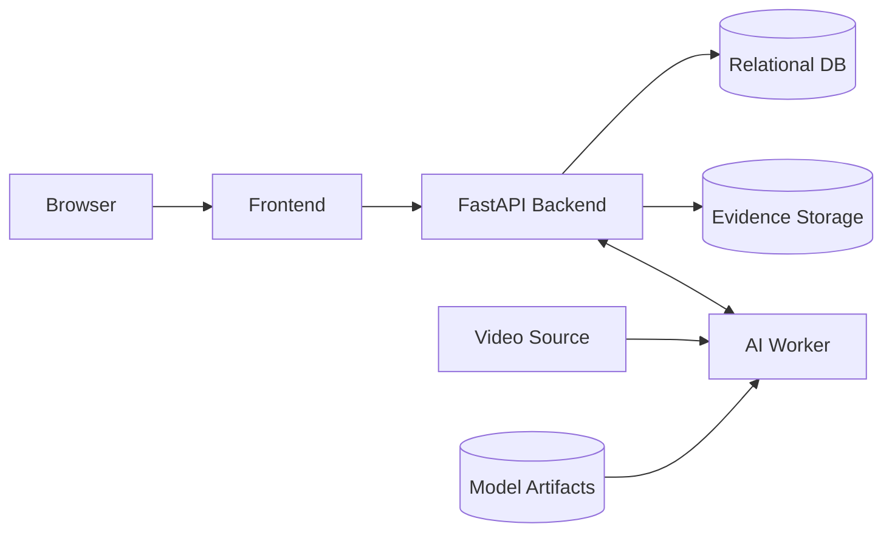

# Sentinel AI — Deployment, Installation, and Demo Runbook

> **Document purpose**
>
> This document defines how Sentinel AI shall be installed, configured, started, verified, demonstrated, stopped, and restored in a reproducible development/demo environment.
>
> It is deliberately conservative.
>
> Several technology choices are still unresolved:
>
> - frontend framework;
> - database final selection;
> - ORM/migration tooling;
> - backend ↔ AI-worker transport;
> - video source/streaming transport;
> - evidence storage backend;
> - authentication implementation;
> - exact network ports;
> - final containerization strategy.
>
> Therefore this guide separates:
>
> 1. **confirmed deployment architecture**
> 2. **proposed implementation defaults**
> 3. **TBD items that must not be guessed**
>
> The final version of this guide must be executable on a clean machine without relying on undocumented local state.

---

# 0. Document Control

## 0.1 Authority

After baseline approval, this document becomes authoritative for local setup and demo execution.

It is subordinate to:

1. `PROJECT_HANDBOOK.md`
2. `04-system-architecture.md`
3. `06-database-design.md`
4. `07-api-specification.md`
5. `08-ai-ml-design.md`
6. `10-dataset-registry.md`
7. `13-security-and-privacy.md`
8. accepted ADRs

If actual code/setup differs from this guide, the guide and/or design must be updated before final handoff.

## 0.2 Deployment status vocabulary

| Status | Meaning |
|---|---|
| `CONFIRMED` | Accepted architecture/behavior |
| `PROPOSED` | Recommended implementation pending team decision |
| `TBD` | Unresolved |
| `DEFERRED` | Future |
| `REJECTED` | Explicitly excluded |

## 0.3 Current deployment assumptions

| Item | Status |
|---|---|
| FastAPI backend | `CONFIRMED` |
| Separate AI worker | `CONFIRMED` |
| Modular monolith backend | `CONFIRMED` |
| Frontend web application | `CONFIRMED` |
| Relational persistence | `PROPOSED` |
| PostgreSQL | `PROPOSED_PENDING_ADR` |
| Alembic migrations | `PROPOSED` |
| Uvicorn ASGI server | `PROPOSED` |
| WebSocket event updates | `PROPOSED` |
| Docker | `PROPOSED` |
| Docker Compose | `PROPOSED` |
| Evidence local filesystem | `PROPOSED_CANDIDATE` |
| Video source transport | `TBD` |
| Auth strategy | `TBD` |
| Worker transport | `TBD` |
| Final ports | `TBD` |

# 1. Deployment Goals

The deployment process shall:

1. be reproducible;
2. avoid hidden local dependencies;
3. avoid committed secrets;
4. keep AI worker separate from backend;
5. make failures visible;
6. support clean demo startup;
7. support deterministic test-video replay;
8. preserve event history between restarts where intended;
9. allow one teammate to set up another machine from documentation alone.

# 2. Supported Deployment Profile

Primary academic profile:

```text
Single development/demo workstation
```

with:

```text
Frontend
FastAPI backend
AI worker
Relational database
Evidence storage
Model artifacts
Test/demo video
```

running locally.

This profile is sufficient for implementation, integration, faculty demonstration, and evaluation. No cloud deployment is required for MVP.

# 3. Logical Deployment Topology



# 4. Local Process Model

Recommended local processes:

```text
Process 1 — Database
Process 2 — FastAPI backend
Process 3 — AI worker
Process 4 — Frontend dev/build server
```

Optional reverse proxy is not required for normal development.

# 5. Recommended Repository Layout

```text
sentinel-ai/
├── README.md
├── PROJECT_HANDBOOK.md
├── AGENTS.md
├── .env.example
├── .gitignore
├── docs/
├── backend/
│   ├── app/
│   ├── tests/
│   └── TBD dependency files
├── ai_worker/
│   ├── src/
│   ├── tests/
│   └── TBD dependency files
├── frontend/
│   ├── src/
│   └── TBD dependency files
├── data/
│   ├── raw/
│   ├── interim/
│   ├── processed/
│   ├── manifests/
│   └── samples/
├── models/
│   └── registry/
├── artifacts/
├── scripts/
└── infra/
```

# 6. Prerequisites

Exact versions must be finalized after implementation.

Current minimum categories:

```text
Git
Python
Python virtual environment tooling
Frontend runtime/package manager
Database server/client
FFmpeg/decoder tooling if selected
Optional Docker
```

# 7. Python

Status: `CONFIRMED_REQUIRED`.

Exact version: `TBD`.

Check:

```bash
python --version
```

or Windows:

```powershell
py --version
```

Use one team-approved version and test it on the demo machine.

# 8. Frontend Runtime

Frontend technology remains `TBD`.

Potential runtime is Node.js if React/Next/Vite or equivalent is chosen.

```text
Node version: TBD
Package manager: TBD
```

Final guide shall replace placeholders with exact commands.

# 9. Database

Database selection: `PROPOSED: PostgreSQL`.

Do not make PostgreSQL mandatory until the database ADR is accepted. Once accepted, record the exact major version.

# 10. FFmpeg / Decoder Tooling

Status: `TBD_DEPENDING_ON_IMPLEMENTATION`.

Potentially required for media inspection, evidence clips, metadata, and decoding.

```bash
ffmpeg -version
ffprobe -version
```

Only make this mandatory if the implementation uses it.

# 11. GPU / CUDA

GPU is `OPTIONAL / MODEL_DEPENDENT`.

Final demo must record whether it uses CPU, NVIDIA CUDA, or another accelerator. Do not require CUDA if the selected model runs acceptably on CPU.

# 12. Repository Clone and Revision

```bash
git clone <REPOSITORY_URL>
cd sentinel-ai
```

Repository URL: `TBD`.

For final demo:

```bash
git checkout main
git pull
git rev-parse HEAD
```

The final demo commit shall be known.

# 13. Environment File Setup

Repository contains `.env.example`; real secrets stay outside Git.

Linux/macOS:

```bash
cp .env.example .env
```

Windows PowerShell:

```powershell
Copy-Item .env.example .env
```

# 14. Environment Variable Principles

Every environment variable shall be classified as required, optional, development-only, secret, or public.

No code should depend on undocumented variables.

# 15. Proposed Environment Variable Catalog

Names below are `PROPOSED` until implementation aligns them.

```dotenv
SENTINEL_ENV=development
SENTINEL_LOG_LEVEL=INFO

SENTINEL_API_HOST=127.0.0.1
SENTINEL_API_PORT=TBD

DATABASE_URL=TBD

SENTINEL_APP_SECRET=TBD
SENTINEL_AUTH_MODE=TBD

SENTINEL_AI_WORKER_URL=TBD
SENTINEL_AI_WORKER_TOKEN=TBD

SENTINEL_MODEL_ROOT=./models
SENTINEL_DETECTOR_MODEL_ID=TBD
SENTINEL_VIOLENCE_MODEL_ID=TBD

SENTINEL_DATA_ROOT=./data
SENTINEL_EVIDENCE_ROOT=./runtime/evidence

SENTINEL_PUBLIC_API_BASE=TBD
SENTINEL_PUBLIC_WS_BASE=TBD
```

# 16. `.env.example` Rules

It may contain placeholders, never real passwords, camera credentials, tokens, or private dataset links.

Recommended ignore policy:

```gitignore
.env
.env.*
!.env.example
```

# 17. Backend Virtual Environment

Linux/macOS:

```bash
cd backend
python -m venv .venv
source .venv/bin/activate
```

Windows PowerShell:

```powershell
cd backend
py -m venv .venv
.\.venv\Scripts\Activate.ps1
```

# 18. Backend Dependency Installation

Dependency mechanism is `TBD`.

Potential final commands include:

```bash
pip install -r requirements.txt
```

or:

```bash
pip install -e .
```

Only one actual project method should remain in the final version.

# 19. AI Worker Environment

AI worker remains a separate package/process.

Possible approaches:

```text
ai_worker/.venv
```

or intentionally shared Python environment.

Decision: `TBD`.

# 20. AI Worker Dependencies

Potential categories:

- PyTorch;
- detector framework;
- OpenCV;
- tracking implementation;
- video decoder;
- numerical packages.

Exact packages shall come from the selected AI stack. Do not install unused heavy libraries.

# 21. Frontend Dependencies

After framework/package manager selection:

```bash
cd frontend
<PACKAGE_MANAGER> install
```

The final guide shall use the actual package manager and lockfile.

# 22. PostgreSQL Candidate Setup

Only if PostgreSQL is accepted.

Two acceptable local approaches:

## Native PostgreSQL

Use official OS package/installer.

## Docker PostgreSQL

Potentially easier for teammate consistency.

Status: `PROPOSED`.

# 23. Proposed Database Names

```text
Application DB: sentinel_ai
Test DB: sentinel_ai_test
```

Status: `PROPOSED`.

# 24. Database User

Use a project-specific account such as:

```text
sentinel_app
```

Status: `PROPOSED`.

Do not use database superuser for ordinary runtime where avoidable.

# 25. Database Connection String

Conceptual:

```text
postgresql://<USER>:<PASSWORD>@<HOST>:<PORT>/<DATABASE>
```

Actual value remains local secret.

# 26. Migrations

Migration tool: `PROPOSED: Alembic`.

If selected:

```bash
alembic upgrade head
```

The final guide must verify the actual config path/module and migration command.

# 27. Migration Rules

Before backend readiness:

- DB exists;
- migrations have applied;
- expected schema revision is current.

Shared development/demo must not depend on manually-created tables.

# 28. Seed Data

Seed strategy: `TBD`.

Potential seed content:

- roles;
- demo user;
- optional demo camera configuration.

Do not seed fake events into final integrated mode without clear disclosure.

# 29. Runtime Directories

Recommended:

```text
runtime/
├── evidence/
├── temp/
└── logs/
```

Status: `PROPOSED`.

These should be Git-ignored.

# 30. Evidence Storage

If local filesystem is chosen:

```text
runtime/evidence/
```

Requirements:

- writable by backend;
- outside public static root;
- browser never receives raw path.

# 31. Temporary Media

Potential:

```text
runtime/temp/
```

Use controlled generated names and cleanup.

# 32. Data Directory

Research data remains under:

```text
data/raw/
data/interim/
data/processed/
```

Controlled fixtures may use:

```text
data/samples/
```

Only if redistribution/permission permits.

# 33. Model Directory

Recommended:

```text
models/
```

Registry metadata shall identify model ID, version, checksum, and artifact.

# 34. Model Acquisition

Final setup shall specify:

```text
source
exact filename
destination
checksum
license/provenance
```

Until selection: `TBD`.

Avoid runtime download of unverified weights during final demo.

# 35. Model Checksum

Linux:

```bash
sha256sum <MODEL_FILE>
```

Windows:

```powershell
Get-FileHash <MODEL_FILE> -Algorithm SHA256
```

Compare against model registry.

# 36. Dataset Acquisition Handoff

Full data acquisition belongs in:

```text
09-dataset-acquisition.md
10-dataset-registry.md
```

Deployment only requires the exact registered artifacts needed for demo/evaluation.

# 37. Golden Demo Fixture

The final demo machine shall contain the registered intrusion fixture.

Expected future identity:

```text
DATA-SENT-DEMO-V1 / SENT-FIX-INT-001
```

Status: `TBD_NOT_YET_REGISTERED`.

# 38. Service Startup Order

Recommended clean-demo order:

```text
1. Database
2. FastAPI backend
3. AI worker
4. Frontend
5. Demo/test video source
```

If backend requires worker readiness during startup, swap backend/worker order and document it.

# 39. Backend Startup

Proposed pattern:

```bash
uvicorn app.main:app --host 127.0.0.1 --port <PORT>
```

Status: `PROPOSED`.

Exact import path and port: `TBD`.

# 40. AI Worker Startup

Exact command: `TBD`.

Potential patterns:

```bash
python -m ai_worker
```

or project-specific entry point.

Final guide must use the actual command.

# 41. Frontend Startup

Exact command: `TBD`.

Potential:

```bash
npm run dev
```

or equivalent.

Distinguish development server from final built serving method.

# 42. Proposed Local Port Registry

| Service | Port | Status |
|---|---:|---|
| Frontend | `TBD` | `TBD` |
| FastAPI | `TBD` | `TBD` |
| AI Worker | `TBD` | `TBD` |
| PostgreSQL | `5432` if default/native | `PROPOSED_DEFAULT` |

No implementation shall invent conflicting ports independently.

# 43. Health Check Sequence

After startup:

```text
1. Backend health
2. Backend readiness
3. Database connection
4. AI worker readiness
5. Frontend API access
6. WebSocket connection if selected
```

# 44. Backend Health

Proposed:

```text
GET /api/v1/health
```

Expected:

```text
HTTP 200
status = ok
```

# 45. Backend Readiness

Proposed:

```text
GET /api/v1/health/readiness
```

Expected component visibility:

```text
database
ai_worker
evidence_storage
```

# 46. Worker Health

If HTTP transport is selected:

```text
GET /internal/v1/health
```

Otherwise use equivalent transport-specific health mechanism.

# 47. Browser Smoke Check

Open frontend and verify:

- page renders;
- backend reachable;
- authentication works if enabled;
- no fatal recurring console error.

# 48. Basic Smoke Test

Minimum:

```text
GET health
GET cameras
GET events
open dashboard
```

After integration:

```text
process one controlled video fixture
```

# 49. First-Time Setup Sequence

The final executable workflow shall become:

```text
clone
→ copy environment template
→ install backend dependencies
→ install worker dependencies
→ install frontend dependencies
→ start/configure database
→ run migrations
→ place models
→ place demo fixtures
→ start services
→ run health checks
→ login
→ run golden scenario
```

# 50. Clean-Machine Verification

Before final submission:

1. use a clean machine/environment;
2. clone exact commit;
3. follow only documented instructions;
4. record every undocumented dependency;
5. correct guide;
6. rerun.

# 51. Clean-Machine Evidence Record

```yaml
clean_setup_id: "DEPLOY-CLEAN-001"
date: "TBD"
machine: "TBD"
os: "TBD"
commit: "TBD"
result: "NOT_YET_EXECUTED"
issues: []
```

# 52. Demo Startup Script

Recommended:

```text
scripts/start_demo.ps1
scripts/start_demo.sh
```

Status: `PROPOSED`.

A script may validate environment, check DB/migrations, and start components, but must expose failures clearly.

# 53. Demo Stop Script

Recommended:

```text
scripts/stop_demo.ps1
scripts/stop_demo.sh
```

Must stop only Sentinel processes and not kill unrelated services blindly.

# 54. Demo Reset Script

Potential:

```text
scripts/reset_demo_data.*
```

Status: `PROPOSED`.

If destructive, require environment guard such as:

```text
SENTINEL_ENV=demo
```

Never reset an unintended database.

# 55. Demo Database State

Recommended final state:

- demo user available;
- camera configured;
- zone configured;
- intrusion rule enabled;
- stale irrelevant development events cleaned.

# 56. Demo Source Integrity

If using recorded media, label it:

```text
Recorded test video
```

not:

```text
Live CCTV
```

# 57. Recommended Demonstration Sequence

```text
1. Open dashboard
2. Show camera health
3. Open Live View
4. Show restricted-zone polygon
5. Start controlled recorded video
6. Person enters zone
7. Event appears
8. Open event detail
9. Show evidence/status
10. Acknowledge
11. Refresh
12. Show acknowledgement persisted
13. Show event history
14. Optionally show analytics
15. Optionally demonstrate camera/worker degradation
```

# 58. Honest Failure Behavior

If a secondary subsystem fails:

- show actual degraded/failed state;
- do not switch silently to mock data.

# 59. Demo Failure Stop Conditions

Do not claim integrated success if:

- event exists only in frontend memory;
- acknowledgement is not persisted;
- worker is mocked but presented as real;
- event is manually injected without disclosure;
- private evidence is exposed.

# 60. Docker Option

Status: `PROPOSED`.

Potential services:

```text
db
backend
ai_worker
frontend
```

Data/models/evidence should be explicit volumes or mounts.

# 61. Docker Compose Skeleton

Conceptual only:

```yaml
services:
  db:
    ...
  backend:
    ...
  ai_worker:
    ...
  frontend:
    ...
```

Do not treat this as executable until actual Dockerfiles/build contexts exist.

# 62. Docker Benefits

- consistent setup;
- isolated DB;
- reproducible teammate environments;
- simpler service start/stop.

# 63. Docker Risks

- GPU pass-through;
- webcam/device access;
- file permissions;
- Windows/Linux path differences;
- debugging complexity.

Docker shall not block MVP.

# 64. Recommended Containerization Strategy

Start with:

```text
database in Docker
```

if useful.

Full-stack containerization only after the native workflow works.

# 65. GPU Containerization

Do not require NVIDIA container runtime unless final model deployment depends on it and it has been tested.

# 66. Volume Rules

Potential mounts:

```text
models
data
evidence
database volume
```

Never mount the entire host filesystem unnecessarily.

# 67. Container Secrets

Secrets shall be injected through environment/secret mechanisms, not baked into image layers.

# 68. Frontend Production Build

Exact build command: `TBD`.

Final guide should document build/serve only if final demo uses a production build. Development server is acceptable for controlled academic demo if disclosed.

# 69. Reverse Proxy

Status: `DEFERRED/TBD`.

Not required unless HTTPS/single-origin routing needs it.

# 70. HTTPS

Localhost development may use HTTP.

If exposed beyond trusted local machine/network, use HTTPS and WSS according to security design.

# 71. CORS

Backend allowed origins shall match the actual frontend origin.

Do not use wildcard credentialed CORS solely to simplify setup.

# 72. WebSocket URL

If enabled:

```text
ws://...   local development
wss://...  HTTPS/external
```

Exact endpoint/base remains `TBD`.

# 73. Authentication Initialization

Final guide must document:

- first user creation;
- login flow;
- session/token secret;
- demo account.

Current auth mode: `TBD`.

# 74. User Creation

Potential:

```text
python scripts/create_user.py
```

Status: `TBD`.

Do not publish a real reusable password in docs.

# 75. Role Initialization

If RBAC is baselined:

```text
administrator
operator
reviewer
```

shall be seeded/created through a repeatable mechanism.

# 76. Camera Configuration

Camera can be created through:

- UI;
- setup seed;
- admin script.

Choose one reproducible demo method.

# 77. Zone Configuration

Preferred via UI. A deterministic demo seed is acceptable if documented.

# 78. Rule Configuration

Same principle: no hidden backend-only rule invisible to admin configuration.

# 79. Evidence Directory Initialization

If local filesystem selected:

Linux:

```bash
mkdir -p runtime/evidence
```

Windows:

```powershell
New-Item -ItemType Directory -Force runtime\evidence
```

# 80. Logging

Recommended demo level:

```text
INFO
```

Development:

```text
DEBUG
```

Do not run final demo with secret-bearing verbose output.

# 81. Startup Configuration Validation

At startup validate mandatory:

- DB configuration;
- auth secret/config;
- evidence path;
- model path;
- worker configuration.

Missing critical config should fail clearly, not fall back insecurely.

# 82. Backend Startup Failure

If DB/config invalid:

```text
readiness fails / startup fails with actionable error
```

No fake persistence.

# 83. Worker Startup Failure

If required model missing:

- worker not ready;
- backend shows degraded dependency;
- model result not fabricated.

# 84. Frontend Configuration Failure

Missing API base must not silently target an unrelated service.

# 85. Troubleshooting — Backend Will Not Start

Check:

1. virtual environment;
2. dependencies;
3. `.env`;
4. DB;
5. migrations;
6. import path;
7. port conflict.

# 86. Troubleshooting — Port Conflict

Windows:

```powershell
Get-NetTCPConnection -LocalPort <PORT>
```

Linux:

```bash
ss -ltnp | grep :<PORT>
```

Identify process before stopping it.

# 87. Troubleshooting — Database Connection

Check:

- service running;
- host;
- port;
- DB name;
- credentials;
- bind/firewall;
- Docker mapping.

# 88. Troubleshooting — Migration Failure

Check:

- correct DB;
- migration revision;
- local manual schema edits;
- conflicting branch migrations.

Do not drop a meaningful DB as first response.

# 89. Troubleshooting — Frontend API Errors

Check:

- backend health;
- API base URL;
- browser network tab;
- CORS;
- auth/session.

# 90. Troubleshooting — WebSocket

Check:

- endpoint;
- scheme;
- port;
- auth;
- allowed Origin;
- server logs.

# 91. Troubleshooting — AI Worker Unavailable

Check:

- process running;
- transport configuration;
- model loaded;
- internal auth;
- backend readiness.

# 92. Troubleshooting — Model Missing

Check:

- model registry;
- path;
- filename;
- checksum;
- model ID config.

Do not download a random substitute.

# 93. Troubleshooting — CUDA

Check:

- framework/device build;
- driver;
- CUDA compatibility;
- GPU memory.

CPU fallback only if configured and evaluated.

# 94. Troubleshooting — Video Decode Failure

Check:

- file existence;
- permissions;
- codec;
- corruption;
- source type;
- decoder dependencies.

# 95. Troubleshooting — No Person Detection

Check:

```text
input reaches worker?
correct model?
correct preprocessing?
person class filtering?
threshold?
```

Do not lower threshold blindly.

# 96. Troubleshooting — Tracking Instability

Check:

- detector misses;
- tracker config;
- processed FPS;
- occlusion;
- input resolution.

# 97. Troubleshooting — No Intrusion Event

Check in this order:

```text
detection
→ track
→ representative point
→ zone
→ rule enabled
→ camera/zone IDs
→ transition state
→ duplicate suppression
→ event persistence
```

# 98. Troubleshooting — No Loitering Event

Check:

- track continuity;
- zone membership;
- timer;
- units;
- grace/reset;
- rule state.

# 99. Troubleshooting — Crowd Count Incorrect

Check:

- counting method;
- active tracks;
- duplicate tracks;
- misses;
- zone membership;
- threshold semantics.

# 100. Troubleshooting — Violence Event Missing

Check:

- temporal window;
- model readiness;
- inference status;
- score;
- event threshold;
- smoothing;
- duplicate policy.

# 101. Troubleshooting — Evidence Missing

Check:

- event;
- evidence state;
- storage path;
- permissions;
- encoder;
- file existence;
- API authorization.

Do not alter metadata to pretend media exists.

# 102. Troubleshooting — Acknowledgement Does Not Persist

Check:

- POST response;
- DB transaction;
- event/user ID;
- idempotency;
- subsequent GET.

# 103. Troubleshooting — Analytics Empty

Check:

- persisted events;
- time range;
- timezone;
- query filters;
- analytics endpoint.

Never inject fake values.

# 104. Troubleshooting — Stale Frontend

Check:

- WebSocket state;
- reconnect;
- REST refresh;
- cache invalidation;
- browser cache.

# 105. Troubleshooting Documentation

For recurring setup issue, record:

```text
symptom
cause
fix
```

and update this guide.

# 106. Startup Checklist

Before demo:

- [ ] Correct commit.
- [ ] `.env` configured.
- [ ] Secrets not exposed.
- [ ] DB running.
- [ ] Migrations current.
- [ ] Demo user exists.
- [ ] Models present.
- [ ] Model checksums verified.
- [ ] Golden fixture present.
- [ ] Evidence directory ready.
- [ ] Backend starts.
- [ ] Worker ready.
- [ ] Frontend starts.
- [ ] Health checks pass.
- [ ] WebSocket connects if enabled.
- [ ] Camera configured.
- [ ] Zone configured.
- [ ] Intrusion rule enabled.

# 107. Functional Pre-Demo Checklist

- [ ] Dashboard loads.
- [ ] Camera health shown.
- [ ] Source label accurate.
- [ ] Zone overlay visible.
- [ ] Golden intrusion event works.
- [ ] Event persists.
- [ ] Evidence state correct.
- [ ] Acknowledgement works.
- [ ] Refresh retains acknowledgement.
- [ ] History filter works.
- [ ] Analytics uses real data.
- [ ] Worker degradation behavior known.

# 108. Security Pre-Demo Checklist

At minimum:

- [ ] No secrets in repo.
- [ ] Auth active if baselined.
- [ ] Evidence protected.
- [ ] Worker not public.
- [ ] Debug internals hidden.
- [ ] Demo media safe to show.

# 109. Demo Run Record

```yaml
demo_run_id: "DEMO-RUN-001"
date: "TBD"
commit: "TBD"
machine: "TBD"
os: "TBD"
backend_port: "TBD"
frontend_port: "TBD"
worker_transport: "TBD"
database: "TBD"
detector_model: "TBD"
tracker: "TBD"
violence_model: "TBD"
golden_fixture: "TBD"
startup_status: "NOT_YET_EXECUTED"
```

# 110. Shutdown Procedure

Recommended:

```text
1. stop test/video source
2. allow current writes to finish
3. stop frontend
4. stop backend
5. stop AI worker
6. stop database if local/demo-only
```

# 111. Graceful Shutdown

Avoid forced termination during:

- migrations;
- active evidence writes;
- model update.

# 112. Docker Shutdown

If Compose is used:

```bash
docker compose stop
```

or:

```bash
docker compose down
```

Do not use volume deletion casually.

```bash
docker compose down -v
```

is destructive.

# 113. Backup / Reset

Exact backup strategy: `TBD`.

A repeatable demo seed/reset may be sufficient for academic deployment, but meaningful history should be backed up before destructive reset.

# 114. Demo Rehearsal

Run full acceptance flow on the actual presentation machine before final demo.

# 115. Offline Demo Preparation

Pre-download:

- dependencies/builds;
- database image/package;
- model weights;
- test media;
- documentation.

Core demo should not depend on internet.

# 116. Model Cache

Pre-place/cache approved model artifact and verify startup with network disabled where feasible.

# 117. Dataset Independence

Do not stream final demo media from external research servers.

# 118. External Service Independence

No unrelated third-party service should be required for the core MVP demo.

# 119. Demo Browser

Final browser/version: `TBD`.

Test it explicitly.

# 120. Display Resolution

Test actual laptop/projector resolution to ensure dashboard/live view remain usable.

# 121. Time / Timezone

Demo machine clock must be correct.

Backend storage/display timezone policy remains `TBD`.

# 122. Disk Space

Windows:

```powershell
Get-PSDrive -PSProvider FileSystem
```

Linux:

```bash
df -h
```

# 123. GPU Check

If NVIDIA GPU is used:

```bash
nvidia-smi
```

Record actual hardware in model card.

# 124. Package Version Snapshot

Python example:

```bash
pip freeze > artifacts/environment/python-packages.txt
```

Use only after final dependency method exists.

# 125. Git State

Record:

```bash
git rev-parse HEAD
git status
```

Prefer clean final demo working tree.

# 126. Test DB vs Demo DB

Automated destructive tests must not run against demo DB.

# 127. Environment Separation

Potential:

```text
development
test
demo
```

Exact `.env` naming/loader strategy: `TBD`.

# 128. Deployment Security Boundary

This guide supports controlled academic use only.

It does not establish readiness for:

- public internet exposure;
- 24/7 monitoring;
- regulated surveillance;
- multi-tenant hosting;
- production CCTV operations.

# 129. Deferred Productionization

Potential future work:

- TLS termination;
- reverse proxy;
- process supervisor;
- centralized logging;
- secret manager;
- backup automation;
- monitoring;
- object storage;
- scaling;
- load balancing.

All are `DEFERRED` unless required.

# 130. Deployment Decision Register

| ID | Decision | Status |
|---|---|---|
| DEP-OD-001 | Frontend framework | `TBD` |
| DEP-OD-002 | Frontend package manager | `TBD` |
| DEP-OD-003 | Python version | `TBD` |
| DEP-OD-004 | Database | `PROPOSED: PostgreSQL` |
| DEP-OD-005 | PostgreSQL version | `TBD` |
| DEP-OD-006 | ORM | `TBD` |
| DEP-OD-007 | Migration tool | `PROPOSED: Alembic` |
| DEP-OD-008 | ASGI server | `PROPOSED: Uvicorn` |
| DEP-OD-009 | Backend port | `TBD` |
| DEP-OD-010 | Frontend port | `TBD` |
| DEP-OD-011 | Worker transport | `TBD` |
| DEP-OD-012 | Worker port if HTTP | `TBD` |
| DEP-OD-013 | Video transport/source | `TBD` |
| DEP-OD-014 | Evidence backend | `TBD` |
| DEP-OD-015 | Evidence local path | `PROPOSED` |
| DEP-OD-016 | Docker usage | `PROPOSED` |
| DEP-OD-017 | Full Compose | `TBD` |
| DEP-OD-018 | Auth mode | `TBD` |
| DEP-OD-019 | Demo browser | `TBD` |
| DEP-OD-020 | Final demo hardware | `TBD` |

# 131. Deployment Verification

Primary tests:

```text
TC-DB-MIG-001
TC-API-HLT-001
TC-WRK-FAIL-001
TC-E2E-INT-001
ACPT-001
DEPLOY-CLEAN-001
```

# 132. SRS Traceability

| Deployment area | Requirement families |
|---|---|
| setup/config | FR-CFG-* |
| readiness/integration | FR-INTG-* |
| camera source | FR-CAM-* |
| AI worker | FR-DET-*, FR-TRK-*, FR-VIO-* |
| evidence | FR-EVD-* |
| security | NFR-SEC-* |
| reliability | NFR-REL-* |
| performance | NFR-PERF-* |
| maintainability | NFR-MAINT-* |
| compatibility | NFR-COMPAT-* |
| data | NFR-DATA-* |
| reproducibility | NFR-ACAD-* |

# 133. Use-Case Traceability

| Deployment concern | Use cases |
|---|---|
| startup/health | UC-SYS-001 |
| camera source | UC-CAM-* |
| monitoring | UC-MON-001 |
| evidence | UC-EVD-001 |
| reconnect | UC-SYS-004 |
| replay | UC-SYS-005 |

# 134. Clean Setup Acceptance Checklist

Before this guide is considered reliable:

- [ ] New environment used.
- [ ] Repository cloned.
- [ ] Prerequisites sufficient.
- [ ] Env setup documented.
- [ ] Backend install works.
- [ ] Worker install works.
- [ ] Frontend install works.
- [ ] DB setup works.
- [ ] Migrations work.
- [ ] Models placed.
- [ ] Fixture placed.
- [ ] Services start.
- [ ] Health checks pass.
- [ ] Golden E2E passes.
- [ ] Shutdown works.
- [ ] No undocumented step remains.

# 135. AI Assistant Deployment Rules

An AI coding assistant shall never:

1. invent a port and silently hard-code it;
2. invent undocumented environment variables;
3. treat PostgreSQL as confirmed before the decision is accepted;
4. add Redis/Kafka/Celery solely for convenience;
5. add Kubernetes for MVP;
6. commit `.env`;
7. place credentials in Dockerfiles;
8. auto-download unverified model weights;
9. auto-download research datasets at normal startup;
10. expose evidence as public static files;
11. change startup command without updating this guide;
12. hide worker failure behind mock data;
13. disable authentication silently in demo;
14. use developer-specific absolute paths;
15. claim clean-machine setup without running it;
16. make Docker mandatory without justification;
17. delete DB volumes to fix migration errors without safe reset;
18. expose AI worker directly to frontend;
19. label recorded test video as live;
20. claim production readiness without production controls.

# 136. Final Deployment Rule

> **A deployable Sentinel AI build is one that another teammate can reproduce from documentation alone.**
>
> The required chain is:
>
> ```text
> repository
> → prerequisites
> → environment configuration
> → database
> → migrations
> → model artifacts
> → test/demo data
> → backend
> → AI worker
> → frontend
> → health checks
> → golden end-to-end verification
> ```
>
> Any step that works only because a developer already has a hidden dependency, model in Downloads, manually-created table, committed secret, or hard-coded local path is a deployment defect.
>
> Until unresolved deployment choices are accepted and executed, this document remains:
>
> `DRAFT_FOR_TEAM_REVIEW`.
