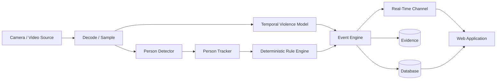

# Sentinel AI — Intelligent Web-Based CCTV Monitoring, Event Detection, and Real-Time Alert Management System

## Final Technical Report

**Course:** Advanced Web Technologies  
**Course Code:** `TBD`  
**Department:** `TBD`  
**Institution:** `TBD`  
**Academic Year:** 2026–2027  
**Team Members:** `TBD`  
**Faculty / Project Guide:** `TBD`

---

## Academic Integrity and Completion Notice

This document is structured as the final technical report for Sentinel AI, but the project is still in the design/implementation phase at the time of this version.

Accordingly, the report distinguishes between:

```text
CONFIRMED DESIGN
PROPOSED DESIGN
TBD DECISION
NOT_YET_IMPLEMENTED
NOT_YET_TESTED
NOT_YET_MEASURED
```

The following shall **not** be replaced by plausible values before evidence exists:

- final integrated-system accuracy/performance claims not backed by retained evidence;
- detector/tracker metrics not yet measured;
- final raw-video violence latency/FPS;
- event-to-client latency;
- final hardware/deployment configuration;
- screenshots of unimplemented features;
- number of passing tests not actually executed;
- deployment success not actually demonstrated.

A preliminary model-level violence result now exists and may be reported only with its exact task, frozen dataset split, reference-feature input, and runtime-qualification limitation.

The final submitted version must be updated using the authoritative engineering documents and actual implementation/test artifacts.

---

# Abstract

Conventional CCTV systems primarily support passive video observation and post-event review, placing substantial monitoring burden on human operators. Sentinel AI is proposed as an intelligent web-based CCTV monitoring and event-management system that combines computer-vision perception, deterministic surveillance rules, temporal violence/fighting analysis, persistent event records, evidence management, real-time web notifications, operator acknowledgement, search, and analytics in a unified web application.

The system is deliberately designed so that artificial intelligence is a perception subsystem rather than the sole decision-making mechanism. A pretrained person detector provides person observations, a multi-object tracker associates observations over time, and deterministic domain rules evaluate restricted-area intrusion, loitering, and crowd-threshold conditions. Violence/fighting is handled through a separate temporal video-analysis model. Camera-offline detection is treated as system-health monitoring rather than a machine-learning task. The backend architecture uses a FastAPI modular monolith with a separate AI worker, while the frontend provides live/replayed source monitoring, polygonal zone configuration, rule management, event review, evidence inspection, acknowledgement, history, and analytics.

The engineering process emphasizes formal requirements, traceability, reproducibility, security, privacy, and responsible AI use. Facial recognition, persistent identity tracking, autonomous punitive decisions, and online self-training are explicitly excluded from the MVP. Evaluation is designed to separately measure model quality, tracking behavior, deterministic rule correctness, operational false alerts, inference performance, and end-to-end event delivery. A preliminary model-level evaluation has now been completed for a BiGRU + Temporal Attention Fighting-vs-Normal classifier trained on frozen XD-Violence pre-extracted I3D RGB feature splits. The held-out reference-feature test result is reported in Section 20. These results do not yet represent final raw-video system performance because runtime feature-extractor compatibility and end-to-end worker integration remain incomplete.

**Keywords:** CCTV monitoring, FastAPI, computer vision, object detection, multi-object tracking, violence detection, event detection, WebSocket, surveillance analytics, responsible AI.

---

# 1. Introduction

## 1.1 Background

Video-surveillance systems are widely used for security monitoring in campuses, workplaces, transport facilities, public spaces, warehouses, and other operational environments. Conventional CCTV infrastructure is effective at capturing video but often depends heavily on a human operator continuously watching multiple streams or reviewing stored footage after an event.

The practical difficulty is not only recording more video. It is converting large volumes of visual information into timely and reviewable operational events.

Research in surveillance-video understanding has therefore explored automated anomaly recognition, violence detection, person detection, and multi-object tracking. Examples include UCF-Crime for real-world anomaly detection [8], XD-Violence for large-scale multimodal violence detection [9], COCO for general object-detection research [10], and MOTChallenge datasets for tracking evaluation [11].

Sentinel AI applies these ideas within a web-engineering context. Its principal contribution is not a new foundation model. Instead, it integrates computer vision with a structured web application, event workflow, persistent evidence, configurable spatial rules, real-time notifications, and operator review.

## 1.2 Problem Statement

Traditional CCTV monitoring presents several operational limitations:

1. continuous observation of many video feeds is cognitively demanding;
2. potentially relevant events may be noticed late or missed;
3. recordings alone do not provide structured incident/event records;
4. searching historical video is less efficient than querying structured event metadata;
5. static monitoring systems often do not provide configurable spatial rules such as virtual restricted areas;
6. AI-only demonstrations may detect objects but lack user workflows, persistent state, auditability, evidence review, and failure handling.

The project therefore addresses the following problem:

> How can a web-based CCTV monitoring system combine AI-assisted visual perception, deterministic security rules, persistent event/evidence management, and real-time operator interaction while remaining technically feasible, transparent, reproducible, and privacy-conscious within an academic project timeline?

## 1.3 Motivation

The motivation for Sentinel AI is to demonstrate how modern web technologies can act as the operational layer around a computer-vision pipeline.

The project emphasizes:

- web architecture;
- REST APIs;
- real-time communication;
- authentication and authorization;
- interactive graphics;
- database persistence;
- event lifecycle;
- evidence delivery;
- analytics;
- AI-service integration;
- security;
- responsible use of surveillance data.

This makes Sentinel AI particularly suitable for an Advanced Web Technologies course because the AI model is integrated into a broader web system instead of being treated as an isolated notebook demonstration.

---

# 2. Project Objectives

## 2.1 Primary Objective

To design and implement a web-based intelligent CCTV monitoring system that transforms selected AI observations and deterministic monitoring conditions into persistent, reviewable, and actionable operator events.

## 2.2 Specific Objectives

The project aims to:

1. detect persons using a pretrained object detector;
2. maintain temporary person tracks across video frames;
3. allow administrators to draw polygonal monitoring zones;
4. detect restricted-area intrusion through deterministic geometry and transition rules;
5. detect loitering through track dwell-time evaluation;
6. detect crowd-threshold conditions using person-counting logic;
7. detect violence/fighting using temporal video analysis;
8. detect camera/source offline conditions through health monitoring;
9. generate persistent event records;
10. create evidence snapshots and/or short clips where available;
11. notify connected web clients of new events;
12. allow operators to acknowledge events;
13. provide event history, filtering, and evidence review;
14. provide event analytics;
15. protect sensitive CCTV/evidence data;
16. avoid facial recognition and persistent biometric identity;
17. maintain requirements-to-test traceability;
18. produce reproducible AI/model evaluation records.

---

# 3. Scope

## 3.1 MVP Scope

The confirmed MVP capabilities are:

| Capability | Method | Scope |
|---|---|---|
| Person detection | pretrained object detector | MVP |
| Person tracking | multi-object tracker | MVP |
| Restricted-area intrusion | detector + tracker + polygon rule | MVP |
| Loitering | tracking + dwell-time rule | MVP |
| Crowd threshold | person count + threshold rule | MVP |
| Violence/fighting | temporal video model | MVP |
| Camera offline | system health monitoring | MVP |
| Alert/event creation | backend event engine | MVP |
| Evidence | snapshot/short clip | MVP |
| Operator acknowledgement | web workflow | MVP |
| Event history/search | web + database | MVP |
| Analytics | web dashboard | MVP |

## 3.2 Explicitly Deferred

The following are not required for the MVP:

- fall detection;
- fire/smoke detection;
- general sound anomaly detection;
- SMS/email notification;
- mobile/PWA deployment;
- multi-site monitoring;
- cloud-scale multi-camera deployment;
- advanced model serving infrastructure.

## 3.3 Explicitly Rejected

The following are rejected from the current scope:

- facial recognition;
- named-person identification;
- cross-camera biometric identity;
- demographic or sensitive-attribute inference;
- automatic criminality assessment;
- autonomous punitive action;
- online self-training from operator feedback.

---

# 4. Existing Systems and Literature Review

## 4.1 Conventional CCTV Systems

Traditional CCTV systems primarily provide:

- live video viewing;
- recording;
- playback;
- basic motion detection;
- manual export.

Their principal limitation is that operational understanding still depends heavily on human interpretation.

## 4.2 Object Detection

Modern object-detection systems can detect general visual classes including people. COCO is a major benchmark and dataset for object detection, segmentation, and related tasks [10]. Sentinel AI plans to use pretrained person-detection capability rather than training a general detector from random initialization.

The detector's output is not directly treated as an alert. It is an observation that can be consumed by tracking and deterministic rules.

## 4.3 Multi-Object Tracking

Multi-object tracking associates detections over time. Algorithms such as ByteTrack [12] and BoT-SORT [13] are candidate approaches. Tracking provides the temporal continuity required for:

- entry-transition detection;
- loitering duration;
- crowd counting based on active tracks.

Track IDs are temporary computational identifiers and are not personal identity.

## 4.4 Video Anomaly Detection

Sultani, Chen, and Shah introduced a large-scale real-world anomaly-detection dataset containing long untrimmed surveillance videos across several anomaly categories, including Fighting [8].

UCF-Crime is therefore a candidate secondary dataset for Sentinel's violence-related research, although its task formulation is broader than fighting-only classification.

## 4.5 XD-Violence

Wu et al. introduced XD-Violence, a large-scale violence-detection dataset with 217 hours and 4,754 untrimmed videos, weak labels, audio, and multiple violent categories including Fighting [9].

The official project also provides pre-extracted I3D visual features and VGGish audio features. These are relevant to feasibility because they may reduce the computational cost of a student-project baseline.

## 4.6 Tracking Benchmarks

MOT17 is a pedestrian multi-object tracking benchmark from MOTChallenge [11]. It is optional for Sentinel because operational tracking tests on project-controlled videos may be more directly relevant to rule behavior.

## 4.7 Requirements Engineering

The project's requirements process follows principles inspired by ISO/IEC/IEEE 29148:2018 [1], using:

- unambiguous requirement IDs;
- normative "shall" statements;
- acceptance criteria;
- verification methods;
- traceability.

The 2018 edition remains a published standard; a later edition is under development at the time of this report draft.

## 4.8 Web Security Guidance

The security design draws on:

- OWASP ASVS 5.0.0 [4];
- OWASP Top 10:2025 [5];
- OWASP API Security Top 10:2023 [6];
- OWASP WebSocket Security guidance [7].

These references are used as engineering guidance. Sentinel AI does not claim formal OWASP certification.

## 4.9 Responsible AI

NIST AI RMF 1.0 [3] is used as a voluntary risk-management reference for:

- validity and reliability;
- transparency;
- accountability;
- privacy;
- security and resilience;
- monitoring and human oversight.

---

# 5. Requirements Engineering

## 5.1 Requirements Specification

The complete SRS is maintained separately in:

```text
02-srs.md
```

It currently contains 155 formally identified requirements covering:

- functional requirements;
- AI/ML requirements;
- non-functional requirements.

## 5.2 Requirement Families

Functional families include:

```text
FR-AUTH
FR-USER
FR-CAM
FR-ZONE
FR-DET
FR-TRK
FR-RULE
FR-INT
FR-LOIT
FR-CROWD
FR-VIO
FR-EVT
FR-ALT
FR-EVD
FR-HIST
FR-ANL
FR-AUD
FR-UI
FR-INTG
FR-CFG
FR-DEMO
```

AI/ML requirements include:

```text
MLR-MOD
MLR-DATA
MLR-DET
MLR-TRK
MLR-VIO
MLR-INF
MLR-EXP
MLR-LIC
```

Non-functional requirements include:

```text
NFR-SEC
NFR-PERF
NFR-REL
NFR-PRIV
NFR-MAINT
NFR-TEST
NFR-USAB
NFR-OBS
NFR-COMPAT
NFR-DATA
NFR-ACAD
```

## 5.3 Traceability

The master traceability matrix is maintained in:

```text
15-requirements-traceability.md
```

Its purpose is to establish:

```text
Requirement
→ Use Case
→ Design
→ Implementation Area
→ Test
→ Evidence
→ Verification Status
```

At the time of this report draft, verification status remains:

```text
NOT_YET_VERIFIED
```

until actual test execution exists.

---

# 6. Use-Case Model

## 6.1 Actors

Proposed human actors:

- Administrator
- Operator
- Reviewer/Supervisor

System actors:

- AI Worker
- Camera/Video Source
- Health Monitoring Process

## 6.2 Major Use Cases

The system supports use cases for:

- authentication;
- camera management;
- camera-health monitoring;
- zone creation/editing;
- intrusion rule configuration;
- loitering rule configuration;
- crowd rule configuration;
- live monitoring;
- event review;
- evidence review;
- acknowledgement;
- historical search;
- analytics;
- AI inference;
- failure recovery.

The full use-case specification appears in:

```text
03-use-case-specification.md
```

---

# 7. Proposed System

## 7.1 Conceptual Pipeline



## 7.2 Design Principle

Sentinel AI deliberately separates:

```text
Detection
Tracking
Event
Alert
```

### Detection

A model observation such as:

```text
person bounding box
```

### Track

Temporary association of a detected object across frames.

### Event

A persisted semantic condition such as:

```text
restricted-area intrusion
```

### Alert

The operator-facing presentation of an event requiring attention.

This separation prevents low-level model output from being treated as meaningful security judgement without domain logic.

---

# 8. System Architecture

## 8.1 Architecture Style

The confirmed architecture is:

```text
FastAPI modular monolith
+
separate AI worker
```

This approach was selected to balance:

- separation of concerns;
- simplicity;
- development speed;
- testability;
- fault isolation;
- clear AI/web boundaries.

Microservices are not required for the MVP.

## 8.2 Backend

The backend is implemented/planned using FastAPI [2].

Conceptual backend modules:

```text
core
auth
users
cameras
zones
rules
events
alerts
evidence
analytics
audit
ai_integration
shared
```

## 8.3 AI Worker

The worker is responsible for:

- source decoding;
- frame sampling;
- preprocessing;
- person detection;
- tracking;
- violence-model inference;
- model health;
- typed AI result output.

It does not own:

- authentication;
- event acknowledgement;
- operator workflow;
- persistent event truth.

## 8.4 Frontend

Frontend framework:

```text
TBD
```

The frontend shall consume the backend API and real-time channel.

## 8.5 Database

Current candidate:

```text
PROPOSED: PostgreSQL
```

The relational design is event-centric.

## 8.6 Evidence Storage

Exact media backend:

```text
TBD
```

Current candidate for the academic MVP:

```text
protected local filesystem storage
```

## 8.7 Real-Time Transport

Current proposal:

```text
WebSocket
```

The final transport is not considered baselined until accepted and implemented.

---

# 9. Database Design

## 9.1 Data Model Principles

The proposed relational design follows these principles:

- stable IDs;
- foreign-key integrity;
- event-centric storage;
- separate event-specific contexts;
- evidence metadata separated from media;
- model provenance stored;
- no persistent face identity;
- no full per-frame detection history by default.

## 9.2 Core Entities

Potential entities include:

```text
users
roles
user_roles
cameras
camera_health_history
zones
zone_vertices
rules
events
event context tables
event_acknowledgements
event_feedback
evidence_items
models
model_versions
audit_log
```

## 9.3 Detection and Event Separation

Sentinel does not require every frame-level detection to be persisted.

Instead:

```text
AI observation
→ rule/model criterion
→ persistent event
```

This reduces unnecessary storage and keeps the database focused on operational history.

## 9.4 Evidence

Evidence metadata is proposed to include:

- evidence ID;
- event ID;
- type;
- status;
- storage key;
- timestamps;
- optional checksum.

Actual media should remain outside normal public static access.

---

# 10. API Design

## 10.1 API Style

Proposed:

```text
REST-style HTTP API
+
WebSocket event channel
```

Base path:

```text
PROPOSED: /api/v1
```

## 10.2 Response Envelopes

Success:

```json
{
  "data": {}
}
```

Collection:

```json
{
  "data": [],
  "meta": {}
}
```

Error:

```json
{
  "error": {
    "code": "ERROR_CODE",
    "message": "Safe message",
    "details": {},
    "request_id": "..."
  }
}
```

## 10.3 Major Resources

Proposed resource groups:

```text
health
auth
cameras
zones
rules
events
evidence
analytics
models
```

## 10.4 Event Creation

The normal public frontend shall not create arbitrary security events.

Events originate from:

- rule engine;
- AI/model policy;
- system health.

## 10.5 Real-Time Events

Proposed WebSocket message types:

```text
event.created
event.updated
event.acknowledged
camera.health_changed
system.degraded
```

The persistent database remains authoritative after reconnect.

---

# 11. AI/ML Methodology

## 11.1 AI Scope

The AI subsystem is used for perception, not unrestricted decision-making.

## 11.2 Person Detection

Strategy:

```text
pretrained detector
→ Sentinel-relevant evaluation
→ optional fine-tuning only if needed
```

Exact detector:

```text
TBD
```

Candidate families include modern YOLO variants and Torchvision detectors.

## 11.3 Tracker

Exact tracker:

```text
TBD
```

Candidate approaches include ByteTrack and BoT-SORT.

Track IDs are temporary.

## 11.4 Intrusion Position

Current proposal:

```text
bounding-box bottom-center
```

For normalized box:

```text
x = (x_min + x_max) / 2
y = y_max
```

This approximates a person's contact point with the ground plane.

Status:

```text
PROPOSED
```

## 11.5 Restricted-Area Intrusion

Conceptual state:

```text
outside
→ inside
→ candidate intrusion event
```

Duplicate suppression prevents event creation on every frame.

## 11.6 Loitering

Conceptual logic:

```text
track enters zone
→ store entered_at
→ remain in zone
→ dwell time >= configured threshold
→ event
```

Exact grace/reset/retrigger semantics remain `TBD`.

## 11.7 Crowd Threshold

Current proposed method:

```text
count active qualifying person tracks inside zone
```

Exact counting method remains `TBD`.

## 11.8 Camera Offline

Camera offline is not an ML task.

It is based on system-health conditions such as:

- connection state;
- absence of frames;
- decode failure.

Exact time criterion remains `TBD`.

---

# 12. Violence/Fighting Model Methodology

## 12.1 Current experimental task

The completed model-level baseline uses:

```text
binary temporal classification:
Fighting
vs
Normal
```

This is a deliberately narrow derived task from XD-Violence. Other violent/anomaly categories are excluded from this baseline and are not covered by its reported metrics.

## 12.2 Temporal input and feature representation

`EXP-VIO-TEMPORAL-001` is feature-based.

```text
XD-Violence pre-extracted I3D RGB temporal feature tensor
→ temporal sequence model
```

Observed reference features use a 2,048-dimensional I3D representation and include a reference crop axis. The model does not decode raw frames during training/evaluation.

The exact raw-video sampling, decode mode, crop policy, and temporal chunk construction required to recreate compatible reference features are being validated separately under `EXP-VIO-RUNTIME-COMPAT-001`.

## 12.3 Implemented architecture

The current experimental temporal classifier is:

```text
I3D RGB feature sequence
→ Bidirectional GRU
→ Temporal Attention
→ binary classifier
```

Recorded properties:

```text
trainable parameters = 822,530
configured epochs = 8
best epoch = 3
positive-class weight = 5.417
```

The architecture is accepted as an **experimental model baseline**, not yet as the final deployable violence worker.

## 12.4 Dataset decision

Current primary source:

```text
XD-Violence pre-extracted I3D RGB features
```

Current derived dataset:

```text
DATA-DERIVED-XD-FIGHTING-BINARY-V1
```

UCF-Crime remains a secondary option and is deferred unless needed. RWF-2000 remains rejected for the current plan unless legitimate official access changes.

## 12.5 Training and evaluation policy

The model is trained by Sentinel on **pre-extracted pretrained visual features**. It shall therefore be described as a feature-based temporal classifier, not as an end-to-end I3D model trained from scratch.

The classifier threshold used for the experiment was selected on the validation split. The held-out test split is reserved for reporting the frozen experiment result.

## 12.6 Runtime qualification

A deployable raw-video path additionally requires:

```text
raw video
→ runtime I3D extractor
→ feature representation compatible with training reference
→ BiGRU + temporal attention classifier
```

Current runtime compatibility status:

```text
NOT_YET_QUALIFIED
```

Exact crop/decode diagnostics have not yet established feature equivalence. Therefore the measured model-level result must not be presented as final live-CCTV performance.

---

# 13. Dataset Governance

## 13.1 Provenance

Every used dataset must trace:

```text
Original Source
→ Acquisition Record
→ Checksum
→ Dataset ID
→ Derived Dataset
→ Split Manifest
→ Experiment
→ Model
```

## 13.2 Current Dataset Registry Status

| Dataset | Current Status |
|---|---|
| Sentinel controlled demo/test videos | `NOT_YET_REGISTERED` |
| XD-Violence parent/source identity | `ACQUIRED_UNVERIFIED` — I3D RGB feature files obtained/used; checksum/terms record still incomplete |
| `DATA-DERIVED-XD-FIGHTING-BINARY-V1` | `ACTIVE` — frozen Fighting-vs-Normal feature split used by `EXP-VIO-TEMPORAL-001` |
| UCF-Crime | `NOT_YET_ACQUIRED / DEFERRED_UNLESS_NEEDED` |
| MOT17 | `NOT_YET_ACQUIRED` |
| COCO 2017 | `PRETRAINED_PROVENANCE_ONLY` |
| RWF-2000 | `REJECTED_FOR_CURRENT_PLAN` |

Current derived split:

| Split | Normal | Fighting | Total |
|---|---:|---:|---:|
| Train | 1,636 | 302 | 1,938 |
| Validation | 410 | 75 | 485 |
| Test | 300 | 107 | 407 |

The split-manifest path/hash and acquisition checksum/terms fields remain to be finalized in `10-dataset-registry.md`.

## 13.3 Dataset Split Discipline

Formal model evaluation requires separation among:

```text
train
validation
test
```

Video windows derived from the same source video should not leak across train and test when that would compromise independence.

---

# 14. User Interface and User Experience

## 14.1 Information Architecture

Core navigation:

```text
Dashboard
Live View
Events
Cameras
Rules
Analytics
```

Potential lower-priority pages:

```text
AI Models
Audit Log
Settings
```

## 14.2 Dashboard

The dashboard should summarize:

- unacknowledged events;
- recent events;
- camera health;
- offline cameras;
- event trends.

## 14.3 Live View

The Live View combines:

- selected camera/video;
- zone overlays;
- optional person/track overlays;
- health;
- active rules;
- recent events.

Recorded test footage shall not be labelled as live CCTV.

## 14.4 Zone Editor

A major web-technology feature is interactive polygon definition over a camera frame.

Proposed rendering:

```text
SVG overlay
```

Normalized geometry allows the polygon to remain aligned after resizing.

## 14.5 Event Review

The event-detail page should show:

- event type;
- camera;
- time;
- context;
- evidence;
- acknowledgement;
- relevant model/rule metadata.

## 14.6 Evidence

Evidence states:

```text
Pending
Available
Failed
Deleted
```

An event remains valid even if evidence generation fails.

## 14.7 Analytics

Analytics may include:

- event trend;
- events by type;
- events by camera;
- acknowledgement summary.

No placeholder/random data is allowed in the final integrated mode.

---

# 15. Security and Privacy

## 15.1 Security Objectives

The design protects:

- credentials;
- camera configuration;
- event records;
- evidence;
- user data;
- model artifacts;
- logs.

## 15.2 Trust Boundaries

Major boundaries include:

```text
Browser ↔ Backend
Worker ↔ Backend
Video Source ↔ Worker
Backend ↔ Database
Backend ↔ Evidence Storage
Model Artifact ↔ Worker
```

## 15.3 Authentication

Exact mechanism:

```text
TBD
```

The system nevertheless requires server-side authenticated identity for protected operations.

## 15.4 Authorization

Server-side authorization is mandatory.

The backend must enforce:

- object-level access;
- function-level access;
- mutable-property restrictions.

Frontend route hiding is not a security control.

## 15.5 Secrets

Secrets shall not be committed to Git.

A `.env.example` may contain placeholders only.

## 15.6 Evidence Protection

Evidence access shall require authorization.

Evidence IDs shall not map directly to unrestricted filesystem paths.

## 15.7 WebSocket Security

If WebSocket is used:

- authenticate connection;
- validate Origin;
- validate messages;
- bound message/resource usage;
- use WSS when externally exposed.

## 15.8 Privacy

Sentinel explicitly rejects facial recognition.

Video is treated as potentially identifying even without face matching.

## 15.9 Data Minimization

The project avoids persisting:

- every raw frame;
- every track indefinitely;
- biometric embeddings.

Event-level context and short evidence are preferred.

---

# 16. Implementation Plan and Module Structure

## 16.1 Backend

Planned:

```text
backend/app/
├── core/
├── modules/
│   ├── auth/
│   ├── users/
│   ├── cameras/
│   ├── zones/
│   ├── rules/
│   ├── events/
│   ├── evidence/
│   ├── analytics/
│   └── ai_integration/
└── shared/
```

Actual implementation state:

```text
NOT_YET_REPORTED_IN_THIS_DOCUMENT
```

## 16.2 AI Worker

Planned:

```text
ai_worker/src/
├── input/
├── preprocess/
├── detection/
├── tracking/
├── violence/
├── schemas/
├── model_registry/
├── pipeline/
├── health/
└── adapters/
```

Actual implementation state:

```text
NOT_YET_REPORTED
```

## 16.3 Frontend

Planned framework-neutral structure:

```text
frontend/src/
├── app/
├── pages/
├── components/
├── features/
├── api/
├── realtime/
├── auth/
├── hooks/
└── styles/
```

Actual framework:

```text
TBD
```

---

# 17. First Vertical Slice

The highest-priority integrated milestone is:

```text
Video
→ Person Detection
→ Track
→ Restricted Zone Entry
→ Rule Evaluation
→ Persistent Event
→ Evidence State
→ Real-Time Frontend Notification
→ Event Detail
→ Acknowledgement
→ Refresh
→ Persisted Acknowledgement
```

This vertical slice is deliberately prioritized before implementing every individual feature in isolation.

---

# 18. Testing and Verification Strategy

## 18.1 Test Levels

Sentinel uses/plans:

```text
Unit
Module
Database
API
Contract
AI Worker
Model Evaluation
Frontend
Real-Time
Security
Performance
Recovery
End-to-End
Manual Acceptance
```

## 18.2 Deterministic Rule Testing

Dedicated tests exist/planned for:

- point-in-polygon;
- intrusion transitions;
- loitering timing;
- crowd threshold;
- camera offline;
- duplicate suppression.

## 18.3 API Testing

API verification covers:

- schema;
- status codes;
- response envelope;
- errors;
- filtering;
- pagination;
- authorization.

## 18.4 AI Worker Testing

Worker verification covers:

- structured person results;
- valid empty detections;
- tracking output;
- violence result;
- model failure;
- malformed output.

## 18.5 Frontend Testing

Frontend verification covers:

- loading;
- empty;
- error;
- disconnected;
- acknowledgement;
- polygon editing;
- evidence;
- responsive behavior.

## 18.6 Security Testing

Planned security tests cover:

- authentication;
- authorization;
- mass assignment;
- injection;
- XSS;
- path traversal;
- SSRF if remote URLs are accepted;
- evidence access;
- WebSocket security;
- worker contract validation;
- secret scanning/review.

## 18.7 Golden End-to-End Test

Mandatory final acceptance:

```text
controlled video
→ intrusion
→ persistent event
→ frontend
→ acknowledgement
→ persisted acknowledgement
```

---

# 19. Model Evaluation Methodology

## 19.1 Person Detector

Potential metrics:

```text
Precision
Recall
mAP@0.5
mAP@0.5:0.95
Inference Latency
Processed FPS
```

Only applicable metrics with valid ground truth shall be reported.

## 19.2 Tracker

Potential:

```text
IDF1
HOTA
MOTA
ID switches
Track losses
Operational continuity
```

Formal MOT benchmark is optional.

## 19.3 Violence Model

Required where applicable:

```text
Precision
Recall
F1
Confusion Matrix
```

Optional:

```text
ROC-AUC
PR-AUC
```

## 19.4 Threshold Selection

Thresholds shall be selected using validation/calibration data rather than final test data.

## 19.5 Performance

Performance shall distinguish:

```text
model inference latency
worker pipeline latency
processed FPS
event-to-client latency
```

---

# 20. Results

## 20.1 Current Results Status

At the time of this report update:

```text
Detector selected: NO
Tracker selected: NO
Violence model-level baseline trained: YES — EXP-VIO-TEMPORAL-001
Violence model-level held-out evaluation completed: YES
Violence raw-video runtime qualification completed: NO
Violence model approved for final integrated demo: NO
Golden E2E test completed: NOT_YET_VERIFIED
Final security review completed: NO
Final integrated performance benchmark completed: NO
```

The violence result below is a Sentinel-measured result, not an external benchmark value. It is tied specifically to the frozen XD-Violence Fighting-vs-Normal **reference-feature** split.

## 20.2 Detector Results

| Metric | Result |
|---|---:|
| Precision | `NOT_YET_MEASURED` |
| Recall | `NOT_YET_MEASURED` |
| mAP@0.5 | `NOT_YET_MEASURED` |
| mAP@0.5:0.95 | `NOT_YET_MEASURED` |
| Median inference latency | `NOT_YET_MEASURED` |
| Processed FPS | `NOT_YET_MEASURED` |

## 20.3 Tracker Results

| Metric | Result |
|---|---:|
| IDF1 | `NOT_YET_MEASURED` |
| HOTA | `NOT_YET_MEASURED` |
| MOTA | `NOT_YET_MEASURED` |
| ID switches | `NOT_YET_MEASURED` |
| Track losses | `NOT_YET_MEASURED` |
| Median tracker overhead | `NOT_YET_MEASURED` |

## 20.4 Violence Model Results — `EXP-VIO-TEMPORAL-001`

### Validation result

| Metric | Result |
|---|---:|
| Accuracy | 0.9588 |
| Precision | 0.9231 |
| Recall | 0.8000 |
| F1-score | 0.8571 |
| ROC-AUC | 0.95584 |
| PR-AUC | 0.89096 |
| Validation-selected threshold | 0.8346 |

### Held-out test result

| Metric | Result |
|---|---:|
| Accuracy | 0.94595 |
| Balanced accuracy | 0.90922 |
| Precision | 0.95699 |
| Recall | 0.83178 |
| Specificity | 0.98667 |
| F1-score | 0.8900 |
| ROC-AUC | 0.98156 |
| PR-AUC | 0.94488 |
| TN | 296 |
| FP | 4 |
| FN | 18 |
| TP | 89 |
| Raw-video inference latency | `NOT_YET_MEASURED` |

Interpretation:

The classifier produced high held-out discrimination on the frozen Fighting-vs-Normal reference-feature split, with only four false positives but eighteen false negatives. The recall of 0.83178 therefore remains an important limitation even before runtime-domain effects are considered.

These values are **not final integrated-system metrics**. `EXP-VIO-RUNTIME-COMPAT-001` has not yet established that raw-video runtime extraction reproduces the reference feature representation used to obtain these results.

## 20.5 End-to-End Results

| Test | Result |
|---|---|
| Golden intrusion flow | `NOT_YET_EXECUTED` |
| Event persistence | `NOT_YET_VERIFIED` |
| Evidence generation | `NOT_YET_VERIFIED` |
| Acknowledgement persistence | `NOT_YET_VERIFIED` |
| Camera offline behavior | `NOT_YET_VERIFIED` |
| Worker degraded behavior | `NOT_YET_VERIFIED` |
| Real-time reconnect | `NOT_YET_VERIFIED` |
| Event-to-client latency | `NOT_YET_MEASURED` |

---

# 21. Required Final Figures and Screenshots

The completed report should add implementation screenshots only after the feature exists.

Required/Recommended figures:

```text
Figure 1 — System Architecture
Figure 2 — AI Pipeline
Figure 3 — Database ER Diagram
Figure 4 — Dashboard
Figure 5 — Live View
Figure 6 — Zone Editor
Figure 7 — Rule Configuration
Figure 8 — Event Detail
Figure 9 — Evidence Viewer
Figure 10 — Analytics
Figure 11 — Violence Confusion Matrix
Figure 12 — Performance / Latency Result
```

Do not use AI-generated fake UI screenshots as implementation evidence.

---

# 22. Discussion

## 22.1 Strength of the Architecture

The central architectural strength of Sentinel AI is the separation of AI perception from deterministic domain logic.

This gives several benefits:

- easier testing;
- more interpretable event criteria;
- configurable rules;
- clearer failure diagnosis;
- reduced model-training burden;
- improved academic transparency.

## 22.2 Why a Modular Monolith

A modular monolith provides sufficient separation without adding operational complexity associated with microservices.

The AI worker remains separate because model dependencies, resource use, and failure behavior differ substantially from standard web requests.

## 22.3 Why Deterministic Rules Matter

Intrusion, loitering, and crowd thresholds are naturally expressible as geometry, state, and timing rules.

Training separate neural networks for these conditions would:

- reduce interpretability;
- increase dataset requirements;
- increase training burden;
- complicate verification.

## 22.4 Web-Technology Contribution

The project demonstrates Advanced Web Technologies through:

- API design;
- browser-based real-time updates;
- interactive SVG geometry;
- stateful event workflow;
- authorization;
- evidence delivery;
- analytics;
- responsive interface;
- async error/reconnect states.

## 22.5 Responsible AI Contribution

Sentinel avoids implying that model outputs prove intent, identity, or wrongdoing.

This is particularly important because surveillance AI can easily be presented with greater certainty than the underlying model supports.

---

# 23. Limitations

The final report must update this section after testing.

Current anticipated limitations include:

## 23.1 Detector Domain Shift

Performance may degrade for:

- low light;
- distant people;
- occlusion;
- unusual camera angles.

## 23.2 Tracking Instability

Track fragmentation may affect:

- loitering timers;
- crowd counts;
- zone-transition behavior.

## 23.3 Violence Ambiguity

Violence/fighting classification can confuse:

- sports;
- rapid gestures;
- crowd movement;
- low-quality motion.

## 23.4 Weak Dataset Labels

Some violence datasets use weak/video-level labels, which may not precisely identify the temporal location of an action.

## 23.5 Compute Constraints

Video models may be constrained by:

- CPU/GPU availability;
- memory;
- processed frame rate.

## 23.6 Academic Prototype Scope

The system is not intended to claim:

- 24/7 production reliability;
- large multi-camera scalability;
- legal evidentiary reliability;
- public-internet security certification.

## 23.7 Privacy

Even without facial recognition, CCTV footage may identify individuals visually.

This requires controlled evidence access and data minimization.

---

# 24. Future Work

Potential future extensions include:

1. improved evidence-retention management;
2. advanced event lifecycle/incident management;
3. additional validated event types;
4. fire/smoke detection;
5. fall detection;
6. optional multimodal audio-supported violence analysis;
7. mobile/PWA interface;
8. multi-site architecture;
9. object storage;
10. production reverse proxy/TLS;
11. richer audit features;
12. advanced operational analytics;
13. better model calibration;
14. domain-specific detector fine-tuning;
15. formal tracker benchmarking;
16. scalable model serving.

Facial recognition is not automatically considered desirable future work and would require separate ethical/privacy justification.

---

# 25. Conclusion

Sentinel AI is designed as an integrated web-based CCTV monitoring and event-management system in which computer vision assists perception while deterministic software and human review retain central roles in operational decision-making.

The proposed system combines:

- person detection;
- temporary multi-object tracking;
- configurable polygon zones;
- intrusion detection;
- loitering detection;
- crowd-threshold detection;
- temporal violence/fighting analysis;
- camera-health monitoring;
- persistent event/evidence records;
- real-time web notification;
- acknowledgement;
- history;
- analytics;
- security/privacy controls.

The architecture intentionally avoids unnecessary microservices, facial recognition, and opaque one-model-for-everything design. Requirements, datasets, models, API contracts, database structures, test plans, and security controls are documented as separate authoritative artifacts and connected through a formal traceability matrix.

**Final implementation conclusion:**

```text
TO_BE_WRITTEN_AFTER_IMPLEMENTATION_AND_FINAL_TESTING
```

The final conclusion must state only what was actually implemented and verified.

---

# 26. Project Documentation Set

The complete Sentinel AI engineering documentation consists of:

```text
PROJECT_HANDBOOK.md
AGENTS.md
docs/01-vision-and-scope.md
docs/02-srs.md
docs/03-use-case-specification.md
docs/04-system-architecture.md
docs/05-uml-and-system-models.md
docs/06-database-design.md
docs/07-api-specification.md
docs/08-ai-ml-design.md
docs/09-dataset-acquisition.md
docs/10-dataset-registry.md
docs/11-model-card-and-evaluation.md
docs/12-ui-ux-specification.md
docs/13-security-and-privacy.md
docs/14-test-plan.md
docs/15-requirements-traceability.md
docs/16-deployment-guide.md
docs/17-operator-manual.md
docs/18-final-technical-report.md
docs/adr/
```

This report summarizes these documents but does not replace their detailed engineering authority.

---

# 27. Final Report Completion Checklist

Before submission, replace all applicable `TBD`, `NOT_YET_*`, and draft-state material.

## 27.1 Administrative

- [ ] Team member names added.
- [ ] Registration numbers added if required.
- [ ] Course code added.
- [ ] Department/institution added.
- [ ] Faculty name added.
- [ ] Submission date added.

## 27.2 Architecture

- [ ] Frontend framework final.
- [ ] Database final.
- [ ] Worker transport final.
- [ ] Evidence storage final.
- [ ] Video transport final.
- [ ] Auth final.
- [ ] Ports/deployment final.

## 27.3 AI

- [ ] Detector selected.
- [ ] Tracker selected.
- [ ] Violence architecture selected.
- [ ] Model versions recorded.
- [ ] Licenses recorded.
- [ ] Dataset IDs active.
- [ ] Splits frozen.
- [ ] Thresholds frozen.

## 27.4 Implementation

- [ ] Backend module list matches code.
- [ ] Frontend page list matches code.
- [ ] Worker pipeline matches code.
- [ ] DB schema matches migrations.
- [ ] API examples match OpenAPI.
- [ ] Screenshots added.

## 27.5 Evaluation

- [ ] Detector results measured.
- [ ] Tracker results measured.
- [ ] Violence confusion matrix generated.
- [ ] Precision/recall/F1 measured.
- [ ] Hardware recorded.
- [ ] Latency measured.
- [ ] Processed FPS measured.
- [ ] Golden E2E executed.
- [ ] Security negatives executed.
- [ ] Clean deployment test executed.

## 27.6 Academic Integrity

- [ ] No external paper metric presented as project result.
- [ ] No mock screenshot presented as implementation.
- [ ] No generated dataset count.
- [ ] No fabricated test count.
- [ ] No invented latency.
- [ ] No "real-time" claim without measurement/context.
- [ ] No "trained from scratch" claim unless true.
- [ ] No production-readiness claim.
- [ ] No facial-recognition claim.
- [ ] All external work cited.

---

# 28. Suggested Final Results Narrative Template

Replace only after real measurements exist.

> The final Sentinel AI implementation used **[DETECTOR]** with **[TRACKER]** for person-based event processing and **[VIOLENCE MODEL]** for temporal violence/fighting inference. The violence model was evaluated using **[DATASET ID]**, with the final held-out split containing **[N]** samples. At a validation-selected threshold of **[T]**, the model achieved precision **[P]**, recall **[R]**, and F1-score **[F1]**. On the documented demo hardware **[HARDWARE]**, median detector latency was **[X ms]**, violence inference latency was **[Y ms]**, and median end-to-end event-to-client latency was **[Z ms]**. The controlled golden intrusion scenario completed successfully, including event persistence, evidence state handling, frontend notification, acknowledgement, and persisted acknowledgement after refresh.
>
> **Do not retain this paragraph with placeholders in the final submitted version.**

---

# 29. Suggested Final Limitation Narrative Template

> Evaluation showed that the main observed limitations were **[OBSERVED LIMITATIONS]**. Detector errors were most frequent under **[CONDITIONS]**, tracking errors affected **[RULES]**, and the violence classifier produced false positives for **[OBSERVED CASES]** and false negatives for **[OBSERVED CASES]**. These findings indicate that Sentinel AI should be treated as an operator-assistance system rather than an autonomous security decision system.

Use only observed evidence.

---

# 30. References

[1] ISO, **ISO/IEC/IEEE 29148:2018 — Systems and software engineering — Life cycle processes — Requirements engineering**, 2018.  
https://www.iso.org/standard/72089.html

[2] FastAPI, **FastAPI Documentation**, official documentation.  
https://fastapi.tiangolo.com/

[3] National Institute of Standards and Technology, **Artificial Intelligence Risk Management Framework (AI RMF 1.0)**, NIST AI 100-1, 2023.  
https://doi.org/10.6028/NIST.AI.100-1

[4] OWASP Foundation, **Application Security Verification Standard (ASVS) 5.0.0**.  
https://owasp.org/www-project-application-security-verification-standard/

[5] OWASP Foundation, **OWASP Top 10:2025**.  
https://owasp.org/Top10/2025/

[6] OWASP Foundation, **OWASP API Security Top 10 — 2023**.  
https://owasp.org/API-Security/editions/2023/

[7] OWASP Foundation, **WebSocket Security Cheat Sheet**.  
https://cheatsheetseries.owasp.org/cheatsheets/WebSocket_Security_Cheat_Sheet.html

[8] W. Sultani, C. Chen, and M. Shah, **Real-World Anomaly Detection in Surveillance Videos**, IEEE/CVF Conference on Computer Vision and Pattern Recognition (CVPR), 2018.  
https://www.crcv.ucf.edu/research/real-world-anomaly-detection-in-surveillance-videos/

[9] P. Wu, J. Liu, Y. Shi, Y. Sun, F. Shao, Z. Wu, and Z. Yang, **Not only Look, but also Listen: Learning Multimodal Violence Detection under Weak Supervision**, European Conference on Computer Vision (ECCV), 2020.  
https://roc-ng.github.io/XD-Violence/

[10] T.-Y. Lin et al., **Microsoft COCO: Common Objects in Context**, ECCV, 2014.  
https://cocodataset.org/

[11] MOTChallenge, **MOT17 — Multiple Object Tracking Benchmark**.  
https://motchallenge.net/data/MOT17/

[12] Y. Zhang et al., **ByteTrack: Multi-Object Tracking by Associating Every Detection Box**, ECCV, 2022.  
https://arxiv.org/abs/2110.06864

[13] N. Aharon, R. Orfaig, and B.-Z. Bobrovsky, **BoT-SORT: Robust Associations Multi-Pedestrian Tracking**, 2022.  
https://arxiv.org/abs/2206.14651

[14] NIST, **Privacy Framework**, official resource.  
https://www.nist.gov/privacy-framework

[15] Ultralytics, **Ultralytics Licensing**, official resource.  
https://www.ultralytics.com/license

---

# 31. Final Report Governance Rule

> **This report may summarize the system, but it may not create project facts.**
>
> Authoritative facts must originate from:
>
> ```text
> requirements
> accepted design decision
> code
> dataset registry
> model registry
> test execution
> measured evaluation
> ```
>
> If a result cannot be traced back to evidence, it shall not appear as a completed claim in the final submission.
