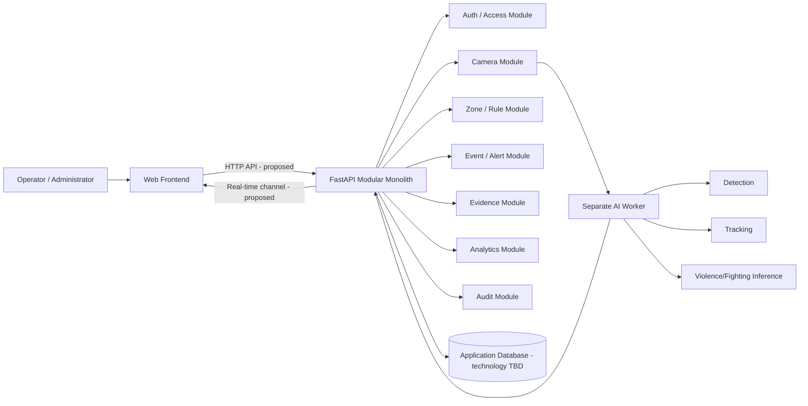
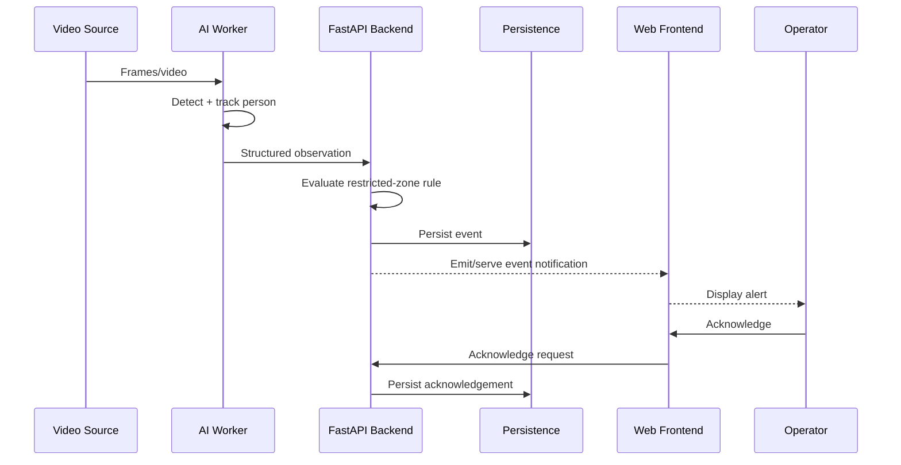
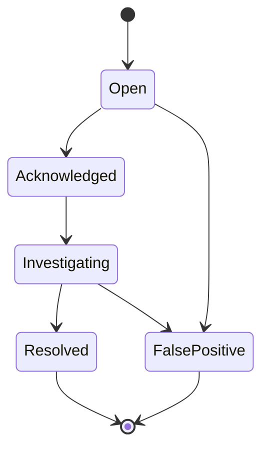

# Sentinel AI — Project Handbook

> **Document purpose:** This is the root governance and engineering handbook for the Sentinel AI project.  
> It defines the project boundary, agreed architectural baseline, documentation rules, team working model, engineering standards, AI-assistant constraints, repository conventions, quality gates, and delivery strategy.
>
> **This document is not the SRS.** Functional and non-functional requirements will be baselined separately in `docs/02-srs.md`.

---

## 0. Document Control

### 0.1 Authority

This handbook is intended to be the first document read by:

1. every project team member;
2. any new contributor;
3. any AI coding assistant such as GPT, Claude, Codex, or equivalent;
4. reviewers who need to understand how Sentinel AI is organized before reading detailed specifications.

The handbook establishes **project governance and boundaries**. It must not be used to invent detailed product requirements that belong in the SRS or implementation specifications.

### 0.2 Current review status

| Field | Value |
|---|---|
| Document status | `DRAFT_FOR_TEAM_REVIEW` |
| Architecture baseline | Partially confirmed |
| Backend framework | Confirmed: FastAPI |
| Frontend framework | `TBD` |
| Database technology | `PROPOSED`, not yet confirmed |
| AI detector implementation | `TBD` |
| Tracking implementation | `TBD` |
| Violence model architecture | `TBD` |
| Camera transport/input protocol | `TBD` |
| Deployment target | `TBD` |
| Team member ownership assignment | `TBD` |

No contributor or AI assistant may convert any `TBD` or `PROPOSED` item into an implementation assumption without an explicit project decision.

### 0.3 Controlled vocabulary for decision status

Every significant technical or product decision shall use one of the following statuses.

| Status | Meaning | Implementation rule |
|---|---|---|
| `CONFIRMED` | Explicitly accepted as part of the project baseline | May be implemented |
| `PROPOSED` | Candidate decision awaiting acceptance | May be prototyped only when clearly isolated; must not silently become baseline |
| `TBD` | Unresolved decision | Must not be guessed |
| `DEFERRED` | Valid idea deliberately postponed | Must not enter current MVP unless re-approved |
| `REJECTED` | Considered and explicitly excluded | Must not be implemented unless decision is reopened |
| `EXPERIMENTAL` | Time-boxed technical experiment | Must not alter production contracts without approval |

### 0.4 Change rule

Any change to a `CONFIRMED` item that affects requirements, architecture, API contracts, database structure, security, dataset selection, or model behavior shall:

1. be proposed in an issue or team discussion;
2. identify impacted documents;
3. receive team acceptance;
4. update or create an ADR where architectural significance warrants it;
5. update affected specifications;
6. update tests or acceptance criteria if behavior changes.

A code change alone does **not** redefine the project specification.

---

# 1. Project Identity

## 1.1 Project name

**Sentinel AI**

## 1.2 Working title

**Sentinel AI — Intelligent Web-Based CCTV Monitoring, Event Detection, and Real-Time Alert Management System**

Status: `PROPOSED_TITLE`

The title may be refined later for the final academic report without changing project scope.

## 1.3 Academic context

Sentinel AI is being developed as a project for an **Advanced Web Technologies** course.

The project intentionally combines:

- web application engineering;
- real-time client/server communication;
- video surveillance workflows;
- computer vision and machine-learning inference;
- persistent incident/event data;
- configurable rule-based event detection;
- operator interaction and acknowledgement;
- analytics and auditability.

The AI subsystem is important, but the project is **not defined solely as a machine-learning model**. Sentinel AI is a software system in which AI inference is one controlled subsystem.

## 1.4 Team size

**Three contributors.**

Individual names and ownership assignments are intentionally left `TBD` until the team assigns them explicitly.

## 1.5 Delivery window

**Maximum implementation window: approximately 2–3 weeks.**

This constraint is architectural. Features that threaten the reliable completion of the integrated MVP shall be deferred rather than allowed to destabilize the core system.

---

# 2. Problem Definition

## 2.1 Problem statement

Traditional CCTV installations primarily capture and retain video while requiring human operators to continuously observe live feeds or review recordings after an incident. Continuous observation does not scale well as the number of cameras and monitored areas increases.

Sentinel AI is intended to augment CCTV monitoring by:

1. ingesting camera/video input;
2. extracting relevant machine-readable observations;
3. tracking detected people where required;
4. evaluating configurable spatial and temporal rules;
5. applying a dedicated violence/fighting analysis capability;
6. converting qualified conditions into system events;
7. producing evidence associated with events;
8. notifying web clients of actionable events;
9. allowing operators to acknowledge and review incidents;
10. preserving event history for later investigation and analytics.

The project shall not describe the system as autonomously determining criminal intent, guilt, identity, or legal conclusions.

## 2.2 Software-engineering framing

Sentinel AI shall be treated as a **software engineering system with an AI subsystem**.

The project shall therefore prioritize:

- clear requirements;
- explicit interfaces;
- data contracts;
- modularity;
- testability;
- traceability;
- failure handling;
- human review;
- privacy and security;
- reproducibility of AI experiments;
- honest documentation of model limitations.

## 2.3 Core objective

Build and demonstrate an integrated web-based surveillance workflow in which camera/video observations are processed by a separate AI worker, converted into domain events by the application, surfaced in a web interface, and managed through an auditable operator workflow.

---

# 3. Confirmed MVP Scope

The following capability table is the current functional scope baseline.

| Capability | Mechanism | MVP status |
|---|---|---:|
| Person detection | Object detector | `CONFIRMED` |
| Person tracking | Tracking algorithm | `CONFIRMED` |
| Restricted-area intrusion | Detection + virtual zone + rule engine | `CONFIRMED` |
| Loitering | Tracking + duration rule | `CONFIRMED` |
| Crowd threshold | Detection + counting rule | `CONFIRMED` |
| Violence/fighting | Temporal video classifier/anomaly model | `CONFIRMED` |
| Camera offline | System health monitoring | `CONFIRMED` |
| Alert generation | Backend event engine | `CONFIRMED` |
| Evidence snapshots/clips | Video service | `CONFIRMED` |
| Operator acknowledgement | Web application | `CONFIRMED` |
| Incident history/search | Web + database | `CONFIRMED` |
| Analytics | Web dashboard | `CONFIRMED` |
| Fall detection | Pose/behaviour model | `DEFERRED` |
| Fire/smoke | Separate specialist detector | `DEFERRED` |
| Sound anomaly detection | Audio model | `DEFERRED` |
| SMS/email alerts | Notification adapters | `DEFERRED` |
| Mobile/PWA interface | Web technology | `DEFERRED` |
| Multiple-site monitoring | System architecture | `DEFERRED` |

## 3.1 Explicit scope rule

Deferred features must not be implemented simply because:

- a library makes them easy;
- an AI assistant suggests them;
- a dataset is discovered;
- a teammate wants to make the demo more impressive.

They may only be reopened after the confirmed MVP has reached its integration and quality gates.

## 3.2 Facial recognition

**Status: `REJECTED_FOR_MVP`**

Sentinel AI v1 shall not perform facial identification.

The project shall not maintain a biometric identity database and shall not label tracks with real-world identities.

A tracked person shall be represented using a temporary system identifier such as:

```text
track_id = 42
```

not:

```text
identity = "Person Name"
```

unless a future, separately approved project version introduces an identity subsystem after appropriate technical, ethical, privacy, and legal analysis.

---

# 4. System Concept and Domain Boundaries

## 4.1 Critical distinction: observation is not an incident

The system shall separate low-level AI observations from higher-level domain events.

Example:

```text
Object detector:
person detected

        ↓

Tracker:
track #42 persists

        ↓

Spatial logic:
track #42 enters configured restricted polygon

        ↓

Rule engine:
restricted-zone rule conditions are satisfied

        ↓

Domain event:
RESTRICTED_AREA_INTRUSION

        ↓

Alert:
event is surfaced to authorized operator

        ↓

Operator action:
acknowledge / investigate / resolve / mark false positive
```

This separation is fundamental and shall be preserved in the SRS, architecture, database design, APIs, and tests.

## 4.2 Working domain terminology

The following definitions are the current terminology baseline. They shall be validated when the SRS and domain model are baselined.

### Camera

A configured video source known to Sentinel AI.

The exact transport may be USB, network stream, file, or another supported source. The MVP input protocol remains `TBD`.

### Frame

A single image sampled from a video stream or recording.

### Detection

A machine-generated observation describing an object or class present in a frame, usually with confidence and spatial coordinates.

A detection is **not automatically an alert**.

### Track

A temporal association representing the same detected object across multiple frames.

A track identifier is operational and temporary; it is not a human identity.

### Zone

A configured region associated with a camera frame, usually represented as polygon coordinates.

Examples may include:

- restricted area;
- monitored area;
- counting region.

Exact zone types shall be defined in the SRS.

### Rule

A deterministic configuration that evaluates observations and context.

Examples:

- tracked person enters restricted polygon;
- person remains in zone beyond duration threshold;
- number of persons exceeds configured threshold.

### Event

A domain-level record representing the system's conclusion that a configured condition or model output meets an event criterion.

Examples:

- restricted-area intrusion;
- loitering;
- crowd threshold exceeded;
- violence/fighting;
- camera offline.

### Alert

A user-facing notification associated with an event.

A single event and alert relationship shall be formally defined in the SRS/database design before implementation. Do not assume one-to-one, one-to-many, or many-to-one relationships without specification.

### Evidence

Snapshot(s), clip(s), or other media/metadata preserved to support event review.

### Incident

A user-manageable operational record associated with an event or group of related events.

The exact relationship between events and incidents remains `TBD` until the SRS is baselined.

### Acknowledgement

An authenticated operator action confirming that an alert/event has been seen.

Acknowledgement does not necessarily mean the event is resolved.

### False positive

An event that was generated by the system but judged by an authorized operator not to represent the intended event class or rule condition.

### AI worker

The independently running process/service responsible for AI-related video processing and inference.

### Application/backend

The FastAPI-based modular monolith responsible for the web-facing application domain and persistence.

---

# 5. Architecture Baseline

## 5.1 Confirmed architectural style

**Status: `CONFIRMED`**

Sentinel AI shall use:

> **A modular monolith for the application/backend + a separate AI worker.**

This means:

- the main application is deployed as one logical backend application;
- domain functionality is separated into internal modules;
- the AI workload executes outside the main web request process;
- AI code shall not be scattered throughout web controllers/routes;
- boundaries between backend and AI worker shall be explicit.

## 5.2 Backend framework

**FastAPI**

Status: `CONFIRMED`

The exact FastAPI version shall be pinned during environment setup and recorded in dependency metadata. Documentation must not claim a version before the repository pins it.

## 5.3 Conceptual architecture



### Diagram status notes

- FastAPI application: `CONFIRMED`
- separate AI worker: `CONFIRMED`
- REST/HTTP API: `PROPOSED`
- WebSocket real-time channel: `PROPOSED`
- PostgreSQL: `PROPOSED`; database technology not yet baselined
- exact worker communication transport: `TBD`
- frontend technology: `TBD`

## 5.4 Architectural constraints

The backend shall not:

- execute long-running model training inside API request handlers;
- couple route functions directly to model implementation details;
- expose model files directly through public endpoints;
- allow AI worker failures to crash the entire web process;
- treat detector output as authoritative human identity;
- embed dataset acquisition logic in runtime application code.

The AI worker shall not:

- directly implement web authentication;
- directly mutate user roles;
- define frontend behavior;
- silently create new application-domain event types;
- silently create database columns;
- determine product requirements;
- bypass backend validation merely because inference produced a result.

## 5.5 Worker/application contract

The exact transport remains `TBD`, but the logical contract shall contain enough information to preserve traceability.

A future AI result payload may contain concepts such as:

```text
camera/source identifier
frame or sample timestamp
model identifier
model version
result type
object class / event class
confidence
bounding box or geometry, where relevant
track identifier, where relevant
processing timestamp
correlation identifier
```

This list is conceptual, not an approved API schema.

The approved schema shall live in:

`docs/07-api-specification.md`

or in a dedicated machine-readable contract linked by that document.

---

# 6. Why the Architecture Is Deliberately Not Microservices

The 2–3 week project window strongly favors a modular monolith.

A microservice architecture would introduce additional concerns such as:

- service discovery;
- multiple deployment units;
- distributed tracing;
- cross-service authentication;
- service-to-service error handling;
- network retries;
- independent schemas/contracts;
- operational overhead.

Those concerns do not directly improve the academic objectives of the MVP.

The AI worker is separated because AI/video workloads have meaningfully different execution characteristics from interactive web requests.

This separation is functional rather than architectural fashion.

---

# 7. AI/ML Strategy

## 7.1 General principle

Sentinel AI shall avoid training a separate neural network for every system event.

Machine learning shall be used only where it provides meaningful value.

Deterministic rules shall be preferred for events that can be reliably computed from detections, tracks, spatial geometry, time, or system health.

## 7.2 Person detection

**Mechanism:** object detector  
**Capability status:** `CONFIRMED`  
**Specific model/library:** `TBD`

Initial direction:

1. evaluate a pretrained detector capable of detecting people;
2. test on representative Sentinel footage;
3. measure errors;
4. fine-tune only if evidence shows the baseline is insufficient.

Do not train an object detector from random initialization merely to claim that the model was "trained by us."

If fine-tuning is performed, it shall be documented as transfer learning/fine-tuning.

## 7.3 Person tracking

**Mechanism:** tracking algorithm  
**Capability status:** `CONFIRMED`  
**Specific tracker:** `TBD`

The tracker shall preserve a temporary track identity across frames long enough to support rules such as loitering.

Tracking accuracy shall be evaluated sufficiently to demonstrate that rule behavior is meaningful.

## 7.4 Restricted-area intrusion

**Mechanism:** detection + tracking where required + configured virtual zone + deterministic rule.

No dedicated intrusion neural network is required for the MVP.

Conceptual flow:

```text
person detected
    ↓
track position derived
    ↓
position evaluated against configured polygon
    ↓
rule conditions checked
    ↓
event created
```

## 7.5 Loitering

**Mechanism:** tracking + zone + duration rule.

A model must not invent "suspicious intent."

Loitering in Sentinel shall mean a measurable configured condition such as:

> a tracked person remains within a configured region for longer than a configured duration.

Exact threshold semantics belong in the SRS.

## 7.6 Crowd threshold

**Mechanism:** person detection/counting + configured threshold rule.

No separate crowd neural network is required unless later evidence demonstrates a need.

The counting definition must be specified before implementation, including whether it counts:

- detections inside a region;
- active tracks;
- unique tracks during a time window;
- whole-frame detections.

This remains an SRS/design decision.

## 7.7 Violence/fighting

**Mechanism:** temporal video classifier or anomaly model.  
**Capability status:** `CONFIRMED`  
**Specific architecture:** `TBD`

Violence/fighting is treated differently because temporal context is normally necessary to distinguish motion and interaction patterns.

The selected approach shall be justified using:

- dataset fit;
- licensing/access;
- compute requirements;
- training time;
- inference latency;
- reproducibility;
- evaluation quality;
- integration complexity.

The project shall not claim that generic proximity between people is equivalent to violence.

## 7.8 Camera offline

This is a system-health capability, not an AI classification task.

The exact health criteria are `TBD` and may include one or more of:

- source connection state;
- absence of frames within a defined interval;
- repeated decode failures;
- explicit stream errors.

The SRS shall define the condition precisely.

---

# 8. Model and Dataset Governance

## 8.1 No unverified dataset provenance

A dataset shall not be used merely because it appears on a file-sharing site or Kaggle mirror.

Before use, record:

1. dataset name;
2. original authors;
3. original publication;
4. official project/publisher URL;
5. direct official acquisition route, when available;
6. mirror URL, if a mirror is unavoidable;
7. license or usage terms;
8. date accessed;
9. dataset version/release;
10. file count or archive metadata where practical;
11. checksum where practical;
12. intended Sentinel task;
13. subset used;
14. preprocessing;
15. known limitations;
16. privacy/ethical concerns;
17. whether redistribution is allowed.

## 8.2 Dataset acquisition authority

The detailed acquisition instructions shall live in:

- `docs/09-dataset-acquisition.md`
- `docs/10-dataset-registry.md`

The acquisition document answers:

> Where can the dataset legitimately be obtained, and how?

The registry answers:

> Which exact dataset release/subset did Sentinel actually use?

## 8.3 Dataset source hierarchy

Prefer sources in this order:

1. official dataset/project page;
2. original research institution;
3. official author repository;
4. official publisher archive;
5. documented authorized mirror;
6. third-party mirror only after provenance and terms are verified.

A third-party mirror must not replace the original authors/publication in academic citation.

## 8.4 Datasets shall not be committed by default

Large video/image datasets shall not be committed to Git.

Recommended local layout:

```text
data/
├── README.md
├── raw/
├── interim/
├── processed/
└── samples/
```

Recommended ignore policy:

```gitignore
data/raw/**
data/interim/**
data/processed/**
*.mp4
*.avi
*.mov
*.mkv
```

Exceptions require explicit documentation and redistribution permission.

## 8.5 Train/validation/test integrity

Once a formal evaluation split is established:

- the test split shall not be used for training;
- thresholds shall not be repeatedly tuned against the test set;
- dataset split generation shall be reproducible;
- random seeds shall be recorded where relevant;
- split manifests should be stored as text/CSV/JSON metadata when licensing allows.

## 8.6 Model provenance

Each model used in the final system shall have enough metadata to answer:

- What model is this?
- Where did its base weights come from?
- Under what license?
- What dataset was used?
- Was it trained, fine-tuned, or used as-is?
- Which code commit created it?
- Which configuration created it?
- What metrics were measured?
- On what hardware/environment?
- What are its known limitations?

## 8.7 Model registry convention

Model binaries should normally stay outside Git.

Metadata may be stored in a registry such as:

```text
models/
├── README.md
└── registry/
    ├── detector-v1.yaml
    └── violence-v1.yaml
```

Example conceptual metadata:

```yaml
model_id: "TBD"
task: "person_detection"
status: "EXPERIMENTAL"
base_model: "TBD"
weights_source: "TBD"
license: "TBD"
dataset_ids: []
training_commit: "TBD"
metrics: {}
artifact_location: "TBD"
```

The repository shall not fabricate values just to complete the file.

## 8.8 AI licensing gate

Any AI library/model considered for Sentinel shall undergo a license check before acceptance.

Example risk:

Ultralytics currently offers an AGPL-3.0 route and an Enterprise licensing route. If the project adopts an Ultralytics package/model, the team must verify the license obligations applicable to the actual repository and intended use before integration.

Therefore:

**Ultralytics/YOLO is technically a candidate, not yet a confirmed Sentinel dependency.**

The detector ADR shall record the final decision.

---

# 9. Documentation Architecture

## 9.1 Root documents

The project shall have two root governance documents.

### `PROJECT_HANDBOOK.md`

Human/project governance source of truth.

### `AGENTS.md`

Strict operating rules for AI coding assistants.

`AGENTS.md` shall not contradict this handbook. If the files conflict, the conflict must be resolved explicitly.

## 9.2 Planned documentation suite

```text
docs/
├── 01-vision-and-scope.md
├── 02-srs.md
├── 03-use-case-specification.md
├── 04-system-architecture.md
├── 05-uml-and-system-models.md
├── 06-database-design.md
├── 07-api-specification.md
├── 08-ai-ml-design.md
├── 09-dataset-acquisition.md
├── 10-dataset-registry.md
├── 11-model-card-and-evaluation.md
├── 12-ui-ux-specification.md
├── 13-security-and-privacy.md
├── 14-test-plan.md
├── 15-requirements-traceability.md
├── 16-deployment-guide.md
├── 17-operator-manual.md
├── 18-final-technical-report.md
└── adr/
```

### Document purposes

| Document | Purpose |
|---|---|
| `01-vision-and-scope.md` | Problem, stakeholders, objectives, boundaries, assumptions, success criteria |
| `02-srs.md` | Functional and non-functional requirements |
| `03-use-case-specification.md` | Actor goals, preconditions, normal/alternate/error flows |
| `04-system-architecture.md` | System structure, module boundaries, communication, decisions |
| `05-uml-and-system-models.md` | Use-case/activity/sequence/component/deployment models |
| `06-database-design.md` | ER model, entities, constraints, indexes, data dictionary |
| `07-api-specification.md` | Approved REST/HTTP and real-time contracts |
| `08-ai-ml-design.md` | AI tasks, preprocessing, model interfaces, thresholds, inference design |
| `09-dataset-acquisition.md` | Official sources, direct links, access instructions, licenses |
| `10-dataset-registry.md` | Exact datasets/releases/subsets used by Sentinel |
| `11-model-card-and-evaluation.md` | Model versions, metrics, limitations, evaluation |
| `12-ui-ux-specification.md` | Information architecture, pages, states, interactions |
| `13-security-and-privacy.md` | RBAC/auth, threat model, access, retention, privacy |
| `14-test-plan.md` | Unit, integration, system, security, performance, AI tests |
| `15-requirements-traceability.md` | Requirement → design → code → test mapping |
| `16-deployment-guide.md` | Setup, configuration, runtime, deployment |
| `17-operator-manual.md` | How the final system is used |
| `18-final-technical-report.md` | Academic consolidated report |

## 9.3 Documentation source-of-truth matrix

When two files appear to overlap, use this domain authority:

| Question | Authoritative source |
|---|---|
| Is a feature in scope? | `PROJECT_HANDBOOK.md` + `01-vision-and-scope.md` |
| What must the system do? | `02-srs.md` |
| What is the detailed actor flow? | `03-use-case-specification.md` |
| Why was an architecture choice made? | Accepted ADR |
| How is the system structured? | `04-system-architecture.md` |
| What are the database entities/fields? | `06-database-design.md` |
| What API route/message is valid? | `07-api-specification.md` |
| What AI behavior/contract is valid? | `08-ai-ml-design.md` |
| What dataset may be downloaded and how? | `09-dataset-acquisition.md` |
| What data did we actually use? | `10-dataset-registry.md` |
| What model result is academically claimable? | `11-model-card-and-evaluation.md` |
| What UI behavior is expected? | `12-ui-ux-specification.md` |
| What security/privacy controls apply? | `13-security-and-privacy.md` |
| How is a requirement verified? | `14-test-plan.md` + `15-requirements-traceability.md` |
| How is the system run? | `16-deployment-guide.md` |
| What does the user do? | `17-operator-manual.md` |

## 9.4 Conflict rule

If an implementation decision appears to conflict with an authoritative specification:

**Do not choose whichever source is convenient.**

Instead:

1. stop the affected change;
2. identify the conflict;
3. open or record a decision;
4. update the correct authoritative document;
5. update dependent documents;
6. then update code/tests.

## 9.5 Academic source rule

Academic/technical claims shall cite original or authoritative sources where practical.

Preferred order:

1. standard/specification publisher;
2. original paper;
3. official project documentation;
4. original software repository;
5. reputable secondary source only when primary material is unavailable.

Do not cite an AI assistant as a technical authority.

---

# 10. Markdown and Obsidian Documentation Standard

## 10.1 Compatibility target

Documentation shall render acceptably in:

- Obsidian;
- GitHub;
- VS Code Markdown preview;
- common AI context ingestion.

Therefore, prefer standard Markdown over editor-specific syntax.

## 10.2 File names

Use lowercase kebab-case for files inside `docs/`.

Examples:

```text
system-architecture.md
dataset-acquisition.md
security-and-privacy.md
```

Root governance files may use conventional uppercase names:

```text
PROJECT_HANDBOOK.md
AGENTS.md
README.md
```

## 10.3 Links

Prefer portable relative Markdown links:

```md
[Software Requirements Specification](docs/02-srs.md)
```

Avoid relying exclusively on Obsidian `[[wikilinks]]` because they are less portable outside Obsidian.

## 10.4 YAML frontmatter

Every substantial engineering document shall begin with YAML frontmatter.

Recommended template:

```yaml
---
title: "Sentinel AI — Document Title"
document_id: "SEN-XXX"
version: "0.1.0"
status: "DRAFT"
project: "Sentinel AI"
last_updated: "YYYY-MM-DD"
owners:
  - "TBD"
reviewers:
  - "TBD"
---
```

## 10.5 Headings

- Exactly one H1 per document.
- Use `##` for major sections.
- Use `###` and `####` hierarchically.
- Do not skip heading levels without a reason.
- Keep heading wording stable because other documents may link to anchors.

## 10.6 Tables

Use standard Markdown tables.

Do not place paragraphs of prose inside a table when a normal section is clearer.

## 10.7 Diagrams

Prefer Mermaid for diagrams that benefit from version control.

Examples:

- flowcharts;
- sequence diagrams;
- state diagrams;
- ER diagrams;
- class/component diagrams where Mermaid is sufficient.

If a diagram requires a specialized tool, store both:

1. source;
2. exported image/vector, if practical.

The text around a diagram must explain its meaning; a diagram alone is not a complete specification.

## 10.8 Code/configuration examples

Every code block shall specify a language when known.

Example:

```python
def example() -> None:
    pass
```

Configuration snippets must not contain real secrets.

## 10.9 Normative language

Use **shall** for mandatory requirements.

Use **should** for recommendations.

Use **may** for permitted optional behavior.

Avoid vague terms such as:

- fast;
- seamless;
- intelligent;
- robust;
- user-friendly;
- efficient;
- real-time;

unless the term is operationally defined.

## 10.10 Uncertainty

Unknown values shall be written explicitly:

```text
TBD
```

Do not use realistic-looking placeholder values that could be mistaken for measured facts.

---

# 11. Requirements Engineering Standard

## 11.1 Reference framework

Sentinel requirements documentation shall be informed by **ISO/IEC/IEEE 29148:2018, Systems and software engineering — Life cycle processes — Requirements engineering**.

This does not mean the academic project claims formal certification to the standard.

It means the team shall use disciplined requirements practices such as:

- identifiable requirements;
- clear source/intent;
- traceability;
- verifiability;
- controlled changes;
- separation of requirements from implementation detail where possible.

## 11.2 Requirement identifier families

The following identifier scheme is recommended for the SRS.

### Functional requirements

```text
FR-AUTH-###
FR-USER-###
FR-CAM-###
FR-ZONE-###
FR-DET-###
FR-TRK-###
FR-RULE-###
FR-EVT-###
FR-ALT-###
FR-EVD-###
FR-INC-###
FR-SEARCH-###
FR-ANL-###
FR-AUD-###
```

### Non-functional requirements

```text
NFR-SEC-###
NFR-PERF-###
NFR-REL-###
NFR-USAB-###
NFR-MAINT-###
NFR-COMPAT-###
NFR-PRIV-###
NFR-OBS-###
```

### AI/ML requirements

```text
MLR-DET-###
MLR-TRK-###
MLR-VIO-###
MLR-EVAL-###
MLR-LAT-###
MLR-DATA-###
```

Final families may be adjusted during the SRS baseline, but existing IDs shall not be casually renumbered after references exist.

## 11.3 Requirement template

```md
### FR-ZONE-001 — Create Monitoring Zone

**Status:** CONFIRMED  
**Priority:** Must  
**Source:** Project scope  
**Verification:** System test

The system shall allow an authorized user with the required
permission to define a polygonal monitoring zone within a
configured camera's image coordinate space.

#### Acceptance criteria

1. ...
2. ...
```

## 11.4 Requirement quality checks

A requirement should be:

- necessary;
- unambiguous;
- singular where practical;
- feasible;
- verifiable;
- traceable;
- implementation-neutral where appropriate;
- consistent with higher-level scope.

## 11.5 No invented performance targets

Do not write:

> Alerts shall be delivered in under 2 seconds.

unless 2 seconds has been explicitly accepted.

Instead:

```md
### NFR-PERF-001 — Event Notification Latency

**Status:** TBD

The maximum permitted event-to-client notification latency
shall be established after baseline profiling.

The measurement start and end points shall be defined before
the requirement is baselined.
```

Quantitative values must have a source or decision record.

---

# 12. AI Assistant Operating Rules

This section shall be mirrored and expanded in `AGENTS.md`.

## 12.1 Prime directive

AI assistants are implementation aids, not product authorities.

An AI assistant may:

- explain code;
- propose alternatives;
- generate code consistent with approved specs;
- produce tests;
- inspect contradictions;
- help update documentation.

An AI assistant may not silently decide project scope or fabricate missing facts.

## 12.2 Mandatory rules

1. **Never invent an API endpoint** not present in the approved API specification.
2. **Never invent a database field** not present in the approved database specification/migration plan.
3. **Never convert `TBD` into an assumption** without explicitly identifying the proposed decision.
4. **Never fabricate model metrics.**
5. **Never fabricate dataset sizes, licenses, source links, or citations.**
6. **Never fabricate benchmark latency/FPS.**
7. **Never claim a test passed unless the test was actually executed and the result observed.**
8. **Never claim a dependency is installed unless verified from project metadata/environment.**
9. **Never silently replace a selected architecture with an easier architecture.**
10. **Never add a new major dependency without justification.**
11. **Never expose real credentials or secrets in generated code.**
12. **Never create facial-recognition behavior in MVP code.**
13. **Never implement deferred features without explicit scope approval.**
14. **Never use test data in training unless the documented evaluation design permits it.**
15. **Never claim that a detector output proves intent, criminality, or identity.**
16. **When two authoritative documents conflict, report the conflict rather than guessing.**
17. **Before modifying an interface, inspect all known callers and tests.**
18. **Preserve requirement IDs in tests and documentation.**
19. **Prefer a minimal coherent patch over broad unrelated refactoring.**
20. **Do not downgrade validation/security merely to make a demo pass.**

## 12.3 Required uncertainty language for AI-generated proposals

When an AI assistant proposes something not baselined, it shall label it clearly:

```text
PROPOSED:
```

or:

```text
ASSUMPTION REQUIRING APPROVAL:
```

It shall not write proposed content as if it already exists.

## 12.4 AI-generated code review

All AI-generated code is treated as contributor code.

It requires:

- human review;
- tests;
- dependency/license review where applicable;
- security review for auth/media/data changes;
- documentation updates when contracts change.

---

# 13. Repository Organization

The exact structure may evolve, but the following structure is the recommended baseline.

```text
sentinel-ai/
├── README.md
├── PROJECT_HANDBOOK.md
├── AGENTS.md
├── LICENSE                    # TBD after dependency/license review
├── .gitignore
├── .env.example
│
├── docs/
│   ├── 01-vision-and-scope.md
│   ├── 02-srs.md
│   ├── 03-use-case-specification.md
│   ├── 04-system-architecture.md
│   ├── 05-uml-and-system-models.md
│   ├── 06-database-design.md
│   ├── 07-api-specification.md
│   ├── 08-ai-ml-design.md
│   ├── 09-dataset-acquisition.md
│   ├── 10-dataset-registry.md
│   ├── 11-model-card-and-evaluation.md
│   ├── 12-ui-ux-specification.md
│   ├── 13-security-and-privacy.md
│   ├── 14-test-plan.md
│   ├── 15-requirements-traceability.md
│   ├── 16-deployment-guide.md
│   ├── 17-operator-manual.md
│   ├── 18-final-technical-report.md
│   └── adr/
│
├── backend/
│   ├── app/
│   │   ├── core/
│   │   └── modules/
│   └── tests/
│
├── ai_worker/
│   ├── src/
│   └── tests/
│
├── frontend/
│   ├── src/
│   └── tests/
│
├── data/
│   ├── README.md
│   ├── raw/
│   ├── interim/
│   ├── processed/
│   └── samples/
│
├── models/
│   ├── README.md
│   └── registry/
│
├── scripts/
├── infra/
└── .github/
```

### Important

This is a structural recommendation, not permission to create empty complexity.

A directory should exist when it has a real purpose.

---

# 14. Backend Module Boundaries

The modular monolith shall separate domains internally.

Candidate modules:

| Module | Responsibility | Status |
|---|---|---|
| Authentication/access | Session/token/authentication and authorization boundaries | `PROPOSED` |
| Users | User records and account-related behavior | `PROPOSED` |
| Cameras | Camera/source configuration and health | `PROPOSED` |
| Zones | Spatial monitoring configurations | `PROPOSED` |
| Rules | Rule configuration/evaluation | `PROPOSED` |
| Events | Domain event lifecycle | `PROPOSED` |
| Alerts | User-facing notification state | `PROPOSED` |
| Incidents | Operator review/management lifecycle | `PROPOSED` |
| Evidence | Snapshot/clip metadata and controlled access | `PROPOSED` |
| Analytics | Aggregated operational views | `PROPOSED` |
| Audit | Security/operational activity history | `PROPOSED` |

The SRS/domain model may merge or split modules when justified.

## 14.1 Module interaction rule

Modules should communicate through explicit service/domain interfaces rather than importing arbitrary internal implementation details from one another.

Avoid:

```text
routes -> ORM everywhere -> arbitrary cross-module writes
```

Prefer:

```text
route/controller
    ↓
application/service function
    ↓
domain/repository boundary
    ↓
persistence
```

Exact architectural patterns shall be documented in the system design.

---

# 15. API and Real-Time Communication Rules

## 15.1 Transport status

HTTP/REST-style APIs and WebSockets are currently **proposed**, not yet baselined.

FastAPI officially supports WebSocket endpoints, making it technically suitable for real-time server/client communication.

## 15.2 Contract-first principle

Before frontend and backend independently implement a feature, agree the contract.

An API contract shall define:

- route/path;
- method;
- authentication requirement;
- authorization requirement;
- request schema;
- response schema;
- status codes;
- validation rules;
- error schema;
- pagination if applicable;
- idempotency expectations if applicable;
- examples;
- requirement IDs.

For real-time messages:

- event/message name;
- direction;
- payload schema;
- versioning expectations;
- reconnection behavior;
- duplicate handling;
- authorization behavior.

## 15.3 API compatibility rule

Changing a field name in code is not a trivial refactor when another component consumes that field.

API changes require:

1. specification update;
2. frontend/worker impact assessment;
3. tests;
4. migration/backward-compatibility plan where necessary.

---

# 16. Database and Persistence Rules

## 16.1 Technology

Database technology: `PROPOSED_POSTGRESQL`, not yet confirmed.

## 16.2 Schema-first discipline

Persistent entities and fields shall be documented in `docs/06-database-design.md`.

No contributor may add arbitrary columns to "make something work" without updating the design.

## 16.3 Migrations

Once a relational database is selected, schema changes shall be performed through a migration mechanism.

Do not:

- manually modify production/demo tables without recording changes;
- rewrite old migrations after they are shared/applied, unless the team intentionally resets the pre-baseline database;
- store secrets in migrations;
- store large binary video clips directly in the database without an explicit architecture decision.

## 16.4 Timestamps

Timestamp semantics shall be defined centrally.

At minimum, the project must distinguish:

- event occurrence time;
- ingestion/processing time;
- persistence time where relevant.

Time-zone handling shall be documented before final implementation.

---

# 17. Security and Privacy Baseline

## 17.1 Security reference sources

Security requirements should be informed by:

- OWASP Top 10:2025;
- OWASP Application Security Verification Standard (ASVS);
- framework-specific secure implementation guidance.

Sentinel does not claim formal OWASP certification.

## 17.2 Mandatory project rules

1. Real secrets shall never be committed.
2. `.env.example` shall contain only names/example placeholders.
3. Credentials shall not appear in screenshots committed to documentation.
4. Authentication-sensitive endpoints shall fail closed.
5. Authorization shall be enforced server-side.
6. Client-side hiding is not authorization.
7. Media/evidence access shall not be assumed public.
8. User input shall be validated.
9. File upload behavior, if implemented, shall restrict type/size and avoid unsafe path handling.
10. Logs shall not intentionally contain passwords, tokens, or sensitive credentials.
11. Dependency versions shall be pinned/recorded.
12. Debug modes that expose internals shall not be enabled in final deployment without justification.
13. Audit-sensitive operations shall be traceable where specified.
14. Security controls shall have corresponding tests where practical.

## 17.3 Privacy principles

Because camera footage may contain identifiable individuals even without facial recognition, the project shall document:

- purpose of processing;
- data retained;
- evidence retention;
- access permissions;
- deletion policy;
- dataset provenance;
- use of public/research datasets;
- whether sample footage contains real individuals;
- whether consent/permission is relevant;
- limits on sharing raw footage.

Exact legal compliance claims shall not be made without a separately verified legal basis.

## 17.4 Demonstration footage

Prefer demo footage that is:

- legitimately sourced;
- authorized for project use;
- non-sensitive;
- documented;
- limited to what is necessary to demonstrate the system.

---

# 18. Logging, Errors, and Observability

## 18.1 Logging goals

Logs should help answer:

- what failed;
- when;
- in which component;
- for which camera/event/job;
- whether retry occurred;
- whether user action triggered it.

## 18.2 Logging restrictions

Do not log:

- passwords;
- full authentication tokens;
- secret keys;
- unnecessary personal data;
- raw video frames by default.

## 18.3 Error handling

Errors shall be:

- explicit;
- categorized;
- logged at the correct boundary;
- converted to safe API responses;
- recoverable where reasonable.

Do not hide failed inference and continue as if it succeeded.

## 18.4 Correlation

A correlation/job identifier is `PROPOSED` for tracing a video/inference result through worker → backend → event/alert.

This shall be designed in the API/architecture documents.

---

# 19. Git and Collaboration Standard

## 19.1 Shared repository principles

The shared repository is the collaboration source of truth for:

- code;
- specifications;
- ADRs;
- tests;
- scripts;
- configuration templates.

Large datasets and model artifacts shall normally remain outside Git.

## 19.2 Main branch

Recommended:

```text
main
```

shall remain in a runnable or recoverable state.

Direct commits to `main` should be avoided after initial setup.

## 19.3 Branch naming

Recommended patterns:

```text
feat/<short-name>
fix/<short-name>
docs/<short-name>
test/<short-name>
chore/<short-name>
ml/<experiment-name>
refactor/<short-name>
```

Examples:

```text
feat/restricted-zone-events
docs/srs-baseline
ml/violence-baseline
fix/websocket-reconnect
```

## 19.4 Commit messages

Use concise imperative-style messages.

Examples:

```text
feat(events): add restricted-zone rule evaluation
fix(worker): handle missing video frames
docs(srs): define camera-offline requirement
test(api): cover event acknowledgement authorization
```

Avoid:

```text
changes
final
final2
working
stuff
```

## 19.5 Pull request expectations

Each meaningful PR should state:

- purpose;
- affected requirements;
- major implementation choices;
- screenshots when UI changes;
- test evidence;
- known limitations;
- documentation changed;
- migration impact;
- AI/model impact if applicable.

## 19.6 Review ownership

No major feature should have only an author.

Use:

```text
Primary owner
+
Reviewer
```

The reviewer should preferably understand an adjacent subsystem.

## 19.7 Merge rule

Merge only when:

- scope is approved;
- required checks pass;
- reviewer concerns are addressed;
- documentation/contracts are updated;
- no real secrets are present;
- no unresolved conflict with specifications exists.

---

# 20. Team Roles for Three Contributors

Actual names are `TBD`.

Recommended primary ownership model:

| Role | Primary responsibility | Secondary review |
|---|---|---|
| **Role A — System/Backend & Integration Lead** | FastAPI, domain architecture, persistence, events/rules, integration | AI worker interface |
| **Role B — Frontend/AWT & UX Lead** | web UI, live monitoring views, zones UI, alerts/incidents, analytics | API usability/contracts |
| **Role C — AI/ML & Data Lead** | dataset governance, detection/tracking integration, violence model, evaluation | worker/backend integration |

## 20.1 Role assignment record

Fill before substantive parallel implementation.

| Contributor | Primary role | Secondary area | Status |
|---|---|---|---|
| Team Member 1 | `TBD` | `TBD` | Unassigned |
| Team Member 2 | `TBD` | `TBD` | Unassigned |
| Team Member 3 | `TBD` | `TBD` | Unassigned |

## 20.2 Shared responsibilities

All three contributors share responsibility for:

- reading the SRS;
- protecting MVP scope;
- reviewing interface changes;
- preventing fabricated metrics/claims;
- keeping documentation synchronized;
- running integration tests before final demonstration;
- understanding the end-to-end demo flow.

The project must not become three disconnected mini-projects.

---

# 21. Decision-Making Process

## 21.1 Small reversible decisions

The primary owner may make small implementation decisions that:

- do not alter scope;
- do not alter public/internal contracts;
- do not add major dependencies;
- do not affect security/privacy;
- do not alter persisted data;
- do not affect model/dataset validity.

These decisions should still be reviewable in PRs.

## 21.2 Significant decisions

Team acceptance is required for:

- new MVP feature;
- new external service;
- new database;
- major dependency;
- AI model family;
- dataset source;
- authentication approach;
- worker communication mechanism;
- schema changes affecting multiple modules;
- media storage design;
- deployment architecture;
- licensing decisions.

## 21.3 ADR use

Create an ADR when a decision has architectural consequences or reasonable alternatives.

Recommended initial ADRs:

```text
ADR-001-modular-monolith.md
ADR-002-fastapi-backend.md
ADR-003-separate-ai-worker.md
ADR-004-database-selection.md
ADR-005-no-facial-recognition.md
ADR-006-detector-selection.md
ADR-007-tracker-selection.md
ADR-008-violence-model-selection.md
ADR-009-worker-communication.md
ADR-010-media-storage.md
```

Not all need to be written on Day 1.

## 21.4 ADR template

```md
---
title: "ADR-XXX — Decision Title"
status: "PROPOSED"
date: "YYYY-MM-DD"
---

# ADR-XXX — Decision Title

## Context

...

## Decision

...

## Alternatives Considered

### Alternative A
...

### Alternative B
...

## Consequences

### Positive
...

### Negative
...

## References

...
```

---

# 22. Definition of Ready

A substantial feature is ready for implementation when:

- its purpose is understood;
- it is in MVP scope;
- relevant requirement IDs exist or are being baselined;
- UI/API/data impacts are known;
- dependencies are known;
- acceptance criteria are testable;
- unresolved decisions are explicitly marked;
- security/privacy implications are considered;
- the owner and reviewer are known.

Do not begin a large implementation based only on a vague chat description.

---

# 23. Definition of Done

A feature is not done merely because it appears to work once.

A feature is done when all applicable items are satisfied.

## 23.1 Functional

- [ ] Required behavior is implemented.
- [ ] Acceptance criteria are satisfied.
- [ ] Error/edge cases defined in the requirement are handled.
- [ ] Deferred behavior has not leaked into scope.

## 23.2 Code

- [ ] Code follows project structure.
- [ ] No unnecessary duplicated logic.
- [ ] No secrets.
- [ ] Dependencies are justified and recorded.
- [ ] Dead/debug code is removed or intentionally documented.

## 23.3 Testing

- [ ] Relevant unit tests exist.
- [ ] Integration behavior is tested when interfaces cross components.
- [ ] Negative/error paths are tested where material.
- [ ] Tests were actually executed.
- [ ] Results are recorded honestly.

## 23.4 Documentation

- [ ] SRS/spec remains accurate.
- [ ] API/database docs updated when contracts changed.
- [ ] ADR added/updated when needed.
- [ ] User/operator docs updated when visible behavior changed.
- [ ] Requirement traceability updated.

## 23.5 Security/privacy

- [ ] Authorization behavior reviewed.
- [ ] Sensitive data handling reviewed.
- [ ] Media access reviewed.
- [ ] Logging does not expose secrets.
- [ ] Input validation reviewed.

## 23.6 AI-specific

- [ ] Model/version identified.
- [ ] Dataset/source identified.
- [ ] Configuration recorded.
- [ ] Evaluation method is valid.
- [ ] Metrics are actual measured values.
- [ ] Known limitations recorded.
- [ ] No test-set leakage identified.
- [ ] Model/license implications reviewed.

---

# 24. Testing Strategy

## 24.1 Test layers

Sentinel shall plan for:

1. unit tests;
2. module/service tests;
3. API tests;
4. database integration tests;
5. AI worker tests;
6. worker-backend contract tests;
7. frontend component/behavior tests where feasible;
8. end-to-end vertical-slice tests;
9. security-focused tests;
10. performance measurements;
11. model evaluation;
12. manual demonstration acceptance tests.

## 24.2 AI evaluation is separate from software testing

A model with acceptable F1-score can still fail as a system because:

- inference is too slow;
- events are duplicated;
- the worker crashes;
- timestamps are wrong;
- evidence is not saved;
- WebSocket notifications fail;
- operator acknowledgement is lost.

Likewise, a perfectly functioning web application does not prove model quality.

Both must be evaluated.

## 24.3 Operational metrics

Candidate operational metrics include:

- inference latency;
- effective processing FPS;
- event creation latency;
- event-to-client notification latency;
- false alerts per defined observation interval;
- missed-event rate;
- worker failure/recovery behavior;
- camera-offline detection delay.

No target value shall be claimed until baselined.

## 24.4 Traceability

Every test that verifies a formal requirement should reference its requirement ID.

Example:

```python
def test_restricted_zone_event_is_created():
    """Verifies FR-EVT-XXX."""
```

The final traceability matrix should connect:

```text
Requirement
    ↓
Design element
    ↓
Implementation/module
    ↓
Test
    ↓
Result/evidence
```

---

# 25. Vertical Slice: First Integrated Milestone

The first major milestone shall be an end-to-end slice, not three disconnected completed components.

Target conceptual flow:



### Milestone acceptance

Even with an unfinished UI and baseline model, the project should prove:

1. video can enter the processing path;
2. AI worker can produce a valid observation;
3. backend can consume it;
4. a deterministic rule can generate an event;
5. the event can be persisted;
6. the frontend can learn about it;
7. an operator can acknowledge it;
8. the acknowledgement is persisted.

Once this works, Sentinel is an integrated system.

---

# 26. Delivery Plan: 2–3 Week Maximum

The following schedule uses **project days**, not specific calendar dates.

Parallel work is expected.

## Phase 0 — Baseline and repo discipline

### Days 1–2

**Whole team**

- review this handbook;
- assign roles;
- establish repository structure;
- establish branch/PR conventions;
- create `AGENTS.md`;
- baseline vision/scope;
- draft SRS;
- decide minimum demo input mode;
- begin dataset acquisition feasibility;
- define first vertical-slice contract.

**Exit criteria**

- MVP scope frozen;
- unresolved major decisions listed;
- no contributor is coding against a different architecture.

---

## Phase 1 — Skeleton + AI baseline

### Days 3–5

**Backend/integration**

- FastAPI application skeleton;
- configuration approach;
- health endpoint;
- domain module skeleton;
- preliminary persistence approach;
- camera/event concepts.

**Frontend**

- application shell;
- navigation structure;
- initial dashboard/live view;
- alert component states;
- camera/zone UX flow draft.

**AI/data**

- verify detector/tracker candidate;
- prove inference on local sample footage;
- define worker output schema proposal;
- verify candidate violence dataset access;
- record license/provenance.

**Exit criteria**

- each component runs independently;
- interface proposals exist;
- no unverified model claims.

---

## Phase 2 — First vertical slice

### Days 6–8

Goal:

> Person → track/observation → restricted-zone condition → event → web alert → acknowledgement.

**Exit criteria**

- end-to-end data flow works;
- event is persistent;
- user action changes persistent state;
- failure is visible rather than silently ignored.

This is the highest-priority project milestone.

---

## Phase 3 — Rule-based MVP expansion

### Days 9–11

Add:

- loitering;
- crowd threshold;
- camera offline;
- evidence snapshot/clip flow;
- incident/event history/search foundation.

Exact ordering may change based on dependencies.

---

## Phase 4 — Violence baseline + integration

### Days 9–14, parallel

AI lead:

- acquire/validate dataset;
- choose feasible model approach;
- create baseline experiment;
- record training configuration;
- evaluate;
- integrate inference contract.

Integration lead:

- define violence event path;
- ensure model failure does not break core backend.

Frontend lead:

- surface violence event distinctly;
- provide evidence/review flow.

**Scope protection**

If training a sophisticated violence model threatens the integrated MVP, prioritize:

1. a defensible baseline;
2. correct evaluation;
3. clear limitations;
4. integration;

over an unverified "advanced" model.

---

## Phase 5 — Analytics, hardening, evaluation

### Days 12–16

- analytics views;
- event filtering/search;
- access control hardening;
- error handling;
- integration tests;
- performance measurements;
- model evaluation;
- false-positive review;
- UI consistency;
- audit behavior.

If the actual window is only 14 days, this phase is truncated to the highest-risk items.

---

## Phase 6 — Demo stabilization and final documentation

### Days 17–21

Only if schedule permits.

- freeze new feature development;
- fix critical defects;
- reproduce setup from clean environment;
- validate demo footage;
- run final tests;
- collect screenshots/results;
- complete model card;
- complete traceability;
- complete deployment guide;
- complete operator manual;
- prepare final technical report.

No late feature should be added if it jeopardizes demonstration stability.

---

# 27. Scope Cutline for a 14-Day Deadline

If the project effectively has only two weeks, protect this order:

## Must survive

1. backend modular monolith;
2. separate AI worker;
3. person detection;
4. tracking sufficient for rules;
5. restricted-zone intrusion;
6. loitering;
7. crowd threshold;
8. camera offline;
9. event/alert generation;
10. operator acknowledgement;
11. event history;
12. evidence at least at a defensible baseline;
13. violence/fighting baseline;
14. minimum analytics;
15. integration testing;
16. academic documentation.

## Reduce before removing core behavior

Examples:

- fewer analytics charts;
- simpler UI animation;
- fewer advanced filters;
- less elaborate model management UI;
- simpler evidence browsing;
- fewer configuration screens.

## Do not replace the system with a prerecorded fake demo

If a subsystem is incomplete, document that limitation rather than simulate functionality that does not exist.

---

# 28. Risk Register

| Risk | Likelihood | Impact | Mitigation |
|---|---:|---:|---|
| Scope creep | High | High | Freeze MVP; deferred-feature gate |
| Three developers diverge on contracts | High | High | Contract-first docs; PR review; vertical slice |
| Violence dataset access/licensing problems | Medium–High | High | Verify early; maintain alternative candidates |
| Training exceeds available compute/time | Medium | High | Use transfer learning/features/baseline; time-box experiments |
| Detector performs poorly on surveillance footage | Medium | Medium–High | Test early; fine-tune only if justified |
| Tracking instability breaks loitering | Medium | High | Evaluate representative clips; tune tracker/rules |
| Excess false positives | Medium | High | Threshold calibration; cooldown/deduplication design |
| Worker blocks/crashes backend | Medium | High | Separate process; explicit failure handling |
| Video ingestion incompatibility | Medium | High | Freeze input protocol early; test representative source |
| Evidence storage becomes too large | Medium | Medium | Short clips/snapshots; retention rule |
| Web real-time updates unreliable | Medium | Medium–High | Reconnect/duplicate handling; integration tests |
| AI assistant invents interfaces/data | High | High | `AGENTS.md`; contract authority; review |
| Dependency/license incompatibility | Medium | High | License review before adoption |
| Secrets committed to repo | Medium | High | `.gitignore`; `.env.example`; review |
| Privacy exposure in footage/screenshots | Medium | High | Controlled demo data; access/retention policy |
| Last-minute integration failure | High | High | Vertical slice by Days 6–8; feature freeze |
| Documentation diverges from code | Medium | High | PR checklist; traceability; docs as code |

The team shall update this register as new risks become concrete.

---

# 29. Dependency Selection Rules

A dependency should be added only when:

- it solves a real requirement;
- the team understands its license;
- it is actively usable/maintained enough for the project;
- it does not create disproportionate setup burden;
- the functionality is not already provided by an accepted dependency;
- its version is pinned/recorded;
- its security implications are acceptable.

Before accepting a major dependency, record:

```text
Name:
Purpose:
Version:
Official source:
License:
Alternatives:
Reason selected:
Security notes:
Integration owner:
```

No AI assistant should run package installation commands merely because a package is popular.

---

# 30. Configuration and Secrets

## 30.1 Environment configuration

Runtime environment-specific values should be externalized.

Examples may include:

- database URL;
- secret keys;
- media path;
- camera URLs;
- model artifact path;
- allowed origins;
- log level.

Exact configuration fields shall be documented once chosen.

## 30.2 `.env.example`

May contain:

```dotenv
DATABASE_URL=
APPLICATION_SECRET=
MEDIA_ROOT=
```

but never real values.

## 30.3 Camera credentials

If camera streams require credentials:

- do not hard-code them in source;
- do not commit them;
- do not include them in screenshots;
- avoid returning them through APIs;
- avoid logging them.

---

# 31. Media and Evidence Principles

## 31.1 Evidence objective

Evidence exists to support event review, not to turn Sentinel into a large-scale archival CCTV platform.

## 31.2 MVP preference

Prefer:

- event snapshot;
- short event clip;
- metadata;

over unlimited permanent video retention.

## 31.3 Design questions to resolve

The SRS/architecture must explicitly answer:

- when evidence capture begins;
- how much pre-event context is retained;
- how much post-event context is retained;
- where media is stored;
- whether media paths or blobs are stored in the database;
- who can access media;
- retention period;
- deletion behavior;
- what happens when media creation fails.

No numeric duration shall be invented before acceptance.

---

# 32. Event Lifecycle Principles

The exact state machine remains an SRS decision.

A candidate lifecycle is:



Status: `PROPOSED`

Questions to resolve:

- Is `Detected` a persisted status or just event creation?
- Can an event be acknowledged without an incident?
- Who may resolve an incident?
- Can a resolved incident reopen?
- Is false-positive feedback attached to event, incident, or model prediction?
- Is state transition history immutable/audited?

These decisions belong in SRS/domain/database design.

---

# 33. Analytics Principles

Analytics is in MVP scope, but chart selection is not yet defined.

Potential academically meaningful metrics include:

- events by type;
- events over time;
- events by camera;
- alerts by status;
- false positives;
- average acknowledgement time;
- camera availability;
- crowd threshold occurrences;
- model confidence distribution, if meaningful.

Do not create misleading charts from tiny or synthetic data without labeling the dataset/demo nature.

Analytics shall derive from persistent data, not hard-coded dashboard numbers.

---

# 34. Performance Engineering

## 34.1 No unmeasured claims

The final report shall not say:

- "real-time with zero latency";
- "highly accurate";
- "99% reliable";
- "works on all CCTV cameras";
- "scalable to thousands of cameras";

unless supported by actual defined tests.

## 34.2 Measurement environment

Performance results shall record:

- hardware;
- OS/runtime;
- CPU;
- GPU if used;
- memory where relevant;
- model;
- model input size;
- video resolution;
- FPS/input characteristics;
- number of streams;
- software commit/version.

## 34.3 End-to-end latency decomposition

Where feasible, distinguish:

```text
frame acquisition
+
preprocessing
+
inference
+
tracking/rules
+
event persistence
+
notification
+
client rendering
```

A single unexplained number is less useful.

---

# 35. Reproducibility Standard for ML Experiments

For a meaningful experiment, record:

- experiment ID;
- date;
- purpose;
- code commit;
- dataset registry ID;
- train/validation/test split;
- preprocessing;
- augmentation;
- model/base weights;
- hyperparameters;
- random seed where relevant;
- hardware;
- duration where measured;
- resulting metrics;
- artifact path;
- notes/failures.

Recommended experiment log location:

```text
docs/experiments/
```

or another structured registry accepted by the team.

Do not erase failed experiments if they informed design decisions; summarize them where useful.

---

# 36. Academic Integrity Rules

Sentinel documentation shall clearly distinguish:

- what was implemented;
- what was designed but not implemented;
- what was measured;
- what came from a pretrained model;
- what was fine-tuned by the team;
- what dataset was sourced externally;
- what code/library was reused;
- what remains future work.

## 36.1 Prohibited claims

Do not claim:

> "We trained the entire object-detection model ourselves"

if pretrained weights were used.

Instead:

> "A pretrained detector was integrated and, if applicable, fine-tuned on the documented dataset."

Do not claim:

> "The model detects suspicious behavior"

unless "suspicious" is operationally defined.

Do not claim:

> "Sentinel prevents crime."

The system detects configured events and supports operator awareness; it does not establish causality or guaranteed prevention.

---

# 37. Citation and Reference Policy

## 37.1 Standards/reference baseline

As of this handbook revision, useful authoritative references include:

### Requirements engineering

ISO/IEC/IEEE 29148:2018  
Official ISO page:  
https://www.iso.org/standard/72089.html

### FastAPI

Official documentation:  
https://fastapi.tiangolo.com/

WebSockets:  
https://fastapi.tiangolo.com/advanced/websockets/

Background tasks:  
https://fastapi.tiangolo.com/tutorial/background-tasks/

### OWASP

OWASP Top 10:2025:  
https://owasp.org/Top10/2025/

OWASP ASVS:  
https://owasp.org/www-project-application-security-verification-standard/

### Ultralytics licensing — only if evaluated

Official licensing page:  
https://www.ultralytics.com/license

Official documentation:  
https://docs.ultralytics.com/

These links are references, not automatic technology approvals.

## 37.2 Access date

For web references that may change, record the access date in formal academic documents.

For this handbook reference baseline:

**Accessed: 2026-08-19**

---

# 38. Frontend/AWT Direction

Frontend framework: `TBD`

The frontend shall nevertheless be designed to demonstrate meaningful advanced web engineering.

Expected functional categories include:

- authenticated application shell;
- camera/live monitoring view;
- event/alert presentation;
- incident/event history;
- zone configuration UI;
- acknowledgement workflow;
- analytics;
- responsive state handling;
- real-time or near-real-time update mechanism.

Specific frameworks, visualization libraries, state-management libraries, and CSS systems shall be selected through a documented decision rather than assumed.

---

# 39. User and Authorization Model

Exact roles are `PROPOSED`.

Candidate roles:

1. **Administrator**
   - configure users;
   - configure cameras;
   - configure zones/rules;
   - manage system settings.

2. **Operator**
   - monitor feeds;
   - receive alerts;
   - review evidence;
   - acknowledge/manage incidents.

3. **Reviewer/Supervisor**
   - review history/analytics;
   - investigate events;
   - limited configuration capability.

The SRS shall define actual roles and permissions.

Until then, AI assistants must not hard-code these roles into database migrations as final policy.

---

# 40. Camera and Input Strategy

Exact MVP input protocol is one of the first required decisions.

Possible candidates include:

- local webcam;
- uploaded video;
- local video file;
- RTSP/IP camera stream.

Do not attempt to support every input type in the first iteration.

## 40.1 Selection criteria

Choose the first input mode based on:

- reliability;
- demonstration value;
- hardware availability;
- development time;
- video library support;
- ability to reproduce tests;
- ability to simulate camera-offline behavior.

## 40.2 Recommended engineering approach

Use recorded video for deterministic automated tests even if the final demo also supports a live stream.

This gives repeatable event scenarios.

---

# 41. Minimum Demo Scenarios

The final demonstration should use predefined scenarios with expected behavior.

## Scenario A — Restricted area intrusion

1. camera/source active;
2. person visible;
3. person enters configured zone;
4. event generated;
5. evidence available;
6. alert appears;
7. operator acknowledges;
8. history shows acknowledgement.

## Scenario B — Loitering

1. track enters monitored region;
2. remains beyond configured threshold;
3. exactly defined loitering event behavior occurs;
4. duplicate-event handling is demonstrated.

## Scenario C — Crowd threshold

1. person count crosses threshold;
2. event generated;
3. count/threshold context is visible where specified.

## Scenario D — Violence/fighting

1. video segment is processed;
2. model produces documented output;
3. event criterion is met;
4. event and evidence appear;
5. result can be reviewed.

## Scenario E — Camera offline

1. active source becomes unavailable or frame health fails;
2. system detects condition according to formal requirement;
3. camera health changes;
4. event/alert is surfaced.

All five scenarios should have documented test data and expected results before the final review.

---

# 42. Failure Scenarios That Must Be Considered

The system design shall consider:

- video source unavailable;
- malformed/unsupported video;
- AI worker unavailable;
- model file missing;
- inference exception;
- database unavailable;
- evidence write failure;
- duplicate worker result;
- out-of-order result;
- stale event;
- WebSocket/client disconnect;
- invalid zone geometry;
- unauthorized acknowledgement;
- deleted/disabled camera;
- model confidence missing/outside allowed range;
- track lost;
- time discontinuity.

Not every failure requires sophisticated recovery in MVP, but failures must not be silently misrepresented as successful processing.

---

# 43. Duplicate and Cooldown Behavior

Real-time video can produce repeated detections across many frames.

The project must therefore distinguish:

```text
frame-level repeated observation
```

from:

```text
one operational event
```

The event design shall define:

- event opening condition;
- persistence condition;
- cooldown;
- duplicate suppression;
- closing/resolution condition where automatic;
- whether repeated entry creates a new event.

Exact values remain `TBD`.

This is especially important for:

- intrusion;
- loitering;
- crowd threshold;
- violence.

---

# 44. AI Confidence Semantics

Confidence shall not be treated as a universal probability unless the chosen model's output is explicitly calibrated/interpretable that way.

Documentation must identify:

- which component produced confidence;
- its numeric range;
- how it is used;
- threshold;
- whether threshold was measured/tuned;
- whether confidence is shown to users.

Do not merge detector confidence, tracker confidence, and violence classifier score into a single meaningless "AI confidence" field without an explicit design.

---

# 45. Human-in-the-Loop Principle

Sentinel AI assists operators.

Where the UI permits false-positive feedback, that feedback shall be stored as an operator decision, not silently treated as ground truth for immediate retraining.

Any future retraining pipeline shall define:

- who approves labels;
- how labels are reviewed;
- when data enters training;
- how leakage is prevented;
- how model versions are evaluated before deployment.

Automatic online self-training is outside the MVP.

---

# 46. Model Update Policy

A model change can alter system behavior even if API code does not change.

Therefore every deployed model version shall be identifiable.

A model update should record:

- old version;
- new version;
- reason;
- evaluation difference;
- dataset difference;
- threshold difference;
- compatibility;
- rollback artifact.

The UI does not necessarily need a full model-management interface in MVP unless specified.

---

# 47. Project License

Repository license: `TBD`

Do not choose MIT, Apache-2.0, AGPL-3.0, or another license until major dependencies and pretrained model licenses are reviewed.

This is particularly important if an AI framework/model imposes reciprocal obligations.

---

# 48. Dependency and Environment Reproducibility

The project shall eventually provide:

- documented Python version;
- pinned backend dependencies;
- pinned AI-worker dependencies;
- frontend runtime/package versions;
- environment setup;
- sample configuration;
- database migration procedure;
- model acquisition/configuration procedure;
- dataset acquisition procedure.

The final deployment guide should allow another team member to set up the system from a clean machine without relying on undocumented chat history.

---

# 49. Communication Between Team Members

## 49.1 Decisions belong in the repository

Important decisions made in chat/calls shall be moved into:

- issue;
- ADR;
- specification;
- handbook update;

as appropriate.

A decision that exists only in a temporary chat is not durable project documentation.

## 49.2 Handoffs

When handing a task to another contributor, provide:

```text
Requirement / issue
Expected behavior
Relevant docs
Interfaces affected
Current branch/commit
What is complete
What is not complete
How to run/test
Known problems
```

Do not hand off with:

> "It mostly works, check the code."

---

# 50. Daily Integration Discipline

During the short build window:

1. pull/rebase/update before starting major work;
2. keep changes small;
3. merge integration-critical contracts early;
4. run the vertical slice regularly;
5. record blockers immediately;
6. avoid multi-day private branches that alter shared contracts;
7. review AI-generated dependency changes carefully.

The biggest project risk is not a missing feature; it is three individually working components that fail when connected.

---

# 51. Feature Freeze

A feature freeze should begin before the final demonstration window.

During freeze:

Allowed:

- critical bug fixes;
- security fixes;
- test fixes;
- documentation corrections;
- deployment stabilization;
- UI polish that cannot break contracts.

Not allowed without explicit agreement:

- new model family;
- new database;
- new auth system;
- new deferred feature;
- major UI rewrite;
- new camera transport;
- schema redesign.

---

# 52. Final Evidence Package

The final project archive should be capable of proving what was built.

Recommended evidence:

- repository commit hash;
- tagged release;
- SRS version;
- architecture version;
- dataset registry;
- model card;
- test report;
- requirements traceability;
- screenshots;
- demo scenarios;
- measured metrics;
- setup guide;
- known limitations.

This evidence is stronger academically than unsupported claims in presentation slides.

---

# 53. Known Open Decisions

These items shall be resolved deliberately.

| ID | Decision | Current status | Target phase |
|---|---|---|---|
| OD-001 | Frontend framework | `TBD` | Days 1–2 |
| OD-002 | Database technology | `PROPOSED: PostgreSQL` | Days 1–2 |
| OD-003 | Authentication approach | `TBD` | Days 1–3 |
| OD-004 | User roles/permissions | `PROPOSED` | SRS baseline |
| OD-005 | MVP video input protocol | `TBD` | Days 1–2 |
| OD-006 | Detector implementation/model | `TBD` | Days 1–3 |
| OD-007 | Tracker implementation | `TBD` | Days 1–3 |
| OD-008 | Violence dataset | `TBD` | Days 1–3 |
| OD-009 | Violence model architecture | `TBD` | Days 2–5 |
| OD-010 | Worker/backend transport | `TBD` | Days 1–3 |
| OD-011 | Evidence storage location | `TBD` | Days 3–6 |
| OD-012 | Event/incident relationship | `TBD` | SRS/database design |
| OD-013 | Event state machine | `PROPOSED` | SRS baseline |
| OD-014 | Rule threshold semantics | `TBD` | SRS |
| OD-015 | Real-time client transport | `PROPOSED: WebSocket` | Architecture/API |
| OD-016 | Project repository license | `TBD` | Before public release/dependency lock |
| OD-017 | Deployment target | `TBD` | Deployment phase |
| OD-018 | Team role assignment | `TBD` | Day 1 |

No AI assistant may "resolve" this table by inference.

---

# 54. Immediate Next Actions

The project should proceed in this order.

## A. Team review

- [ ] All three members read this handbook.
- [ ] Correct any misunderstood project goals.
- [ ] Assign Team Member 1/2/3 names and roles.
- [ ] Mark accepted handbook sections as baseline.
- [ ] Record disagreements.

## B. Create AI agent rules

- [ ] Create `AGENTS.md`.
- [ ] Mirror authoritative-source and no-hallucination rules.
- [ ] Add repository-specific commands after stack/tooling is finalized.

## C. Requirements baseline

- [ ] Draft `docs/01-vision-and-scope.md`.
- [ ] Draft `docs/02-srs.md`.
- [ ] Define actors.
- [ ] Define system boundary.
- [ ] Define each MVP event precisely.
- [ ] Define event/incident state semantics.
- [ ] Define measurable acceptance criteria.

## D. High-risk feasibility

- [ ] Confirm initial video input.
- [ ] Verify detector candidate.
- [ ] Verify tracker candidate.
- [ ] Verify violence dataset access.
- [ ] Verify license conditions.
- [ ] Establish baseline inference on sample video.

## E. Architecture/contracts

- [ ] Write initial ADRs.
- [ ] Freeze worker/backend contract v0.
- [ ] Freeze first API contract.
- [ ] Define initial database model.
- [ ] Define first vertical-slice test.

## F. Implementation

Only then begin parallel feature development.

---

# 55. Handbook Acceptance Checklist

Before changing this document from `DRAFT_FOR_TEAM_REVIEW` to a baselined version, the team should verify:

- [ ] The three contributors agree with the MVP capability table.
- [ ] The deferred capability list is correct.
- [ ] Modular monolith + separate AI worker is accepted.
- [ ] FastAPI is accepted.
- [ ] No unconfirmed technology is incorrectly marked confirmed.
- [ ] Team roles are assigned.
- [ ] Repository workflow is accepted.
- [ ] Documentation hierarchy is accepted.
- [ ] AI assistant constraints are accepted.
- [ ] Dataset provenance rules are accepted.
- [ ] License review rule is accepted.
- [ ] Definition of Done is accepted.
- [ ] 2–3 week delivery cutline is accepted.
- [ ] Open decision register is accurate.

After approval:

```yaml
status: "BASELINED"
version: "1.0.0"
```

should be used only when the team intentionally freezes the first project baseline.

---

# 56. Source Notes

The following external sources were checked for this handbook on **2026-08-19**.

1. **ISO/IEC/IEEE 29148:2018 — Requirements engineering**  
   https://www.iso.org/standard/72089.html

2. **FastAPI official documentation**  
   https://fastapi.tiangolo.com/

3. **FastAPI WebSockets**  
   https://fastapi.tiangolo.com/advanced/websockets/

4. **FastAPI Background Tasks**  
   https://fastapi.tiangolo.com/tutorial/background-tasks/

5. **OWASP Top 10:2025**  
   https://owasp.org/Top10/2025/

6. **OWASP Application Security Verification Standard**  
   https://owasp.org/www-project-application-security-verification-standard/

7. **Ultralytics licensing** — relevant only if Ultralytics is selected  
   https://www.ultralytics.com/license

8. **Ultralytics documentation** — relevant only if Ultralytics is selected  
   https://docs.ultralytics.com/

---

# 57. Final Project Rule

> **Sentinel AI must be explainable from its repository.**
>
> A reviewer should be able to determine:
>
> - what the team intended to build;
> - what was actually implemented;
> - how the components communicate;
> - where the data came from;
> - which models were used;
> - what was measured;
> - what remains unresolved;
> - how to reproduce the project;
> - and which claims are supported by evidence.
>
> If the only explanation for an implementation choice is "the AI assistant generated it," the project documentation is incomplete.
